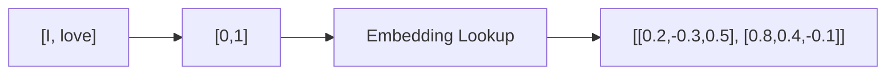

# Experiment 6.2：Embedding Lookup——把 Token 转换成向量

## 实验目标

第 3 章已经讲透了 Embedding Matrix 和 Lookup 的本质——它没有任何复杂计算，只是**数组索引**（根据 Token ID 取出矩阵的对应一行）。本实验把这件事装进 NLM 流水线，完成第 3 章没做过的新一步：**一次对 Context 里的多个 Token 做 Lookup**，得到形状 `(窗口大小, 维度)` 的矩阵。

最终效果：



---

# 一、实验原理

Embedding 就是 `Token → Vector`（原理见第 3 章）。这里为 4 个 Token 各准备一个 3 维向量，放在一起就是 **Embedding Matrix**：

```text
Token      Embedding
I      [0.2,-0.3,0.5]
love   [0.8,0.4,-0.1]
AI     [0.6,0.1,0.7]
today  [-0.2,0.9,0.3]
```

Embedding Lookup本质就是**根据 Token ID，到矩阵中取出对应的一行**。

---

# 二、准备数据

```python
sentence = ["I", "love", "AI", "today"]
vocab = {"I":0, "love":1, "AI":2, "today":3}
token_ids = [vocab[word] for word in sentence]
```

训练样本：`[0,1] -> 2`，`[1,2] -> 3`。

---

# 三、创建 Embedding Matrix

手动创建 4 个 Token，每个 Token 使用 3 维向量：

```python
import numpy as np

embedding = np.array([
    [0.2,-0.3,0.5],
    [0.8,0.4,-0.1],
    [0.6,0.1,0.7],
    [-0.2,0.9,0.3]
])
```

---

# 四、第一次 Embedding Lookup

假设 Context 是 `[I, love]`，对应 `[0,1]`：

```python
context = [0,1]
vectors = embedding[context]
print(vectors)
```

输出：

```text
[[ 0.2 -0.3  0.5]
 [ 0.8  0.4 -0.1]]
```

成功！两个 Token 已经变成两个向量。

---

# 五、观察 Shape（形状）

```python
print(vectors.shape)  # (2,3)
```

表示"2 个 Token × 每个 Token 3 维"。以后 GPT 中例如 `512 × 4096`，其实就是"512 个 Token × 4096 维 Embedding"，本质完全一样，只是规模大很多。

---

# 六、尝试不同 Context

把 `context = [1,2]` 再次运行，输出 `[[0.8 0.4 -0.1], [0.6 0.1 0.7]]`。说明 Lookup 只是根据 Token ID，不断读取 Embedding Matrix。

---

# 七、完整代码

```python
#!/usr/bin/env python3
import numpy as np

embedding = np.array([
    [0.2,-0.3,0.5],
    [0.8,0.4,-0.1],
    [0.6,0.1,0.7],
    [-0.2,0.9,0.3]
])

context = [0,1]
vectors = embedding[context]

print("Embedding Matrix:")
print(embedding)
print("\nContext:")
print(context)
print("\nEmbedding Lookup:")
print(vectors)
print("\nShape:")
print(vectors.shape)
```

---

# 八、运行结果

```text
Embedding Matrix:
[[ 0.2 -0.3  0.5]
 [ 0.8  0.4 -0.1]
 [ 0.6  0.1  0.7]
 [-0.2  0.9  0.3]]

Context: [0,1]

Embedding Lookup:
[[ 0.2 -0.3  0.5]
 [ 0.8  0.4 -0.1]]

Shape: (2,3)
```

---

# 九、实验分析

很多初学者认为 Embedding Lookup 一定进行了复杂计算，实际上这里没有任何数学运算，只是"根据 Token ID → 读取矩阵中的对应行"。因此 Embedding Lookup 本质上就是**数组索引（Array Indexing）**。真正发生学习的是 Embedding Matrix 中的参数，随着训练不断进行，这些向量会不断调整，最终相似语义的 Token 通常会拥有相近的向量。

---

# 十、思考题

尝试修改 `context = [2,3]`，观察 Lookup 是否正确。进一步尝试把 Embedding Dimension 改成 5 或 8，程序是否还能正常运行？

---

# 本实验总结

本实验完成了：✅ 创建 Embedding Matrix ✅ Embedding Lookup ✅ 理解 Shape ✅ 理解 Lookup 的本质

下一实验，我们将把多个 Embedding **拼接（Concatenate）** 成一个固定长度向量，并送入 MLP 进行第一次真正的预测。
