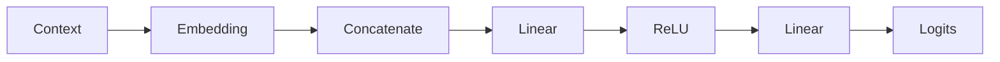
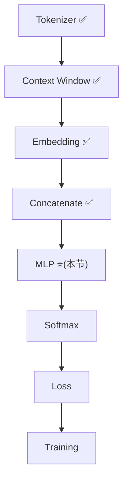

# Experiment 6.2：第一次前向——把 MLP 接进流水线

## 实验目标

第4章已经推导过 MLP 的计算方式（`Linear → ReLU → Linear`），6.1 节又把多个 Token 的 Embedding 拼接成了一个向量。本节不重复推导任何公式，只做一件事，但要做透：把 6.1 得到的 6 维 Context 向量，喂给第4章那套 MLP，第一次在真实的 `(Context → Next Token)` 数据上，**一步一步、逐个数字**地跑完一次前向计算——这样你能清楚看到，从 Token ID 到 Logits，每一步 Shape 是怎么变的、每一个数字是怎么算出来的。



---

# 一、温故：走到这一步，手上已经有哪些零件？

在正式开始之前，先盘一遍库存——下面每一行，都是前面某一节已经亲手实现过的东西，本节不会重新发明，只会把它们**接起来跑一遍**：

| 出处 | 零件 | 干了什么 |
|---|---|---|
| 第2章 | Tokenizer | 文本 → Token ID（例如 `I love` → `[0, 1]`） |
| 第3章 | Embedding Matrix | Token ID → 一行向量（数组索引，不涉及计算） |
| 第4章“神经元”与“从标量公式到向量计算” | 神经元 | 一次加权求和：`w·x + b` |
| 第4章“为什么一个神经元不够”与“Linear Layer” | Linear Layer | 多个神经元合并成一次矩阵运算：`y = Wx + b` |
| 第4章“Activation Function” | Activation（ReLU） | 负数清零，给网络引入非线性 |
| 第4章“MLP” | 输出层 | 再来一次 `Linear`，把隐藏表示映射成词表大小的 Logits |
| 第4章“Softmax”与“Cross Entropy Loss” | Softmax / Cross Entropy | Logits → 概率 → Loss（本节还用不到，6.3、6.4 才会接上） |
| 第5章 | Context Window | 滑动窗口，把"单 Token 预测"升级成"多 Token(Context) 预测" |
| 6.1 节 | 数据 ID 化 + Embedding Lookup | 把 Context 里的每个词变成一行向量，一次查出多行 |
| 6.1 节 | Concatenate | 把多行向量首尾拼接，压成**一个**固定长度的向量 |

用一张"打卡表"总结现在走到了哪一步：



前面四个 ✅ 都是"表示层"的工作——把文字变成数字、把数字变成向量、把多个向量拼成一个。而 MLP，才是整条流水线里**第一个真正做"计算"、做"预测"的模块**。这也是为什么本节要格外放慢速度：它是从"准备数据"到"开始预测"的分界线。

---

# 二、和第4章的对应关系（以及一个容易被忽略的变化）

先看维度上的变化：

| 第4章 | 本节 |
|---|---|
| 输入是 `love` 的 3 维向量 | 输入是 `[love, AI]` 拼接后的 6 维向量（6.1 节） |
| 隐藏层 4 维 | 隐藏层 5 维 |
| 词表 5 个词 | 词表 4 个词（`I, love, AI, today`） |

维度和词表大小变了，但公式和参数的角色，和第4章“MLP：Linear → Activation → Linear”一节完全一样：

```
hidden = ReLU(W1 @ x + b1)     # 第一层 Linear + Activation
logits = W2 @ hidden + b2      # 第二层 Linear
```

回顾第4章“Linear Layer”讲过的 Shape 规律：`W` 的形状永远是 `(输出维度, 输入维度)`。所以这里：

- `W1` 的形状是 `(5, 6)`——输出 5 维隐藏层，输入 6 维 Context 向量；
- `W2` 的形状是 `(4, 5)`——输出 4 个候选词的分数，输入 5 维隐藏层。

**一个容易被忽略、但值得说清楚的变化：本节的 `W1`、`W2` 不再是第4章那样手写的固定数字，而是用 `np.random.randn(...)` 随机生成的。** 这不是疏忽，而是故意的：

- 4.1 实践手写具体数字（比如 `W1 = [[0.2, 0.5, -0.1], ...]`），是为了让你能**一个数一个数地对上账**，专心理解"公式在算什么"；
- 但真实训练开始前，没有人会手写几百万个 Weight——**所有参数一开始都是随机的**，这才是训练前的真实状态。本节用 `np.random.randn` 生成随机权重，就是想让你提前适应这一点：模型现在还什么都不懂，Logits 是"瞎猜"出来的，这也是为什么下面算出来的预测大概率是错的（6.3 节会验证这一点）。至于"随机成什么样才合适"这个问题，6.7 节会专门讲 Xavier/Kaiming 初始化，这里先用最朴素的 `randn` 即可。

---

# 三、逐步展开：这次前向传播，每一步到底在算什么？

下面把 `context = [1, 2]`（也就是 `love AI`）完整地过一遍流水线，每一步都停下来看 Shape 和数值。为了让手算能对上账，固定 `np.random.seed(42)`。

**为什么选这条样本？** 6.1 节构造数据集时，`sentence = [I, love, AI, today]` 一共产出两条 `(context → target)` 样本：`[I, love] → AI` 和 `[love, AI] → today`。本节用第二条——这样代码里的 `context` 和 `target` 都是数据集里真实存在的一对，不是凑出来的数字。

## （一）输入：Embedding Lookup + Concatenate（复习 6.1 节）

```python
import numpy as np
np.random.seed(42)

embedding = np.array([
    [0.2,-0.3,0.5],   # I
    [0.8,0.4,-0.1],   # love
    [0.6,0.1,0.7],    # AI
    [-0.2,0.9,0.3]    # today
])

context = [1, 2]                        # [love, AI] —— 6.1 节数据集里的第二条样本
target = 3                               # 真实答案：today（Token ID 3），(context, target)是同一条样本的两半
vectors = embedding[context]            # Embedding Lookup(6.1 节)：Shape (2,3)
x = vectors.reshape(-1)                 # Concatenate(6.1)：Shape (6,)
print(x)   # [ 0.8  0.4 -0.1  0.6  0.1  0.7]
```

这一步没有任何新计算，只是把前两节的结果接上——`x` 就是 `love` 和 `AI` 两个 3 维向量首尾拼接成的 6 维向量。`target = 3` 提前写出来，是为了让"这次预测的正确答案是谁"从一开始就摆在代码里，不用等到后面靠文字交代。

## （二）第一层 Linear：`pre1 = W1 @ x + b1`

```python
W1 = np.random.randn(5, 6)     # Shape (5,6)：6维输入 → 5维隐藏层
b1 = np.zeros(5)
pre1 = W1 @ x + b1
```

`seed(42)` 生成的 `W1` 具体是（保留4位小数）：

```text
W1 = [[ 0.4967 -0.1383  0.6477  1.5230 -0.2342 -0.2341]
      [ 1.5792  0.7674 -0.4695  0.5426 -0.4634 -0.4657]
      [ 0.2420 -1.9133 -1.7249 -0.5623 -1.0128  0.3142]
      [-0.9080 -1.4123  1.4656 -0.2258  0.0675 -1.4247]
      [-0.5444  0.1109 -1.1510  0.3757 -0.6006 -0.2917]]
```

`pre1` 的第 1 个数字（下标0），就是 `W1` **第一行**和 `x` 做点积——这一步和 4.3 节"一个神经元 = 一次加权求和"完全一样，只是换成了真实数字：

```
pre1[0] = 0.4967×0.8 + (-0.1383)×0.4 + 0.6477×(-0.1) + 1.5230×0.6 + (-0.2342)×0.1 + (-0.2341)×0.7
        = 0.3974 + (-0.0553) + (-0.0648) + 0.9138 + (-0.0234) + (-0.1639)
        = 1.0038
```

其它 4 个数字是 `W1` 剩下 4 行分别和同一个 `x` 做点积，原理相同，这里不逐一手算。完整的 `pre1`：

```text
pre1 = [ 1.0038  1.5705 -0.6179 -2.5639 -0.3149]
```

## （三）ReLU：负数清零

```python
hidden = np.maximum(0, pre1)
print(hidden)   # [1.0038 1.5705 0.     0.     0.    ]
```

`pre1` 里第 3、4、5 个数字（`-0.6179`、`-2.5639`、`-0.3149`）是负数，被 ReLU 直接清成了 `0`；只有前两个正数原样通过。这正是 4.6 节讲过的规律，只是这次是真实的随机数字，而不是手挑的例子。

## （四）第二层 Linear：`logits = W2 @ hidden + b2`

```python
W2 = np.random.randn(4, 5)     # Shape (4,5)：5维隐藏层 → 4个候选词
b2 = np.zeros(4)
logits = W2 @ hidden + b2
```

`W2` 具体是：

```text
W2 = [[-0.6017  1.8523 -0.0135 -1.0577  0.8225]     # I
      [-1.2208  0.2089 -1.9597 -1.3282  0.1969]     # love
      [ 0.7385  0.1714 -0.1156 -0.3011 -1.4785]     # AI
      [-0.7198 -0.4606  1.0571  0.3436 -1.7630]]    # today
```

同样的道理，`logits[0]`（对应候选词 `I`）就是 `W2` 第一行和 `hidden` 的点积——因为 `hidden` 后三个数字都是 0，实际只有前两项参与计算：

```
logits[0] = -0.6017×1.0038 + 1.8523×1.5705 + (-0.0135)×0 + (-1.0577)×0 + 0.8225×0
          ≈ -0.6040 + 2.9090 + 0 + 0 + 0
          ≈ 2.3050
```

其它三个候选词同理，最终：

```text
logits = [ 2.3050 -0.8975  1.0104 -1.4460]
            I       love     AI      today
```

## （五）完整代码及运行结果

把上面拆开讲的四步重新拼成一份完整脚本，直接复制运行就能复现前面手算的每一个数字：

```python
#!/usr/bin/env python3
import numpy as np

np.random.seed(42)

embedding = np.array([
    [0.2,-0.3,0.5],   # I
    [0.8,0.4,-0.1],   # love
    [0.6,0.1,0.7],    # AI
    [-0.2,0.9,0.3]    # today
])

context = [1, 2]                        # [love, AI]，6.1 节数据集的第二条样本
target = 3                              # 真实答案：today
x = embedding[context].reshape(-1)      # Embedding Lookup(6.1 节) + Concatenate(6.1)

W1 = np.random.randn(5, 6)              # 第一层 Linear：6维 → 5维隐藏层
b1 = np.zeros(5)
pre1 = W1 @ x + b1
hidden = np.maximum(0, pre1)            # ReLU

W2 = np.random.randn(4, 5)              # 第二层 Linear：5维 → 4个候选词
b2 = np.zeros(4)
logits = W2 @ hidden + b2

np.set_printoptions(precision=4, suppress=True)
print("Input (Concatenate 之后):", x)
print("pre1  (第一层 Linear 之后):", pre1)
print("hidden(ReLU 之后)        :", hidden)
print("logits(第二层 Linear 之后):", logits)
```

真实运行结果：

```text
Input (Concatenate 之后): [ 0.8  0.4 -0.1  0.6  0.1  0.7]
pre1  (第一层 Linear 之后): [ 1.0038  1.5705 -0.6179 -2.5639 -0.3149]
hidden(ReLU 之后)        : [1.0038 1.5705 0.     0.     0.    ]
logits(第二层 Linear 之后): [ 2.305  -0.8975  1.0104 -1.446 ]
```

四行输出，正好对应 3.1~3.4 四个小节手算出来的四组数字——**这份"完整代码"不是新内容，只是把前面拆开讲解的步骤重新接回一条流水线，方便你直接复制运行、和手算结果逐一核对。**

---

# 四、Shape 全景图：一路走来，形状是怎么变的？

把整节的变化汇总成一张表，方便随时回来对照：

| 阶段 | 代码 | Shape | 含义 |
|---|---|---|---|
| Context（Token ID） | `context = [1,2]` | `(2,)` | 2 个 Token 的编号（love, AI） |
| Embedding Lookup | `embedding[context]` | `(2,3)` | 2 个 Token，每个 3 维 |
| Concatenate | `.reshape(-1)` | `(6,)` | 拼成 1 个向量，MLP 才能接受 |
| 第一层 Linear | `W1 @ x + b1` | `(5,)` | 6维 → 5维隐藏表示 |
| ReLU | `np.maximum(0, pre1)` | `(5,)` | Shape 不变，负数清零 |
| 第二层 Linear（输出层） | `W2 @ hidden + b2` | `(4,)` | 5维 → 4个候选词的 Logits |

可以看到，**Shape 只在"拼接"和"两次 Linear"这三步发生变化，ReLU 从不改变 Shape**——这是一个通用规律：激活函数只负责改数值（清零负数），不负责改形状。

## （一）画格子理解：6→5→4 每一步到底在算什么

光看 Shape 表格容易记住数字，但记不住"为什么"。下面把两次矩阵乘法画成格子图，一眼看清哪个格子和哪个格子相乘、结果落在哪。

**第一层 Linear：`W1 @ x → pre1`（6→5）**

```
        x（输入向量，6个格子，[love, AI] 拼接）
        ┌──────┬──────┬──────┬──────┬──────┬──────┐
        │ 0.80 │ 0.40 │-0.10 │ 0.60 │ 0.10 │ 0.70 │
        └──┬───┴──┬───┴──┬───┴──┬───┴──┬───┴──┬───┘
           ↓      ↓      ↓      ↓      ↓      ↓
W1（5行×6列）                                       pre1（5个格子）
┌──────┬──────┬──────┬──────┬──────┬──────┐       ┌────────┐
│ 0.50 │-0.14 │ 0.65 │ 1.52 │-0.23 │-0.23 │─→ Σ →│  1.00  │ ← 第1行·x
├──────┼──────┼──────┼──────┼──────┼──────┤       ├────────┤
│ 1.58 │ 0.77 │-0.47 │ 0.54 │-0.46 │-0.47 │─→ Σ →│  1.57  │
├──────┼──────┼──────┼──────┼──────┼──────┤       ├────────┤
│ 0.24 │-1.91 │-1.72 │-0.56 │-1.01 │ 0.31 │─→ Σ →│ -0.62  │
├──────┼──────┼──────┼──────┼──────┼──────┤       ├────────┤
│-0.91 │-1.41 │ 1.47 │-0.23 │ 0.07 │-1.42 │─→ Σ →│ -2.56  │
├──────┼──────┼──────┼──────┼──────┼──────┤       ├────────┤
│-0.54 │ 0.11 │-1.15 │ 0.38 │-0.60 │-0.29 │─→ Σ →│ -0.31  │
└──────┴──────┴──────┴──────┴──────┴──────┘       └────────┘
 5行（=5个隐藏神经元）  6列（=输入维度，必须对齐x）        5个输出
```

**规则**：`W1` 有几行，输出就有几个数字；`W1` 有几列，就必须和输入维度对齐。这里 6 列对齐 `x` 的 6 维，5 行是自己选的隐藏层大小，于是 `pre1` 变成 5 维——**一行 = 一个神经元，做一次点积（见第4章“从标量公式到向量计算”），5 行并行计算，得到 5 个数字。**

**ReLU：只改数值，不改 Shape**

```
pre1: [ 1.00,  1.57,  -0.62,  -2.56,  -0.31 ]
              ↓             ↓        ↓        ↓
hidden:[ 1.00, 1.57,    0  ,    0  ,    0    ]   ← 三个负数被清零，Shape仍是(5,)
```

这次随机权重下，`x` 与 `W1` 后三个神经元的点积恰好都是负数，ReLU 一下子关掉了 3/5 的神经元——只留下前两个数字继续往下传。

**第二层 Linear：`W2 @ hidden → logits`（5→4）**

```
        hidden（5个格子，ReLU后）
        ┌──────┬──────┬──────┬──────┬──────┐
        │ 1.00 │ 1.57 │  0   │  0   │  0   │
        └──┬───┴──┬───┴──┬───┴──┬───┴──┬───┘
           ↓      ↓      ↓      ↓      ↓
W2（4行×5列）                               logits（4个格子）
┌──────┬──────┬──────┬──────┬──────┐     ┌────────┐
│-0.60 │ 1.85 │-0.01 │-1.06 │ 0.82 │─→ Σ→│  2.31  │ ← "I"
├──────┼──────┼──────┼──────┼──────┤     ├────────┤
│-1.22 │ 0.21 │-1.96 │-1.33 │ 0.20 │─→ Σ→│ -0.90  │ ← "love"
├──────┼──────┼──────┼──────┼──────┤     ├────────┤
│ 0.74 │ 0.17 │-0.12 │-0.30 │-1.48 │─→ Σ→│  1.01  │ ← "AI"
├──────┼──────┼──────┼──────┼──────┤     ├────────┤
│-0.72 │-0.46 │ 1.06 │ 0.34 │-1.76 │─→ Σ→│ -1.45  │ ← "today" ★真实答案
└──────┴──────┴──────┴──────┴──────┘     └────────┘
 4行（=4个候选词，必须=词表大小） 5列（对齐hidden）  4个输出（Logits）
```

注意每一行乘 `hidden` 中值为 `0` 的那三列时，结果直接是 0——**这正是 ReLU 的实际效果：相当于"关掉"了某些神经元，第二层根本用不到那些位置的权重。** 也正因为这次被关掉的神经元特别多（3个），第二层几乎只靠前两个神经元的信息在打分，而这两个神经元恰好都更"偏向" `I`——这正是下面看到"预测明显错误"的直接原因。

**全景图：哪些数字是"被迫的"，哪些是"自己选的"**

```
                    自己选的（超参数）
                          ↓
     ┌────┐        ┌─────────┐        ┌────────┐
     │ x  │        │  hidden │        │ logits │
     │6个 │──W1───→│  5个    │──W2───→│  4个   │
     │数字│ (5×6)   │  数字   │ (4×5)  │  数字  │
     └────┘        └─────────┘        └────────┘
       ↑                                   ↑
  2词×3维拼接（6.1节）                 词表恰好有4个词
   被迫 = 6                              被迫 = 4
```

| 维度 | 值 | 由什么决定 |
|---|---|---|
| 输入 6 | `window_size(2) × embedding_dim(3)` | 被前面的设定锁死，**被迫** |
| 隐藏 5 | 超参数，随便设 | **唯一自由选择的**（想加几层、每层多宽都行） |
| 输出 4 | `vocab_size = 4` | 被词表大小锁死，**被迫**——模型必须给每个候选词恰好输出一个分数 |

记住一条规则：**`W` 的行数 = 想输出几维，列数 = 输入有几维。** 任何 Linear 层的 Shape，套这条规则都能秒推出来。

---

# 五、实验分析

现在流水线是 `Context → Embedding → Concatenate → Linear → ReLU → Linear → Logits`，和第4章唯一的区别是输入换成了拼接后的真实 Context，权重也换成了随机初始化。距离完整模型只差最后一步：`Logits → Softmax → Probability`。

留意一下算出来的 `logits = [2.305, -0.8975, 1.0104, -1.446]`（对应 I / love / AI / today）：正确答案 `today` 对应的分数是 `-1.446`，是四个分数里**最低**的一个，而 `I` 的分数 `2.305` 反而最高——**模型现在什么都不懂，这组数字只是随机权重"瞎算"出来的结果，而且这次错得相当明显（正确答案的分数垫底）。** 这不是 bug，而是训练开始前的正常状态；6.3 节会验证这次预测确实选错了，6.4~6.6 节会讲模型如何从"瞎猜"一步步学会"猜对"。

---

# 六、思考题

1. `hidden.shape` 为什么是 `(5,)`，`logits.shape` 为什么是 `(4,)`？如果 Vocabulary 增加到 100，`W2` 应该变成什么 Shape？
2. 如果把 `np.random.seed(42)` 换成别的数字（或者去掉这一行），`logits` 的具体数值会变，但 Shape 会不会变？为什么？
3. 试着自己手算一下 `pre1[1]`（`W1` 第二行和 `x` 的点积），验证是否等于 `1.5705`。

---

# 本实验总结

本实验完成了：✅ 复习了从 Tokenizer 到 Concatenate 的整条前置流水线 ✅ 把第4章的 MLP 接到真实 Context 输入上 ✅ 逐个数字手算了一次完整的前向计算（Embedding Lookup → Concatenate → Linear → ReLU → Linear） ✅ 理解了本节权重改用随机初始化的原因 ✅ 输出了 Logits，并观察到模型此刻的预测大概率是错的

下一实验，我们将把 Logits 通过 **Softmax** 转换为概率分布，并真正预测下一个 Token——顺便验证一下，这次预测到底错在哪。
