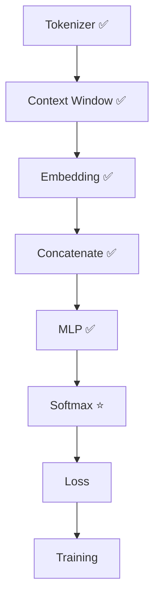
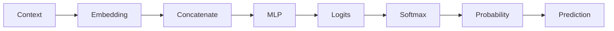

# Experiment 6.3：第一次预测——从 Logits 到概率分布

## 实验目标

Softmax 的公式和原理已经在第4.8节讲过,这里不重复推导。本实验只做第4章没做的事:把 Softmax 接到 6.2 的真实 Logits 上,并第一次用 **argmax（Greedy Decoding）** 从概率分布里选出一个具体的 Token。



---

# 一、把 4.8 节的公式接到真实 Logits 上

```python
#!/usr/bin/env python3
import numpy as np

id2word = {0:"I", 1:"love", 2:"AI", 3:"today"}
logits = np.array([-1.72, -3.22, 0.93, -0.90])   # 来自 6.2 节

shifted = logits - np.max(logits)
exp = np.exp(shifted)
prob = exp / np.sum(exp)

for i, p in enumerate(prob):
    print(f"{id2word[i]:<8} {p:.3f}")
print("Sum:", prob.sum())
```

```text
I        0.057
love     0.013
AI       0.801
today    0.129
Sum: 1.0
```

---

# 二、第一次真正做出预测：Greedy Decoding

之前的 Logits/概率都只是一组数字,还没有选出"下一个 Token 到底是谁"。最简单的选择方式是直接取概率最大的那个:

```python
prediction = np.argmax(prob)
print(id2word[prediction])  # AI
```

模型认为下一个 Token 最可能是 `AI`,但真实答案其实是 `today`——这次预测**错了**,这个错误结果 6.4 节会用来计算 Loss。

---

# 三、实验分析

现在完整链路是:



模型真正输出的是整个概率分布,`argmax` 只是推理阶段用来"选一个词"的最简单策略,后面章节还会介绍 Sampling、Temperature 等其它策略。

---

# 四、思考题

把 `logits` 换成 `[100,99,98,97]`,Softmax 依然能正常算出结果,这是靠哪一行代码保证的?

---

# 本实验总结

本实验完成了：✅ 把 Softmax 接到真实 Logits ✅ 用 argmax 做出第一次真正的预测（且预测错了）

下一实验，我们将用 **Cross Entropy Loss** 给这次"预测错误"打一个具体的分数。
