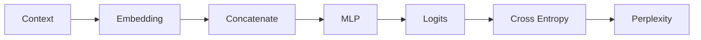

# 6.4 模型评估——Loss 与 Perplexity

## 实验目标

Cross Entropy 的原理已经在第4章“Cross Entropy Loss：衡量预测有多差”一节推导过。本实验把它接到 6.2、6.3 的同一条样本 `[love, AI] → today` 上，并引入语言模型常用指标 **Perplexity（困惑度）**。

---

# 一、用完整精度的 Logits 计算 Cross Entropy

6.2 节打印 Logits 时只保留了 4 位小数，那适合展示，不适合作为后续计算的输入。下面重新执行同一前向过程，并直接用内存中的完整精度 `logits` 计算 Loss：

```python
#!/usr/bin/env python3
import numpy as np

np.random.seed(42)

embedding = np.array([
    [ 0.2, -0.3,  0.5],  # I
    [ 0.8,  0.4, -0.1],  # love
    [ 0.6,  0.1,  0.7],  # AI
    [-0.2,  0.9,  0.3],  # today
])
context = [1, 2]  # [love, AI]
target = 3        # today

x = embedding[context].reshape(-1)
W1 = np.random.randn(5, 6)
b1 = np.zeros(5)
W2 = np.random.randn(4, 5)
b2 = np.zeros(4)

pre1 = W1 @ x + b1
hidden = np.maximum(0, pre1)
logits = W2 @ hidden + b2

# 数值稳定的 log-sum-exp 形式；不先把概率四舍五入
shifted = logits - logits.max()
log_sum_exp = logits.max() + np.log(np.exp(shifted).sum())
loss = log_sum_exp - logits[target]

exp_shifted = np.exp(shifted)
prob = exp_shifted / exp_shifted.sum()

print("logits =", logits)
print("P(today) =", prob[target])
print("loss =", loss)
```

输出：

```text
logits = [ 2.30496143 -0.89747202  1.01040491 -1.44600378]
P(today) = 0.0175575037...
loss = 4.0422738605
```

这里的 Loss 也等于 `-np.log(prob[target])`。使用 `log-sum-exp` 直接从 Logits 计算，可以避免 `log(0)`，也是 `CrossEntropyLoss` 一类实现采用的数值稳定思路。

6.3 节显示的 `0.018` 只是三位小数的展示值。若错误地用它反算，会得到约 `4.017`；那不是这次前向过程的准确 Loss。后续计算都应使用完整精度值。

---

# 二、从平均 Cross Entropy 到 Perplexity

对由若干个目标 Token 组成的语料，先求每个位置负对数似然的平均值：

$$
\text{CE}= -\frac{1}{N}\sum_{t=1}^{N}\log p(y_t\mid \text{context}_t)
$$

再定义：

$$
\text{PPL}=\exp(\text{CE})
$$

本节只有一个目标 Token，所以平均值就是单样本 Loss：

```python
perplexity = np.exp(loss)
print(perplexity)  # 56.9557...
```

单样本时，`PPL = exp(-log(P(today))) = 1 / P(today)`，因此这里约为 `56.96`。它可以超过词表大小 4：若模型只给真实答案极小概率，负对数似然没有以 `log(V)` 为上界。

需要区分两种说法：

- **本节的 `56.96`**：一个预测位置的演示值，主要用于理解公式；
- **通常报告的语料 PPL**：在固定分词方式下，对验证集或测试集中所有目标 Token 的 NLL 取平均后再指数化。

因此，语料 PPL 不是“每个 Token 的 PPL 再求算术平均”，也不能脱离 Tokenizer、词表和评测语料横向比较。它可直观理解为模型在该语料上的平均不确定程度，但不是字面意义上“真的有 56.96 个等概率候选词”。

作为参照，如果每个位置都在 4 个词上均匀分配概率，则 `CE = -log(1/4) = log(4)`，`PPL = 4`；如果真实答案概率为 `0.9`，则单样本 `PPL = 1/0.9 ≈ 1.11`。

---

# 三、实验分析



Cross Entropy 是训练时被最小化的目标；Perplexity 是同一个平均负对数似然经过指数变换后的报告指标。二者单调对应：CE 越低，PPL 越低。

---

# 四、思考题

1. 为什么训练代码通常直接把 Logits 传给 Cross Entropy，而不是先手动执行 Softmax？
2. 两个 Token 的正确答案概率分别是 `0.5` 和 `0.125` 时，语料 PPL 应先平均哪两个量？
3. 为什么使用不同 Tokenizer 的两个模型，其 PPL 通常不能直接比较？

---

# 本实验总结

本实验用 6.2 的完整精度 Logits 得到 `loss = 4.0422738605` 和单样本 `PPL ≈ 56.96`，并明确了真正的语料 PPL 是“平均每 Token NLL 的指数”。下一实验将从同一条 `[love, AI] → today`、同一组 `6 → 5 → 4` 参数继续反向传播。
