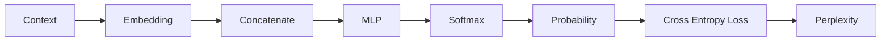

# Experiment 6.4：第一次打分——Loss 与 Perplexity

## 实验目标

Cross Entropy 的公式 `Loss = -log(P)` 已经在第4.9节推导过,这里不重复推导。本实验只做两件新事:①把它接到 6.3 真实预测错误的结果上;②引入第4章没讲过的新指标——**Perplexity（困惑度）**。

---

# 一、这次是一次真实的预测错误

真实答案（Target）是 `today`（Token ID 3），但模型（6.3节）把 80.1% 的概率押在了 `AI` 上，只给 `today` 留了 12.9%：

```python
#!/usr/bin/env python3
import numpy as np

prob = np.array([0.057, 0.013, 0.801, 0.129])  # 来自 6.3 节
target = 3  # today

loss = -np.log(prob[target])
print(loss)  # 2.045
```

Loss 约 `2.045`——对比第4.9节 `P=0.1` 时 `Loss≈2.303` 的量级，说明这次预测确实不理想，但也不是"完全押错"那么差。

---

# 二、从 Loss 到 Perplexity（困惑度）

`2.045` 这个数字不太直观——语言模型领域通常会把 Loss 转换成更好理解的指标：**Perplexity**，定义很简单：

```
Perplexity = exp(Loss)
```

```python
perplexity = np.exp(loss)
print(perplexity)  # 7.73
```

**Perplexity 的直觉解读：它大致相当于"模型每一步预测时，感觉有多少个同样可能的候选 Token 在竞争"。** Perplexity 为 1，代表模型几乎百分之百确定答案；这里的 `7.73`，大致相当于"模型的把握程度，相当于在7~8个词里随机蒙一个"。词表越大、任务越难，同样的 Loss 对应的 Perplexity 也会越高，这也是为什么 Perplexity 是语言模型最经典的评价指标之一。

对比一次假设中"几乎完全预测对"的情况（`today` 概率给到 0.9）：

```python
print(-np.log(0.9), np.exp(-np.log(0.9)))  # Loss≈0.105, Perplexity≈1.11
```

Perplexity 从 `7.73` 降到 `1.11`，直观地对应了"预测从不确定变得非常确定"。

---

# 三、实验分析

现在 Neural Language Model 已经具备完整的评价体系:



Loss 是训练时用来指导参数更新的信号；Perplexity 是给人看的、更直观的评价指标——两者算的是同一件事，只是单位不同。

---

# 四、思考题

如果真实答案对应的概率恰好为 `0.0`，Loss 和 Perplexity 会变成什么？这在实际训练中会带来什么问题？

---

# 本实验总结

本实验完成了：✅ 把 Cross Entropy 接到真实的预测错误上 ✅ 引入 Perplexity 并理解它和 Loss 的关系

现在模型已经知道自己预测得好不好，但**知道错了还不够，还需要知道该往哪个方向修改参数**——也就是 Loss 对每一个 Weight 的梯度。下一实验（按照 Karpathy micrograd 的顺序），我们将先亲手实现**反向传播（Backpropagation）**，把梯度是怎么算出来的彻底讲清楚；再在下一个实验用**Gradient Descent（梯度下降）**真正利用梯度，让模型学会自我修正。
