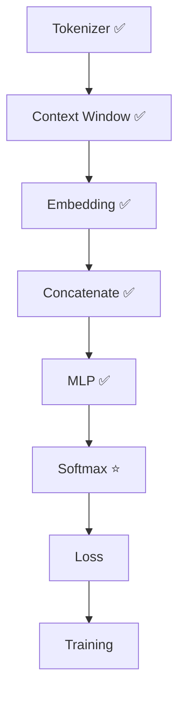
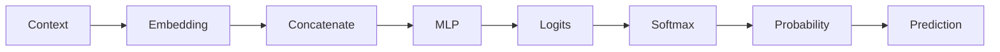

# Experiment 6.5：Softmax——预测下一个 Token 的概率

## 实验目标

上一实验，我们已经完成了 MLP 的前向传播，模型输出 Logits `[1.84, -0.61, 2.35, 0.78]`。但这些数字仍然没有实际意义，因为神经网络最后输出的是**Logits（未归一化分数）**。真正的 Language Model 需要输出 `AI 62%, today 21%, love 11%, I 6%` 这样的概率分布。本实验将完成**把 Logits 转换成概率分布**。

实验结束后，你将理解为什么需要 Softmax、Logits 和 Probability 的区别、为什么概率之和一定等于 1，以及模型如何决定预测哪个 Token。

---

# 当前进度



---

# 一、实验原理

上一实验得到 Logits `[1.84, -0.61, 2.35, 0.78]`。Logits 只表示模型认为哪个 Token 更可能出现，例如 `AI: 2.35` 说明模型最喜欢 `AI`，但到底有多大概率不知道，因此需要 Softmax。

---

# 二、准备 Vocabulary

```python
id2word = {0:"I", 1:"love", 2:"AI", 3:"today"}
logits = np.array([1.84, -0.61, 2.35, 0.78])
```

---

# 三、实现 Softmax

```python
shifted = logits - np.max(logits)  # 数值稳定
exp = np.exp(shifted)
prob = exp / np.sum(exp)
print(prob)  # [0.319 0.028 0.531 0.122]
```

---

# 四、验证概率

```python
print(prob.sum())  # 1.0
```

说明Softmax 成功把任意数字变成了合法概率。

---

# 五、打印预测结果

```python
for i, p in enumerate(prob):
    print(id2word[i], ":", round(p, 3))
```

输出：

```text
I : 0.319
love : 0.028
AI : 0.531
today : 0.122
```

已经非常接近真正 Language Model 的输出。

---

# 六、预测下一个 Token

最简单的方法：Greedy Decoding。

```python
prediction = np.argmax(prob)
print(id2word[prediction])  # AI
```

说明模型认为下一 Token 最可能是 `AI`。

---

# 七、完整代码

```python
#!/usr/bin/env python3
import numpy as np

id2word = {0:"I", 1:"love", 2:"AI", 3:"today"}
logits = np.array([1.84, -0.61, 2.35, 0.78])

shifted = logits - np.max(logits)
exp = np.exp(shifted)
prob = exp / np.sum(exp)

print("Probability:", prob)
print("Sum:", prob.sum())
for i, p in enumerate(prob):
    print(f"{id2word[i]:<8} {p:.3f}")

prediction = np.argmax(prob)
print("Prediction:", id2word[prediction])
```

---

# 八、运行结果

```text
Probability: [0.319 0.028 0.531 0.122]
Sum: 1.0

I        0.319
love     0.028
AI       0.531
today    0.122

Prediction: AI
```

---

# 九、实验分析

现在我们的神经语言模型终于能够**根据 Context，预测下一个 Token**。完整流程：



请注意，模型真正输出的不是 `AI`，而是整个概率分布，例如 `AI 53%, I 32%, today 12%, love 3%`。真正选择哪个 Token，只是推理阶段最后一步。

---

# 十、思考题

把 `logits` 修改成 `[8,2,1,0]`，观察 Softmax 有什么变化。继续尝试 `[100,99,98,97]`，为什么程序仍然能够正常运行？提示：观察 `shifted = logits - np.max(logits)` 这一句解决了什么问题。

---

# 本实验总结

本实验完成了：✅ Logits ✅ Softmax ✅ Probability ✅ Greedy Prediction

现在整个神经语言模型已经能够根据 Context 预测下一个 Token。下一实验，我们将告诉模型"你预测得对还是错"，并利用**Cross Entropy Loss** 计算模型这一次到底预测得有多好。
