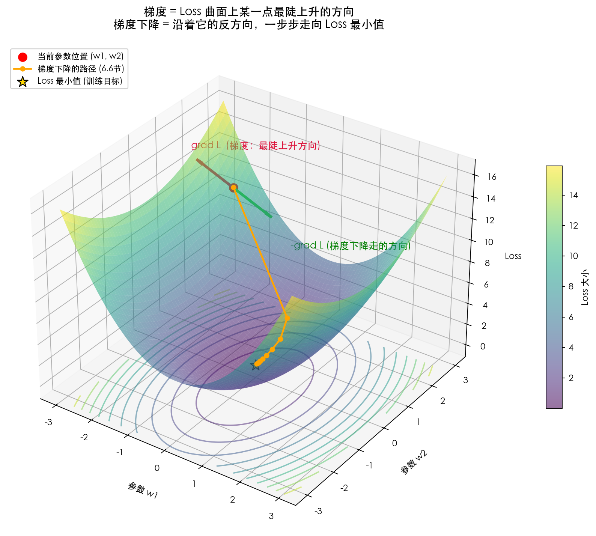
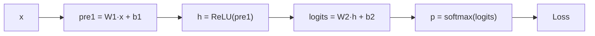
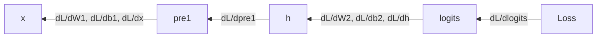
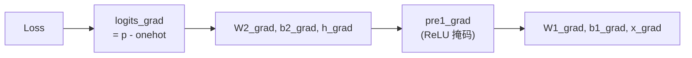

# Experiment 6.5：亲手实现反向传播——从 Loss 到每一个 Weight 的梯度

> **本节目标**：本章开头到 6.4 节，我们把前向流水线一步步搭了起来——数据、Embedding（本章开头）、拼接（6.1）、MLP 前向（6.2）、Softmax（6.3）、Loss（6.4）。模型终于能"知道自己错了"，但一个关键问题还没回答：**Loss 对每一个 Weight 的梯度，到底是怎么算出来的？** 不知道梯度，就谈不上"调整参数"。本节按照 Karpathy 在 micrograd 里教的方法，先用第4章那条真实数字链**手算一次完整的反向传播**，再用约 60 行代码写一个迷你自动求导引擎（micrograd-lite），最后与 PyTorch 的 `loss.backward()` **三方对账**——算完这一次，6.6 的梯度下降和 6.7 的完整训练对你就不再是黑盒。

---

# 一、概念：Loss、梯度、反向传播

- **Loss**：一个标量，衡量当前预测有多差（6.4节已算出）。
- **梯度（Gradient）**：Loss 对每个参数的偏导数，记作 `dL/dW`。符号给出调整方向，绝对值给出调整力度。
- **反向传播（Backpropagation）**：从 Loss 出发，用链式法则逐层往回，计算出所有参数梯度的算法。

关系：**前向传播算出 Loss → 反向传播算出梯度 → 梯度下降（6.6节）用梯度更新参数。** 本节只做中间一步：算梯度，不改参数。

为什么不用"挨个试"（改动某个参数、重新前向、看 Loss 变化多少）代替反向传播？因为一个模型有几百万到几十亿个参数，逐个试需要几百万次前向；反向传播只需一次前向 + 一次反向，就能同时得到所有参数的梯度。

**用一张图直观理解"梯度"到底是什么**：如果把 Loss 看成一个由参数 `(w1, w2)` 决定的曲面（就像吴恩达课程里那张经典的碗形图），梯度就是曲面上"当前位置最陡上升"的方向；梯度下降走的是它的反方向，一步步滑向碗底（Loss 最小值）：



- 红色箭头 `∇L`：梯度本身，指向 Loss **增大最快**的方向；
- 绿色箭头 `-∇L`：梯度的反方向，也就是 6.6 节梯度下降**真正走**的方向——Loss **减小最快**；
- 橙色轨迹：从随机初始点出发，每一步都沿着当时的负梯度方向走一小步，最终收敛到碗底（金色星星）。

本节要手算的 `dL/dW1`、`dL/dW2`……就是图里箭头 `∇L` 在每一个参数轴上的分量——只是真实模型的参数有几千万个，曲面画不出来，但"沿着梯度反方向走、一步步逼近最小值"这件事，原理和这张图完全一样。

---

# 二、链式法则总览：从 Loss 到每个参数的完整公式链

在动手写代码之前，先把**整条反向传播要用到的全部公式**一次性列完——这样后面每实现一步，都能对照这张"总地图"，不会写着代码就忘了自己在算哪一段。

模型是一张有向计算图：



反向传播就是把这张图**倒着走一遍**，从 Loss 出发，每往回过一个节点，就用链式法则 `dz/dx = dz/dy × dy/dx` 乘上这一层的局部导数：



**上面这条链式法则，只覆盖了"一条路走到底"的情况。** 但在下面的公式清单里，你会看到 `h`（以及后面的 `x`）不止走一条路——`h` 里的每一个数字，会**同时**流向全部 5 个 `logits`；`x` 里的每一个数字，也会同时流向全部 4 个 `pre1`。这时链式法则要多加一步：

> **多变量链式法则**：如果一个变量 `v` 通过好几条不同的路径影响最终的 Loss，那么 `v` 的梯度，等于**每条路径各自算出的梯度贡献，加总起来**。

直觉上很好理解：`v` 对 Loss 的总影响，就是它经过路径①造成的影响 + 经过路径②造成的影响 + ……——每条路径独立算一次"局部导数 × 上游梯度"，最后简单相加即可。下面公式清单里的 `∂L/∂h = W2ᵀ·∂L/∂logits`、`∂L/∂x = W1ᵀ·∂L/∂pre1`，本质都是这条"多路径求和"规则的矩阵化写法（矩阵乘法自带了"对每一行/列求和"的效果）；第六节、第八节手算推导时会把这个求和过程逐项展开给你看。

完整的公式清单（只有数学推导，不涉及任何代码变量名）：

**第一步，Loss → Logits**（`Loss = -log(p[target])`，`p = softmax(logits)`）：

$$
\frac{\partial L}{\partial \text{logits}} = p - \text{onehot(target)}
$$

**第二步，Logits → 隐藏层**（`logits = W2·h + b2`）：

$$
\frac{\partial L}{\partial W_2} = \frac{\partial L}{\partial \text{logits}} \otimes h
\qquad
\frac{\partial L}{\partial b_2} = \frac{\partial L}{\partial \text{logits}}
\qquad
\frac{\partial L}{\partial h} = W_2^\top \frac{\partial L}{\partial \text{logits}}
$$

**第三步，穿过 ReLU**（`h = ReLU(pre1)`）：

$$
\frac{\partial L}{\partial \text{pre1}} = \frac{\partial L}{\partial h} \odot \mathbb{1}[\text{pre1} > 0]
$$

**第四步，pre1 → 输入层**（`pre1 = W1·x + b1`）：

$$
\frac{\partial L}{\partial W_1} = \frac{\partial L}{\partial \text{pre1}} \otimes x
\qquad
\frac{\partial L}{\partial b_1} = \frac{\partial L}{\partial \text{pre1}}
\qquad
\frac{\partial L}{\partial x} = W_1^\top \frac{\partial L}{\partial \text{pre1}}
$$

**这十条公式，就是本节要亲手实现的全部内容**——第三节先跑一次前向拿到具体数值，第五~八节把这四步依次转成代码，第九节把它们封装成自动求导引擎，第十节和 PyTorch 对账验证。

---

# 三、前向：先回顾第4章的数字链

我们直接复用第4章 4.7~4.9 节训练前的那个模型——输入 `x = [0.8, 0.3, 0.5]`（`love` 的特征向量），目标 Token 是 `AI`（词表索引 3）：

```python
import numpy as np

x = np.array([0.8, 0.3, 0.5])          # love 的特征(3 维)

W1 = np.array([                        # 第一层 Linear:3 维 → 4 维
    [0.2, 0.5,-0.1],
    [0.8,-0.3, 0.7],
    [0.4, 0.1, 0.2],
    [0.6, 0.8,-0.5]
])
b1 = np.array([-0.5, 0.2, -0.6, 0.4])

W2 = np.array([                        # 第二层 Linear:4 维 → 5 个候选 Token
    [0.1, 0.5, 0.2,-0.3],   # I
    [0.4, 0.9,-0.1, 0.6],   # love
    [0.2, 0.3, 0.5, 0.1],   # like
    [0.6, 1.2, 0.4, 0.8],   # AI
    [0.3, 0.4, 0.2, 0.5],   # NLP
])
b2 = np.array([0.1, 0.2, 0.0, 0.3, 0.1])
target = 3                               # 正确答案:AI

pre1 = W1 @ x + b1                       # Linear 层 1
h = np.maximum(0, pre1)                  # ReLU
logits = W2 @ h + b2                     # Linear 层 2
exp = np.exp(logits - logits.max())      # Softmax(数值稳定版)
p = exp / exp.sum()
loss = -np.log(p[target])                # Cross Entropy
```

运行结果（与第4章完全一致）：

```text
pre1   = [-0.24  1.1  -0.15  0.87]
h      = [0.   1.1  0.   0.87]
logits = [0.389 1.712 0.417 2.316 0.975]
p      = [0.069 0.26  0.071 0.475 0.124]   sum = 1.0
loss   = 0.7436                            # 第4章里写作 0.744
```

我们的目标：**把第二节的十条公式，套上这组具体数字，算出 W1、b1、W2、b2（以及 x）的真实梯度值**。

---

# 四、记号约定：代码里怎么表示这些梯度

第二节的公式全部用的是数学写法 `∂L/∂W1`，但代码里不可能写这么长的变量名。下面开始写代码之前，先定好命名规则：

> 对计算图里任意一个节点 `v`，代码变量 `v_grad` 就表示 `∂L/∂v`——即"最终这个标量 Loss，对 `v` 的导数"。

对照表：

| 数学公式 | 代码变量名 |
|---|---|
| `∂L/∂logits` | `logits_grad` |
| `∂L/∂W2`、`∂L/∂b2`、`∂L/∂h` | `W2_grad`、`b2_grad`、`h_grad` |
| `∂L/∂pre1` | `pre1_grad` |
| `∂L/∂W1`、`∂L/∂b1`、`∂L/∂x` | `W1_grad`、`b1_grad`、`x_grad` |

这和 PyTorch 的命名习惯是一致的——`tensor.grad` 存的就是这个东西。下面四节，就是把第二节的十条数学公式，逐条翻译成代码里的 `xxx_grad`。

---

# 五、实现反向第一步：从 Loss 到 Logits

对应第二节的第一条公式 `∂L/∂logits = p - onehot(target)`。

**先对 Softmax + Cross Entropy 这个组合求导。** 分开算会很繁琐（Softmax 的雅可比矩阵），但合在一起有一个著名的简洁结果——这正是第二节公式的来源：**Loss 对 logits 的梯度，等于模型的预测概率减去"正确答案的 one-hot 向量"**。

直觉理解：正确答案 `AI` 的位置上，`p[AI] = 0.475`，减去 1 得到 `-0.525`——梯度是负的，意思是"`AI` 的 logit 应该更大"（往正方向调，Loss 才会降）；其它四个位置梯度是正的 `+0.069, +0.260, +0.071, +0.124`，意思是"这几个位置的 logit 应该更小"。**正负号直接告诉了我们每个参数的调整方向。**

```python
logits_grad = p.copy()
logits_grad[target] -= 1.0          # p - onehot(AI)
print(logits_grad)
```

```text
logits_grad = [ 0.0692  0.2599  0.0712 -0.5246  0.1244]
```

---

# 六、实现反向第二步：从 Logits 到隐藏层

对应第二节的第二组公式：`W2_grad = logits_grad ⊗ h`、`b2_grad = logits_grad`、`h_grad = W2ᵀ @ logits_grad`。这三条不是凭空来的，下面把 `logits = W2 @ h + b2` 拆成最原始的分量形式，重新推导一遍。`W2` 是 5×4（5个候选词、4个隐藏单元），所以：

```
logits[i] = Σ_j (W2[i,j] × h[j]) + b2[i]      对每个候选词 i = 0,1,2,3,4
```

**推 `b2_grad`**：`b2[i]` 只出现在 `logits[i]` 这一项里，系数是 1，所以 `∂logits[i]/∂b2[i] = 1`。链式法则：

```
b2_grad[i] = logits_grad[i] × ∂logits[i]/∂b2[i] = logits_grad[i] × 1 = logits_grad[i]
```

也就是说 `b2_grad` 直接照抄 `logits_grad`，这就是为什么代码里 `b2_grad = logits_grad.copy()`。

**推 `W2_grad`（外积从哪来）**：`W2[i,j]` 只出现在 `logits[i]` 这一项里（乘的是 `h[j]`），所以 `∂logits[i]/∂W2[i,j] = h[j]`。链式法则：

```
W2_grad[i,j] = logits_grad[i] × ∂logits[i]/∂W2[i,j] = logits_grad[i] × h[j]
```

把所有 `i,j` 组合起来，正好是"用 `logits_grad` 的每个数字，乘 `h` 的每个数字，摆成一个矩阵"——这就是外积（`np.outer`）的定义，也是它在这里出现的原因：**外积不是什么特殊技巧，只是"逐元素相乘、摆成矩阵"这件事的数学名字**。

**推 `h_grad`（转置从哪来，这是最容易看晕的一步）**：和前两个不一样，`h[j]` 会**同时出现在所有 5 个 `logits[i]` 里**（因为每个候选词都要用到全部隐藏单元）。要把这 5 条路径的贡所以 `h[j]` 对 Loss 的影响，献**全部加起来**：

```
∂logits[i]/∂h[j] = W2[i,j]     ← 对 logits[i] 的求和式求导，h[j]的系数就是W2[i,j]

h_grad[j] = Σ_i (logits_grad[i] × ∂logits[i]/∂h[j]) = Σ_i (logits_grad[i] × W2[i,j])
```

这个"对 `i` 求和"的操作，写成矩阵形式正好是 `W2` 的**转置**乘 `logits_grad`——`W2ᵀ` 的第 `j` 行，就是原来 `W2` 的第 `j` 列 `[W2[0,j], W2[1,j], ..., W2[4,j]]`，和 `logits_grad` 做点积，算的就是上面那个求和式：

```
h_grad = W2ᵀ @ logits_grad
```

**用矩阵图把"转置"画出来**：下面是完整的 `W2`（5行×4列，`I/love/like/AI/NLP` 五个候选词各占一行）。前向时，模型是**按行**读它——第 `i` 行和 `h` 做点积，得到 `logits[i]`：

```
        h1     h2     h3     h4
      ┌──────┬──────┬──────┬──────┐
I  →  │ 0.1  │ 0.5  │ 0.2  │-0.3  │
      ├──────┼──────┼──────┼──────┤
love→ │ 0.4  │ 0.9  │-0.1  │ 0.6  │
      ├──────┼──────┼──────┼──────┤
like→ │ 0.2  │ 0.3  │ 0.5  │ 0.1  │
      ├──────┼──────┼──────┼──────┤
AI →  │ 0.6  │ 1.2  │ 0.4  │ 0.8  │
      ├──────┼──────┼──────┼──────┤
NLP→  │ 0.3  │ 0.4  │ 0.2  │ 0.5  │
      └──────┴──────┴──────┴──────┘
              ↑ 竖着圈出"第2列"：[0.5, 0.9, 0.3, 1.2, 0.4]
```

反向时，要算的是 `h_grad`，而不是 `logits`——但用的还是**同一批数字**，只是换了个方向读：把刚才竖着圈出来的"列"，横过来变成"行"。这就是转置——**行列互换，数字不变**：

```
        I     love   like   AI    NLP
      ┌─────┬──────┬──────┬─────┬──────┐
h1 →  │ 0.1 │ 0.4  │ 0.2  │ 0.6 │ 0.3  │
      ├─────┼──────┼──────┼─────┼──────┤
h2 →  │ 0.5 │ 0.9  │ 0.3  │ 1.2 │ 0.4  │ ← 就是上面竖着圈出的那一列，横过来了
      ├─────┼──────┼──────┼─────┼──────┤
h3 →  │ 0.2 │-0.1  │ 0.5  │ 0.4 │ 0.2  │
      ├─────┼──────┼──────┼─────┼──────┤
h4 →  │-0.3 │ 0.6  │ 0.1  │ 0.8 │ 0.5  │
      └─────┴──────┴──────┴─────┴──────┘
```

现在这张"转置后"的矩阵，和上游传来的 `logits_grad` 做点积——**形式和前向时"按行点积"完全一样**，只是矩阵换成了 `W2ᵀ`、右边的向量换成了 `logits_grad`：

```
        logits_grad（5个格子，上游梯度）
        ┌────────┬────────┬────────┬────────┬────────┐
        │ 0.0692 │ 0.2599 │ 0.0712 │-0.5246 │ 0.1244 │
        └───┬────┴───┬────┴───┬────┴───┬────┴───┬────┘
            ↓        ↓        ↓        ↓        ↓
W2ᵀ（4行×5列）                                          h_grad（4个格子）
┌────────┬────────┬────────┬────────┬────────┐        ┌─────────┐
│ 0.1    │ 0.4    │ 0.2    │ 0.6    │ 0.3    │─→ Σ →│ -0.1524 │ ← h1
├────────┼────────┼────────┼────────┼────────┤        ├─────────┤
│ 0.5    │ 0.9    │ 0.3    │ 1.2    │ 0.4    │─→ Σ →│ -0.2899 │ ← h2
├────────┼────────┼────────┼────────┼────────┤        ├─────────┤
│ 0.2    │-0.1    │ 0.5    │ 0.4    │ 0.2    │─→ Σ →│ -0.1615 │ ← h3
├────────┼────────┼────────┼────────┼────────┤        ├─────────┤
│-0.3    │ 0.6    │ 0.1    │ 0.8    │ 0.5    │─→ Σ →│ -0.2152 │ ← h4
└────────┴────────┴────────┴────────┴────────┘        └─────────┘
```

**这四个数字，正是下面代码即将算出的完整 `h_grad`**——数形结合地看，"转置"在这里就是：前向按行点积用的是 `W2` 本身，反向按行点积用的是把 `W2` 斜着翻过来（行列互换）得到的 `W2ᵀ`；点积这个操作本身没有任何变化，变的只是"用哪个方向的数字去点"。

**一句话总结这一节的规律**：`b2` 只影响自己那一路，直接照抄梯度；`W2[i,j]` 只影响 `logits[i]` 这一条路，梯度是"上游梯度 × 对应的 `h[j]`"（外积）；而 `h[j]` 同时影响**所有** `logits[i]`，所以梯度必须把"所有路径的贡献"加起来——这正是第二节铺垫过的**多变量链式法则**（一个变量走多条路径，梯度要相加）第一次落地成具体数字，也是为什么 `h_grad` 需要转置矩阵相乘，而不是简单地复制或做一次外积。

```python
W2_grad = np.outer(logits_grad, h)
b2_grad = logits_grad.copy()
h_grad = W2.T @ logits_grad
print("h_grad =", h_grad)
```

```text
h_grad = [-0.1524 -0.2899 -0.1615 -0.2152]
```

`h_grad` 是"隐藏层输出的梯度"——它还要继续往上传给 ReLU 和 W1。注意它四个分量都是负数，说明"隐藏层的输出普遍应该更小一点"（因为当前预测偏向 `AI` 过头了）。

---

# 七、实现反向第三步：穿过 ReLU

对应第二节的第三条公式：`pre1_grad = h_grad ⊙ 1[pre1>0]`。`h = ReLU(pre1)`，ReLU 的导数特别简单——**正数部分是 1，负数部分是 0**：

```python
mask = (pre1 > 0).astype(float)     # ReLU 的导数
pre1_grad = h_grad * mask
print("ReLU 掩码 =", mask)
print("pre1_grad =", pre1_grad)
```

```text
ReLU 掩码 = [0. 1. 0. 1.]  pre1_grad = [-0.     -0.2899 -0.     -0.2152]
```

`pre1 = [-0.24, 1.10, -0.15, 0.87]`，第 1、3 个位置是负数，ReLU 把它们清零了，所以梯度也被掩码挡成 0——**信息流不过去，梯度也流不过去**。

这里藏着一个第4章埋下的伏笔：**"死神经元"（Dead Neuron）**。看下一步你会更清楚：梯度为 0 的位置，对应的 W1 整行都不会被更新。如果一个神经元长期输出负数、长期被 ReLU 清零，它就永远收不到梯度、永远不会学习——这正是第4章说的"为什么 GPT 不用纯 ReLU，而是用 GELU/SwiGLU"的另一个视角。

---

# 八、实现反向第四步：从 pre1 到 W1（和 x！）

对应第二节的最后一组公式：`W1_grad = pre1_grad ⊗ x`、`b1_grad = pre1_grad`、`x_grad = W1ᵀ @ pre1_grad`——公式结构和第六节完全同构（`pre1 = W1@x + b1` 和 `logits = W2@h + b2` 是同一种形式），推导过程照搬第六节即可，这里直接写代码：

```python
W1_grad = np.outer(pre1_grad, x)
b1_grad = pre1_grad.copy()
x_grad = W1.T @ pre1_grad
print("x_grad(会流向 Embedding) =", x_grad)
print("W1_grad =\n", W1_grad)
```

```text
x_grad(会流向 Embedding) = [-0.3611 -0.0852 -0.0953]
W1_grad =
 [[-0.     -0.     -0.    ]
  [-0.232  -0.087  -0.145 ]
  [-0.     -0.     -0.    ]
  [-0.1722 -0.0646 -0.1076]]
```

**注意 `W1_grad` 的第 1、3 行全是 0**——对应的正是上一步被 ReLU 掩码挡掉的两个神经元。这两个神经元这次前向"没有说话"，反向传播时也就"没有收到批评"。如果长期如此，它们就是死神经元。

## 💡 矩阵乘法的两条导数规律

第二节公式里反复出现的外积和转置，其实可以浓缩成两条通用规律。对线性层 $y = xW + b$（$x$ 形状 $[N, C_{in}]$，$W$ 形状 $[C_{in}, C_{out}]$）：

$$
\frac{\partial L}{\partial W} = x^\top \frac{\partial L}{\partial y} \qquad
\frac{\partial L}{\partial x} = \frac{\partial L}{\partial y} W^\top
$$

- **对权重 W**：上游梯度乘**输入 x 的转置**——转置让维度对齐到 W 的形状（外积 $\otimes$ 正是 $x^\top \cdot dy$ 的另一种写法）；
- **对输入 x**：上游梯度乘 **W 的转置**——梯度继续往前传，形状还原成 x 的形状。

只要记住了"梯度形状必须与参数形状一致，转置用来对齐维度"这一句，任何线性层的反向传播都可以直接写出来，不需要再翻公式。

**`x_grad` 是本节最值得停下来看的一个数。** 它回答的是第4章 4.10 节结尾留下的问题："`love` 的特征向量是不是也要跟着一起改？"答案是：**要，而且梯度就是它**。如果 `x` 不是手写的特征，而是 Embedding 查表的结果（本章开头 Embedding Lookup 一节），这个梯度会沿着查表操作原样传回 Embedding Matrix 里被查到的那一行——这正是 6.6 节"Embedding 和 Weight 用同一条公式更新"这句话的完整证明。

至此，第二节列出的十条公式，全部对上了具体数字。回顾一整条链路：



---

# 九、micrograd-lite：把公式翻译成 60 行代码

手算能算一次，但每次训练有上百万个参数，不可能每次都手算。**自动求导（Automatic Differentiation）做的事，就是把上面的公式固化成代码**：每个运算节点除了会算前向结果，还"记住"了自己的局部导数（backward），最后从 Loss 出发按拓扑序反向传播。

下面这个迷你引擎只有 4 种运算：矩阵乘法、加法、ReLU，以及一个"Softmax + Cross Entropy"融合节点——**每一种运算的 backward，用的正是第二节的公式**。这里每个 `Var` 对象都有一个 `.grad` 属性，存的正是"这个节点对应的 `v_grad`"，写法和 PyTorch 的 `tensor.grad` 完全一致：

```python
class Var:
    """迷你张量:记录数值 + 计算图,backward 时沿图反向传播"""
    def __init__(self, data, children=(), grad_fn=None):
        self.data = np.array(data, dtype=float)
        self.grad = np.zeros_like(self.data)   # 对应 v_grad，即 dL/dv
        self.children = children
        self.grad_fn = grad_fn

    def __matmul__(self, other):        # self @ other:backward 用外积
        out = Var(self.data @ other.data, (self, other),
                  lambda g: (np.outer(g, other.data), self.data.T @ g))
        return out

    def __add__(self, other):           # self + other:梯度原样传回两边
        out = Var(self.data + other.data, (self, other),
                  lambda g: (g, g))
        return out

    def relu(self):                     # ReLU:正数传 1,负数传 0
        out = Var(np.maximum(0, self.data), (self,),
                  lambda g: (g * (self.data > 0),))
        return out

    @staticmethod
    def softmax_ce(logits, target):     # Softmax+CE 融合节点
        e = np.exp(logits.data - logits.data.max())
        p_ = e / e.sum()
        out = Var(-np.log(p_[target]), (logits,),
                  lambda g: (g * (p_ - np.eye(len(p_))[target]),))
        return out

    def backward(self):                 # 拓扑排序后反向传播
        order, seen = [], set()
        def topo(v):
            if id(v) in seen: return
            seen.add(id(v))
            for c in v.children: topo(c)
            order.append(v)
        topo(self)
        self.grad = np.ones_like(self.data)
        for v in reversed(order):
            if v.grad_fn is None: continue
            for c, g in zip(v.children, v.grad_fn(v.grad)):
                c.grad += g
        return self
```

对照着看：`relu` 的 backward 就是第七节的掩码 `g * (data > 0)`；`__matmul__` 的 backward 就是第六节的外积公式；`softmax_ce` 的 backward 就是第五节的 `p - onehot`。**自动求导没有任何魔法，它只是把链式法则写进了每个节点。**

把第4章那个 MLP 原样喂给它：

```python
xv = Var(x); W1v = Var(W1); b1v = Var(b1); W2v = Var(W2); b2v = Var(b2)
pre1v = W1v @ xv + b1v
hv = pre1v.relu()
logitsv = W2v @ hv + b2v
lossv = Var.softmax_ce(logitsv, target)
lossv.backward()
```

`W1v.grad`、`W2v.grad`、`xv.grad`……所有梯度自动算好——而且和手算结果完全一致。

---

# 十、三方对账：手算 = micrograd = PyTorch

最后，用 PyTorch（6.7 节训练时会用到的那套 `nn.Linear` + `loss.backward()`）做第三份梯度，三份放一起逐元素比较：

```python
import torch, torch.nn as nn

class MLP(nn.Module):
    def __init__(self):
        super().__init__()
        self.fc1 = nn.Linear(3, 4)
        self.fc2 = nn.Linear(4, 5)
    def forward(self, x):
        return self.fc2(torch.relu(self.fc1(x)))

model = MLP()
with torch.no_grad():                       # 把第4章的手工权重填进去
    model.fc1.weight.copy_(torch.tensor(W1)); model.fc1.bias.copy_(torch.tensor(b1))
    model.fc2.weight.copy_(torch.tensor(W2)); model.fc2.bias.copy_(torch.tensor(b2))
xt = torch.tensor(x, dtype=torch.float32, requires_grad=True)
loss_t = nn.functional.cross_entropy(model(xt).view(1, -1), torch.tensor([target]))
loss_t.backward()

print("loss =", round(loss_t.item(), 4))
print("max |手算 - micrograd| (W1):", np.abs(W1v.grad - W1_grad).max())
print("max |手算 - micrograd| (W2):", np.abs(W2v.grad - W2_grad).max())
print("max |手算 - micrograd| (x) :", np.abs(xv.grad - x_grad).max())
print("max |手算 - torch| (W1):", np.abs(model.fc1.weight.grad.numpy() - W1_grad).max())
print("max |手算 - torch| (W2):", np.abs(model.fc2.weight.grad.numpy() - W2_grad).max())
print("max |手算 - torch| (x) :", np.abs(xt.grad.numpy() - x_grad).max())
```

真实运行结果：

```text
loss = 0.7436
max |手算 - micrograd| (W1): 0.0
max |手算 - micrograd| (W2): 0.0
max |手算 - micrograd| (x) : 0.0
max |手算 - torch| (W1): 2.96e-08
max |手算 - torch| (W2): 6.70e-08
max |手算 - torch| (x) : 2.02e-08
```

三份梯度：手算 vs micrograd **逐位一致（0.0）**；vs PyTorch 只有约 `1e-8` 的浮点误差（float32 精度下不可避免）。**这说明 PyTorch 的 `loss.backward()` 内部做的，和我们手算的、micrograd-lite 做的，是同一件事。**

---

# 十一、现在，`loss.backward()` 对你不再是黑盒

回到 6.7 节那个训练循环，现在你可以把每一行都"翻译"出来了：

```python
logits = model(x)                    # 前向:计算图建立完成
loss = nn.functional.cross_entropy(...)
loss.backward()                      # 反向:沿着计算图逐层乘出每个参数的梯度（即每个参数的 xxx_grad）
optimizer.step()                     # 6.8 节:AdamW 拿着梯度更新参数
```

`loss.backward()` 干的就是第五节到第十节我们干的事——只不过它用引擎化的代码、在 GPU 上、对几百万个参数同时完成。而 `optimizer.step()` 用的，正是 6.8 节手写的那个更新公式 `w = w - lr × m_hat / (√v_hat + eps)`。

到这里，第6章的拼图全部齐了：**前向传播（第4章 + 本章开头 + 6.1~6.3）→ 损失（6.4）→ 梯度（本节，反向传播）→ 梯度下降（6.6）→ 完整训练（6.7）→ 现代优化器（6.8）**。你亲手走过了从"一个随机的 MLP"到"一个会学习的语言模型"的每一步。

---

# 本实验总结

✅ 第二节先一次性列出反向传播全部的数学公式，第四节起再逐条翻译成代码变量 ✅ 用第4章的真实数字链，从 Loss 出发逐层手算了一次完整的反向传播 ✅ 理解了三个关键公式：Softmax+CE 的联合导数 `p - onehot`、矩阵层的外积梯度 `outer(g, h)`、ReLU 的掩码导数 ✅ 亲眼看到"死神经元"的梯度整行为 0 ✅ 用 60 行 micrograd-lite 把链式法则固化成自动求导，与手算逐位一致 ✅ 与 PyTorch 三方对账，证明 `loss.backward()` 就是同一套链式法则。一句话总结：**反向传播没有魔法，它只是把链式法则沿着计算图逐层乘回去；而自动求导，只是把这个过程写成了代码。**

下一节，我们用梯度下降的概念回答"梯度怎么用"——沿着负梯度方向更新 Weight，模型就开始真正"学会"了。

---

# 参考资料

- Karpathy micrograd（约 150 行自动求导引擎，本节迷你引擎的原型）：https://github.com/karpathy/micrograd
- 吴恩达《深度学习》课程（神经网络与深度学习基础）：https://www.bilibili.com/video/BV12urfB1E7s
- 李沐《实用机器学习》（优化算法、超参数调优与训练实战）：https://space.bilibili.com/1567748478
