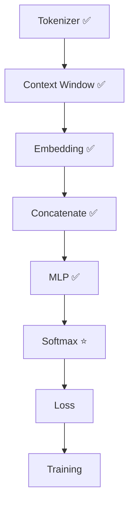
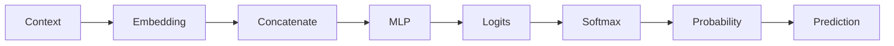

# Experiment 6.5：第一次预测——从 Logits 到概率分布

## 实验目标

第 4.8 节已经讲过了：为什么需要 Softmax、为什么概率之和等于 1、为什么要减去最大值。本实验把它接到 6.4 的 Logits 上，并做一件第 4 章没做的事——**第一次真正"预测"出一个 Token**：用 argmax（Greedy Decoding）选出概率最大的词。

---

# 当前进度



---

# 一、实验原理

上一实验得到 Logits `[-1.72, -3.22, 0.93, -0.90]`。它只表示模型对每个候选的"偏好程度"：`AI: 0.93` 最高，但到底有多大把握不知道。Softmax 的原理在第 4.8 节，这里直接调用。

---

# 二、准备 Vocabulary

```python
id2word = {0:"I", 1:"love", 2:"AI", 3:"today"}
logits = np.array([-1.72, -3.22, 0.93, -0.90])
```

---

# 三、实现 Softmax

```python
shifted = logits - np.max(logits)  # 数值稳定
exp = np.exp(shifted)
prob = exp / np.sum(exp)
print(prob)  # [0.057 0.013 0.801 0.129]
```

---

# 四、验证概率

```python
print(prob.sum())  # 1.0
```

说明Softmax 成功把任意数字变成了合法概率。

---

# 五、打印预测结果

```python
for i, p in enumerate(prob):
    print(id2word[i], ":", round(p, 3))
```

输出：

```text
I : 0.057
love : 0.013
AI : 0.801
today : 0.129
```

已经非常接近真正 Language Model 的输出。

---

# 六、预测下一个 Token

最简单的方法：Greedy Decoding。

```python
prediction = np.argmax(prob)
print(id2word[prediction])  # AI
```

说明模型认为下一 Token 最可能是 `AI`。

---

# 七、完整代码

```python
#!/usr/bin/env python3
import numpy as np

id2word = {0:"I", 1:"love", 2:"AI", 3:"today"}
logits = np.array([-1.72, -3.22, 0.93, -0.90])

shifted = logits - np.max(logits)
exp = np.exp(shifted)
prob = exp / np.sum(exp)

print("Probability:", prob)
print("Sum:", prob.sum())
for i, p in enumerate(prob):
    print(f"{id2word[i]:<8} {p:.3f}")

prediction = np.argmax(prob)
print("Prediction:", id2word[prediction])
```

---

# 八、运行结果

```text
Probability: [0.057 0.013 0.801 0.129]
Sum: 1.0

I        0.057
love     0.013
AI       0.801
today    0.129

Prediction: AI
```

---

# 九、实验分析

现在我们的神经语言模型终于能够**根据 Context，预测下一个 Token**。完整流程：



请注意，模型真正输出的不是 `AI`，而是整个概率分布，例如 `AI 80%, I 6%, today 13%, love 1%`。真正选择哪个 Token，只是推理阶段最后一步。

---

# 十、思考题

把 `logits` 修改成 `[8,2,1,0]`，观察 Softmax 有什么变化。继续尝试 `[100,99,98,97]`，为什么程序仍然能够正常运行？提示：观察 `shifted = logits - np.max(logits)` 这一句解决了什么问题。

---

# 本实验总结

本实验完成了：✅ 把 Softmax 接到真实 Logits ✅ Probability ✅ Greedy Prediction

现在整个神经语言模型已经能够根据 Context 预测下一个 Token。下一实验，我们将告诉模型"你预测得对还是错"，并利用**Cross Entropy Loss** 计算模型这一次到底预测得有多好。
