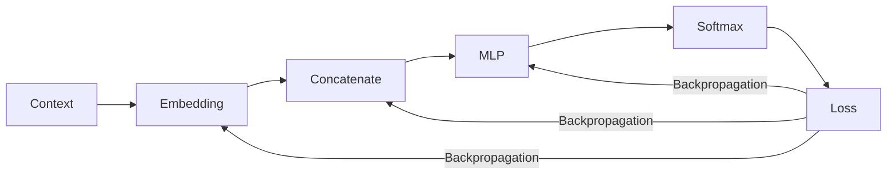

# Experiment 6.6：Gradient Descent——模型是如何学会的？

## 实验目标

上一节（6.5），我们已经**详细手算**过反向传播——怎么从 Loss 一路推出 `W1_grad`、`b1_grad`、`W2_grad`、`b2_grad`、`x_grad` 这些具体数字，本节不再重复。本节只回答一个问题，但要讲透、讲严谨：**梯度算出来之后，工程上到底是怎么被用来真正改动参数的？** 这里面藏着几个新手最容易踩的坑——梯度默认会累加、参数更新不能被自动求导追踪、真实训练是对一个 batch 求平均梯度，而不是单个样本——这些都是"知道梯度"和"正确使用梯度"之间的真实距离。

---

# 一、一个简单的类比

假设你站在山坡上，想要走到山谷（Loss 最小的地方），但你看不见整座山，只能感觉脚下的坡度（Gradient，梯度）。于是你每一步都朝着坡度下降最快的方向走一小步，走了很多步以后，就会越来越接近谷底：

> **梯度指出了 Loss 增长最快的方向，我们只需要往相反方向走，就能让 Loss 变小。**

---

# 二、最小例子：建立更新公式

用一个最简单的函数 `L(w) = (w-3)²` 建立直觉，梯度就是 `dL/dw = 2(w-3)`：

```python
def loss_fn(w):
    return (w - 3) ** 2

def gradient_fn(w):
    return 2 * (w - 3)

w = 0.0          # 初始值
lr = 0.1         # 学习率（Learning Rate）

for step in range(10):
    grad = gradient_fn(w)
    w = w - lr * grad
    print(f"step {step}: w={w:.3f}, loss={loss_fn(w):.3f}")
```

```text
step 0: w=0.600, loss=5.760
step 1: w=1.080, loss=3.686
...
step 9: w=2.678, loss=0.104
```

`w` 从 0 一步一步逼近 3，Loss 不断变小，核心就是这一条**更新公式**：

```
w_new = w_old - learning_rate × gradient
```

这条公式贯穿所有深度学习训练——无论是四层 MLP 还是千亿参数的 GPT，参数更新方式完全一样，唯一区别是参数数量多了几十亿倍，以及 `learning_rate` 本身可能是动态调整的（6.8 节详细讲）。

---

# 三、Learning Rate 的作用（简述，6.8节详细展开）

`lr` 决定每一步走多远。太小（如 0.001）收敛极慢；太大（如 2.0）会在最优点附近震荡甚至发散。这里先建立直觉即可，**"学习率该怎么随训练过程动态调整（Warmup、Cosine Decay）"这个更复杂的话题，留给 6.8 节专门讲**，本节只关注"梯度算出来之后，具体怎么被应用"这一件事。

---

# 四、工程中，梯度具体是怎么被用来更新参数的？

上面的例子只有 1 个参数、1 个样本，看起来只是套一下公式。但真实训练里，至少有三件事会让"用梯度更新参数"变得不那么直观——下面逐一讲清楚。

## 4.1 真实训练用的是一个 batch 的平均梯度，不是单个样本

6.5 节手算梯度时，只喂了**一条样本**（`x = [0.8, 0.3, 0.5]`，目标 `AI`）。但真实训练每一步会同时喂一批样本（比如 32 条），Loss 是这一批样本各自 Loss 的**平均值**：

```
batch_loss = (loss_1 + loss_2 + ... + loss_B) / B
```

根据链式法则，"对平均值求导"等于"对每一项分别求导，再求平均"：

```
d(batch_loss)/dW = ( d(loss_1)/dW + d(loss_2)/dW + ... + d(loss_B)/dW ) / B
```

也就是说，**每一步实际更新用的梯度，是这一批样本各自梯度的平均值**，不是某一条样本单独的梯度。这解释了两件事：

- **为什么 Batch Size 越大，训练越"稳"**：平均掉了更多样本的随机噪声，梯度方向更能代表整体数据的真实趋势；
- **为什么 Batch Size 太小时 Loss 曲线会上下抖动**：单个样本（甚至几个样本）的梯度带有很大的随机性，平均样本数太少，噪声压不下去。

PyTorch 里 `nn.CrossEntropyLoss()` 默认的 `reduction='mean'` 参数，做的正是这件事——本章 6.7 节代码里没有明写 `reduction`，就是因为默认值已经是"批内求平均"。

## 4.2 所有参数是"一次性"向量化更新的，不是一个个循环

6.5 节手算时，`W1_grad` 是一个 4×3 的矩阵，`W1` 本身也是 4×3——**更新时是整个矩阵一次性相减**，不是写一个双重循环去更新 `W1[0][0]`、`W1[0][1]`……：

```python
W1_new = W1 - lr * W1_grad     # 一行代码，12个数字同时更新
```

真实模型的一个 Linear 层可能有几千万个参数，全部靠 NumPy/PyTorch 的向量化运算（底层调用 BLAS 或 GPU 的并行计算单元）一次性完成，这也是为什么"参数量"可以轻松涨到几十亿——**不是因为算得慢，而是向量化运算天生就能同时处理海量数字**。

## 4.3 梯度默认会"累加"，这是新手最容易踩的坑

这是一个真实、具体、容易被忽略的工程细节：PyTorch 里，每调用一次 `.backward()`，梯度是**累加**到 `.grad` 属性上的，不是覆盖：

```python
import torch

w = torch.tensor([1.0], requires_grad=True)

loss1 = (w - 3) ** 2
loss1.backward()
print(w.grad)          # tensor([-4.])   ← 第一次反向传播的梯度

loss2 = (w - 3) ** 2
loss2.backward()
print(w.grad)          # tensor([-8.])   ← 不是-4，是-4 + -4 = -8，累加了！
```

如果不做任何处理，梯度会一直往上叠加，导致更新步子越滚越大、训练直接失控。**这正是为什么每一个训练循环，必须在反向传播之前先调用 `optimizer.zero_grad()`（或 `w.grad = None`）**——6.7 节的训练代码里 `optimizer.zero_grad()` 这一行，答案就在这里：

```python
w.grad = None                    # 手动清零（也可以用 optimizer.zero_grad()）
loss3 = (w - 3) ** 2
loss3.backward()
print(w.grad)          # tensor([-4.])   ← 清零之后，恢复成单次的正确梯度
```

**为什么 PyTorch 要设计成"默认累加"而不是"默认覆盖"？** 因为这个特性本身是有用的——训练大模型时显存不够，一次塞不下整个 batch，工程上会把一个大 batch 拆成几个小 batch **分别** `backward()`（梯度自动累加），最后统一 `step()` 一次，这叫**梯度累积（Gradient Accumulation）**，本质上就是利用了这个"累加"特性，用时间换显存。

## 4.4 更新参数这个动作，本身不能被自动求导追踪

`w = w - lr * grad` 这行代码看起来很朴素，但如果 `w` 是一个 `requires_grad=True` 的 PyTorch 张量，直接这样写会出问题：

```python
w = torch.tensor([1.0], requires_grad=True)
grad = torch.tensor([-4.0])

w = w - 0.1 * grad     # 危险写法：这个减法本身会被 Autograd 记录进计算图
```

问题在于：**减法运算本身也是一次"前向计算"，如果不加保护，Autograd 会把它也当成计算图的一部分记录下来**，而"更新参数"根本不应该被纳入下一次求梯度的计算图——我们只是想改一下这个数字，不是想对"改数字"这个操作本身再求导。正确写法是用 `torch.no_grad()` 包裹住更新这一步，明确告诉 PyTorch"这里不用追踪梯度"：

```python
with torch.no_grad():
    w -= 0.1 * grad     # 在 no_grad 语境下修改 w 的数值，不会被计算图记录
```

`torch.optim.SGD`、`Adam` 等所有官方优化器，内部的 `step()` 方法都是在 `torch.no_grad()` 语境下执行的——这也是为什么你在 6.7 节代码里只需要调用 `optimizer.step()`，不需要自己操心这个细节，但这个细节确实存在，且是真实踩坑高发地。

## 4.5 用 6.5 节的真实梯度，手动验证一次参数更新

不用抽象举例，直接拿 6.5 节已经算出来的真实数字，走一遍更新流程。6.5 节里 `W1[1,0] = 0.8`，对应算出的 `W1_grad[1,0] = -0.232`。假设 `lr = 0.1`：

```python
lr = 0.1
W1_10_old = 0.8
W1_10_grad = -0.232

W1_10_new = W1_10_old - lr * W1_10_grad
print(W1_10_new)   # 0.8232
```

```text
W1_10_new = 0.8 - 0.1 × (-0.232) = 0.8 + 0.0232 = 0.8232
```

**这个数字本身也值得读一下**：梯度是负的（`-0.232`），减去一个负数等于加上一个正数，所以 `W1[1,0]` 从 `0.8` **变大**到了 `0.8232`——回顾 6.5 节，`W1_grad` 为负意味着"这个参数应该调大才能让 Loss 下降"，这里的更新方向和梯度的符号含义完全对应上了。同理，`W1` 里那些梯度为 0 的位置（被 ReLU 掩码挡掉的两行），这一步完全不会变化——**没有梯度，就没有更新**。

## 4.6 PyTorch 的 `optimizer.step()` 内部到底在做什么

6.7 节直接用了 `torch.optim.Adam(...)`，看起来像个黑盒。剥掉外壳，一个最朴素的优化器（不含 Momentum/Adam 这些改进，留给6.8节）本质上就是把 4.3、4.4 两节的细节封装成了两个方法：

```python
class MinimalSGD:
    """朴素版 SGD，用来对照 torch.optim.SGD 内部到底做了什么"""
    def __init__(self, params, lr):
        self.params = list(params)   # model.parameters() 返回的所有可训练张量
        self.lr = lr

    def step(self):
        with torch.no_grad():          # 对应 4.4 节：更新时不追踪梯度
            for p in self.params:
                if p.grad is not None:
                    p -= self.lr * p.grad   # 对应 4.2 节：整个张量一次性向量化更新

    def zero_grad(self):
        for p in self.params:            # 对应 4.3 节：每步开始前清零梯度
            if p.grad is not None:
                p.grad.zero_()
```

拿它替换掉 6.7 节代码里的 `torch.optim.Adam`，效果就是最朴素的梯度下降（没有 Adam 的自适应学习率）——这也是 6.8 节要讲的"Adam 到底比它聪明在哪里"的起点。

**一个容易被问到的问题：`for p in self.params` 这个循环，是先更新 `W1` 还是先更新 `W2`？会不会影响结果？** 答案是：**顺序无所谓，谁先谁后结果完全一样**。原因是 `p.grad`（也就是 `W1_grad`、`W2_grad` 这些值）已经在上一步 `loss.backward()` 里，**基于同一套旧参数**全部算完并冻结好了——`W2_grad` 依赖的是前向传播时的旧 `h`（进而是旧 `W1`），不是"更新循环执行到这一刻"的 `W1`。所以每个参数的更新只用得上"它自己的旧值 + 它自己已经算好的梯度"，参数之间在更新这一步互不依赖，天然可以同时进行（这也是为什么 PyTorch 底层能把这个循环向量化并行执行，而不必真的一个个串行等待）。

**注意这和"梯度怎么算出来"是两件不同的事**：6.5 节 `backward()` 里那个反向拓扑序（`Loss → logits_grad → W2_grad/h_grad → pre1_grad → W1_grad`）是**有严格顺序**的，因为 `W1_grad` 的计算要依赖已经算出的 `pre1_grad`；但这里"应用梯度去更新参数"，是在所有梯度都已经算完之后才发生的**另一个独立阶段**，不存在这种依赖关系。这也是为什么 `loss.backward()`（算全部梯度）和 `optimizer.step()`（应用全部梯度）必须是两个分开的调用，不能边算边更新。

**一句话总结这一节**：`optimizer.step()` 不是魔法，就是"遍历所有参数张量，在 `no_grad` 语境下按 `w = w - lr×grad` 整体更新一次"；`optimizer.zero_grad()` 也不是可选的仪式，而是因为梯度默认累加，必须手动清零。

---

# 五、把梯度下降接到 Neural Language Model 上



Loss 算出来后，反向传播会让 Embedding、MLP 里每一个参数都拿到梯度，然后按 4.6 节的方式统一更新一次。重复这一过程数千、数万次，模型的预测就会越来越准确。

**这里可以回答第3、4章都留下的一个问题：Embedding 到底是不是和 Weight 一起被更新的？** 是的，没有另外一套机制——反向传播会一路从 Loss 传回 MLP，再传回 Embedding，两者用的是完全同一条更新公式（4.6 节的 `MinimalSGD.step()`，`model.parameters()` 会把 Embedding 矩阵也算进去）。但有一个细节值得注意：**Embedding Lookup 本质上是数组索引，所以反向传播传回来的梯度，也只会落在这一步实际被查到的那几行上**——这一批训练数据只用到了 `I`、`love` 两个 Token，那么也只有 Embedding Matrix 里这两行会拿到梯度、被更新，词表里其它没出现过的词，这一步梯度是 0，不会有任何变化。这也是为什么高频词（如 `the`）的 Embedding 通常学得更快更好：它被抽到、被更新的次数远多于生僻词。

---

# 六、完整训练循环：把本节所有细节串起来

```python
optimizer.zero_grad()                   # 4.3节：先清空上一步残留的梯度
logits = forward(context)               # 前向传播
loss = cross_entropy(logits, target)    # 计算 Loss（4.1节：真实训练里是一个batch的平均值）
loss.backward()                         # 反向传播（6.5节已详细手算过这一步在算什么）
optimizer.step()                        # 4.6节：no_grad语境下，向量化更新全部参数
```

这五行代码，就是几乎所有深度学习模型训练的核心循环——GPT 的训练过程在本质上完全一样，只是参数规模、batch 规模大很多。下一节（6.7），我们会用真正的 PyTorch 把这五行代码接上一个完整可训练的模型，亲眼看着 Loss 从随机瞎猜的水平一路降下来。

---

# 本实验总结

本实验完成了：✅ 用最小例子确立更新公式 `w_new = w - lr×grad` ✅ **详细讲清楚了梯度在工程中具体如何被使用**：batch 平均、向量化整体更新、梯度默认累加需要 `zero_grad()`、更新必须在 `no_grad` 语境下进行 ✅ 用 6.5 节的真实梯度手动验证了一次参数更新，并解释了符号方向的含义 ✅ 拆开 `optimizer.step()`，用 60 行 `MinimalSGD` 对照出它内部到底做了什么 ✅ 把梯度下降接回 Neural Language Model，讲清楚了 Embedding 是如何被"部分更新"的

现在我们已经拥有了训练一个真正 Neural Language Model 所需的全部组件。下一实验，我们将把前面所有实验组合起来，使用 PyTorch **真正训练**一个完整的 Neural Language Model。
