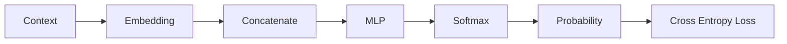

# Experiment 6.6：第一次打分——Loss 与 Perplexity

## 实验目标

第 4.9 节讲过 Cross Entropy 的原理：`Loss = -log(P)`，只关心真实答案的概率。本实验把它接到 6.5 的真实预测上——注意这次模型**真的预测错了**（它信心满满地押 `AI` 80.1%，而真实答案是 `today`），并补上第 4 章没有的新指标：**Perplexity（困惑度）**。

---

# 一、实验原理

真实答案（Target）是 `today`，对应 Token ID 为 3；模型给它的概率只有 12.9%（`prob[3] = 0.129`），说明模型预测得不太好。Cross Entropy 的定义（第 4.9 节）：

```
Loss = -log(P(target))
```

只关心真实答案对应的概率，概率越高 Loss 越小，概率越低 Loss 越大。

---

# 二、准备数据

```python
import numpy as np

id2word = {0:"I", 1:"love", 2:"AI", 3:"today"}
prob = np.array([0.057, 0.013, 0.801, 0.129])
target = 3  # today
```

---

# 三、计算 Loss

```python
loss = -np.log(prob[target])
print(loss)  # 2.045
```

---

# 四、对比不同预测

假设模型预测得很好，`today` 概率为 0.9：

```python
good_prob = np.array([0.05, 0.02, 0.03, 0.90])
print(-np.log(good_prob[3]))  # 0.105
```

Loss 只有 0.105，比之前的 2.045 小很多，说明预测得更准确。

假设模型完全预测错误，`today` 概率只有 0.01：

```python
bad_prob = np.array([0.90, 0.05, 0.04, 0.01])
print(-np.log(bad_prob[3]))  # 4.605
```

Loss 高达 4.605。

---

# 五、三种情况对比

| 预测质量 | today 的概率 | Loss |
| -------- | -----------: | ----:|
| 很好 | 0.90 | 0.105 |
| 一般 | 0.129 | 2.045 |
| 很差 | 0.01 | 4.605 |

> **概率越高，Loss 越小；概率越低，Loss 呈指数级增大。**

---

# 六、完整代码

```python
#!/usr/bin/env python3
import numpy as np

def cross_entropy(prob, target):
    return -np.log(prob[target])

id2word = {0:"I", 1:"love", 2:"AI", 3:"today"}
target = 3  # today

predictions = {
    "很好": np.array([0.05,0.02,0.03,0.90]),
    "一般": np.array([0.057,0.013,0.801,0.129]),
    "很差": np.array([0.90,0.05,0.04,0.01]),
}

for name, prob in predictions.items():
    loss = cross_entropy(prob, target)
    print(f"{name:<4} target概率={prob[target]:.3f}  Loss={loss:.3f}")
```

---

# 七、运行结果

```text
很好 target 概率=0.900  Loss=0.105
一般 target 概率=0.129  Loss=2.045
很差 target 概率=0.010  Loss=4.605
```

---

# 八、实验分析

现在整个 Neural Language Model 已经拥有了完整的评价体系：



Loss 就是模型训练过程中最重要的信号——**Loss 越小，模型预测得越准确**。

---

# 九、思考题

如果真实答案对应的概率恰好为 1.0，Loss 会是多少？如果恰好为 0.0 呢？请思考这在实际训练中会带来什么问题。

---

# 十、从 Loss 到 Perplexity（困惑度）

Cross Entropy Loss 是一个数学上很好用的训练目标，但它的数值（例如 `2.045`）本身不太直观——"2.045" 到底算好还是算差？为了让这个数字更好理解，语言模型领域普遍会把Loss 转换成另一个指标：**Perplexity（困惑度）**，定义非常简单：

```
Perplexity = exp(Loss)
```

```python
import numpy as np

for name, prob in predictions.items():
    loss = cross_entropy(prob, target)
    perplexity = np.exp(loss)
    print(f"{name:<4} Loss={loss:.3f}  Perplexity={perplexity:.2f}")
```

```text
很好 Loss=0.105  Perplexity=1.11
一般 Loss=2.045  Perplexity=7.73
很差 Loss=4.605  Perplexity=100.00
```

**Perplexity 有一个很直观的解读：它大致相当于"模型在每一步预测时，平均感觉有多少个同样可能的候选 Token 在竞争"。** Perplexity 为 1，意味着模型几乎百分之百确定下一个 Token 是什么（完全不"困惑"）；Perplexity 为 100，意味着模型的把握程度大致相当于"在100个候选词里随机蒙一个"。这也是为什么 Perplexity 是语言模型最经典的评价指标之一：它把一个抽象的Loss 数字，变成了一个更接地气的"模型有多困惑"的直觉度量，词表越大、任务越难，同样的 Loss 对应的 Perplexity 也会越高。

---

# 本实验总结

本实验完成了：✅ Cross Entropy 公式 ✅ 不同预测质量对比 ✅ 理解 Loss 与概率的关系

现在模型已经知道自己预测得好不好，但**知道错了还不够，还需要知道该往哪个方向修改参数**。下一实验，我们将进入整个深度学习的核心——**Gradient Descent（梯度下降）**，让模型真正学会自我修正。
