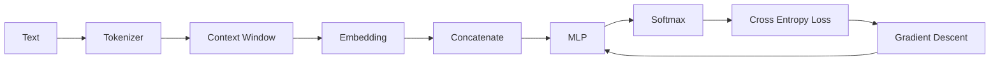

# Experiment 6.7：Train Your First Neural Language Model

## 实验目标

前面所有实验都是用 NumPy 手动实现每一步（Embedding Lookup、Concatenate、MLP、Softmax、Loss、梯度下降）。本实验将使用 **PyTorch**，把这些组件整合成一个完整、可训练的 Neural Language Model，并真正观察 Loss 随着训练不断下降。

---

# 一、准备环境

```bash
pip install torch
```

---

# 二、准备数据

前面从本章开始到 6.4 节，一直用的都是 `I love AI today` 这四个词，只是单句在窗口为 2 时只能生成 2 条样本。这里保留**同一个 Token 集合**，把四词序列重复 20 次，以构造一个容易拟合的周期数据集。注意，本节通过 `sorted(set(words))` 重新分配 ID，因此映射为 `AI:0, I:1, love:2, today:3`，与 6.1 手写的 `I:0, love:1, AI:2, today:3` 不同；模型只要求同一段代码内的映射前后一致。

```python
import torch
import torch.nn as nn

torch.manual_seed(42)

text = "I love AI today " * 20  # 仍然是 6.1 节实验准备里的四个词：I、love、AI、today
words = text.split()
vocab = sorted(set(words))
word2id = {w: i for i, w in enumerate(vocab)}
id2word = {i: w for w, i in word2id.items()}

ids = [word2id[w] for w in words]

window_size = 2
contexts, targets = [], []
for i in range(window_size, len(ids)):
    contexts.append(ids[i-window_size:i])
    targets.append(ids[i])

X = torch.tensor(contexts)
Y = torch.tensor(targets)
print(vocab)
print(word2id)
print(X.shape, Y.shape)
```

```text
['AI', 'I', 'love', 'today']
{'AI': 0, 'I': 1, 'love': 2, 'today': 3}
torch.Size([78, 2]) torch.Size([78])
```

80 个 Token 用长度为 2 的滑动窗口产生 `80 - 2 = 78` 条样本，不是 2 条。`I love AI today` 不断重复，会形成一个非常规律的循环：`[I,love]→AI`、`[love,AI]→today`、`[AI,today]→I`、`[today,I]→love`……这正好可以验证：只要给模型足够多次观察同一份数据，它是否能够把这套规律学到几乎零误差的 Loss。

---

# 三、定义模型

把前面实验中的 Embedding、Concatenate 和 MLP 组合成一个 PyTorch 模型。模型的 `forward` 返回原始 Logits；训练时不在模型末尾添加 Softmax，因为 `nn.CrossEntropyLoss` 会在内部以数值稳定的方式完成 `log_softmax + NLLLoss`：

```python
class NeuralLM(nn.Module):
    def __init__(self, vocab_size, embed_dim, window_size, hidden_dim):
        super().__init__()
        self.embedding = nn.Embedding(vocab_size, embed_dim)
        self.fc1 = nn.Linear(embed_dim * window_size, hidden_dim)
        self.relu = nn.ReLU()
        self.fc2 = nn.Linear(hidden_dim, vocab_size)

    def forward(self, x):
        emb = self.embedding(x)            # (batch, window, embed_dim)
        emb = emb.view(emb.size(0), -1)    # Concatenate
        hidden = self.relu(self.fc1(emb))  # Linear + ReLU
        logits = self.fc2(hidden)          # Linear -> Logits
        return logits
```

这几行代码的结构是 `Embedding → Concatenate → Linear → ReLU → Linear → Logits`。PyTorch Autograd 会记录这些运算并在 `loss.backward()` 时计算梯度；Softmax/交叉熵属于损失函数，而不是这个 `forward` 的一层。

---

# 四、初始化模型、Loss、优化器

```python
vocab_size = len(vocab)
model = NeuralLM(vocab_size=vocab_size, embed_dim=8, window_size=window_size, hidden_dim=16)

criterion = nn.CrossEntropyLoss()          # 对应 6.4 节
optimizer = torch.optim.Adam(model.parameters(), lr=0.01)  # 对应 6.6 节（梯度下降）
```

`nn.CrossEntropyLoss()` 接收原始 Logits，并在内部组合数值稳定的 `log_softmax` 与负对数似然；不要先手动 Softmax。`optimizer` 使用反向传播得到的梯度更新参数，Adam 是朴素梯度下降的自适应改进。

---

# 五、训练循环

```python
for step in range(300):
    logits = model(X)                # 前向传播
    loss = criterion(logits, Y)      # 计算 Loss
    optimizer.zero_grad()
    loss.backward()                  # 反向传播，自动计算梯度
    optimizer.step()                 # 更新参数

    if step % 50 == 0:
        print(f"step {step:>3} loss={loss.item():.4f}")
```

---

# 六、运行与数值检查

代码固定了 `torch.manual_seed(42)`；在同一 PyTorch 版本和设备上重复运行可复现。不同 PyTorch 版本或后端的初始化/浮点实现仍可能带来小差异，因此这里不把某一环境的一串 Loss 当作跨环境保证。应检查两个可复现事实：Loss 总体下降，并且训练后四种周期 Context 都预测正确。

```python
test_contexts = [["I", "love"], ["love", "AI"],
                 ["AI", "today"], ["today", "I"]]
test_ids = torch.tensor([[word2id[w] for w in context] for context in test_contexts])
with torch.no_grad():
    final_loss = criterion(model(X), Y).item()
    pred_ids = model(test_ids).argmax(dim=-1).tolist()
print(f"final loss={final_loss:.6f}")
for context, pred_id in zip(test_contexts, pred_ids):
    print(context, "->", id2word[pred_id])
```

## 训练前的第一个数字检查：`ln(V)` 是基线，不是硬性等式

如果初始 Logits 恰好全相等，模型对每个 Token 的概率就是 $1/V$，Cross Entropy 恰好为：

$$
-\ln(1/V)=\ln(V)
$$

随机初始化只会让预测**近似**均匀，因此单次初始化的 Loss 可以偏离 `ln(V)`。本实验有 78 条高度重复的样本，$V=4$，均匀预测基线为 $\ln(4)\approx1.386$。这个值适合做量级检查，但不能据此断言稍有偏离就是 bug；真正异常的是数量级悬殊、NaN/Inf，或在小数据上长时间无法过拟合。

---

# 七、测试模型

```python
def predict(context_words):
    ids = torch.tensor([[word2id[w] for w in context_words]])
    logits = model(ids)
    pred_id = torch.argmax(logits, dim=-1).item()  # argmax(softmax(logits)) 与 argmax(logits) 相同
    return id2word[pred_id]

print(predict(["I", "love"]))   # 训练充分后应该输出 AI
```

---

# 八、完整代码

```python
#!/usr/bin/env python3
import torch
import torch.nn as nn

torch.manual_seed(42)

text = "I love AI today " * 20
words = text.split()
vocab = sorted(set(words))
word2id = {w: i for i, w in enumerate(vocab)}
id2word = {i: w for w, i in word2id.items()}
ids = [word2id[w] for w in words]

window_size = 2
contexts, targets = [], []
for i in range(window_size, len(ids)):
    contexts.append(ids[i-window_size:i])
    targets.append(ids[i])

X = torch.tensor(contexts)
Y = torch.tensor(targets)

class NeuralLM(nn.Module):
    def __init__(self, vocab_size, embed_dim, window_size, hidden_dim):
        super().__init__()
        self.embedding = nn.Embedding(vocab_size, embed_dim)
        self.fc1 = nn.Linear(embed_dim * window_size, hidden_dim)
        self.relu = nn.ReLU()
        self.fc2 = nn.Linear(hidden_dim, vocab_size)

    def forward(self, x):
        emb = self.embedding(x).view(x.size(0), -1)
        hidden = self.relu(self.fc1(emb))
        return self.fc2(hidden)

model = NeuralLM(len(vocab), embed_dim=8, window_size=window_size, hidden_dim=16)
criterion = nn.CrossEntropyLoss()
optimizer = torch.optim.Adam(model.parameters(), lr=0.01)

for step in range(300):
    logits = model(X)
    loss = criterion(logits, Y)
    optimizer.zero_grad()
    loss.backward()
    optimizer.step()
    if step % 50 == 0:
        print(f"step {step:>3} loss={loss.item():.4f}")
```

---

# 九、实验分析：本章完整流程回顾



从 6.1 到 6.7，我们一步一步、亲手拼出了一个真正可训练的 Neural Language Model：数据集构建、Embedding Lookup、Concatenate（6.1）→ MLP Forward（6.2）→ Softmax（6.3）→ Cross Entropy（6.4）→ 反向传播（6.5）→ Gradient Descent（6.6）→ PyTorch 端到端训练（本节）。

---

# 十、这个模型的局限

虽然模型已经能够训练，但它仍然使用**固定 Context Window**（本例为 2），无法处理任意长度的上下文，也无法真正建模"哪些词更重要"。这两个问题，将分别在后续RNN 章节和 Attention 章节中得到解决。

---

# 本章总结

请记住 Neural Language Model 最核心的流程：

> **Token → Embedding → 神经网络计算 → Softmax 得到概率 → Cross Entropy 计算误差 → 梯度下降更新参数。**

这套流程从 2003 年的Bengio Neural Language Model，到今天数千亿参数的 GPT，从未改变，唯一变化的是网络结构从MLP 演进为 RNN，最终演进为 Transformer。不过，上面的训练代码里，我们直接用了`torch.optim.Adam`，却从来没有解释它比6.6 节手写的 Vanilla Gradient Descent 到底聪明在哪里。下一节，我们先补上这一课：**6.8 从 Vanilla Gradient Descent 到 Adam——现代优化器与权重初始化**。之后，我们才正式进入 **RNN（循环神经网络）**，看看模型如何摆脱固定窗口的限制，拥有真正的"记忆"。
