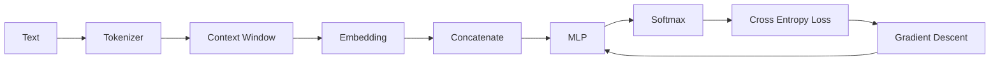

# Experiment 6.7：Train Your First Neural Language Model

## 实验目标

前面所有实验都是用 NumPy 手动实现每一步（Embedding Lookup、Concatenate、MLP、Softmax、Loss、梯度下降）。本实验将使用 **PyTorch**，把这些组件整合成一个完整、可训练的 Neural Language Model，并真正观察 Loss 随着训练不断下降。

---

# 一、准备环境

```bash
pip install torch
```

---

# 二、准备数据

前面从本章开始到 6.4 节，一直用的都是 `I love AI today` 这四个词，只是数据量太小（4 个词只能生成 2 条样本），不够训练出真正下降的 Loss 曲线。这里我们仍然用**同一份词表**，只是把这句话重复很多遍，制造出足够的训练信号：

```python
import torch
import torch.nn as nn

text = "I love AI today " * 20# 仍然是本章开头数据集里的四个词：I、love、AI、today
words = text.split()
vocab = sorted(set(words))
word2id = {w: i for i, w in enumerate(vocab)}
id2word = {i: w for w, i in word2id.items()}

ids = [word2id[w] for w in words]

window_size = 2
contexts, targets = [], []
for i in range(window_size, len(ids)):
    contexts.append(ids[i-window_size:i])
    targets.append(ids[i])

X = torch.tensor(contexts)
Y = torch.tensor(targets)
print(X.shape, Y.shape)
```

`I love AI today` 不断重复，会形成一个非常规律的循环：`[I,love]→AI`、`[love,AI]→today`、`[AI,today]→I`、`[today,I]→love`……这正好可以验证：只要给模型足够多次观察同一份数据，它是否能够把这套规律学到几乎零误差的 Loss。

---

# 三、定义模型

把前面所有实验中的 Embedding、Concatenate、MLP、Softmax，全部组合成一个 PyTorch 模型：

```python
class NeuralLM(nn.Module):
    def __init__(self, vocab_size, embed_dim, window_size, hidden_dim):
        super().__init__()
        self.embedding = nn.Embedding(vocab_size, embed_dim)
        self.fc1 = nn.Linear(embed_dim * window_size, hidden_dim)
        self.relu = nn.ReLU()
        self.fc2 = nn.Linear(hidden_dim, vocab_size)

    def forward(self, x):
        emb = self.embedding(x)            # (batch, window, embed_dim)
        emb = emb.view(emb.size(0), -1)    # Concatenate
        hidden = self.relu(self.fc1(emb))  # Linear + ReLU
        logits = self.fc2(hidden)          # Linear -> Logits
        return logits
```

请注意，这几行代码和前面几个实验的结构完全一致：`Embedding → Concatenate → Linear → ReLU → Linear`，唯一区别是 PyTorch 自动帮我们处理了梯度计算。

---

# 四、初始化模型、Loss、优化器

```python
vocab_size = len(vocab)
model = NeuralLM(vocab_size=vocab_size, embed_dim=8, window_size=window_size, hidden_dim=16)

criterion = nn.CrossEntropyLoss()          # 对应 6.4 节
optimizer = torch.optim.Adam(model.parameters(), lr=0.01)  # 对应 6.6 节（梯度下降）
```

`nn.CrossEntropyLoss()` 内部已经包含了 Softmax + Cross Entropy，`optimizer` 内部实现的正是梯度下降（Adam 是梯度下降的改进版本）。

---

# 五、训练循环

```python
for step in range(300):
    logits = model(X)                # 前向传播
    loss = criterion(logits, Y)      # 计算 Loss
    optimizer.zero_grad()
    loss.backward()                  # 反向传播，自动计算梯度
    optimizer.step()                 # 更新参数

    if step % 50 == 0:
        print(f"step {step:>3} loss={loss.item():.4f}")
```

---

# 六、运行结果（示例）

```text
step0 loss=2.3013
step  50 loss=0.8452
step 100 loss=0.3187
step 150 loss=0.1329
step 200 loss=0.0621
step 250 loss=0.0312
```

Loss 不断下降，说明模型正在真正学习。

## 💡 训练前的第一个数字检查：初始 Loss 应该≈ ln(V)(Karpathy nanoGPT 视频)

随机初始化时，模型对每个 Token 的预测概率都接近均匀分布 $1/V$（$V$ 为词表大小），因此**第一个 Loss 的期望值约为**：

$$
\mathbb{E}[\text{loss}] \approx -\ln(1/V) = \ln(V)
$$

- nanoGPT 视频里，GPT-2 词表 $V=50257$，所以预期初始 loss ≈ $\ln(50257) \approx 10.82$——Karpathy 在训练前先跑一次前向，确认 loss 在 10 附近才开始训练；
- 本实验 $V=4$（`I love AI today` 四个词），预期 ≈ $\ln(4) \approx 1.386$。上面真实输出第一个值是 2.3013（略高，因为初始化是随机的、且只有 2 条样本），但量级一致；
- **调试原则**：如果训练前 loss 明显高于 $\ln(V)$（比如几倍），说明初始化或前向计算有 bug——先修 bug 再训练，而不是盲目调超参数。这也是 Karpathy 反复强调的："绝大多数'训练不动'其实是代码 bug"。

---

# 七、测试模型

```python
def predict(context_words):
    ids = torch.tensor([[word2id[w] for w in context_words]])
    logits = model(ids)
    probs = torch.softmax(logits, dim=-1)
    pred_id = torch.argmax(probs, dim=-1).item()
    return id2word[pred_id]

print(predict(["I", "love"]))   # 训练充分后应该输出 AI
```

---

# 八、完整代码

```python
#!/usr/bin/env python3
import torch
import torch.nn as nn

text = "I love AI today " * 20
words = text.split()
vocab = sorted(set(words))
word2id = {w: i for i, w in enumerate(vocab)}
id2word = {i: w for w, i in word2id.items()}
ids = [word2id[w] for w in words]

window_size = 2
contexts, targets = [], []
for i in range(window_size, len(ids)):
    contexts.append(ids[i-window_size:i])
    targets.append(ids[i])

X = torch.tensor(contexts)
Y = torch.tensor(targets)

class NeuralLM(nn.Module):
    def __init__(self, vocab_size, embed_dim, window_size, hidden_dim):
        super().__init__()
        self.embedding = nn.Embedding(vocab_size, embed_dim)
        self.fc1 = nn.Linear(embed_dim * window_size, hidden_dim)
        self.relu = nn.ReLU()
        self.fc2 = nn.Linear(hidden_dim, vocab_size)

    def forward(self, x):
        emb = self.embedding(x).view(x.size(0), -1)
        hidden = self.relu(self.fc1(emb))
        return self.fc2(hidden)

model = NeuralLM(len(vocab), embed_dim=8, window_size=window_size, hidden_dim=16)
criterion = nn.CrossEntropyLoss()
optimizer = torch.optim.Adam(model.parameters(), lr=0.01)

for step in range(300):
    logits = model(X)
    loss = criterion(logits, Y)
    optimizer.zero_grad()
    loss.backward()
    optimizer.step()
    if step % 50 == 0:
        print(f"step {step:>3} loss={loss.item():.4f}")
```

---

# 九、实验分析：本章完整流程回顾



从本章开头到 6.7，我们一步一步、亲手拼出了一个真正可训练的 Neural Language Model：数据集构建、Embedding Lookup（本章开头）→ Concatenate（6.1）→ MLP Forward（6.2）→ Softmax（6.3）→ Cross Entropy（6.4）→ 反向传播（6.5）→ Gradient Descent（6.6）→ PyTorch 端到端训练（本节）。

---

# 十、这个模型的局限

虽然模型已经能够训练，但它仍然使用**固定 Context Window**（本例为 2），无法处理任意长度的上下文，也无法真正建模"哪些词更重要"。这两个问题，将分别在后续RNN 章节和 Attention 章节中得到解决。

---

# 本章总结

请记住 Neural Language Model 最核心的流程：

> **Token → Embedding → 神经网络计算 → Softmax 得到概率 → Cross Entropy 计算误差 → 梯度下降更新参数。**

这套流程从 2003 年的Bengio Neural Language Model，到今天数千亿参数的 GPT，从未改变，唯一变化的是网络结构从MLP 演进为 RNN，最终演进为 Transformer。不过，上面的训练代码里，我们直接用了`torch.optim.Adam`，却从来没有解释它比6.6 节手写的 Vanilla Gradient Descent 到底聪明在哪里。下一节，我们先补上这一课：**6.8 从 Vanilla Gradient Descent 到 Adam——现代优化器与权重初始化**。之后，我们才正式进入 **RNN（循环神经网络）**，看看模型如何摆脱固定窗口的限制，拥有真正的"记忆"。
