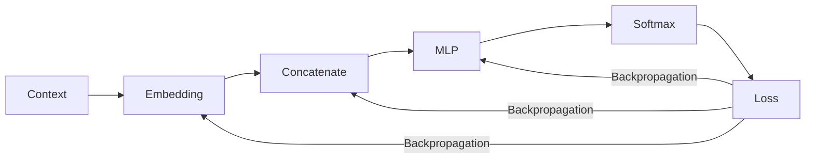

# 7. 反向传播与梯度下降

> **本章目标**
>
> 第6章已经从 Context 计算出概率与 Loss。本章解释模型如何由这个标量误差得到每个参数的梯度，再沿负梯度方向更新参数。理论主线是 `Loss → 链式法则 → 反向传播 → 参数梯度 → 梯度下降`；7.1 使用第6章同一条数值链逐项对账，7.2 再用 PyTorch 完成端到端训练。

---

# 一、从 Loss 到梯度

Loss 是单个标量，但模型包含 Embedding、`W1`、`b1`、`W2`、`b2` 等许多参数。训练首先要回答：**某个参数轻微变化时，Loss 会向哪个方向变化、变化有多快？**

例如把一个参数增加 `0.01`，Loss 在局部近似增加 `0.02`，敏感度约为 `0.02/0.01=2`。导数就是把这种“微小改变量之比”写成精确记号。对任一参数 $\theta$：

```math
\frac{\partial L}{\partial \theta}
```

它表示参数发生微小变化时，Loss 在当前位置如何变化。标量参数只有一个导数；向量和矩阵参数的梯度与参数 Shape 相同。因此 `W1.shape == W1_grad.shape`，优化器才能执行逐元素更新。

梯度指向局部上升最快的方向。要降低 Loss，应沿负梯度方向移动。梯度只描述当前位置的局部信息，不保证一次更新就到达全局最优点。

---

# 二、链式法则与反向传播

模型的 Loss 不是参数的直接函数，而是由多层运算复合得到：

```text
x → Linear → ReLU → Linear → Logits → Cross Entropy → Loss
```

如果 $L$ 通过中间变量 $u$ 依赖参数 $w$，链式法则为：

```math
\frac{\partial L}{\partial w}
=
\frac{\partial L}{\partial u}
\frac{\partial u}{\partial w}
```

**这个公式的作用**：把“中间变量怎样影响 Loss”和“参数怎样影响中间变量”连接起来，得到参数对 Loss 的总影响。`∂L/∂u` 是上游梯度，`∂u/∂w` 是当前局部导数，乘积是继续向参数 `w` 传播的梯度。

反向传播从 Loss 开始，按计算图的逆序复用上游梯度。对第6章的两层 MLP，核心顺序是：

```text
Loss
→ logits_grad
→ W2_grad、b2_grad、hidden_grad
→ ReLU Mask
→ W1_grad、b1_grad、x_grad
→ Embedding grad
```

Softmax 与 Cross Entropy 组合后的输出梯度为：

```math
\frac{\partial L}{\partial \text{logits}}
=p-\text{onehot(target)}
```

**这个公式的作用**：得到每个 Vocabulary Logit 应该上调还是下调。非 Target 位置梯度等于其预测概率，Target 位置再减 `1`；因此梯度下降会压低错误候选并提高真实 Target 的相对分数。

Linear 层把同一个上游梯度分成两类结果：一类用于参数更新，另一类继续向输入方向传播。7.1 将沿用 `[love, AI] → today` 和 `6 → 5 → 4` 的 Shape，逐个计算这些梯度。

---

# 三、负梯度方向的直觉

假设你站在山坡上，想要走到山谷（Loss 最小的地方），但你看不见整座山，只能感觉脚下的坡度（Gradient，梯度）。于是你每一步都朝着坡度下降最快的方向走一小步，走了很多步以后，就会越来越接近谷底：

> **梯度指出了 Loss 增长最快的方向，我们只需要往相反方向走，就能让 Loss 变小。**

---

# 四、Learning Rate：控制参数更新步长

梯度给出当前位置 Loss 增长最快的方向和局部变化率，但不能单独决定一次更新应该走多远。训练时还需要一个人为设定的正数：**Learning Rate（学习率）**。

学习率在公式中通常记作 $\eta$，在代码中通常写作 `lr` 或 `learning_rate`：

```math
\theta_{t+1}=\theta_t-\eta\nabla_\theta L_t
```

其中：

- $\theta_t$：更新前的参数；
- $\nabla_\theta L_t$：当前梯度；
- $\eta$：学习率；
- $-\eta\nabla_\theta L_t$：本次实际参数改变量。

因此，**学习率不是梯度，也不是 Loss**。梯度来自反向传播；学习率是一个**超参数（Hyperparameter）**——由人在训练开始前设定、不会被反向传播更新的配置项。相对地，Weight、Bias 和 Embedding 属于**参数（Parameter）**，由梯度更新。隐藏层宽度、Batch Size、层数同样是超参数。

学习率用来缩放梯度形成实际更新步长。若梯度为 `-6`：

```text
lr = 0.001 → 参数增加 0.006
lr = 0.1   → 参数增加 0.6
lr = 1.0   → 参数增加 6.0
```

学习率过小时，每次更新幅度很小，训练可能非常缓慢；学习率过大时，参数可能越过低 Loss 区域，在两侧震荡甚至发散。合适的学习率与 Loss 曲面、Batch Size、优化器和参数尺度有关，不能脱离训练配置给出一个通用固定值。

本章先使用固定学习率建立基本更新机制。第8章再讨论 Warmup、Cosine Decay 等学习率调度：它们不是新的优化目标，而是让 $\eta$ 随训练 Step 变化。

---

# 五、最小数值实验

使用函数 $L(w)=(w-3)^2$。它的梯度是：

```math
\frac{dL}{dw}=2(w-3)
```

当 `w=0` 时，梯度为 `-6`。若直接令 `lr=1`，参数会在 `0` 和 `6` 之间往返；使用 `lr=0.1`，每次只移动梯度的十分之一：

```python
def loss_fn(w):
    return (w - 3) ** 2


def gradient_fn(w):
    return 2 * (w - 3)


w = 0.0
lr = 0.1

for step in range(10):
    grad = gradient_fn(w)
    w = w - lr * grad
    print(f"step {step}: w={w:.3f}, loss={loss_fn(w):.3f}")
```

```text
step 0: w=0.600, loss=5.760
step 1: w=1.080, loss=3.686
...
step 9: w=2.678, loss=0.104
```

这里 `w` 逐步接近最小点 `3`。最基础的更新规则可以写为：

```text
new_parameter = old_parameter - learning_rate × gradient
```

现代优化器仍以梯度为基础，但会利用历史梯度、逐参数尺度和权重衰减修正实际更新；第8章将继续展开这些机制。

---

# 六、工程中的参数更新

上面的例子只有 1 个参数、1 个样本，看起来只是套一下公式。但真实训练里，至少有三件事会让"用梯度更新参数"变得不那么直观——下面逐一讲清楚。

## （一）真实训练用的是一个 Batch 的平均梯度，不是单个样本

先统一四个训练术语，后面各章都会用到：

| 术语                             | 含义                                                                                     |
| -------------------------------- | ---------------------------------------------------------------------------------------- |
| **Batch（批）**            | 一次同时送进模型的一组样本                                                               |
| **Batch Size**             | 这一组里有多少条样本，例如`32`                                                         |
| **Mini-Batch**             | 从完整数据集中抽出的小批数据；相对“一次用完整数据集”而言                               |
| **Step / Iteration（步）** | 执行一次“前向 → 反向 → 参数更新”，即一次`optimizer.step()`                         |
| **Epoch（轮）**            | 把训练集完整遍历一遍。若有 1000 条样本、Batch Size 为 100，则 1 个 Epoch 包含 10 个 Step |

7.1 节手算梯度时，只喂了**一条样本**（`[love, AI] → today`，拼接输入为 6 维）。但真实训练每一步会同时喂一个 Batch（比如 32 条），Loss 是这一批样本各自 Loss 的**平均值**：

```
batch_loss = (loss_1 + loss_2 + ... + loss_N) / N
```

根据链式法则，"对平均值求导"等于"对每一项分别求导，再求平均"：

```
d(batch_loss)/dW = ( d(loss_1)/dW + d(loss_2)/dW + ... + d(loss_N)/dW ) / N
```

也就是说，**每一步实际更新用的梯度，是这一批样本各自梯度的平均值**，不是某一条样本单独的梯度。这解释了两件事：

- **为什么 Batch Size 越大，训练越"稳"**：平均掉了更多样本的随机噪声，梯度方向更能代表整体数据的真实趋势；
- **为什么 Batch Size 太小时 Loss 曲线会上下抖动**：单个样本（甚至几个样本）的梯度带有很大的随机性，平均样本数太少，噪声压不下去。

PyTorch 里 `nn.CrossEntropyLoss()` 默认的 `reduction='mean'` 参数，做的正是这件事——7.2 节代码里没有明写 `reduction`，就是因为默认值已经是"批内求平均"。

## （二）单个参数张量按张量运算更新

**Tensor（张量）**是多维数组的统称：0 维是标量，1 维是向量，2 维是矩阵，3 维及以上统称高维张量。NumPy 的 `ndarray` 与 PyTorch 的 `torch.Tensor` 都属于这一类；PyTorch 的 Tensor 额外记录梯度和计算图，因此可以直接参与反向传播。

7.1 节手算时，`W1_grad` 是一个 5×6 的矩阵，`W1` 本身也是 5×6。更新时不需要在 Python 中逐元素修改 `W1[0][0]`、`W1[0][1]`……，而是直接执行张量运算：

```python
W1_new = W1 - lr * W1_grad
```

NumPy/PyTorch 会把张量内部的逐元素运算交给底层并行实现。一个模型通常包含多个参数张量，优化器仍需遍历或批量处理这些张量；参数规模增大也会显著增加计算、显存和通信成本。向量化提高了执行效率，但不会消除大模型的训练成本。

## （三）梯度默认会"累加"，这是新手最容易踩的坑

这是一个真实、具体、容易被忽略的工程细节：PyTorch 里，每调用一次 `.backward()`，梯度是**累加**到 `.grad` 属性上的，不是覆盖：

```python
import torch

w = torch.tensor([1.0], requires_grad=True)

loss1 = (w - 3) ** 2
loss1.backward()
print(w.grad)          # tensor([-4.])   ← 第一次反向传播的梯度

loss2 = (w - 3) ** 2
loss2.backward()
print(w.grad)          # tensor([-8.])   ← 不是-4，是-4 + -4 = -8，累加了！
```

如果不做任何处理，梯度会一直往上叠加，导致更新步子越滚越大、训练直接失控。**这正是为什么每一个训练循环，必须在反向传播之前先调用 `optimizer.zero_grad()`（或 `w.grad = None`）**——7.2 节的训练代码里 `optimizer.zero_grad()` 这一行，答案就在这里：

```python
w.grad = None                    # 手动清零（也可以用 optimizer.zero_grad()）
loss3 = (w - 3) ** 2
loss3.backward()
print(w.grad)          # tensor([-4.])   ← 清零之后，恢复成单次的正确梯度
```

**为什么 PyTorch 要设计成"默认累加"而不是"默认覆盖"？** 因为这个特性可以实现**梯度累积（Gradient Accumulation）**：显存放不下大 Batch 时，把它拆成若干 Micro-Batch，分别执行 `backward()`，最后只执行一次 `step()`。但 `CrossEntropyLoss` 默认返回每个 Micro-Batch 的平均 Loss；若要让等大小 Micro-Batch 的结果等价于原大 Batch 的平均梯度，通常还要在反向传播前除以累积步数：

```python
loss = criterion(logits, targets) / accumulation_steps
loss.backward()
```

如果最后一个 Micro-Batch 大小不同，则应按实际样本数加权，而不是简单除以固定步数。

## （四）更新参数这个动作，本身不能被自动求导追踪

`w = w - lr * grad` 这行代码看起来很朴素，但如果 `w` 是一个 `requires_grad=True` 的 PyTorch 张量，直接这样写会出问题：

```python
w = torch.tensor([1.0], requires_grad=True)
grad = torch.tensor([-4.0])

w = w - 0.1 * grad     # 危险写法：这个减法本身会被 Autograd 记录进计算图
```

问题在于：**减法运算本身也是一次"前向计算"，如果不加保护，Autograd 会把它也当成计算图的一部分记录下来**，而"更新参数"根本不应该被纳入下一次求梯度的计算图——我们只是想改一下这个数字，不是想对"改数字"这个操作本身再求导。正确写法是用 `torch.no_grad()` 包裹住更新这一步，明确告诉 PyTorch"这里不用追踪梯度"：

```python
with torch.no_grad():
    w -= 0.1 * grad     # 在 no_grad 语境下修改 w 的数值，不会被计算图记录
```

`torch.optim.SGD`、`Adam` 等所有官方优化器，内部的 `step()` 方法都是在 `torch.no_grad()` 语境下执行的——这也是为什么你在 7.2 节代码里只需要调用 `optimizer.step()`，不需要自己操心这个细节，但这个细节确实存在，且是真实踩坑高发地。

## （五）用 7.1 节的真实梯度，手动验证一次参数更新

不用抽象举例，直接拿 7.1 节已经算出来的真实数字，走一遍更新流程。7.1 节里 `W1[1,0] = 1.57921282`，对应 `W1_grad[1,0] = 1.50253496`。假设 `lr = 0.1`：

```python
lr = 0.1
W1_10_old = 1.57921282
W1_10_grad = 1.50253496

W1_10_new = W1_10_old - lr * W1_10_grad
print(W1_10_new)   # 1.428959324
```

```text
W1_10_new = 1.57921282 - 0.1 × 1.50253496 = 1.428959324
```

梯度为正，因此沿负梯度方向更新会让这个参数减小。在足够小的学习率下，这是一阶近似意义上的下降方向；它不保证任意大步长都使 Loss 下降。同理，`W1` 中本次梯度为 0 的后三行不会在这一步变化。

## （六）PyTorch 的 `optimizer.step()` 内部到底在做什么

第8章将从朴素梯度下降继续推导 Momentum、Adam 与 AdamW。在此之前，先剥掉优化器的外壳：一个不含这些改进的最小 SGD，本质上只是把本节（三）的梯度清零与本节（四）的无梯度更新封装成两个方法：

```python
class MinimalSGD:
    """朴素版 SGD，用来对照 torch.optim.SGD 内部到底做了什么"""
    def __init__(self, params, lr):
        self.params = list(params)   # model.parameters() 返回的所有可训练张量
        self.lr = lr

    def step(self):
        with torch.no_grad():          # 对应本节（四）：更新时不追踪梯度
            for p in self.params:
                if p.grad is not None:
                    p -= self.lr * p.grad   # 对应本节（二）：按张量运算更新

    def zero_grad(self):
        for p in self.params:            # 对应本节（三）：每步开始前清零梯度
            if p.grad is not None:
                p.grad.zero_()
```

它与 7.2 将使用的 `torch.optim.SGD` 具有相同的 `zero_grad()`、`step()` 接口；8.1 再以此为起点，解释 Momentum、Adam 和 AdamW 增加了什么。

**一个容易被问到的问题：`for p in self.params` 这个循环，是先更新 `W1` 还是先更新 `W2`？会不会影响结果？** 对这个不含跨参数耦合项的 `MinimalSGD`，顺序不影响结果。`p.grad` 已在 `loss.backward()` 中基于同一套旧参数全部算完；每个参数只使用自己的旧值和既有梯度。实际 PyTorch 优化器可能逐张量、批量（`foreach`）或使用融合 Kernel 更新，具体执行方式取决于优化器、设备和配置，不能一概视为所有参数同时更新。

**注意这和"梯度怎么算出来"是两件不同的事**：7.1 节 `backward()` 里那个反向拓扑序（`Loss → logits_grad → W2_grad/h_grad → pre1_grad → W1_grad`）是**有严格顺序**的，因为 `W1_grad` 的计算要依赖已经算出的 `pre1_grad`；但这里"应用梯度去更新参数"，是在所有梯度都已经算完之后才发生的**另一个独立阶段**，不存在这种依赖关系。这也是为什么 `loss.backward()`（算全部梯度）和 `optimizer.step()`（应用全部梯度）必须是两个分开的调用，不能边算边更新。

**一句话总结这一节**：对这里的 `MinimalSGD`，`step()` 会遍历参数张量，在不记录计算图的语境下执行 `w = w - lr×grad`；现代优化器会在此基础上加入状态和额外更新规则。`zero_grad()` 则用于清除默认累加的旧梯度。

---

# 七、把梯度下降接到 Neural Language Model 上



Loss 算出来后，反向传播会为 Embedding 和 MLP 参数计算梯度，再按本章的更新公式统一执行一次参数更新。重复这一过程，模型才可能逐步降低训练误差。

Embedding 与其他 Weight 使用同一套反向传播和更新机制。Embedding Lookup 本质上是数组索引，因此梯度只会落在本步实际查到的行上：7.1 的样本只查询 `love`、`AI`，所以只有这两行获得非零梯度；`I`、`today` 两行在这一步保持不变。若同一 Token 在 Context 中重复出现，各位置梯度会累加到同一行。高频词通常获得更多更新机会，但表示质量仍取决于语料、目标函数和优化过程。

---

# 八、完整训练循环

```python
optimizer.zero_grad()                   # 清除上一步残留的梯度
logits = forward(context)               # 前向传播
loss = cross_entropy(logits, target)    # 计算 Batch 平均 Loss
loss.backward()                         # 反向传播；7.1 逐项计算这一步
optimizer.step()                        # 在不记录计算图的语境下更新参数
```

这五行代码构成了深度学习模型训练的核心循环。7.2 将用 PyTorch 和 SGD 接通完整模型；第8章再解释 AdamW、学习率调度和初始化。

---

# 本章总结

本章建立了从 Loss 到参数更新的完整理论链：链式法则按计算图逆序传播梯度；参数梯度与参数 Shape 相同；SGD 按 `parameter -= lr × gradient` 更新参数；Batch Loss、梯度清零和 `no_grad` 是工程训练循环中的必要细节。Embedding 与 MLP Weight 使用同一套机制，但 Lookup 只会把梯度写回本步查询到的行。

现在已经明确了梯度如何变成参数更新。7.1 将逐项验证反向公式，7.2 使用 PyTorch 和 SGD 完成端到端训练；第8章再进入现代优化器与训练工程。
