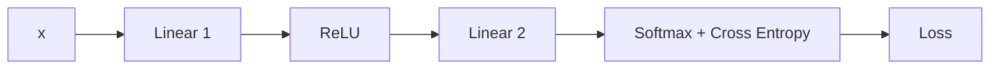
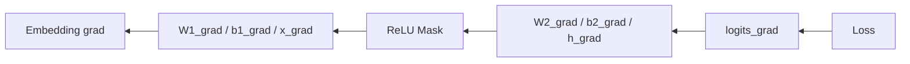
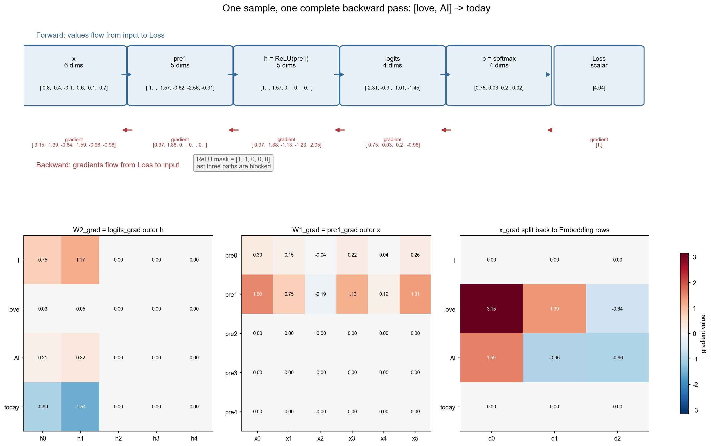

# 7.1 实现反向传播——从 Loss 到参数梯度

> **本节目标**：沿用 6.1～6.2 的同一条 `[love, AI] → today` 样本、同一组随机参数和同一条 `6 → 5 → 4` 前向链，从 Loss 反向算到 `W1`、`b1`、`W2`、`b2`，再把 6 维 `x_grad` 拆回 `love` 与 `AI` 两行 Embedding。最后用一个迷你自动求导实现和 PyTorch 对账。

---

# 一、Loss、梯度与反向传播

- **Loss**：衡量当前预测误差的标量。
- **梯度**：Loss 对某个变量或参数的偏导数，例如 `dL/dW1`。
- **反向传播**：从 Loss 出发，按计算图的逆序应用链式法则，高效计算各节点梯度。

前向传播得到 Loss，反向传播得到梯度，第7章的梯度下降再使用这些梯度更新参数。本节只计算梯度，不更新参数。


梯度指向局部上升最快的方向；梯度下降沿负梯度方向更新。真实模型有许多参数，无法把完整 Loss 曲面画出来，但原理相同。

---

# 二、先看反向传播要完成哪些任务

前向传播把输入逐层变成 Loss：



反向传播沿相反方向回答三个问题：

1. 输出概率错了多少？得到 `logits_grad`；
2. 这个误差应该怎样分给第二层、ReLU 和第一层？
3. 哪些参数与 Embedding 行应该被更新？



这里不先罗列八条公式，因为公式只有在对应到具体节点、Shape 和数字时才有意义。后续每一节都遵循同一个顺序：

```text
先说明这一节点要解决什么问题
→ 再写当前公式
→ 解释输入与输出 Shape
→ 代入本节数值
```

需要提前认识的只有三种运算：

- **矩阵乘法**：把下游梯度传播回输入；
- **外积**：生成与 Weight 同 Shape 的参数梯度；
- **逐元素乘法**：应用 ReLU Mask，截断没有激活的路径。

完整公式会在各节点逐步出现，并在本节末作为速查表汇总，不要求在开始计算前背诵。

---

# 三、前向：完整复现 6.1～6.2 的数字链

```python
import numpy as np

np.random.seed(42)
np.set_printoptions(precision=4, suppress=True)

embedding = np.array([
    [ 0.2, -0.3,  0.5],  # I
    [ 0.8,  0.4, -0.1],  # love
    [ 0.6,  0.1,  0.7],  # AI
    [-0.2,  0.9,  0.3],  # today
])
context = [1, 2]  # [love, AI]
target = 3        # today

x = embedding[context].reshape(-1)  # 2×3 -> 6
W1 = np.random.randn(5, 6)          # 6 -> 5
b1 = np.zeros(5)
W2 = np.random.randn(4, 5)          # 5 -> 4
b2 = np.zeros(4)

pre1 = W1 @ x + b1
h = np.maximum(0, pre1)
logits = W2 @ h + b2
exp_shifted = np.exp(logits - logits.max())
p = exp_shifted / exp_shifted.sum()
loss = -np.log(p[target])
```

输出：

```text
x      = [ 0.8     0.4    -0.1     0.6     0.1     0.7   ]
pre1   = [ 1.0038  1.5705 -0.6179 -2.5639 -0.3149]
h      = [1.0038 1.5705 0.     0.     0.    ]
logits = [ 2.305  -0.8975  1.0104 -1.446 ]
p      = [0.7473 0.0304 0.2048 0.0176]
loss   = 4.0422738605
```

这与 6.2 完全是同一次前向，而不是另换一个 3 维输入、4 维隐藏层和 5 词词表的例子。

下图把前向值和后续将得到的反向梯度放在同一张计算图中。蓝色箭头表示前向数据流，红色箭头表示反向梯度流；下方三个矩阵分别对应 `W2_grad`、`W1_grad` 和最终回到 Embedding Matrix 的梯度：



图中可以直接观察到三件事：`logits_grad` 从 Loss 向左传播；ReLU Mask 把后三条路径截断，所以 `W1_grad` 后三行全为 0；6 维 `x_grad` 最终按 Context 的拼接边界拆回 `love` 与 `AI` 两行。后续各节将逐步推导图中的每一个数字。生成脚本见 [`backprop_numeric_flow.py`](./assets/backprop_numeric_flow.py)。

---

# 四、命名约定

对计算图中的节点 `v`，代码变量 `v_grad` 表示 `∂L/∂v`。例如：

| 数学量 | 代码变量 |
|---|---|
| `∂L/∂logits` | `logits_grad` |
| `∂L/∂W2, ∂L/∂b2, ∂L/∂h` | `W2_grad, b2_grad, h_grad` |
| `∂L/∂pre1` | `pre1_grad` |
| `∂L/∂W1, ∂L/∂b1, ∂L/∂x` | `W1_grad, b1_grad, x_grad` |

梯度是局部敏感度：它描述在当前计算图和当前数值处，对该变量做无穷小扰动时 Loss 的一阶变化。不能只看某个中间梯度的正负，就脱离后续约束断言“整个隐藏层应该更大或更小”。

---

# 五、Loss → Logits

```python
logits_grad = p.copy()
logits_grad[target] -= 1.0
print(logits_grad)
```

```text
[ 0.7473  0.0304  0.2048 -0.9824]
```

正确答案 `today` 所在位置是负值；在其它条件不变的一阶近似下，提高它的 Logit 会降低 Loss。其它位置为正，提高对应 Logit 会增大 Loss。

---

# 六、Logits → 隐藏层

由 `logits[i] = Σ_j W2[i,j] h[j] + b2[i]`：

```python
W2_grad = np.outer(logits_grad, h)
b2_grad = logits_grad.copy()
h_grad = W2.T @ logits_grad

print("h_grad =", h_grad)
print("W2_grad =\n", W2_grad)
```

```text
h_grad = [ 0.3717  1.8782 -1.1319 -1.2300  2.0500]
W2_grad =
[[ 0.7501  1.1736  0.      0.      0.    ]
 [ 0.0305  0.0477  0.      0.      0.    ]
 [ 0.2055  0.3216  0.      0.      0.    ]
 [-0.9862 -1.5429 -0.     -0.     -0.    ]]
```

`h[j]` 同时流向 4 个 Logit，所以 `h_grad[j]` 必须汇总 4 条路径：

```text
h_grad[j] = Σ_i logits_grad[i] × W2[i,j]
```

这正是 `W2.T @ logits_grad`。

---

# 七、穿过 ReLU

```python
relu_mask = (pre1 > 0).astype(float)
pre1_grad = h_grad * relu_mask
print("mask      =", relu_mask)
print("pre1_grad =", pre1_grad)
```

```text
mask      = [1. 1. 0. 0. 0.]
pre1_grad = [ 0.3717  1.8782 -0.     -0.      0.    ]
```

本次前向中，后三个 `pre1` 为负，因此它们经过 ReLU 的局部导数为 0；相应的 `W1_grad` 后三行也为 0。这是单次样本、单次前向的结果，不代表这些神经元以后一定永远无法激活。

---

# 八、pre1 → W1 与 6 维输入

```python
W1_grad = np.outer(pre1_grad, x)
b1_grad = pre1_grad.copy()
x_grad = W1.T @ pre1_grad

print("x_grad =", x_grad)
print("W1_grad =\n", W1_grad)
```

```text
x_grad = [ 3.1506  1.3900 -0.6410  1.5851 -0.9574 -0.9617]
W1_grad =
[[ 0.2973  0.1487 -0.0372  0.2230  0.0372  0.2602]
 [ 1.5025  0.7513 -0.1878  1.1269  0.1878  1.3147]
 [-0.     -0.      0.     -0.     -0.     -0.    ]
 [-0.     -0.      0.     -0.     -0.     -0.    ]
 [ 0.      0.     -0.      0.      0.      0.    ]]
```

`x` 是两行 Embedding 按顺序拼接的结果，因此反向时把 6 维梯度按同样边界还原为 `(2, 3)`：

```python
vectors_grad = x_grad.reshape(2, 3)
embedding_grad = np.zeros_like(embedding)
np.add.at(embedding_grad, context, vectors_grad)

print("love grad =", embedding_grad[1])
print("AI grad   =", embedding_grad[2])
print("embedding_grad =\n", embedding_grad)
```

```text
love grad = [ 3.1506  1.3900 -0.6410]
AI grad   = [ 1.5851 -0.9574 -0.9617]
embedding_grad =
[[ 0.      0.      0.    ]
 [ 3.1506  1.3900 -0.6410]
 [ 1.5851 -0.9574 -0.9617]
 [ 0.      0.      0.    ]]
```

本样本只 Lookup 了 `love` 和 `AI`，所以只有这两行收到梯度。使用 `np.add.at` 而不是简单赋值，是为了正确处理 Context 中同一个 Token 重复出现时的梯度累加。

至此，反向传播各节点都已落到具体数值，并且梯度真正回到了 Embedding Matrix。公式将在完成代码对账后统一汇总。

---

# 九、micrograd-lite：把链式法则固化成代码

下面的迷你实现支持本例需要的矩阵乘法、加法、ReLU 和融合的 Softmax + Cross Entropy：

```python
class Var:
    def __init__(self, data, children=(), grad_fn=None):
        self.data = np.array(data, dtype=float)
        self.grad = np.zeros_like(self.data)
        self.children = children
        self.grad_fn = grad_fn

    def __matmul__(self, other):
        return Var(
            self.data @ other.data,
            (self, other),
            lambda g: (np.outer(g, other.data), self.data.T @ g),
        )

    def __add__(self, other):
        return Var(self.data + other.data, (self, other), lambda g: (g, g))

    def relu(self):
        return Var(
            np.maximum(0, self.data),
            (self,),
            lambda g: (g * (self.data > 0),),
        )

    @staticmethod
    def softmax_ce(logits, target):
        exp_shifted = np.exp(logits.data - logits.data.max())
        prob = exp_shifted / exp_shifted.sum()
        onehot = np.eye(len(prob))[target]
        return Var(-np.log(prob[target]), (logits,), lambda g: (g * (prob - onehot),))

    def backward(self):
        order, seen = [], set()

        def topo(v):
            if id(v) in seen:
                return
            seen.add(id(v))
            for child in v.children:
                topo(child)
            order.append(v)

        topo(self)
        self.grad = np.ones_like(self.data)
        for node in reversed(order):
            if node.grad_fn is None:
                continue
            for child, grad in zip(node.children, node.grad_fn(node.grad)):
                child.grad += grad
```

把同一组 6→5→4 参数交给它：

```python
xv, W1v, b1v = Var(x), Var(W1), Var(b1)
W2v, b2v = Var(W2), Var(b2)
pre1v = W1v @ xv + b1v
hv = pre1v.relu()
logitsv = W2v @ hv + b2v
lossv = Var.softmax_ce(logitsv, target)
lossv.backward()

assert np.allclose(W1v.grad, W1_grad)
assert np.allclose(W2v.grad, W2_grad)
assert np.allclose(xv.grad, x_grad)
```

自动求导并没有换一套数学：每个运算节点记录局部反向规则，最后按拓扑逆序应用链式法则。

---

# 十、与 PyTorch 对账，包括 Embedding 梯度

```python
import torch
import torch.nn as nn

class NeuralLM(nn.Module):
    def __init__(self):
        super().__init__()
        self.embedding = nn.Embedding(4, 3)
        self.fc1 = nn.Linear(6, 5)
        self.fc2 = nn.Linear(5, 4)

    def forward(self, token_ids):
        x = self.embedding(token_ids).reshape(token_ids.size(0), -1)
        return self.fc2(torch.relu(self.fc1(x)))

model = NeuralLM()
with torch.no_grad():
    model.embedding.weight.copy_(torch.tensor(embedding, dtype=torch.float32))
    model.fc1.weight.copy_(torch.tensor(W1, dtype=torch.float32))
    model.fc1.bias.copy_(torch.tensor(b1, dtype=torch.float32))
    model.fc2.weight.copy_(torch.tensor(W2, dtype=torch.float32))
    model.fc2.bias.copy_(torch.tensor(b2, dtype=torch.float32))

context_t = torch.tensor([[1, 2]])
target_t = torch.tensor([3])
loss_t = nn.functional.cross_entropy(model(context_t), target_t)
loss_t.backward()

assert np.allclose(loss_t.item(), loss, atol=1e-6)
assert np.allclose(model.fc1.weight.grad.numpy(), W1_grad, atol=1e-6)
assert np.allclose(model.fc2.weight.grad.numpy(), W2_grad, atol=1e-6)
assert np.allclose(model.embedding.weight.grad.numpy(), embedding_grad, atol=1e-6)
print("loss =", loss_t.item())
print(model.embedding.weight.grad)
```

预期可见 `loss ≈ 4.042274`，Embedding 的第 1、2 行分别等于上面手算的 `love grad`、`AI grad`，第 0、3 行为 0。NumPy 默认使用 `float64`，此处 PyTorch 使用 `float32`，逐元素可能存在约 `1e-6` 以内的浮点差异。

---

# 十一、从反向传播到参数更新

```python
optimizer.zero_grad()
logits = model(context_t)
loss = nn.functional.cross_entropy(logits, target_t)
loss.backward()       # 计算参数与 Embedding 的梯度
optimizer.step()      # 第7章建立更新公式，第8章介绍现代优化器
```

`loss.backward()` 负责算梯度，`optimizer.step()` 负责应用梯度；两者是不同阶段，不能混为一谈。

---

# 十二、完成数值推导后的公式速查

下面的公式只用于把前面已经计算过的代码压缩成统一记法，不要求脱离数值过程背诵：

$$
\text{logits\_grad}=p-\operatorname{onehot}(target)
$$

它把预测概率与真实标签之差传给输出层。

$$
W_{2,grad}=\text{logits\_grad}\otimes h,\quad
b_{2,grad}=\text{logits\_grad},\quad
h_{grad}=W_2^\top\text{logits\_grad}
$$

这组公式同时产生第二层参数梯度，并把梯度继续传回隐藏层。`⊗` 是外积，因此 `W2_grad` 与 `W2` Shape 相同。

$$
\text{pre1\_grad}=h_{grad}\odot\mathbb{1}[\text{pre1}>0]
$$

它应用 ReLU Mask；`⊙` 是逐元素乘法，没有激活的路径梯度变为 `0`。

$$
W_{1,grad}=\text{pre1\_grad}\otimes x,\quad
b_{1,grad}=\text{pre1\_grad},\quad
x_{grad}=W_1^\top\text{pre1\_grad}
$$

这组公式产生第一层参数梯度，并把 `x_grad` 传回 Embedding。所有公式的输入、输出 Shape 和具体数值都已在第五至第八节对账。

---

# 本实验总结

本实验沿用 `[love, AI] → today` 的完整 `6 → 5 → 4` 数值链，实现了八条反向公式；得到 6 维 `x_grad` 后，将前三维累加到 `love` 行、后三维累加到 `AI` 行；最后用 micrograd-lite 和 PyTorch 对账。下一节将使用这些梯度执行参数更新。

---

# 参考资料

- Karpathy micrograd：https://github.com/karpathy/micrograd
