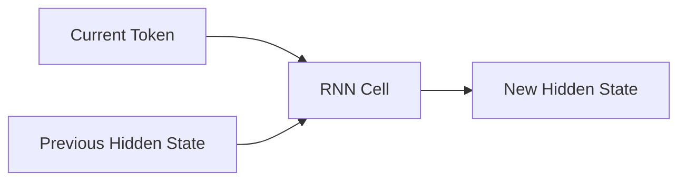

# 7.3 RNN Cell——Hidden State 是如何更新的？

上一节，我们已经知道 Hidden State 就是模型内部不断更新的 Memory，新的 Hidden State 依赖于"当前输入"和"上一时刻 Hidden State"。但还有一个问题没有解决：**模型到底如何把这两个信息融合在一起？** 答案就是：**RNN Cell（循环神经网络单元）**。

---

# 什么是 RNN Cell？



RNN Cell 只有一个任务：**根据当前输入和过去记忆，计算新的记忆。** 它并不是一个完整模型，只是 RNN 中最小的计算单元。

---

# 从上一节的规则继续升级

上一节的更新规则 `hidden = 0.6 * hidden + token` 已经有了 RNN 的影子。真正的 RNN，只是把这里的 `0.6` 变成**可以学习的参数**。

**第一步：加入 Weight**。假设 Hidden State 和 Token 都是 2 维，`hidden = hidden + token` 升级成：

```python
hidden = W1 @ token + W2 @ hidden
```

这里第一次出现两个 Weight，分别负责把 Token 变成特征（`W1`），把 Hidden 变成新的记忆（`W2`），然后相加。为什么需要两个 Weight？因为 Token（当前新信息）和 Hidden（历史信息）是两种完全不同的信息，来源不同、作用也不同，因此需要两套不同的参数。

**第二步：加入 Bias**：`hidden = W1 @ token + W2 @ hidden + b`。到这里，还没有任何非线性，仍然只是 Linear。

**第三步：加入 Activation**。如果一直是 Linear，整个网络仍然只是一个线性模型。因此和 MLP 一样，RNN 也需要 Activation，最经典的是 `tanh`：

```python
hidden = np.tanh(W1 @ token + W2 @ hidden + b)
```

到这里，真正的 RNN Cell 已经出现了。

---

# 论文里的公式

论文中通常写成：

```
hₜ = tanh(Wxh·xₜ + Whh·hₜ₋₁ + b)
```

| 数学符号 | 含义 |
|----------|------|
| `xₜ` | 当前输入 Token |
| `hₜ₋₁` | 上一时刻 Hidden State |
| `Wxh` | 输入权重 |
| `Whh` | Hidden 权重 |
| `b` | 偏置 |
| `tanh` | 激活函数 |
| `hₜ` | 新的 Hidden State |

换回上一节的语言，其实就是：`新 Memory = 神经网络(旧 Memory, 当前 Token)`。并没有新的思想，只是把"Memory 更新规则"升级成了"可学习的神经网络"。

---

# Experiment 7.3：实现 RNN Cell

```python
import numpy as np

np.random.seed(42)
hidden_size = 2
input_size = 2

Wx = np.random.randn(hidden_size, input_size)
Wh = np.random.randn(hidden_size, hidden_size)
b = np.zeros(hidden_size)

hidden = np.zeros(hidden_size)
tokens = [np.array([1,0]), np.array([0,1]), np.array([1,1])]  # I, love, AI（与7.2 节相同）

for token in tokens:
    hidden = np.tanh(Wx @ token + Wh @ hidden + b)
    print(hidden)
```

输出（示例）：

```text
[0.45952909 0.57011185]
[-0.36214184  0.99075784]
[0.20818518 0.98229779]
```

每一次输出都不同，因为 Hidden State 一直在变化——但注意，这里已经不是 7.2 节的简单衰减，而是真正可学习的 `tanh(Wx·token + Wh·hidden + b)`。

---

# 实验分析

这个实验虽然只有十几行代码，但已经具备 RNN 最核心的能力：**Previous Hidden + Current Input → Neural Network → New Hidden**。这里已经不需要固定 Context Window，模型依靠 Hidden State，把过去的信息一直传递下去。

---

# 本节总结

本节完成了：✅ 理解 RNN Cell 的作用 ✅ 理解两个 Weight 的意义 ✅ 理解 tanh 的作用 ✅ 手写第一个 NumPy RNN Cell

至此，我们已经掌握了 RNN 的最小计算单元。下一节，我们将把这个 Cell 在时间维度上不断展开（Unroll），构成真正的 RNN，并理解论文中经常出现的 **Time Step（时间步）** 和 **Unrolling（时间展开）**。
