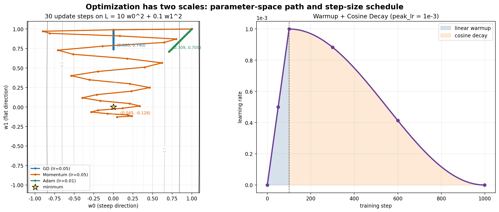

# 8.1 从 SGD 到 AdamW——现代优化器与权重初始化

> **硬件要求**：CPU 即可运行（普通笔记本可跑）

## 实验目标

第7章已经建立最朴素的参数更新公式 `w = w - lr × grad`，7.2 也用 SGD 验证了完整训练循环。本节沿这条公式继续比较 Momentum、Adam 与 AdamW，并通过数值实验观察 Warmup、学习率衰减和权重初始化。8.2 再把这些机制用于 WikiText-2。

---

## 一、一个坐标尺度差异很大的二次函数

```python
import numpy as np

# 模拟一个"病态"的Loss 曲面：一个方向坡度很陡，另一个方向坡度很平缓
def loss_fn(w):
    return 10 * w[0] ** 2 + 0.1 * w[1] ** 2

def grad_fn(w):
    return np.array([20 * w[0], 0.2 * w[1]])

w = np.array([1.0, 1.0])
lr = 0.05
trajectory = [w.copy()]
for _ in range(30):
    w = w - lr * grad_fn(w)   # Vanilla GD：两个方向用同一个学习率
    trajectory.append(w.copy())

print("最终位置:", np.round(w, 4))
```

这段代码的真实结果是 `最终位置: [0.0000, 0.7397]`，Loss 约为 `0.0547`。这里 `lr=0.05` 恰好让第一维一步到零：`w0_new = w0 - 0.05 × 20w0 = 0`，所以它**不会**来回震荡；第二维每步只乘 `0.99`，30 步后仍为 `0.7397`。这个特意选择的例子只说明：同一个全局学习率会让不同曲率方向拥有很不一样的收敛速度。若要展示震荡，必须另选学习率，不能用这段运行结果支持不存在的轨迹。

---

## 二、Momentum：给梯度下降加上"惯性"

一个直觉的改进：**像一个从山坡滚下来的小球，不是每一步都完全跟着当前坡度走，而是保留一部分之前的"运动方向"（惯性）**，这样遇到局部的小波动，小球也不会被轻易带偏：

```python
def gd_with_momentum(w, grad_fn, lr=0.05, momentum=0.9, steps=30):
    velocity = np.zeros_like(w)
    for _ in range(steps):
        grad = grad_fn(w)
        velocity = momentum * velocity - lr * grad   # 保留上一步方向的一部分，再叠加新的梯度
        w = w + velocity
    return w

w = np.array([1.0, 1.0])
print("Momentum 最终位置:", np.round(gd_with_momentum(w, grad_fn), 4))
```

Momentum 让平缓方向的更新可以"越滚越快"（因为惯性不断累积），同时陡峭方向的震荡会因为方向不断反转而被部分抵消——这是Adam 优化器最基础的组成部分之一。

---

## 三、Adam：给每个参数自适应调整学习率

Adam（Adaptive Moment Estimation）在 Momentum 的基础上，再增加了一项：**给每个参数单独估计一个"有效学习率"**，而不是所有参数共用同一个：

```python
def adam_step(w, grad, m, v, t, lr=0.01, beta1=0.9, beta2=0.999, eps=1e-8):
    # m：梯度的一阶矩估计（类似 Momentum，梯度的"平均方向"）
    m = beta1 * m + (1 - beta1) * grad
    # v：梯度平方的指数移动平均（二阶原始矩，反映近期梯度尺度）
    v = beta2 * v + (1 - beta2) * (grad ** 2)
    # 偏差修正：训练刚开始时 m、v 都从 0 累积，会有系统性偏小，需要修正
    m_hat = m / (1 - beta1 ** t)
    v_hat = v / (1 - beta2 ** t)
    # 核心：用近期梯度的二阶矩尺度归一化一阶矩，为不同参数调整有效步长
    w = w - lr * m_hat / (np.sqrt(v_hat) + eps)
    return w, m, v


w = np.array([1.0, 1.0])
m, v = np.zeros_like(w), np.zeros_like(w)
for t in range(1, 31):
    grad = grad_fn(w)
    w, m, v = adam_step(w, grad, m, v, t)

print("Adam 最终位置:", np.round(w, 4))
```

这段代码的真实结果约为 `Adam 最终位置: [0.7087, 0.7087]`，对应 Loss 约 `5.0725`；反而高于第一节 GD 的 `0.0547`。原因是 Adam 在这个确定性二次函数的早期会用二阶矩对梯度尺度归一化，两维得到近似相同的更新幅度；同时这里给 Adam 的 `lr=0.01` 与 GD 的 `lr=0.05` 也不同。因此，这个小实验展示的是**逐参数尺度自适应**，不能证明 Adam 在任意问题和任意超参数下都更快。Adam 往往适合有噪声、尺度差异大且高维的神经网络优化，但仍需选择学习率，并不支配调好参数的 SGD/GD。

---

## 四、AdamW：解耦权重衰减

AdamW 是现代 Transformer 训练中的常见选择。它与 Adam 的关键区别，是如何实现**权重衰减（Weight Decay，一种正则化手段）**：

- **带 L2 正则项的 Adam**：正则项梯度与 Loss 梯度一起进入 `m`、`v`，因此也会被自适应缩放；
- **AdamW**：把权重衰减从梯度矩估计中解耦，单独计算 `lr × weight_decay × w`，使衰减规则不受 `m`、`v` 的逐参数缩放影响。

```python
def adamw_step(w, grad, m, v, t, lr=0.01, beta1=0.9, beta2=0.999, eps=1e-8, weight_decay=0.01):
    m = beta1 * m + (1 - beta1) * grad
    v = beta2 * v + (1 - beta2) * (grad ** 2)
    m_hat = m / (1 - beta1 ** t)
    v_hat = v / (1 - beta2 ** t)
    # 两项都基于更新前的旧参数 w 计算；不要先改 w 再用新 w 做衰减
    adaptive_update = lr * m_hat / (np.sqrt(v_hat) + eps)
    decay_update = lr * weight_decay * w
    w = w - adaptive_update - decay_update
    return w, m, v
```

这种解耦使权重衰减的含义更清楚，也便于独立调节正则化强度。AdamW 因此常用于 Transformer 训练，但具体效果仍取决于任务、参数分组和超参数。

---

## 五、Warmup 与学习率调度：为什么不能一上来就用大学习率

训练刚开始时，模型的 Weight 还是随机的，梯度往往很不稳定、方向也可能不准——如果这时候就用一个较大的学习率，很容易一步走得太远，把刚开始还算合理的参数直接带偏，甚至导致 Loss 直接爆炸（变成 NaN）。**Warmup 的做法是：训练最开始的一段步数里，让学习率从很小的值逐渐线性增长到目标学习率，等模型"站稳了"再全速前进**。达到目标学习率之后，通常还会让学习率随训练进度慢慢下降（常见的是 Cosine Decay，按余弦曲线从峰值逐渐降到接近0），让模型在训练后期用更小的步子做精细调整。

```python
import numpy as np

def lr_schedule(step, total_steps, warmup_steps, peak_lr):
    if step < warmup_steps:
        # Warmup 阶段：学习率从 0 线性增长到 peak_lr
        return peak_lr * step / warmup_steps
    # Cosine Decay 阶段：从 peak_lr 按余弦曲线逐渐降到接近 0
    progress = (step - warmup_steps) / (total_steps - warmup_steps)
    return peak_lr * 0.5 * (1 + np.cos(np.pi * progress))

total_steps, warmup_steps, peak_lr = 1000, 100, 1e-3
for step in [0, 50, 100, 300, 600, 999]:
    print(f"step {step:>4}: lr = {lr_schedule(step, total_steps, warmup_steps, peak_lr):.6f}")
```

这条曲线先在线性 Warmup 阶段升到 `1e-3`，再按余弦曲线逐渐下降。Warmup 在 LLM 训练中很常见；峰值后的调度还可以使用 Linear Decay、Constant、Inverse Square Root 或 WSD 等方案，Cosine Decay 只是常见选择之一。



左图将前三节的 30 步更新投影到同一个 Loss 等高线平面：GD 在第一步把陡峭方向 `w0` 置零，之后只沿平缓方向移动；Momentum 会在陡峭方向发生跨越与衰减振荡；Adam 在本例中把两维梯度尺度归一化，因此轨迹接近对角线。三条轨迹使用的学习率不同，不能只根据终点判断优化器优劣。右图则展示单次训练内部学习率随 Step 的变化。生成脚本见 [`optimizer_trajectories.py`](./assets/optimizer_trajectories.py)。

---

## 六、权重初始化：为什么不能全部设成0，也不能随便乱来

回顾第4章："刚开始 Weight 都是随机的"——但**随机成什么样，其实大有讲究**。

**如果随机初始化的数值范围不合适会怎样？** 用一个简单实验观察数值在深层网络里的变化趋势：

```python
import torch

def forward_variance(std, num_layers=10, dim=256):
    x = torch.randn(1, dim)
    variances = [x.var().item()]
    for _ in range(num_layers):
        w = torch.randn(dim, dim) * std   # 每一层用同样的标准差初始化权重
        x = x @ w
        variances.append(x.var().item())
    return variances

print("标准差过大 (std=1.0):", [f"{v:.2e}" for v in forward_variance(std=1.0)])
print("标准差过小 (std=0.01):", [f"{v:.2e}" for v in forward_variance(std=0.01)])
```

你会观察到：标准差过大时，数值会随层数增加指数级膨胀（很快出现极大的数字，甚至溢出）；标准差过小时，数值会指数级衰减趋近于0——**这两种情况都会让深层网络的训练寸步难行，无论是数值爆炸还是数值消失，梯度都会跟着出问题**（这与第9章讨论的梯度消失问题相关：层数和时间步会影响梯度传播，初始化尺度也会改变数值稳定性）。

**Xavier / Kaiming 初始化的直觉**：根据 `fan_in`、`fan_out` 和激活函数选择权重尺度，使前向激活或反向梯度的尺度尽量不要随深度指数爆炸/消失。对 ReLU，Kaiming 初始化通常按 `fan_in` 使用方差 `2 / fan_in`。

下面每一层都创建**独立参数**，使用较大 Batch 估计方差，并显式声明后续非线性是 ReLU。复用同一个 `Linear` 十次属于权重共享网络，不能作为普通深层 MLP 的初始化实验：

```python
import torch
import torch.nn as nn

torch.manual_seed(42)
dim, num_layers, batch_size = 256, 10, 4096
layers = [nn.Linear(dim, dim, bias=False) for _ in range(num_layers)]
for layer in layers:
    nn.init.kaiming_normal_(layer.weight, mode="fan_in", nonlinearity="relu")

x = torch.randn(batch_size, dim)
second_moments = []
with torch.no_grad():
    for layer in layers:
        x = torch.relu(layer(x))
        second_moments.append(x.square().mean().item())

print("各层激活二阶矩:", [f"{m:.3f}" for m in second_moments])
```

ReLU 输出均值不为 0，所以这里检查 `E[x²]` 而不是只检查中心化方差。有限宽度和有限样本下数值仍会波动；Kaiming 初始化是在独立性等近似假设下稳定尺度，不保证每层统计量精确恒定。另需注意，PyTorch `nn.Linear.reset_parameters()` 默认使用的是 `kaiming_uniform_(a=√5)` 这一具体方案，其界限等价于常见的 `±1/√fan_in` 权重初始化；不能笼统说默认就是上面针对 ReLU 的 `kaiming_normal_`。

---

## 七、超参数怎么选：几条经验法则

优化器的机制讲完了，最后给几条实操经验——这也是吴恩达《深度学习》、李沐《实用机器学习》、Karpathy nanoGPT 这些课程和项目里反复出现的建议：

| 超参数             | 常见取值             | 经验法则                                                                                                  |
| ------------------ | -------------------- | --------------------------------------------------------------------------------------------------------- |
| 峰值学习率 peak_lr | 3e-4 ~ 1e-3（AdamW） | 太小收敛慢、太大训练不稳（第7章说过）；nanoGPT 等小型 GPT 常用 6e-4 量级                                  |
| Warmup 步数        | 总步数的 1%~10%      | 训练越激进（lr 越大、模型越深），warmup 越要长                                                            |
| Batch Size 与 lr   | 视显存和优化器而定   | 某些大 Batch 训练设置可把线性缩放作为起点，但并非普适定律；改变 Batch Size 后应重新观察稳定性和验证集指标 |
| 权重衰减           | 0.01 ~ 0.1（AdamW）  | 11.1 节训练 Mini GPT 用的就是 AdamW + lr=3e-4                                                             |

还有两条更重要的"元经验"：

- **同时观察 train loss 和 val loss**（11.1 节会演示）：train loss 反映优化是否进行，val loss 用于评估未见数据上的泛化；两者在随机小 Batch 下都可能短期波动；
- **Loss 不降，先找 bug 再调参**：Karpathy 在 nanoGPT 里反复强调，绝大多数"训练不动"其实是代码 bug，不是超参数问题——先用 7.1 节的三方对账把梯度检查一遍，再动超参数。

---

## 本实验总结

✅ 理解了 Vanilla GD 对所有参数使用统一学习率的局限 ✅ 用 Momentum 理解了"给梯度下降加惯性"的直觉 ✅ 手写了 Adam 的核心逻辑：给每个参数自适应调整有效学习率 ✅ 理解了 AdamW 相比 Adam 的关键改进——解耦权重衰减 ✅ 用代码验证了 Warmup + Cosine Decay 学习率曲线的真实形状 ✅ 用代码验证了权重初始化不当（全0、过大、过小）会如何破坏深层网络的训练。一句话总结：**从 第7章的 `w = w - lr × grad` 到今天的 AdamW + Warmup + 合理初始化，优化器的每一次进化，都是在解决"如何让千亿参数的模型稳定地训练下去"这一个朴素的问题。**

到这里，Neural Language Model 主线已经覆盖数据准备与前向（第6章）、反向传播与 SGD 训练（第7章），以及现代优化器、学习率调度和初始化（本节）。下一节 8.2 将把这些机制用于 WikiText-2，并检查验证集指标和 Embedding 结构。

---

# 参考资料

- 李沐《实用机器学习》（优化算法、超参数调优与训练实战）：https://space.bilibili.com/1567748478
- 吴恩达《深度学习》课程（神经网络与深度学习基础）：https://www.bilibili.com/video/BV12urfB1E7s
- Karpathy nanoGPT（最简 GPT 训练与微调仓库）：https://github.com/karpathy/nanoGPT
