# 9. RNN——循环状态与序列记忆机制

> **本章目标**
>
> 第4章学完神经网络（MLP）之后，你已经知道：一个神经元做的事情是 `y = activation(w·x + b)`，很多神经元并排组成一层，很多层堆叠组成网络。第6章把这层神经网络接到固定窗口上，构造出 Neural Language Model；第7、8章完成了训练方法。这些模型都只能接收固定数量的 Context Token，窗口外的信息不会进入当前预测——本质上，它们都是"把 MLP 套在一个固定长度的输入上"。
>
> 本章要解决的问题很直接：**如果不想被固定窗口限制，MLP 需要做什么改动？** 答案只有一步之遥——给这层神经元加一条"回路"，让它把自己上一次的输出接回来当输入。这一条回路，就是 RNN 的全部秘密。沿着这条主线，本章会依次讲清 Memory（记忆）、Hidden State（隐藏状态）、RNN Cell、Unrolling（时间展开）、Parameter Sharing（参数共享）、多层 RNN（深度方向的扩展），然后讨论 RNN 的遗忘问题与梯度消失/爆炸，最后进入 LSTM——通过 Cell State 与 Forget/Input/Output 三个门改善长期信息传播，并说明 LSTM 仍然存在的信息瓶颈。
>
> 与前面章节一致：本章先在一节内讲完所有概念，实验部分放在 9.1～9.3 三个独立小节。

---

# 一、固定窗口的问题

第5章提出过固定 Context Window 看不到远处信息的问题，第6～8章的模型也一直受这个限制。以窗口大小为 2、句子 `I love AI today` 为例，模型只能看到 `[I love] → AI`、`[love AI] → today`——始终只有最近两个 Token，看不到整个句子。

再看一个更长的句子：`The book that I bought yesterday from my best friend is interesting.`。最后的 `interesting` 真正描述的是 `book`，但如果窗口只有 4，模型看到的 Context 是 `my best friend is`，`book` 早已消失，模型根本不知道 `interesting` 修饰的是什么。

这种"真正相关的信息距离很远"的现象，在 NLP 中叫做：

> **Long-Term Dependency（长距离依赖）**

中文同样存在这个问题：`昨天在北京参加人工智能大会并发表主题演讲的张教授今天回到了上海。`——"张教授"与"回到了上海"之间隔了很多 Token，固定窗口依然无法覆盖。

**思考题**：如果窗口改成 4 或 100，是否能彻底解决问题？窗口不断增大，又会付出什么代价？（实验 9.1 会先用一段代码把这种局限打印出来。）

---

# 二、从固定窗口到 Memory

固定 Context Window 只能看到最近 N 个 Token，超出窗口的信息会永久丢失。于是一个自然的问题出现了：

> **模型能不能把过去的重要信息保存下来，而不是完全依赖 Context Window？**

这就是 **Memory（记忆）**，也是 RNN 最核心的思想。

人类阅读 `Alice likes AI.` 时，读完 `Alice` 就记住"当前主语是 Alice"；读到 `likes` 时不会忘记 `Alice`；读到 `AI` 时仍然记得 `Alice likes ...`。大脑并不是每次都重新阅读整句话，而是不断更新脑中的状态：

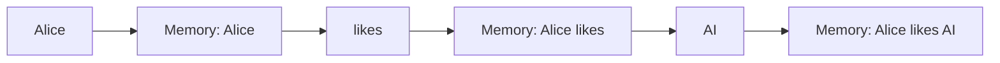

真正变化的是 **Memory**。

第6～8章使用的 Neural Language Model 每次预测都是 `Context → MLP → Prediction`，预测结束后模型什么都不会留下，下一次预测又重新开始，完全没有连续性。一个新的想法出现了：**每处理一个 Token，就把当前信息保存到 Memory，供下一步使用**。这正是 RNN 的核心思想。（实验 9.1 会先用字符串拼接、数字累加两个极简例子体会"Memory 随 Token 不断更新"。）

---

# 三、Hidden State——神经网络中的 Memory

## Hidden State 与 Context Window 是什么关系？

第 6～8 章的固定窗口模型，输入是把最近 N 个 Token 拼起来的 **Context Window**；而 RNN 每一步的输入只有**当前一个 Token**，历史信息全部由 **Hidden State** 携带。换句话说：**RNN 用 Hidden State 替代了 Context Window。**

| | Context Window（第 6～8 章） | Hidden State（本章） |
|---|---|---|
| 历史信息放在哪 | 显式保留最近 N 个 Token | 压缩进一个固定维度的向量 |
| 每一步输入 | N 个 Token 拼成的向量 | 当前 1 个 Token + 上一个 Hidden State |
| 信息会不会被硬截断 | 会，超过窗口就丢弃 | 不会硬截断，但会逐渐衰减 |
| 维度是否随序列增长 | 输入维度随 N 增长 | Hidden State 维度固定，与序列长度无关 |

Context Window 是"显式地把最近 N 个 Token 摆出来"；Hidden State 是"用一个可学习的向量去总结全部历史"。前者硬截断、信息明确但浪费；后者不截断、信息隐式但可能遗忘。这正是第二节说的"不要只依赖 Context Window，而是把过去保存进 Memory"。

## 为什么叫 Hidden（隐藏）？

Hidden 并不是"藏起来不给你看"，而是：**它不是模型最终输出，而是模型内部维护的一份状态**。

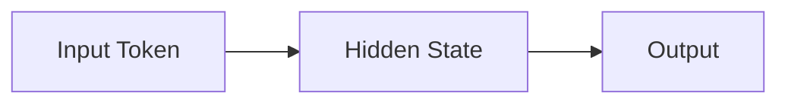

Input 和 Output 用户都能看到，只有 Hidden State 存在于模型内部，不会直接输出。可以把它理解成**模型脑子里的想法**。

## Hidden State 保存了什么？

模型按顺序读取 `I love AI`：读到 `I`，Hidden State 记录"主语可能是 I"；读到 `love`，更新为"I love"；读到 `AI`，再次更新为"I love AI"。Hidden State 并不是保存某一个 Token，而是**到当前为止，模型对整个上下文的理解**——越来越像一句话的摘要（Summary）。

## Hidden State 是一个向量：Hidden Size 是什么？

极简的 Memory 只是一个数字。真正的神经网络中，Hidden State 是一个向量。这个向量的**维度数量，就叫做 Hidden Size（隐藏层大小，也叫隐藏单元数）**。

- Hidden Size = 4 时，Hidden State 就是 `[0.25, -0.61, 0.92, 0.13]` 这样的 4 维向量；
- GPT 中 Hidden Size 可能是 4096，Hidden State 就是 4096 维向量。

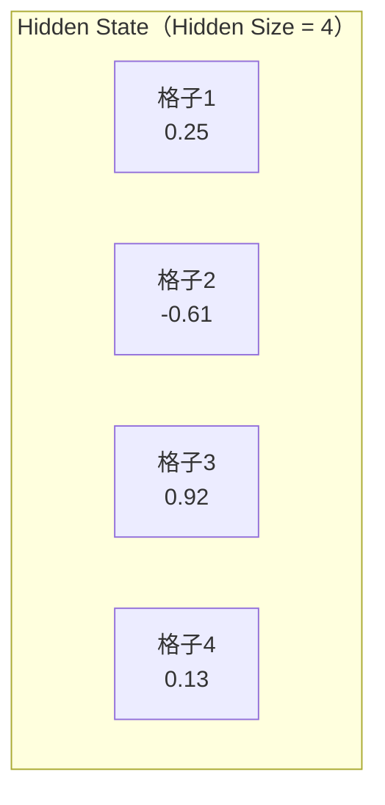

Hidden Size 决定了这个"记忆"的**容量**：Hidden Size 越大，Hidden State 能同时表示的信息就越多，当然参数和计算量也越大。可以把它理解成"纸条上有几个格子"——Hidden Size 是格子的数量，Hidden State 是格子里当前写下的数。本质完全一样，只是维度越来越高。

需要特别强调的是：**Hidden Size 是一个固定不变的超参数，不随句子长度变化。** 无论输入是 4 个 Token 还是 1000 个 Token，Hidden State 始终是同一个维度（例如始终 512 维）。这也是后面 LSTM 会遇到信息瓶颈的原因——容量再大也是固定值。

## Hidden State 如何更新？

极简的更新规则 `memory = 0.8 * memory + token` 可以升级为：

```
New Hidden State = Old Hidden State + Current Token
```

真正的神经网络不会直接相加，而是先做 Linear，再做 Activation：

```
Hidden State = f(Old Hidden State, Current Input)
```

这里 `f()` 表示一个神经网络，而不是简单加法。论文中通常写成：

```
hₜ = f(xₜ, hₜ₋₁)
```

| 极简版 | RNN 论文 |
|---------|----------|
| memory | Hidden State（h） |
| token | Input（x） |
| 更新 memory | 更新 Hidden State |

请不要死记公式，只要记住一句话：**Hidden State 就是不断更新的 Memory。**

---

# 四、RNN Cell——从"一层神经元"到循环单元

已经知道 Hidden State 就是模型内部不断更新的 Memory，新的 Hidden State 依赖于"当前输入"和"上一时刻 Hidden State"。但还有一个问题：**模型到底如何把这两个信息融合在一起？** 答案就是 **RNN Cell（循环神经网络单元）**。

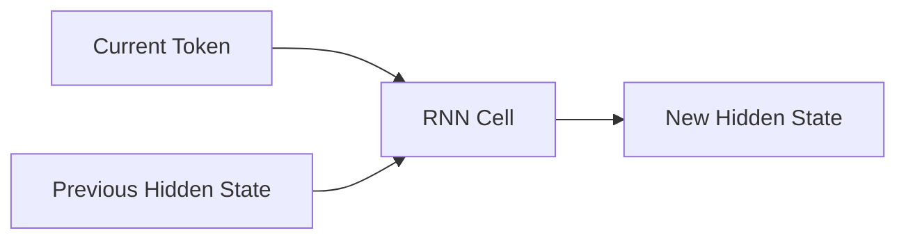

RNN Cell 只有一个任务：**根据当前输入和过去记忆，计算新的记忆。** 它并不是一个完整模型，只是 RNN 中最小的计算单元。

## RNN Cell 和神经元是什么关系？

第 4 章（从神经元到 MLP）里，神经元是最小的计算单元：输入加权求和，加 bias，再过激活函数，即 `y = activation(w·x + b)`。那么 RNN Cell 是"一个神经元"吗？不是——**RNN Cell 是"一层神经元"，外加一个循环连接。**

把 Hidden State 按维度拆开看，它的每一个维度都由一个神经元算出。所以 **Hidden Size（隐藏单元数）= 这层神经元的个数**，Hidden State 的每一维就是对应神经元当前的输出。Hidden Size = 4 时，`[0.25, -0.61, 0.92, 0.13]` 就是 4 个神经元此刻分别输出的 4 个数。

它和普通一层神经元唯一的区别是：除了当前 Token，还把上一时刻自己的输出 `hₜ₋₁` 接回来作为输入。**神经元负责单个维度的计算，循环连接负责让记忆跨时间流动**——下面「从简单规则逐步升级」先搭起"一层神经元"的权重、bias、激活函数，第五节再讲清那个循环连接。

## 从简单规则逐步升级

上一节（第三节）的更新规则 `memory = 0.8 * memory + token` 已经有了 RNN 的影子。真正的 RNN，只是把这里的 `0.8` 变成**可以学习的参数**。

**第一步：加入 Weight**。假设 Hidden State 和 Token 都是 2 维，`hidden = hidden + token` 升级成：

```python
hidden = W1 @ token + W2 @ hidden
```

这里第一次出现两个 Weight，分别负责把 Token 变成特征（`W1`），把 Hidden 变成新的记忆（`W2`），然后相加。为什么需要两个 Weight？因为 Token（当前新信息）和 Hidden（历史信息）是两种完全不同的信息，来源不同、作用也不同，因此需要两套不同的参数。

**第二步：加入 Bias**：`hidden = W1 @ token + W2 @ hidden + b`。到这里，还没有任何非线性，仍然只是 Linear。

**第三步：加入 Activation**。如果一直是 Linear，整个网络仍然只是一个线性模型。因此和 MLP 一样，RNN 也需要 Activation，最经典的是 `tanh`：

第4章列过它的定义：`tanh(x) = (e^x − e^(−x)) / (e^x + e^(−x))`，输出范围是 `(−1, 1)`，且以 0 为中心。这里选它有两个原因：Hidden State 的每一维需要可正可负；同时输出被限制在 `(−1, 1)`，可以避免状态在多个时间步反复相加后无界增长。

```python
hidden = np.tanh(W1 @ token + W2 @ hidden + b)
```

到这里，真正的 RNN Cell 已经出现了。

## 论文里的公式

论文中通常写成：

```
hₜ = tanh(Wxh·xₜ + Whh·hₜ₋₁ + b)
```

| 数学符号 | 含义 |
|----------|------|
| `xₜ` | 当前输入 Token |
| `hₜ₋₁` | 上一时刻 Hidden State |
| `Wxh` | 输入权重 |
| `Whh` | Hidden 权重 |
| `b` | 偏置 |
| `tanh` | 激活函数 |
| `hₜ` | 新的 Hidden State |

换回上一节的语言，其实就是：`新 Memory = 神经网络(旧 Memory, 当前 Token)`。并没有新的思想，只是把"Memory 更新规则"升级成了"可学习的神经网络"。（实验 9.1 会手写这个 NumPy RNN Cell。）

再回到「一层神经元」的视角：把上式按维度逐元素拆开，就是 `hₜ[i] = tanh(Wxh[i,:]·xₜ + Whh[i,:]·hₜ₋₁ + b[i])`——Hidden State 的第 `i` 维，正是第 `i` 个神经元的输出；所谓 Hidden Size，就是这一层神经元的个数。

## RNN Cell 层和 MLP 的区别与联系

既然 RNN Cell 是"一层神经元"，它和第 4 章的 MLP 层到底差在哪？先说相同点：两者都是**线性变换 + bias + 激活函数**，都由神经元组成，都是一个"把输入向量变成输出向量"的层。

真正的区别在输入来源和调用方式：

| | MLP 层 | RNN Cell 层 |
|---|---|---|
| 输入来源 | 只有前一层传来的特征 | 当前 Token `xₜ` + 上一时刻自己的输出 `hₜ₋₁` |
| 计算公式 | `y = activation(W·x + b)` | `hₜ = tanh(Wxh·xₜ + Whh·hₜ₋₁ + b)` |
| 时间维度 | 没有，每个样本独立处理 | 有，同一层沿时间反复调用自己 |
| 参数 | 每层一套，互不共享 | 所有时间步共享同一套 |
| 如何变深 | 堆叠更多层 | 堆叠层 + 沿时间展开 |

这里有一个最重要的洞察：**把 RNN 沿时间展开，就等价于一个深度 = 序列长度的前馈网络，只是每一"层"都绑定同一套参数。** 换句话说，RNN 可以看成"把 MLP 的很多层绑成同一套权重，再沿时间轴铺开"。所以 MLP 和 RNN 并不是两种毫无关系的东西——RNN 就是"参数共享 + 时间循环"的 MLP。

---

# 五、Unrolling 与 Parameter Sharing

一个真正的 RNN Cell 是 `hidden = tanh(Wx@token + Wh@hidden + b)`，它能完成 `Previous Hidden + Current Token → New Hidden`。但一句话 `I love AI today` 有 4 个 Token，难道需要 4 个 RNN Cell？如果 100 个 Token，需要 100 个 Cell 吗？答案是**不需要**。

观察循环写法：

```python
for token in tokens:
    hidden = np.tanh(Wx @ token + Wh @ hidden + b)
```

这里并没有创建新的 Cell，`Wx`、`Wh`、`b` 全部只有一套，一直重复使用。也就是说，真正工作的其实只有**一个 RNN Cell**，它只是不断处理新的 Token。

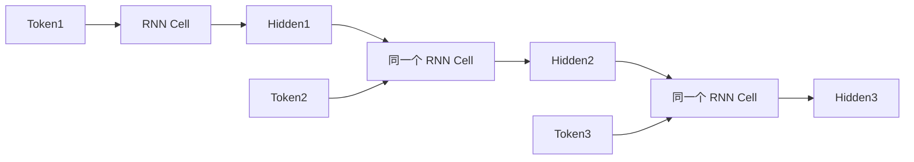

这里真正变化的是 Hidden，不是 Cell。

## Unrolling 与 Parameter Sharing

很多论文会画出一排方框，很多初学者会误认为存在三个 Cell，其实不是——论文只是把**同一个 Cell**在时间轴上**展开（Unroll）**了。这三个方框参数完全一样，真正只有一套 `Wx, Wh, b`。

RNN 最重要的特点就是：**所有时间步，共享同一套参数。** 无论处理 10 个 Token，还是 1000 个 Token，参数数量都不会增加，这就是 **Parameter Sharing（参数共享）**。

为什么必须共享参数？假设不共享，一句 100 Token 的话需要 100 套 Weight，另一句 200 Token 的话需要 200 套 Weight，模型根本无法处理不同长度的句子。因此 RNN 必须共享参数。

## Time Step（时间步）

论文中经常看到 `t=1, t=2, t=3`。很多人会误以为 Time 表示现实时间，其实不是，这里 **Time Step 表示第几个 Token**，例如 `I → t=1`，`love → t=2`，`AI → t=3`，`today → t=4`。因此 RNN 是在 Token 序列上前进，不是在现实时间上前进。

（实验 9.1 会用 `id(Wx)` 验证 Parameter Sharing，并手动 Unrolling 一次。）

---

# 六、深度方向的扩展：多层 RNN（Stacked RNN）

前面讲的都是**单层 RNN**：只有一个 RNN Cell 层，靠它沿时间轴反复展开——这是**时间方向**的扩展。那能不能像 MLP 那样，在**深度方向**也加深？可以——把多个 RNN Cell 层**垂直堆叠**起来，就是 **Stacked RNN（多层 RNN）**。

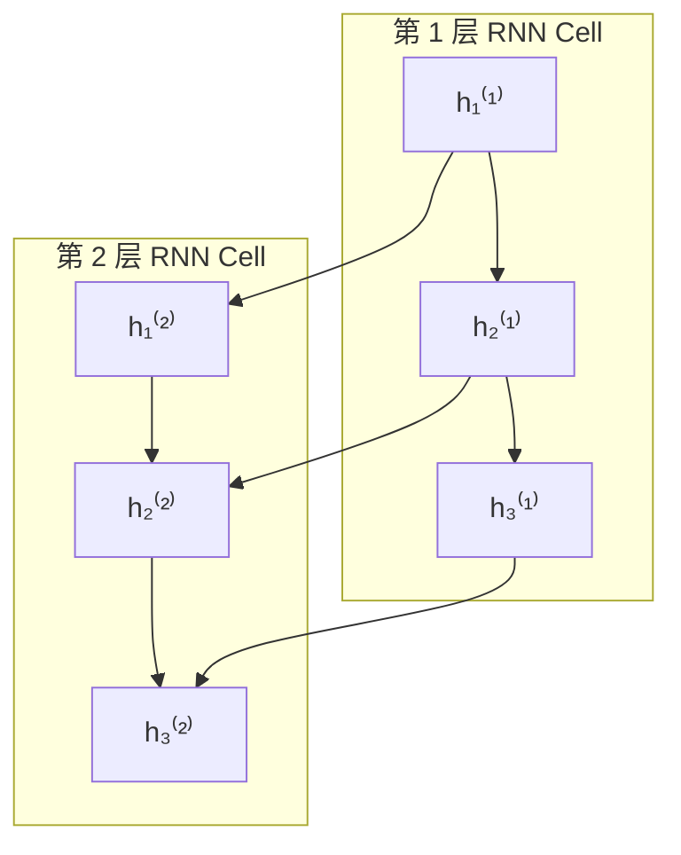

第 1 层沿时间步读入 Token，产出整个序列的 Hidden State `h⁽¹⁾`；第 2 层把 `h⁽¹⁾` 当作自己的输入，再沿时间走一遍，产出 `h⁽²⁾`；以此类推。每一层都有自己的一套 `Wxh、Whh、b`，但**层内**所有时间步依然共享这套参数。

这里再次回到前面那个"两个方向"的区分：

- **时间方向**：同一层内部 `hₜ₋₁ → hₜ` 的循环，靠 Parameter Sharing，一套参数反复用；
- **深度方向**：层与层之间 `h⁽¹⁾ → h⁽²⁾` 的前馈堆叠，每层一套独立参数，这一点和 MLP 加深完全一样。

为什么要堆叠？和 MLP 加深是同一个动机：更深的结构能学到更抽象、更复杂的表示。多层 RNN 里，下层往往捕捉局部的词法、句法信息，上层捕捉更全局的语义；代价也相同——参数和计算量随层数线性增长。（实验 9.1 末尾会手写一个两层的 Stacked RNN。）

---

# 七、RNN 的输出方式——Many-to-One、One-to-Many 与 Many-to-Many

RNN 会不断更新 Hidden State，但还有一个问题：**什么时候输出（Output）？** 答案是：不同任务，输出方式完全不同，这也是 RNN 能够应用于很多 NLP 任务的原因。

**第一种：Many-to-One（多输入，一个输出）**。例如**情感分类**：输入 `I really love this movie.`，模型逐个读取每个 Token，最后只输出一个结果 `Positive`。整个过程中没有中间输出，只有最后一个 Hidden State 用于分类。

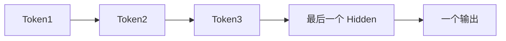

**第二种：One-to-Many（一个输入，多个输出）**。例如**图片描述（Image Caption）**：编码器先把一张图片表示成初始条件，解码器再自回归生成 `A → cat → is → sleeping`。在经典序列分类中，这常被概括为 One-to-Many。

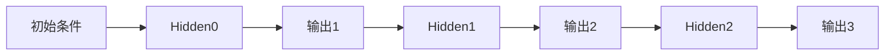

**第三种：Many-to-Many（同步输出）**。例如**词性标注（POS Tagging）**：输入 `I love AI`，输出 `Pronoun Verb Noun`——输入一个 Token，立即输出一个标签，输入输出长度一致。

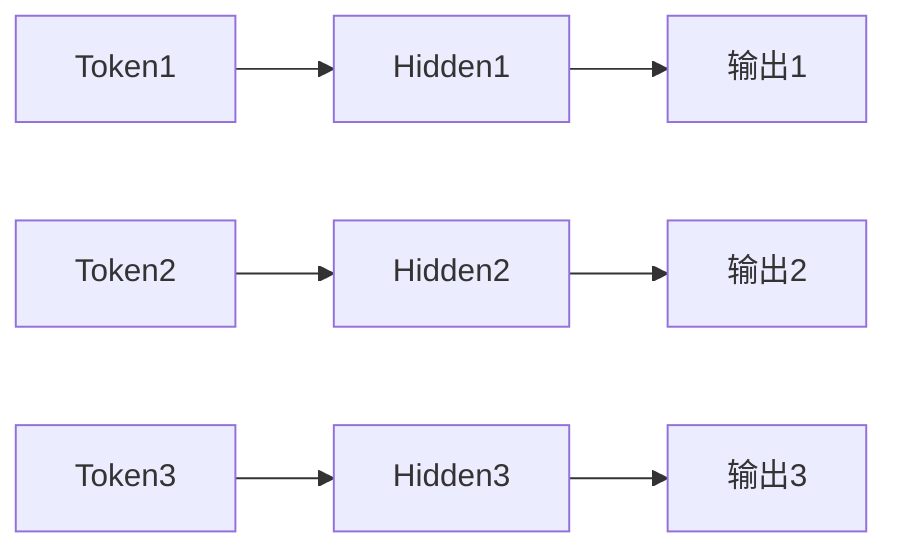

**第四种：Many-to-Many（Encoder-Decoder）**。例如**机器翻译**：输入 `I love AI`，输出 `我 爱 人工智能`。这里输入输出长度完全可以不同（例如 `Hello → 你好呀`，一个词变三个词），这种结构后来发展成 **Seq2Seq**。

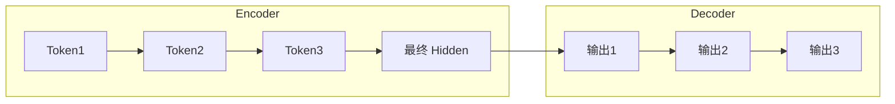

| 模式 | 输入 | 输出 | 典型任务 |
|------|------|------|----------|
| Many-to-One | 多个 Token | 一个结果 | 文本分类、情感分析 |
| One-to-Many | 一个条件输入 | 多个 Token | 图片描述 |
| Many-to-Many（同步） | 多个 Token | 多个标签 | 词性标注、命名实体识别 |
| Many-to-Many（Encoder-Decoder） | 一个序列 | 另一个序列 | 机器翻译、摘要生成 |

这套分类是对 RNN 任务接口的教学概括，不应机械套到现代 Decoder-only LLM。LLM 通常接收多 Token 提示，并在每一步把"提示 + 已生成 Token"作为左侧上下文预测下一个 Token；从序列映射看更接近**条件式 Many-to-Many**，从生成过程看则是**自回归 Next Token Prediction**。

真正变化的不是 RNN 本身，而是**什么时候读取 Hidden State，什么时候产生输出**，即**输出策略（Output Strategy）**。这也是后续 Seq2Seq、Attention、Transformer 等模型的共同基础。

---

# 八、为什么 RNN 会遗忘？

RNN 引入了 Hidden State，模型终于拥有了 Memory。于是很多人会认为 RNN 应该能够一直记住所有信息。事实上并不是——RNN 的 Memory 并不是无限的，随着序列越来越长，它会**逐渐遗忘早期的信息**。

一个真实的例子：`Alice, after spending three years studying artificial intelligence, working at several companies, publishing many papers, finally won the Turing Award.`——谁 `won`？答案是 `Alice`，但 `Alice` 距离 `won` 已经隔了几十个 Token。理论上 RNN 可以一直传递 Hidden State，实际上模型早就忘了 `Alice`。

## 前向与反向传播，到底在处理 Context Window 还是 Hidden State？

很多初学者在这里会混淆。结论非常明确：**RNN 抛弃了 Context Window，前向和反向传播处理的都是 Hidden State 这条时间链。**

**前向传播**：每一步的输入是"当前一个 Token `xₜ` + 上一时刻 Hidden State `hₜ₋₁`"，输出是"新的 Hidden State `hₜ`"。Token 一个一个地读进来，历史全靠 `hₜ₋₁ → hₜ → hₜ₊₁ → ...` 这条 Hidden State 链向后传递。整个过程里根本没有"把最近 N 个 Token 拼起来"这个动作。

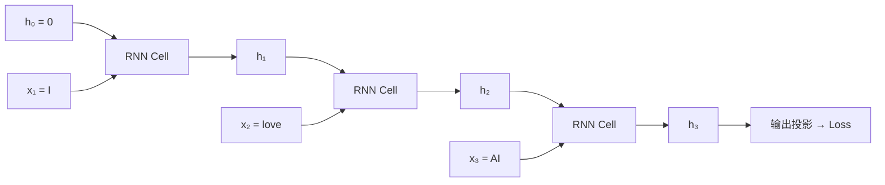

图中 `C1、C2、C3` 是**同一个 RNN Cell**，只是被时间展开了；Token 一个个喂进去，Hidden State `h` 一步步往后传，最后一步再接输出投影产生 Loss。

**反向传播（BPTT，Backpropagation Through Time）**：Loss 从最后一步传回第一步，梯度是沿着 Hidden State 链反向流动的。每一步反向都要乘一个 Jacobian（`∂hₜ/∂hₜ₋₁`，也就是"上一时刻 Hidden State 变动一点，当前 Hidden State 会跟着变动多少"），序列多长就乘多少次。梯度流经的是 `hₜ₋₁ → hₜ` 之间的连接（对应权重 `Whh`），而不是任何 Context Window。

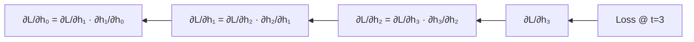

梯度沿 `h₃ → h₂ → h₁ → h₀` 一路回传，每退一步都要乘一个 Jacobian `∂hₜ/∂hₜ₋₁`——这就是"Through Time"的由来，也是后面梯度消失/爆炸的根源。

一句话：**Context Window 是第 6～8 章的东西；进入 RNN 之后，前向传播读的是"当前 Token + Hidden State"，反向传播传的是 Hidden State 链上的梯度。**

## 训练困难的核心：重复 Jacobian 导致梯度消失或爆炸

要注意：前面"每步乘一个小于 1 的系数会遗忘"是一个特意选取的**衰减特例**，只用于说明"反复乘小于 1 的系数会遗忘"，不能推出所有 RNN 的 Hidden State 必然按同样方式衰减。

一般 RNN 的反向传播会反复乘一个矩阵，它叫 **Jacobian（雅可比矩阵）**。这里可以直接把它理解为：**"上一时刻 Hidden State 变动一点，当前 Hidden State 会跟着变动多少"的放大或缩小系数**。单个数字的版本就是一个固定系数；Hidden State 是向量时，这个系数变成一个矩阵。

关键在于：序列有多长，这个系数就要连乘多少次。若乘积的尺度长期小于 1，梯度会消失；若长期大于 1，梯度会爆炸。于是最开始的参数几乎收不到任何更新，这就是 **Gradient Vanishing（梯度消失）** 与 **Gradient Exploding（梯度爆炸）**。

例如一句话 `Alice ... won`，训练时 Loss 发生在最后的 `won`，但真正需要学习的是 `Alice`。由于梯度已经消失，模型不会调整关于 `Alice` 的参数，于是 RNN 越来越容易忘记远距离信息。（实验 9.2 会分别用图和数字观察前向衰减与反向梯度连乘。）

## 两种"消失"的方向

| | Forward（前向） | Backward（反向） |
|---|---|---|
| 可能的问题 | 新输入不断覆盖旧信息，或状态动力学使早期影响衰减 | 重复 Jacobian 乘积导致梯度消失或爆炸 |

二者都会增加长距离依赖的学习难度，但不存在"RNN 固定只能处理几十到几百个 Token"的统一上限；有效长度取决于结构、参数、任务和训练方法。

---

# 九、长期依赖与门控机制

RNN 的 Memory 会越来越弱，原因不是模型没有 Memory，而是**它不会管理自己的 Memory**。更新方式 `memory = 0.8 * memory + token` 中，模型没有任何选择：它不知道哪些应该保留、哪些应该忘记、哪些应该加入。

一个生活中的例子：假设你的大脑只有一个笔记本，每天都往里面写东西：第一天"今天认识了 Alice"，第二天"今天吃了披萨"，第三天"今天下雨了"……如果每写一条都把前面内容擦掉一点，几年以后你可能已经忘了 Alice。但 Alice 真的应该被忘记吗？也许不应该。

如果由你设计 Memory，你最希望它具备哪些能力？大多数人会想到：①重要的信息不要忘（例如 `Alice` 一直保存）；②无关的信息及时删除（例如"天气很好"不用一直记住）；③遇到新的重要信息，加入 Memory（例如"Alice 是教授"）；④输出的时候，只取当前需要的信息，而不是把全部 Memory 都说出来。

于是 Memory 更新不应该再是机械的 `memory = 0.8 * memory + token`，而应该变成"决定哪些保留、哪些删除、哪些新增"，这里第一次出现"决定（Decision）"——Memory 不再是机械更新，而是**可控制（Controllable）**。

这个"可控 Memory"实际上需要三个动作：**删除（Forget）**、**加入（Input）**、**输出（Output）**。1997 年提出的原始 LSTM 已经引入了可控的长期记忆通路和输入门、输出门；今天最常见的 **Forget Gate（遗忘门）** 是 Gers 等人在 1999 年提出、并在后续标准 LSTM 中广泛采用的改进。

> **现代 LSTM（Long Short-Term Memory）**

现代 LSTM 没有推翻 RNN，而是在递归结构中加入三类门控：

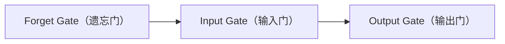

从此，模型终于可以**决定什么该忘、什么该记、什么该输出**。

---

# 十、LSTM——两种 Memory

即使 Memory 可以控制，它仍然只有一份。如果今天加入很多新内容，旧的信息仍然可能慢慢消失。于是研究人员提出了一个新想法：**不要只有一个 Memory，而是准备两份。**

LSTM 中实际存在两种状态：

- **Hidden State（h）**：负责当前时刻神经网络对外输出的信息，相当于**工作内存（Working Memory）**。
- **Cell State（c）**：负责长期保存重要信息，相当于**长期记忆（Long-term Memory）**。

一个类比：写论文时，桌上的一张纸记录着"今天正在思考的问题"（Hidden State），电脑里的文档保存着"整个论文"（Cell State）。桌上的纸每天都会换，但电脑里的文档一直保存——真正长期保存信息的是文档，不是纸。

RNN 只有 Hidden State：`Token1 → Hidden1 → Token2 → Hidden2 → Token3 → Hidden3`。Hidden 不断更新，旧信息越来越弱，最终遗忘。LSTM 增加了一条新的通道——Cell State，它几乎可以一直传递下去，不会像 Hidden State 那样每一步都重新计算。真正长期保存信息的，变成了 Cell State，而不是 Hidden State。（实验 9.3 会先模拟这个"Cell 不变、Hidden 变化"的现象。）

后面的三个 Gate，其实都是围绕 Cell State 展开工作的。

---

# 十一、Forget Gate——模型如何决定"忘记什么"

LSTM 用固定维度的 Cell State 跨时间传递信息。它的向量维度不会随序列增长，但旧信息若始终原样累积，会干扰后续状态更新。因此模型需要按维度调节上一时刻 Cell State 的贡献，这就是 **Forget Gate**。

**为什么叫 Gate（门）？** Forget Gate 不是独立的 Memory，而是一个由线性变换和 Sigmoid 构成的可学习门控向量。它与上一时刻 Cell State 逐元素相乘，控制各维旧信息保留多少。

**一个例子**：笔记本记录着 `Alice、教授、北京大学、天气很好、今天下雨、午饭吃面`。论文结束后，大多数人会保留 `Alice、教授、北京大学`，删除后面的琐事。Forget Gate 做的就是这个决定。

**Forget Gate 不是简单的"删或留"**。Forget Gate 输出的是一个 **0~1 之间的数字**：`1.0` 表示全部保留，`0` 表示全部删除，更多时候是 `0.82、0.35、0.91、0.12` 这样的中间值，表示保留一部分。所以 Forget Gate 其实是一个**保留比例（Keep Ratio）**。

Forget Gate 这个数字是谁决定的？答案是：**神经网络自己计算**。模型会同时观察当前输入 `xₜ` 和上一时刻 Hidden State `hₜ₋₁`，然后输出一个 0~1 之间的向量：

```
fₜ = σ(Wf · [hₜ₋₁, xₜ] + bf)
```

其中 `σ`（Sigmoid）保证输出一定在 0~1 之间，`Wf`、`bf` 是需要学习的参数。因此 Forget Gate 不是程序员写死的固定值，而是模型训练出来的——什么时候应该接近 1，什么时候应该接近 0。

标准 LSTM 在同一时间步还会由同一组输入 `[hₜ₋₁, xₜ]` 计算 Input Gate 和候选记忆：

```
iₜ = σ(Wi · [hₜ₋₁, xₜ] + bi)
C̃ₜ = tanh(Wc · [hₜ₋₁, xₜ] + bc)
Cₜ = fₜ ⊙ Cₜ₋₁ + iₜ ⊙ C̃ₜ
```

这里的 `⊙` 表示逐元素乘法。Forget Gate 与 Input Gate 在实现中可以并行计算；"先忘再写"只是理解 Cell State 更新公式的叙述顺序，并不是因为记忆有固定容量、必须先腾出空间。下一节将详细解释 Input Gate。

---

# 十二、Input Gate 与 Candidate Memory——模型如何决定"记住什么"

Forget Gate 回答的是"哪些旧信息应该保留？"。与它并行计算的另一个问题是：**候选新信息应该写入多少？** 答案就是 **Input Gate（输入门）**。

假设当前 Cell State 是 `Alice、教授、北京大学`。模型读到"Alice 获得了图灵奖"，这条信息显然应该加入长期记忆；但如果读到"今天下雨了"，大多数情况下不需要写入。因此模型需要第二个能力：**决定哪些新的信息值得长期保存**。

Forget Gate 控制"旧 Memory"，Input Gate 控制"新 Memory"，但请注意：**Input Gate 并不决定"写什么"，它只决定"允许多少信息进入 Cell State"**。

如果 Input Gate 负责"写多少"，那么谁负责"写什么"？答案是 **Candidate Memory（候选记忆）**——模型根据当前输入生成的一份"建议写入内容"。例如输入"Alice 获得图灵奖"，模型可能生成候选内容 `Alice、图灵奖、成就`，但真正写入多少，还要经过 Input Gate。一个类比：系统自动生成一条建议（Candidate），但真正是否保存，还需要你点击"保存"或"忽略"，Input Gate 就像这个"保存按钮"。

三个相关量都由当前输入与上一时刻 Hidden State 计算：

```
fₜ = σ(Wf · [hₜ₋₁, xₜ] + bf)
iₜ = σ(Wi · [hₜ₋₁, xₜ] + bi)
C̃ₜ = tanh(Wc · [hₜ₋₁, xₜ] + bc)
Cₜ = fₜ ⊙ Cₜ₋₁ + iₜ ⊙ C̃ₜ
```

其中 `Cₜ₋₁` 是旧 Cell，`fₜ` 是 Forget Gate，`iₜ` 是 Input Gate，`C̃ₜ` 是 Candidate Memory，`⊙` 表示逐元素乘法。实现时前三式可以并行计算，最后一式把两部分合成新的 Cell State；"Forget + Input"描述的是数学分工，不要求两个门先后执行。

一句话：**Cell State 更新公式 = 保留旧 Memory + 加入新 Memory。**

---

# 十三、Output Gate 与 Hidden State——模型如何决定"输出什么"

完成了 Cell State 的更新：`旧 Cell → Forget Gate 保留旧信息 + Input Gate 加入新信息 → 新的 Cell State`。到这里，LSTM 已经拥有了一份新的长期记忆。但新的问题来了：**是不是 Cell State 中的所有信息，都应该立刻输出？** 答案当然不是。

假设你的长期记忆里保存着 `Alice、教授、北京大学、图灵奖、出生地、论文、年龄`。现在别人问你"Alice 在哪里工作？"，你会回答"北京大学"，而不会把所有信息都说出来。虽然这些信息都存在长期记忆中，但当前真正需要输出的只有一部分。

Output Gate 控制的不是"Cell State 是否存在"，而是**Cell State 中哪些内容参与当前计算**：

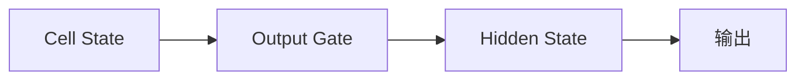

Cell State 仍然完整保留，只是当前输出只使用其中一部分。

既然 Cell State 已经保存了长期记忆，为什么还需要 Hidden State？原因是：Cell State 更像**数据库**，保存全部数据；Hidden State 更像**当前显示的页面**，只显示当前需要的一部分。

标准 LSTM 的 Hidden State 不是 `output_gate × cell_state`，而是：

```
hₜ = oₜ × tanh(Cₜ)
```

`tanh` 先把 Cell State 压缩到 `[-1,1]`，Output Gate 再控制各维度有多少进入当前 Hidden State。需要特别区分：`hₜ` 仍是隐藏表示，并不是词表上的预测概率。语言建模还需要输出投影与 Softmax，例如 `logitsₜ = W_y hₜ + b_y`、`p(yₜ)=softmax(logitsₜ)`。

三个 Gate 分别负责：Forget Gate 管理过去；Input Gate 管理现在；Output Gate 服务当前输出，并把 Hidden State 传递给下一时刻。整个流程形成一个完整的闭环。（实验 9.3 会把三个门串起来，手写一次完整的 LSTM 更新。）

---

# 十四、LSTM 的极限——信息瓶颈

到这里，我们已经完整学习了 LSTM。相比 RNN，它增加了 Cell State、Forget Gate、Input Gate、Output Gate，模型终于拥有了**长期记忆（Long-term Memory）**。但这是否意味着 LSTM 已经解决了所有问题？答案是：**没有。**

来看一句很长的句子：`The little girl who was born in Shanghai, moved to Beijing, studied at Tsinghua University, worked at Google for five years, then joined OpenAI, finally published an important paper.`。最后的 `published` 真正对应的是 `The little girl`。虽然 LSTM 能比 RNN 记住更多内容，但它仍然需要一直维护**同一个 Cell State**——无论一句话是 10 个 Token 还是 1000 个 Token，真正保存历史信息的，始终只有这一个 Cell State。

一个形象的比喻：假设你在阅读一本 500 页的书。RNN 要求你读完以后只能留下一张纸条，所有内容都必须压缩进去。LSTM 升级了一点，给你一张更大的纸，甚至可以擦除、修改、补充，但最后仍然只有这一张纸——一本 500 页的书，真的能够压缩到一张纸吗？当然不能。

这种问题在机器学习中叫 **Information Bottleneck（信息瓶颈）**：

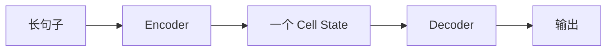

整个句子无论有多少信息，最后都必须经过同一个 Cell State，大量信息不得不被压缩。

为什么不能把 Cell State 变得越来越大（128 → 512 → 2048 → 100000）？理论上当然可以，但代价越来越高，而且无论多大，最终仍然是**固定长度**。只要输入序列继续增长，信息压缩仍然不可避免。

LSTM 并没有失败，它把"压缩式记忆"这条路做到了很高的水平；但只要仍然依赖单个固定向量携带全部历史，这个瓶颈就无法通过继续加宽解决。（实验 9.3 末尾会用一个小例子体验信息压缩。）

---

# 十五、本章总结

回顾整个第 9 章：

- ✅ MLP 的两个限制：输入长度固定、没有跨样本的记忆
- ✅ 为什么需要 Memory 与 Hidden State
- ✅ Hidden Size 的含义，以及 Hidden State 如何替代 Context Window
- ✅ RNN Cell 就是"一层神经元 + 一条循环连接"，公式 `hₜ = tanh(Wxh·xₜ + Whh·hₜ₋₁ + b)`
- ✅ RNN Cell 层和 MLP 层的区别与联系
- ✅ Unrolling 与 Parameter Sharing（时间方向）
- ✅ 多层 RNN / Stacked RNN（深度方向）
- ✅ RNN 的四种输出方式
- ✅ 前向/反向传播处理的是 Hidden State 链，而不是 Context Window
- ✅ 为什么 RNN 会遗忘（前向衰减 / 反向梯度消失与爆炸）
- ✅ 门控机制的设计动机
- ✅ LSTM 的两种状态：Hidden State 与 Cell State
- ✅ Forget / Input / Output 三个门如何管理长期记忆
- ✅ 为什么固定长度 Cell State 仍然存在信息瓶颈

---

# 本章路线

- [9.1 从零实现 RNN Cell](./9.1%20从零实现%20RNN%20Cell.md)：观察固定窗口局限，用 NumPy 一步步实现 Memory、Hidden State 更新与 RNN Cell，验证 Parameter Sharing 与 Unrolling，并动手搭一个两层的 Stacked RNN；
- [9.2 观察 RNN 的遗忘与梯度消失](./9.2%20观察%20RNN%20的遗忘与梯度消失.md)：用图和数字分别观察前向的信息衰减与反向的重复 Jacobian 连乘；
- [9.3 手写 LSTM Cell](./9.3%20手写%20LSTM%20Cell.md)：从可控 Memory 到 Cell State，手写 Forget / Input / Output 三个门与一次完整 LSTM 更新，并体验信息瓶颈。

完成本章后，下一章将讨论既然"把全部历史压缩进一个固定向量"是瓶颈，能否换一个思路：**保留整个历史，在需要时再去读取需要的部分？** 第 10 章 Attention 就从这个问题出发，给出替代方案。
