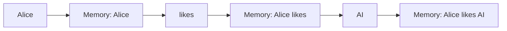

# 9.1 从 Context 到 Memory——为什么模型需要"记住"过去？

上一节，我们发现固定 Context Window 只能看到最近 N 个 Token，超出窗口的信息会永久丢失。于是一个自然的问题出现了：

> **模型能不能把过去的重要信息保存下来，而不是完全依赖 Context Window？**

这就是 **Memory（记忆）**，也是 RNN 最核心的思想。

---

# 什么是 Memory？

人类阅读 `Alice likes AI.` 时，读完 `Alice` 就记住"当前主语是 Alice"；读到 `likes` 时不会忘记 `Alice`；读到 `AI` 时仍然记得 `Alice likes ...`。大脑并不是每次都重新阅读整句话，而是不断更新脑中的状态：



真正变化的是 **Memory**。

---

# 神经网络能不能也这样工作？

第6～8章使用的 Neural Language Model 每次预测都是 `Context → MLP → Prediction`，预测结束后模型什么都不会留下，下一次预测又重新开始，完全没有连续性。

一个新的想法出现了：**每处理一个 Token，就把当前信息保存到Memory，供下一步使用**。这正是 RNN 的核心思想。

---

# Experiment 9.1：实现最小 Memory

不用神经网络、不用矩阵，只体验 Memory 如何随 Token 不断更新。

**版本一：字符串拼接**

```python
sentence = ["I", "love", "AI", "today"]
memory = ""
for word in sentence:
    memory = memory + " " + word
    print(memory)
```

输出：`I` → ` I love` → ` I love AI` → ` I love AI today`。Memory 一直在增长，模型没有忘记前面的 Token。

**版本二：数字累加**

```python
memory = 0
sequence = [1,2,3,4]
for token in sequence:
    memory = memory + token
    print(memory)
```

输出：`1, 3, 6, 10`。Memory 不是重新计算，而是在上一时刻基础上不断更新。

**版本三：带衰减的更新（更接近 RNN）**

```python
memory = 0
sequence = [1,2,3,4]
for token in sequence:
    memory = 0.8 * memory + token
    print(round(memory, 2))
```

输出：`1.00, 2.80, 5.24, 8.19`。这里新的 Memory 同时依赖**上一时刻的 Memory** 和**当前输入 Token**：

```
New Memory = f(Old Memory, Current Token)
```

这正是 RNN 的基本思想，真正的 RNN 更新公式会复杂得多，但核心思想完全一致。

---

# 本节总结

这三个实验虽然没有任何神经网络，却已经模拟了 RNN 最重要的思想：**每读取一个 Token，就更新一次内部状态（State）**。这个状态不会因为预测结束而消失，而是一直传递到下一个时间步，因此模型终于拥有了一种"短期记忆"。

下一节，我们将把这里的 Memory 正式数学化，介绍 RNN 最核心的概念：**Hidden State（隐藏状态）**，并推导出 RNN 的基本计算公式 `hₜ = f(xₜ, hₜ₋₁)`——它其实就是本节 `memory = f(memory, token)` 的数学表达。
