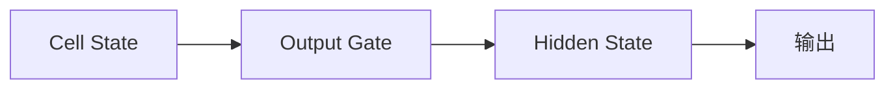
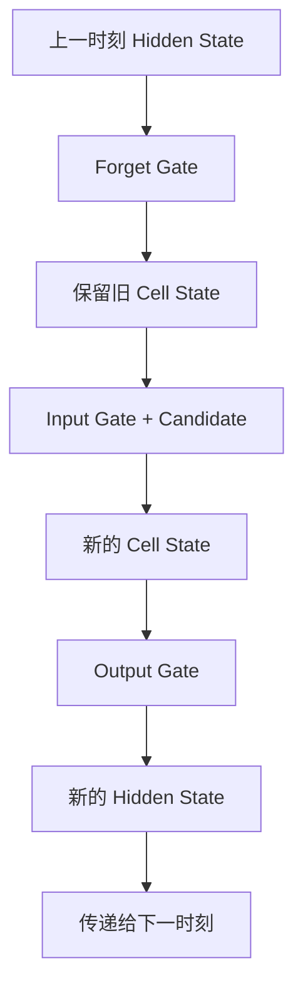

# 9.11 Output Gate——模型如何决定"输出什么"

上一节，我们已经完成了Cell State 的更新：`旧 Cell → Forget Gate 保留旧信息 + Input Gate 加入新信息 → 新的 Cell State`。到这里，LSTM 已经拥有了一份新的长期记忆。但新的问题来了：**是不是 Cell State 中的所有信息，都应该立刻输出？** 答案当然不是。

---

# 一个生活中的例子

假设你的长期记忆里保存着 `Alice、教授、北京大学、图灵奖、出生地、论文、年龄`。现在别人问你"Alice 在哪里工作？"，你会回答"北京大学"，而不会把所有信息都说出来。虽然这些信息都存在长期记忆中，但当前真正需要输出的只有一部分。

---

# Output Gate 的作用

Output Gate 控制的不是"Cell State 是否存在"，而是**Cell State 中哪些内容参与当前计算**：



Cell State 仍然完整保留，只是当前输出只使用其中一部分。

---

# 为什么还需要Hidden State？

既然 Cell State 已经保存了长期记忆，为什么还需要 Hidden State？原因是：Cell State 更像**数据库**，保存全部数据；Hidden State 更像**当前显示的页面**，只显示当前需要的一部分。

---

# Experiment 9.12：体验 Output Gate

标准 LSTM 的 Hidden State 不是 `output_gate × cell_state`，而是：

```
hₜ = oₜ × tanh(Cₜ)
```

`tanh` 先把 Cell State 压缩到 `[-1,1]`，Output Gate 再控制各维度有多少进入当前 Hidden State。延续 9.10 节的 `new_cell = [7.9, 5.0]`：

```python
import numpy as np

new_cell = np.array([7.9, 5.0])
output_gate = np.array([0.7, 0.6])

hidden = output_gate * np.tanh(new_cell)
print(hidden)  # [0.7000 0.5999]
```

Cell State 本身没有因此减少；变化的是当前时刻传给下一时间步或上层网络的 Hidden State。需要特别区分：`hₜ` 仍是隐藏表示，并不是词表上的预测概率。语言建模还需要输出投影与 Softmax，例如 `logitsₜ = W_y hₜ + b_y`、`p(yₜ)=softmax(logitsₜ)`。

---

# 三个 Gate 如何协同工作？



三个 Gate 分别负责：Forget Gate 管理过去；Input Gate 管理现在；Output Gate 服务当前输出，并把 Hidden State 传递给下一时刻。整个流程形成一个完整的闭环。

---

# Experiment 9.13：手写一次完整的 LSTM 更新

把 9.9～9.11 三节串起来，就是一次完整的 LSTM 更新：

```python
import numpy as np

old_cell = np.array([8, 4])
forget = np.array([0.8, 0.5])
candidate = np.array([3, 6])
input_gate = np.array([0.5, 0.5])
output_gate = np.array([0.7, 0.6])

new_cell = forget * old_cell + input_gate * candidate  # 更新 Cell State
hidden = output_gate * np.tanh(new_cell)                 # 标准 LSTM：生成 Hidden State

print("Cell:", new_cell)     # [7.9 5. ]
print("Hidden:", hidden)     # [0.7000 0.5999]
```

计算过程：旧记忆 `[8,4]` 经 Forget Gate 后保留 `[6.4,2.0]`；候选记忆 `[3,6]` 经 Input Gate 后写入 `[1.5,3.0]`；新 Cell 为 `[7.9,5.0]`。随后 `tanh(new_cell)≈[1.0000,0.9999]`，再乘 Output Gate `[0.7,0.6]`，得到 Hidden `[0.7000,0.5999]`。

---

# 本节总结

本节，我们完成了 LSTM 最后一块拼图：✅ Output Gate 控制当前输出 ✅ Hidden State 来自 Cell State，而不是直接等于 Cell State ✅ Cell State 保存长期记忆，Hidden State 表示当前工作状态

至此，我们已经完整理解了 LSTM Cell 的内部工作机制。下一节，我们将讨论 LSTM 依然存在的局限，并引出 **Attention（注意力机制）**。
