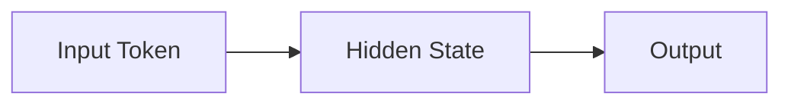

# 9.2 Hidden State——神经网络中的 Memory

上一节，我们设计了一个非常简单的 Memory：`memory = 0.8 * memory + token`。它已经具备了 RNN 最重要的特点：**新的状态依赖于旧状态和当前输入**。本节，我们将把这个 Memory 升级成真正的神经网络状态：**Hidden State（隐藏状态）**。

---

# 为什么叫 Hidden（隐藏）？

Hidden 并不是"藏起来不给你看"，而是：**它不是模型最终输出，而是模型内部维护的一份状态**。



Input 和 Output 用户都能看到，只有 Hidden State 存在于模型内部，不会直接输出。可以把它理解成**模型脑子里的想法**。

---

# Hidden State 保存了什么？

模型按顺序读取 `I love AI`：读到 `I`，Hidden State 记录"主语可能是 I"；读到 `love`，更新为"I love"；读到 `AI`，再次更新为"I love AI"。Hidden State 并不是保存某一个 Token，而是**到当前为止，模型对整个上下文的理解**——越来越像一句话的摘要（Summary）。

---

# Hidden State 是一个向量

上一节的 Memory 只是一个数字。真正的神经网络中，Hidden State 是一个向量：Hidden Size 为 4 时，Hidden State 就是 `[0.25, -0.61, 0.92, 0.13]`；GPT 中 Hidden Size 可能是 4096，Hidden State 就是 4096 维向量。本质完全一样，只是维度越来越高。

---

# Hidden State 如何更新？

上一节的更新规则 `memory = 0.8 * memory + token` 可以升级为：

```
New Hidden State = Old Hidden State + Current Token
```

真正的神经网络不会直接相加，而是先做 Linear，再做 Activation：

```
Hidden State = f(Old Hidden State, Current Input)
```

这里 `f()` 表示一个神经网络，而不是简单加法。论文中通常写成：

```
hₜ = f(xₜ, hₜ₋₁)
```

| 上一节 | RNN 论文 |
|---------|----------|
| memory | Hidden State（h） |
| token | Input（x） |
| 更新 memory | 更新 Hidden State |

请不要死记公式，只要记住一句话：**Hidden State 就是不断更新的 Memory。**

---

# Experiment 9.2：观察 Hidden State 的变化

延续本章的例子：把 `I love AI` 的三个 Token 分别表示成2 维向量 `I=[1,0]`、`love=[0,1]`、`AI=[1,1]`（这组向量我们会一直用到 9.4 节）：

```python
import numpy as np

hidden = np.zeros(2)
tokens = [np.array([1,0]), np.array([0,1]), np.array([1,1])]  # I, love, AI

for token in tokens:
    hidden = 0.6 * hidden + token
    print(hidden)
```

输出：

```text
[1. 0.]
[0.6 1. ]
[1.36 1.6]
```

请认真观察：第一个 Token `I=[1,0]` 虽然已经过去，但它的影子仍然留在第一维（`1 → 0.6 → 1.36` 中的衰减份额），说明 Hidden State 并没有完全忘记之前的信息，只是影响越来越小。

---

# 实验分析

这个实验虽然不是完整的 RNN，但已经展示了 Hidden State 的核心特点：①每读取一个 Token 就更新一次；②新状态依赖于旧状态；③历史信息不会立即消失，而是逐渐衰减；④Hidden State 是模型对当前上下文的压缩表示。

真正的 RNN，会把这里简单的更新规则替换成一个可以学习的神经网络。

---

# 本节总结

本节完成了：✅ Memory → Hidden State ✅ Hidden State 是向量，而不是一个数字 ✅ 理解公式 `hₜ = f(xₜ, hₜ₋₁)` ✅ 使用 NumPy 模拟 Hidden State 更新

下一节，我们将正式揭开 RNN Cell 的内部结构，看看这个 `f()` 到底是什么，它为什么能够学习语言规律，而不是简单地把两个向量相加。
