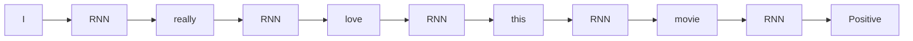
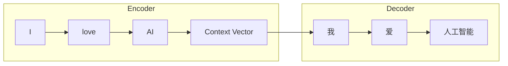

# 9.5 RNN 的输出方式——Many-to-One、One-to-Many 与 Many-to-Many

上一节，我们已经知道 RNN 会不断更新 Hidden State。但还有一个问题：**什么时候输出（Output）？** 答案是：不同任务，输出方式完全不同，这也是 RNN 能够应用于很多 NLP 任务的原因。

---

# 第一种：Many-to-One（多输入，一个输出）

例如**情感分类**：输入 `I really love this movie.`，模型逐个读取每个 Token，最后只输出一个结果 `Positive`。

整个过程中没有中间输出，只有最后一个 Hidden State 用于分类。

---

# 第二种：One-to-Many（一个输入，多个输出）

例如**图片描述（Image Caption）**：编码器先把一张图片表示成初始条件，解码器再自回归生成 `A → cat → is → sleeping`。在经典序列分类中，这常被概括为 One-to-Many。

---

# 第三种：Many-to-Many（同步输出）

例如**词性标注（POS Tagging）**：输入 `I love AI`，输出 `Pronoun Verb Noun`——输入一个 Token，立即输出一个标签，输入输出长度一致。

---

# 第四种：Many-to-Many（Encoder-Decoder）

例如**机器翻译**：输入 `I love AI`，输出 `我 爱 人工智能`。

这里输入输出长度完全可以不同（例如 `Hello → 你好呀`，一个词变三个词），这种结构后来发展成 **Seq2Seq**。

---

# 四种模式总结

| 模式 | 输入 | 输出 | 典型任务 |
|------|------|------|----------|
| Many-to-One | 多个 Token | 一个结果 | 文本分类、情感分析 |
| One-to-Many | 一个条件输入 | 多个 Token | 图片描述 |
| Many-to-Many（同步） | 多个 Token | 多个标签 | 词性标注、命名实体识别 |
| Many-to-Many（Encoder-Decoder） | 一个序列 | 另一个序列 | 机器翻译、摘要生成 |

这套分类是对 RNN 任务接口的教学概括，不应机械套到现代 Decoder-only LLM。LLM 通常接收多 Token 提示，并在每一步把“提示 + 已生成 Token”作为左侧上下文预测下一个 Token；从序列映射看更接近**条件式 Many-to-Many**，从生成过程看则是**自回归 Next Token Prediction**。

---

# 实验对比

| 任务 | 输入 | 输出 |
|------|------|------|
| 情感分析 | I love AI | Positive |
| 文本生成 | I love | AI today very much |
| 词性标注 | I / love / AI | Pronoun / Verb / Noun |
| 翻译 | I love AI | 我 / 喜欢 / 人工智能 |

真正变化的不是 RNN本身，而是**什么时候读取 Hidden State，什么时候产生输出**，即**输出策略（Output Strategy）**。这也是后续 Seq2Seq、Attention、Transformer 等模型的共同基础。

---

# 下一节预告

到目前为止，RNN 已经解决了固定 Context Window 的问题。但新的问题又出现了：虽然 RNN 理论上能够一直记住过去，但实际上它很快就会**遗忘**。下一节，我们将学习 RNN 为什么会遗忘，以及深度学习历史上一个里程碑模型：**LSTM（Long Short-Term Memory）**。
