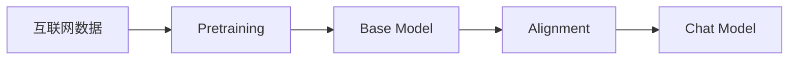
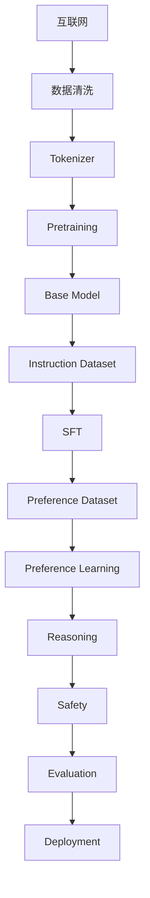

# 第1章 Alignment——为什么 GPT 变成了 ChatGPT？

## 本章目标

完成本章学习后，你将理解：

- 什么是 Alignment（模型对齐）
- 为什么 Base Model 无法直接成为 AI 助手
- Alignment 解决了哪些问题
- ChatGPT 为什么不是简单的 GPT
- Alignment 在现代 LLM 中所处的位置

---

## 一个奇怪的问题

假设我们拥有一个已经训练完成的 GPT——它阅读了整个互联网，拥有极其丰富的知识。现在我们问它：

```text
帮我写一封请假邮件。
```

模型却回答：

```text
邮件（Email）是一种电子通信方式，起源于……
```

它明明知道"什么是邮件"，却没有完成"你的任务"。为什么？

## Base Model 到底是什么？

Base Model 就是经过预训练（Pretraining）的基础模型，它唯一的训练目标只有一个：**Next Token Prediction**。输入"苹果公司总部位于"，它会预测"美国"；输入"今天北京天气"，它只知道继续预测下一个 Token——它并不知道用户是在提问、聊天、写代码还是要求翻译，它只知道"继续预测"。因此，Base Model 更像一个**语言补全器（Language Completer）**，而不是 AI 助手。

## ChatGPT 为什么完全不同？

ChatGPT 不仅知道语言，更知道"如何帮助用户"。用户说"帮我翻译下面这段文字"，它不会先解释什么是翻译，而是直接开始翻译；用户说"帮我写 Python 排序代码"，它不会介绍 Python 的历史，而是立即生成代码。因为模型已经学会**理解用户意图、执行用户指令**——这就是 Alignment。

## 什么是 Alignment？

Alignment 的英文含义是"保持一致、对齐"。在大模型领域，它表示：

> **让模型行为与人类目标保持一致。**

请注意，Alignment 并不是给模型增加知识，而是**改变模型的行为**。

一个生活中的类比：一位医学博士知识丰富，但每次回答问题都像论文答辩——你问"感冒怎么办？"，他回答"人体免疫系统……"，知识完全正确，却没有真正帮到你。后来他学会了根据患者需求调整回答方式：先说怎么做，再解释原因。知识没有变化，变化的是**行为**——Alignment 训练模型的，正是这种行为上的转变。

## Alignment 解决哪些问题？

现代 Alignment 主要解决五类问题：

| 类别 | 解决的问题 |
|---|---|
| Instruction Following | 模型能够理解用户指令 |
| Preference | 模型的回答方式符合人的偏好 |
| Reasoning | 模型能够逐步推理 |
| Safety | 模型能够拒绝危险请求 |
| Helpfulness | 模型真正帮助用户完成任务 |

## Base Model 与 Chat Model

可以把整个过程理解为两个阶段的接力：



其中 Alignment 本身并不是单一步骤，而是包含 SFT、Preference Learning、Safety、Reasoning 等多个阶段的完整流水线。

## 为什么 ChatGPT 会成功？

ChatGPT 最大的创新并不是 Transformer，也不是 GPT 本身，而是**第一次把 Alignment 真正做到了产品级**。正因为如此，用户第一次感觉到模型不只是"会聊天"，而是"真正理解自己"。

## Alignment 不等于 RLHF

很多初学者认为 Alignment 就是 RLHF，其实不然——RLHF 只是 Alignment 众多方法中的一种。现代 Alignment 已经包括：

- SFT
- RLHF
- DPO
- ORPO
- RLAIF
- Constitutional AI
- Process Supervision
- Reasoning Alignment
- Safety Alignment

这些方法共同组成了现代 Alignment 体系。

## 工程实践：一个 ChatGPT 是如何诞生的？

工业界通常采用如下流程：



真正占训练成本最高的仍然是 Pretraining，而真正决定用户体验的，通常是 Alignment。

本章涉及的核心工程概念：Base Model、Instruction Dataset、Chat Template、Conversation Dataset、Alignment Pipeline、Model Card、Checkpoint。

---

如果你想亲眼看看Alignment 到底改变了什么，而不只是听概念，可以先看这一节实验：**1.1 亲手对比 Base Model 与 Aligned Model——同一句话，两种性格**。

下一章，我们将真正进入监督微调（SFT），学习模型是如何一步一步学会理解用户指令，最终成为 ChatGPT 的。
