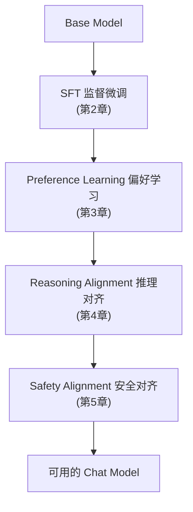
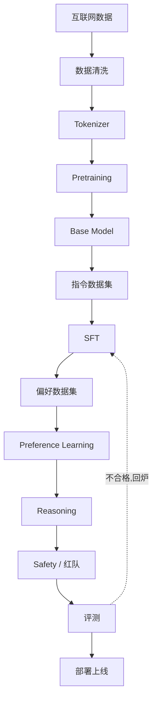

# 1. Alignment——从 Base Model 到对话助手

> **本章目标**
>
> - 理解 Base Model 为什么无法直接成为 AI 助手——"能力"与"对齐"是两件不同的事
> - 理解 Alignment（模型对齐）的精确定义，以及业界公认的 HHH 对齐目标框架
> - 了解 Alignment 的起源：InstructGPT 论文如何用"SFT → 奖励模型 → PPO"三步把 GPT-3 变成听话的助手
> - 建立现代 Alignment 体系的完整地图：SFT、RLHF/DPO、Reasoning、Safety 各自的定位
> - 理解"Alignment 不等于 RLHF"，以及为什么 ChatGPT 的诞生是工程与数据的胜利，而不只是算法的胜利

---

## 一、一个奇怪的问题：GPT-3 为什么不会"回答"？

假设我们已经拥有了一个训练完成的 GPT——它读完了整个互联网，拥有极其丰富的知识。现在我们问它：

```text
帮我写一封请假邮件。
```

模型却回答：

```text
邮件（Email）是一种电子通信方式，起源于……它由以下几个部分组成……
```

它明明知道"什么是邮件"，却没有完成"你的任务"。这不是它笨，而是它的**训练目标**决定了它的行为：预训练阶段它只学过一件事——**预测下一个 Token**。给它一段话，它唯一的"本能"就是继续往后写。它分不清你是在提问、在聊天、在写代码，还是在布置任务——对它来说，这些都是"需要续写的文本"。

> **Base Model 是一个"语言补全器"（Language Completer），不是 AI 助手。** 它知道世界的知识，但不知道"如何帮助一个人"。

这背后是预训练范式的根本局限：**互联网文本里的绝大多数内容都是"陈述"而不是"指令-回答"**。模型从海量文本里学到了"苹果公司总部位于______"该填"美国"，却几乎没见过"请帮我查一下苹果公司总部在哪"这种请求应该如何回应。知识有了，行为没有。

## 二、Alignment 是什么：改变行为，而不是增加知识

**Alignment（对齐）**在机器学习语境下有一个相对精确的含义：

> **让模型的优化目标与人类意图保持一致——模型追求的，正是人类真正想要的。**

注意这句话的关键词是**目标**。预训练阶段模型的"目标"是降低 Next Token Prediction 的 Loss；而人类使用模型时的"目标"是"得到有用的回答"。这两个目标并不一致：一个知识渊博的模型，可能因为追求"预测准确"而输出一段教科书式的定义，而不是你想要的请假邮件。

一个生活中的类比：一位医学博士知识丰富，但每次回答问题都像论文答辩——你问"感冒怎么办？"，他回答"人体免疫系统的工作原理是……"，知识完全正确，却没有真正帮到你。后来他学会了根据提问者的需求调整回答方式：先给建议，再解释原理。**知识没有变化，变化的是行为**——Alignment 训练的，正是这种行为上的转变。

**一个贯穿全书的重要区分**：

| | Capability（能力） | Alignment（对齐） |
|---|---|---|
| 回答的问题 | 模型"能不能做到"（知识、推理、代码） | 模型"愿不愿意、会不会按人的方式做" |
| 来自哪个阶段 | 主要来自 Pretraining | 主要来自 Pretraining 之后的微调 |
| 衡量标准 | MMLU、GSM8K 等能力基准 | 指令跟随、有帮助性、安全性 |
| 类比 | 一个人的学识 | 一个人的职业素养与品行 |

一个模型可以能力很强却完全不可用（GPT-3 的原始状态）；也可以对齐得很好但能力不足（小模型的"礼貌的空话"）。**ChatGPT 的成功，是在两者之间找到了平衡。**

## 三、为什么"预训练 + 提示词"不够？——InstructGPT 的动机

你可能会想：既然 GPT-3 会续写，那我们用提示词引导它不就行了？这正是 2022 年之前的主流做法——**Prompt Engineering**。但 OpenAI 在 InstructGPT 论文（*Training language models to follow instructions with human feedback*，2022）里指出了它的三个根本问题：

1. **提示词是"专家技能"**：要让 GPT-3 好好回答，需要精心构造 few-shot 示例、调整措辞、甚至反复试错。普通用户不会、也不该为使用一个助手学习提示工程；
2. **模型"顺从但不服从"**：GPT-3 即使被明确要求"回答问题"，也经常回到"续写"的本能——它模仿了指令跟随的**形式**，却没有真正把"服从指令"当成目标；
3. **行为无法被可靠保证**：你可以通过提示词让模型"看起来"变好了，但这种改善是临时的、脆弱的——换个说法就失效。真正可靠的方式，是把期望的行为**训练进参数里**。

InstructGPT 的结论是：**与其靠提示词"哄"模型，不如直接训练它**。论文里一个著名的结果：标注人员对 1.3B 参数的 InstructGPT 的回答偏好，显著高于 175B 参数的原始 GPT-3（模型小 100 倍以上，却更"好用"）——**能力没有增加，但对齐让能力变得可用**。这也是"对齐"这个词第一次在 LLM 语境下变得举足轻重。

## 四、InstructGPT：Alignment 流水线的原点

InstructGPT 提出的方法叫 **RLHF（Reinforcement Learning from Human Feedback，基于人类反馈的强化学习）**，它把"让模型听话"拆成了三步：

```mermaid
flowchart LR
    A["① 监督微调 SFT<br/>人类写 13k 条指令-回答示范"] --> B["② 训练奖励模型 RM<br/>33k 组"哪个回答更好"的对比"] --> C["③ PPO 强化学习<br/>31k 条指令,让模型学会讨好 RM"]
```

**第一步：SFT（Supervised Fine-Tuning）。** 雇一批标注员，针对真实用户请求写出高质量回答，得到约 **13,000 条**"指令 → 回答"示范，用它们微调 GPT-3，让模型先学会"模仿好的回答方式"。

**第二步：训练奖励模型（Reward Model, RM）。** 让 SFT 模型对同一条指令生成多个回答，标注员排序"哪个更好"，得到约 **33,000 组对比数据**。用这些数据训练一个专门的打分模型——它不生成文本，只负责给"指令 + 回答"打一个分，分数越高代表越符合人类偏好。

**第三步：PPO 强化学习。** 固定奖励模型，让 SFT 模型对 31,000 条指令生成回答，奖励模型打分，再用 PPO（近端策略优化）算法沿着"高分方向"更新模型参数。为了防止模型"刷分"（钻奖励模型的空子），还要加一个 KL 惩罚项约束它不要偏离 SFT 模型太远。

这三步的细节分别对应本书第 2、3 章，这里先建立整体认知。**2022 年 11 月，OpenAI 把这套流水线应用到 GPT-3.5 上，ChatGPT 诞生了**——它没有改变预训练，只是把"对齐"这件事做到了产品级。

> 💡 **Insight：ChatGPT 最大的创新不是模型架构，而是"第一次把对齐做成产品"。** Transformer 是 2017 年的，GPT-3 是 2020 年的，ChatGPT 的真正增量，是 RLHF 流水线 + 大规模人类反馈数据 + 产品化工程。理解这一点，就理解了 2022 年之后整个行业"卷"的方向为什么从"更大的模型"转向了"更好的对齐"。

## 五、对齐的目标：HHH 框架

对齐到底要让模型"变成什么样"？Anthropic（Claude 的创造者）在 2022 年的 RLHF 论文里提出了一个被业界广泛采用的框架——**HHH**：

| 维度 | 含义 | 反例 |
|---|---|---|
| **Helpful（有帮助）** | 真正完成用户的任务，而不是回避或敷衍 | 问"怎么写请假邮件"，它给你讲邮件历史 |
| **Harmless（无害）** | 不输出有害、违法、危险内容，拒绝危险请求 | 问"如何制作炸弹"，它真的告诉你 |
| **Honest（诚实）** | 不编造事实，承认不确定，不误导用户 | 不知道答案时一本正经地胡编 |

三个维度常常互相冲突：太 Helpful 可能伤害 Harmless（有问必答包括危险问题），太强调 Harmless 会变成"什么都拒绝"（过度防御），而 Honest 要求承认不知道——这与"帮用户完成任务"的直觉相悖。**对齐的本质工作之一，就是在这些冲突的目标之间做权衡。** 后续章节会看到：SFT 主要解决 Helpful，Preference Learning 细化 Helpful 的"偏好"，Safety Alignment 主要解决 Harmless，Reasoning Alignment 提升 Honest 背后的"真会"。

## 六、现代 Alignment 体系：一条不断进化的流水线

InstructGPT 的三步框架奠定了基调，但 2022 年之后，每一步都被大幅演进。今天所说的"Alignment"是一个完整的家族：



- **SFT**：用"指令-回答"示范教模型模仿好的行为——解决"会执行指令"；
- **Preference Learning**：用"哪个回答更好"的偏好教模型学会取舍——解决"回答符合人的偏好"。方法从 RLHF/PPO 演进到更简单高效的 **DPO**（第3章会推导为什么 DPO 能免去奖励模型），再到 Reasoning 场景大量采用的 **GRPO**；
- **Reasoning Alignment**：让模型学会"一步步想清楚再回答"——解决"真正会推理"。代表性工作包括 OpenAI o1、DeepSeek-R1（第4章展开）；
- **Safety Alignment**：让模型在"能"与"不能"之间划出边界——解决"强大而不被滥用"（第5章展开）。

这些阶段不是严格的先后顺序，工业界常常交错进行（例如 DeepSeek-R1 在 RL 之后又做了一轮 SFT 冷启动），但它们共同回答了同一个问题：**如何让一个"只会预测下一个词"的机器，变成一个"知道该做什么、怎么做、什么不该做"的助手。**

## 七、Alignment 不等于 RLHF

一个常见误区是"Alignment = RLHF"。RLHF 只是偏好学习的一种方法（而且正在被 DPO 等更简单的方法挑战）。完整的 Alignment 方法谱系包括：

| 方法 | 核心思想 | 所属阶段 |
|---|---|---|
| SFT | 直接模仿示范 | 基础 |
| RLHF（PPO） | 奖励模型打分 + 强化学习 | 偏好学习 |
| DPO / ORPO / SimPO | 用模型自身概率构造偏好损失，免去奖励模型 | 偏好学习 |
| GRPO | 组内相对奖励，免去 Value Model | 偏好学习 / 推理 |
| RLAIF / Constitutional AI | 用 AI 反馈或"宪法"原则替代人工标注 | 偏好学习 / 安全 |
| Process Supervision | 监督推理过程的每一步 | 推理 |
| Safety Training | 红队、护栏、安全分类器 | 安全 |

**方法在变，目标不变**——所有方法都在逼近同一个目标：让模型的优化目标与人类意图对齐。

## 八、工程视角：一个 ChatGPT 是怎么诞生的？

把视角从算法拉回工程，工业界的完整流水线大致是：



值得注意的两点：

1. **成本的大头在预训练，体验的大头在对齐**：训练一个 70B 模型的预训练要消耗数百万美元级别的算力；而对齐阶段的数据标注（人类反馈）同样是一笔巨大的、持续的开支——ChatGPT 能"好用"，靠的是一支庞大的标注团队和持续的数据飞轮；
2. **对齐不是一次性动作，而是持续迭代**：上线后的用户反馈会不断变成新的 SFT/偏好数据，形成"部署 → 收集反馈 → 再对齐 → 再部署"的循环。这也是为什么现代对齐强调**数据飞轮**。

---

想亲眼看看 Alignment 到底改变了什么，而不只是听概念，可以看这一节实验：**1.1 Base Model 与 Aligned Model 的输出行为对比**。

## 本章总结

本章我们理解了：

✅ Base Model 是"语言补全器"而不是助手——它有知识，但没有"帮助人"的行为 ✅ Alignment 改变的是模型的**目标与行为**，而不是知识；Capability 与 Alignment 是两件不同的事 ✅ 提示词无法可靠地让模型服从指令，InstructGPT 用"SFT → 奖励模型 → PPO"三步把"听话"训练进了参数 ✅ 对齐的目标是 HHH：Helpful / Harmless / Honest，三者之间需要权衡 ✅ 现代 Alignment 是一个家族：SFT、Preference Learning、Reasoning、Safety，RLHF 只是其中一种方法 ✅ ChatGPT 的诞生是"对齐做到产品级"的胜利，而不仅仅是更大的模型

> **能力决定模型"能不能做到"，对齐决定模型"会不会按人的方式做到"。ChatGPT 之前，我们只有前者。**

## 下一章预告

Alignment 流水线的第一步是让模型学会"执行指令"——这正是 SFT 要做的事。下一章，我们将深入监督微调：它的数据从哪来、Chat Template 和 Loss Mask 如何工作、为什么"几十万条高质量数据"和"几万条垃圾数据"的差别比想象中大得多。

> **第2章 SFT——模型如何学会理解人类指令？**

---

# 参考资料

- OpenAI《Training language models to follow instructions with human feedback》(InstructGPT，RLHF 流水线原点)：https://arxiv.org/abs/2203.02155
- Anthropic《Training a Helpful and Harmless Assistant with Reinforcement Learning from Human Feedback》(HHH 框架)：https://arxiv.org/abs/2204.05862
- Andrej Karpathy《State of GPT》演讲（预训练 → SFT → RLHF → 推理全链路）：https://www.youtube.com/watch?v=bZQun8Y4L2A
- 李宏毅《ChatGPT 原理》讲座（中文世界讲 RLHF 最清楚的入门课）：https://www.bilibili.com/video/BV1Ns4y1p7hW
- HuggingFace《Alignment Handbook》（对齐全流程的动手代码）：https://github.com/huggingface/alignment-handbook
