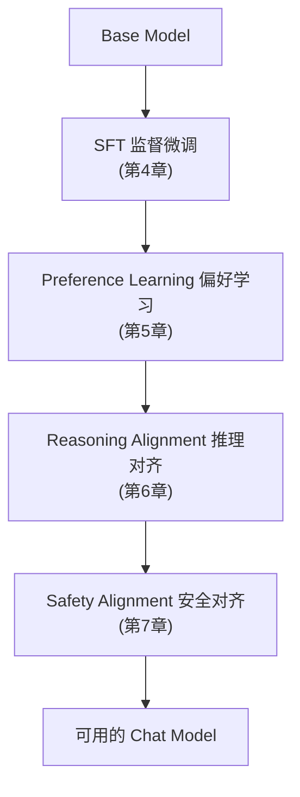
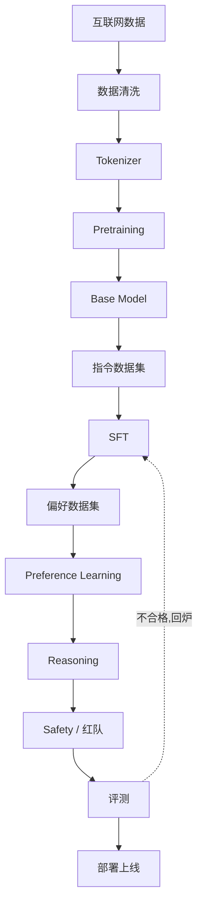

# 1. 模型对齐（Alignment）——从基础模型（Base Model）到对话助手

第一部分我们从零实现并训练出了一个小型 Base Model——它学的是文本续写，还没有被专门训练成稳定遵循指令的助手。第二部分从这里出发：如何让这样一个"语言补全器"变成真正可用的 AI 助手？

**实验基座会在这里切换**：第一部分的 nanoGPT 用来理解模型结构与预训练闭环；本部分从实验 1.1 起使用公开的 Qwen2.5 Base / Instruct 权重，后续微调也以章节指定的公开基座为起点，**不是继续训练你此前得到的 nanoGPT checkpoint**。两者沿用相同的自回归建模思路，但模型实现、词表、权重与对话格式不能直接互换。

> **本章目标**
>
> - 理解为什么 Base Model 的任务能力不等于稳定的助手行为
> - 理解本书使用的 Alignment（模型对齐）概念与常见的 HHH 目标框架
> - 了解 InstructGPT 这一代表性工作：SFT → 奖励模型 → PPO 如何改善指令跟随
> - 建立现代 Alignment 的入门地图：SFT、RLHF/DPO、Reasoning、Safety 各自的定位
> - 理解"Alignment 不等于 RLHF"，以及为什么 ChatGPT 的诞生是工程与数据的胜利，而不只是算法的胜利

---

## 一、一个奇怪的问题：GPT-3 为什么不总在"回答"？

假设我们拥有一个在大规模文本上训练过的 GPT。现在给它输入：

```text
帮我写一封请假邮件。
```

它可能给出下面这样的续写（行为示意，不是固定实测输出）：

```text
邮件（Email）是一种电子通信方式，起源于……它由以下几个部分组成……
```

它没有完成任务，但这不等于它完全看不懂请求。**预训练优化的是预测下一个 Token，而不是在各种用户场景中稳定给出合适的回答。** 预训练语料也包含问答、对话和指令示例，因此 Base Model 可以通过零样本或少样本提示完成任务，只是指令跟随、角色保持和停止生成的行为未必稳定。

> **Base Model 的默认接口是文本续写，不等于“绝不能听指令”。** 后训练的目标之一，是让已有能力更稳定地表现为助手行为。

关键区别不在于“有没有见过问答”，而在于训练数据分布与优化目标：续写训练同时学习各种文本模式，助手训练则有针对性地提高期望回答模式的概率。

## 二、Alignment 是什么：以目标与行为为重点

本书用 **Alignment（对齐）**指让模型行为更符合人类意图、偏好与安全约束的训练和评估工作：

> **让实际优化的训练信号更好地服务于人类期望，而不是把代理指标的提高直接等同于对齐成功。**

预训练降低 Next Token Prediction 的 Loss；用户则希望得到有用、诚实且安全的回答。这两个目标有交集，却不等价。SFT 仍可采用 Token 交叉熵，区别在于示范数据、条件输入和参与计算损失的 Token；偏好学习则进一步引入比较或奖励信号。

一个类比：一位知识丰富的专家学会了按提问者需求组织解释。这个类比突出的是**行为变化**，不是说训练前后知识不变。**SFT、偏好优化和推理训练都会更新参数，可能学到新事实与技能，也可能损伤旧能力；“对齐”与“能力”是分析维度，不是互不影响的两个盒子。**

**一个贯穿全书的重要区分**：

| | Capability（能力） | Alignment（对齐） |
|---|---|---|
| 回答的问题 | 模型"能不能做到"（知识、推理、代码） | 模型"愿不愿意、会不会按人的方式做" |
| 来自哪个阶段 | 主要来自 Pretraining | 主要来自 Pretraining 之后的微调 |
| 衡量标准 | MMLU、GSM8K 等能力基准 | 指令跟随、有帮助性、安全性 |
| 类比 | 一个人的学识 | 一个人的职业素养与品行 |

一个模型可以在部分任务上能力很强，却不是稳定好用的通用助手；一个小模型也可能礼貌流畅，却缺乏解决复杂问题的能力。因此要分别评估能力与行为，不能只看回答是否“像助手”。

## 三、为什么不只靠"预训练 + 提示词"？——InstructGPT 的动机

提示工程能发挥 Base Model 的能力，少样本示范尤其有效。但它有成本和局限。结合 InstructGPT（*Training language models to follow instructions with human feedback*，2022）的动机，可以从三个角度理解：

1. **提示有使用成本**：构造 few-shot 示例、调整措辞和反复试错会增加用户负担与上下文开销；
2. **行为对输入格式敏感**：同一任务换一种说法，模型可能转为续写背景材料，或者不能保持预期角色；
3. **训练与提示互补**：后训练可以把常见期望行为沉淀进参数，提高稳定性，但也不能保证所有输入上都正确、安全；提示、评测和系统约束仍然需要。

论文的一个著名结果是：在其用户提示分布与人工偏好评估设置下，标注员更偏好 1.3B InstructGPT 的回答，而不是 175B GPT-3 的回答。这说明**规模和助手体验不是一回事**，并不证明小模型在所有知识或推理任务上都更强，也不能据此推断后训练没有改变能力。

## 四、InstructGPT：Alignment 流水线的原点

InstructGPT 提出的方法叫 **RLHF（Reinforcement Learning from Human Feedback，基于人类反馈的强化学习）**，它把"让模型听话"拆成了三步：


**第一步：SFT（Supervised Fine-Tuning）。** 标注员针对请求写高质量回答，论文中 SFT 训练集包含约 **13,000 条提示**。用示范微调 GPT-3，让模型更稳定地模仿期望的回答方式。

**第二步：训练奖励模型（Reward Model, RM）。** 对同一提示生成多个回答，由标注员排序。RM 训练集约有 **33,000 条提示**；每条提示可产生多对比较，不能把提示数直接当成回答对数。训练出的模型给“指令 + 回答”评分，分数是人类偏好的代理信号，并非绝对质量。

**第三步：PPO 强化学习。** 使用约 **31,000 条训练提示**采样回答，由固定的奖励模型打分，再用 PPO 更新生成模型。KL 惩罚约束模型不要偏离参考 SFT 策略太远，缓解过度优化奖励等问题，但不能彻底杜绝“刷分”。这些数字是论文数据规模，不是通用训练配方。

SFT 细节见**第4章及实验 4.1、4.2**；奖励模型与 PPO 见**第5章及实验 5.1**。2022 年 11 月发布的 ChatGPT 使用了与 InstructGPT 相关的 RLHF 思路，并面向对话场景调整训练数据与流程；不应将两个系统理解成完全相同的流水线。

> **工程启示**：ChatGPT 的助手体验不只来自模型架构，还依赖后训练、反馈数据与产品工程。预训练能力与后训练质量都仍然重要，并不是“模型规模”从此被“对齐”取代。

## 五、对齐的目标：HHH 框架

对齐到底要让模型"变成什么样"？Anthropic（Claude 的创造者）在 2022 年的 RLHF 论文里提出了一个被业界广泛采用的框架——**HHH**：

| 维度 | 含义 | 反例 |
|---|---|---|
| **Helpful（有帮助）** | 真正完成用户的任务，而不是回避或敷衍 | 问"怎么写请假邮件"，它给你讲邮件历史 |
| **Harmless（无害）** | 不输出有害、违法、危险内容，拒绝危险请求 | 问"如何制作炸弹"，它真的告诉你 |
| **Honest（诚实）** | 不编造事实，承认不确定，不误导用户 | 不知道答案时一本正经地胡编 |

三个维度常常互相冲突：太 Helpful 可能伤害 Harmless（有问必答包括危险问题），太强调 Harmless 会变成"什么都拒绝"（过度防御），而 Honest 要求承认不知道——这与"帮用户完成任务"的直觉相悖。**对齐的本质工作之一，就是在这些冲突的目标之间做权衡。** 后续章节会看到：SFT 主要解决 Helpful，Preference Learning 细化 Helpful 的"偏好"，Safety Alignment 主要解决 Harmless，Reasoning Alignment 提升 Honest 背后的"真会"。

## 六、现代 Alignment 体系：一条不断进化的流水线

InstructGPT 的三步框架奠定了基调，但 2022 年之后，每一步都被大幅演进。今天所说的"Alignment"是一个完整的家族：



- **SFT**：用"指令-回答"示范教模型模仿好的行为——解决"会执行指令"；
- **Preference Learning**：用"哪个回答更好"的偏好教模型学会取舍——解决"回答符合人的偏好"。方法从 RLHF/PPO 演进到更简单高效的 **DPO**（第5章会推导为什么 DPO 能免去奖励模型），再到 Reasoning 场景大量采用的 **GRPO**；
- **Reasoning Alignment**：让模型学会"一步步想清楚再回答"——解决"真正会推理"。代表性工作包括 OpenAI o1、DeepSeek-R1（第6章展开）；
- **Safety Alignment**：让模型在"能"与"不能"之间划出边界——解决"强大而不被滥用"（第7章展开）。

这些阶段不是固定的单向顺序。以 DeepSeek-R1 为例：**冷启动 SFT → 推理 RL → 拒绝采样并构建 SFT 数据 → 再一轮 SFT → 后续 RL**。RL 后的 SFT 是用筛选后的生成数据再训练，不能称为“冷启动”。上图只是章节地图；各阶段都可能同时影响能力、偏好和安全，GRPO 也不表示 DPO 的必然下一代。

## 七、Alignment 不等于 RLHF

一个常见误区是"Alignment = RLHF"。RLHF 只是偏好学习的一种方法（而且正在被 DPO 等更简单的方法挑战）。完整的 Alignment 方法谱系包括：

| 方法 | 核心思想 | 所属阶段 |
|---|---|---|
| SFT | 直接模仿示范 | 基础 |
| RLHF（PPO） | 奖励模型打分 + 强化学习 | 偏好学习 |
| DPO / ORPO / SimPO | 用模型自身概率构造偏好损失，免去奖励模型 | 偏好学习 |
| GRPO | 组内相对奖励，免去 Value Model | 偏好学习 / 推理 |
| RLAIF / Constitutional AI | 用 AI 反馈或"宪法"原则替代人工标注 | 偏好学习 / 安全 |
| Process Supervision | 监督推理过程的每一步 | 推理 |
| Safety Training | 红队、护栏、安全分类器 | 安全 |

**方法在变，目标不变**——所有方法都在逼近同一个目标：让模型的优化目标与人类意图对齐。

## 八、工程视角：一个 ChatGPT 是怎么诞生的？

把视角从算法拉回工程，工业界的完整流水线大致是：



值得注意的两点：

1. **成本的大头在预训练，体验的大头在对齐**：训练一个 70B 模型的预训练要消耗数百万美元级别的算力；而对齐阶段的数据标注（人类反馈）同样是一笔巨大的、持续的开支——ChatGPT 能"好用"，靠的是一支庞大的标注团队和持续的数据飞轮；
2. **对齐不是一次性动作，而是持续迭代**：上线后的用户反馈会不断变成新的 SFT/偏好数据，形成"部署 → 收集反馈 → 再对齐 → 再部署"的循环。这也是为什么现代对齐强调**数据飞轮**。

---

想亲眼看看 Alignment 到底改变了什么，而不只是听概念，可以看这一节实验：**1.1 Base Model 与 Aligned Model 的输出行为对比**。

## 本章总结

本章我们理解了：

- Base Model 以续写为训练任务，也可能执行指令，但未必具有稳定的助手行为。
- Alignment 侧重目标与行为；后训练也可能增加或损伤知识、技能，需要独立评测。
- InstructGPT 的典型流程是 SFT → 奖励模型 → PPO；提示与训练互补，二者都不保证行为绝对可靠。
- HHH 强调有帮助、无害、诚实；SFT、偏好学习、推理与安全训练会共同影响这些维度，RLHF 不等于全部对齐工作。

> **能力与对齐要分别看，也要检查它们如何相互影响。**

## 下一章预告

进入具体微调之前，先回答一个数据问题：预训练和 SFT 都可用 Token 交叉熵，为什么一个从原始文本构造目标，另一个需要期望回答？**第2章**从监督信号的来源讲清三种学习范式；**第3章**再讲数据工程；随后在**第4章及实验 4.1、4.2**展开 SFT、Chat Template 和 Loss Mask。

> **第2章 三种学习范式——监督、无监督与自监督**

---

# 参考资料

- OpenAI《Training language models to follow instructions with human feedback》(InstructGPT，RLHF 流水线原点)：https://arxiv.org/abs/2203.02155
- Anthropic《Training a Helpful and Harmless Assistant with Reinforcement Learning from Human Feedback》(HHH 框架)：https://arxiv.org/abs/2204.05862
- Andrej Karpathy《State of GPT》演讲（预训练 → SFT → RLHF → 推理全链路）：https://www.youtube.com/watch?v=bZQun8Y4L2A
- 李宏毅《ChatGPT 原理》讲座（中文世界讲 RLHF 最清楚的入门课）：https://www.bilibili.com/video/BV1Ns4y1p7hW
- HuggingFace《Alignment Handbook》（对齐全流程的动手代码）：https://github.com/huggingface/alignment-handbook

---

## 思考题

1. 用自己的话解释：Base Model 与 Aligned Model 的本质区别是什么？只看输出行为，你会用哪三个特征区分它们？
2. 在预训练数据里加入高质量对话可能改善哪些行为？为什么仍不能据此保证模型满足助手的指令跟随、诚实与安全要求？
3. 一个只做过 SFT、没做过偏好学习的模型，用户最可能抱怨它什么？为什么？
