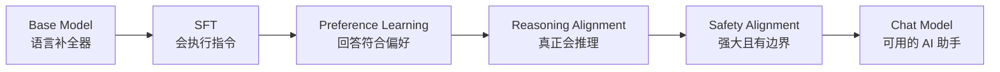
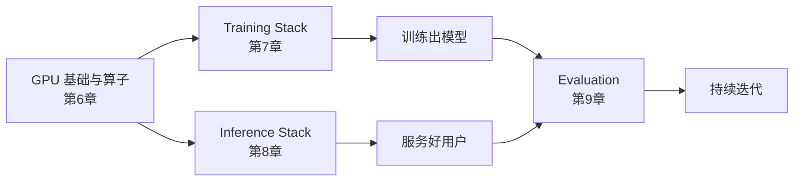

# 第10章 第二部分总结——从 Base Model 到现代 AI 助手

第一部分我们理解了大语言模型**为什么能够理解语言**；第二部分回答了另一个问题：**一个只会预测 Token 的 Base Model，是如何变成 ChatGPT 这样真正可用的产品的？**

答案可以浓缩成一句话：**先让它"知道"，再让它"会说话"，然后让它"说得好"，让它"想清楚"，最后让它"有边界"。**

## 一、从 Base Model 到 Chat Model：对齐的四步

| 阶段 | 解决什么问题 | 核心手段 | 一句话本质 |
|---|---|---|---|
| **SFT（第2章）** | 模型只会续写，不会执行指令 | 指令-回答示范 + Chat Template + Loss Mask | 用监督学习教模型"模仿好的回答方式" |
| **Preference Learning（第3章）** | "正确"不等于"人类更喜欢" | RM + PPO（RLHF）、DPO、GRPO | 让"哪个更好"进入优化目标 |
| **Reasoning Alignment（第4章）** | 模型会"装"会推理，不会真推理 | 可验证奖励 + RL（GRPO）、R1 四阶段 | 让"想对了"直接变成奖励 |
| **Safety Alignment（第5章）** | 能力越强，被滥用的风险越大 | 多层防护 + 安全分类器 + Constitutional AI | 给能力装上方向盘 |

**这四步的共同本质**：它们都没有改变模型的"知识"（那是预训练的事），改变的都是模型的**目标与行为**——这正是第1章反复强调的：**Capability（能力）与 Alignment（对齐）是两件不同的事。**

## 二、方法演进：不变的问题，越来越简单的解法

第二部分还藏着一条暗线——**同一个问题，解法在持续变简单**：

| 问题 | 早期解法 | 今天的解法 |
|---|---|---|
| 如何让模型符合偏好 | RLHF + PPO（RM + 强化学习 + KL） | DPO（一个损失函数搞定） |
| 如何在推理时不用 Value Model | PPO（需要额外训价值模型） | GRPO（组内相对奖励） |
| 如何做安全标注 | 大规模人工安全标注 | Constitutional AI（模型自我批评 + RLAIF） |
| 如何造 SFT 数据 | 人工撰写（InstructGPT 13k 条） | 合成数据 + 蒸馏（Alpaca 52k → LIMA 1k 精选） |

**趋势**：从"复杂的强化学习系统"到"一个简单的损失函数"，从"依赖人类"到"模型自举"。但目标从未改变——**让模型的优化目标与人类意图对齐**。理解了"问题不变、解法变简单"这条主线，再看到 2026 年的新方法时，你就知道该往哪个方向理解它。

## 三、支撑这一切的工程体系

对齐决定了模型"应该表现成什么样子"，但真正让这一切在工业级规模上跑起来，离不开另一套工程体系——而它又建立在对 GPU 硬件本身的理解之上：

- **GPU 基础与算子**（SM / 显存层级 / 算子融合 / FlashAttention）解释了"为什么显存是瓶颈""为什么 FlashAttention 更快"——一切工程方案的地基；
- **Training Stack**（Data/Tensor/Pipeline 并行 + ZeRO + 混合精度）解决了"如何把 700GB 的显存需求拆到成百上千张 GPU 上"；
- **Inference Stack**（Continuous Batching + PagedAttention + 量化）解决了"如何用有限显存同时服务成千上万用户"；
- **Evaluation**（Benchmark + Judge + Arena + 人工）解决了"如何知道模型到底好不好"——为下一轮迭代提供燃料。

**一个贯穿两章的工程认知**：训练系统、推理系统、评测系统，本质上都在和"显存 + 算力 + 通信 + 数据"四个物理资源打交道。第6章的 Roofline 模型、第7章的显存账本、第8章的 KV Cache 账本，都是同一套"资源思维"在不同场景下的应用。

## 四、第二部分知识地图

| 章节 | 核心问题 | 关键概念 |
|---|---|---|
| 1 Alignment | 为什么 GPT 需要变成 ChatGPT | Capability vs Alignment、HHH、InstructGPT 三步 |
| 2 SFT | 模型如何学会执行指令 | Chat Template、Loss Mask、LoRA/QLoRA、数据质量 |
| 3 Preference Learning | 模型如何学会人类偏好 | RM、RLHF/PPO、DPO 推导、GRPO |
| 4 Reasoning Alignment | 模型如何学会真正推理 | 可验证奖励、R1 四阶段、test-time compute |
| 5 Safety Alignment | 如何让模型既强大又安全 | Jailbreak、提示注入、多层防护、Constitutional AI |
| 6 GPU 基础与算子 | GPU 与显存为何决定一切 | SM/Tensor Core、HBM/SRAM、Roofline、算子融合 |
| 7 Training Stack | 如何训练超大模型 | 3D 并行、ZeRO、显存账本 |
| 8 Inference Stack | 如何高效服务大量用户 | Prefill/Decode、Continuous Batching、PagedAttention |
| 9 Evaluation | 如何科学评价模型 | Benchmark、Judge 偏差、多层评测体系 |

## 五、一个重要的认知转变

第二部分结束时，值得停下来重新审视一个观念：

> **能力（Capability）与对齐（Alignment）是两件不同的事——模型可以能力很强却完全不可用（原始 GPT-3），也可以对齐很好但能力不足（小模型的"礼貌空话"）。ChatGPT 的成就在于两者兼备。**

同时要警惕另一个极端：**对齐不能凌驾于能力之上**。过度安全限制（Over-refusal）会损害可用性，过度"讨好"偏好会牺牲诚实——第5章讲过，对齐的本质是在 Helpful / Harmless / Honest 之间找平衡，而不是把模型"训成听话的复读机"。**能力是地基，对齐是建筑——地基不牢，建筑再漂亮也会塌；只打地基不盖楼，则毫无用处。**

至此，我们已经拥有了一个真正可用、也足够安全的 Chat Model。但这个模型目前仍然只能"被动回答问题"——用户问一句，它答一句，它不会主动打开浏览器、不会调用工具、不会规划多步任务。第三部分，我们将进入 **Agent（Use）**——大模型之后的下一次范式升级：

> **从会回答问题，到会完成任务。**

---

# 参考资料

- Andrej Karpathy《State of GPT》(第二部分全链路的总纲性演讲)：https://www.youtube.com/watch?v=bZQun8Y4L2A
- HuggingFace《Alignment Handbook》(对齐全流程代码，与第2、3章对应)：https://github.com/huggingface/alignment-handbook
- OpenAI《InstructGPT》(Alignment 流水线原点)：https://arxiv.org/abs/2203.02155
- DeepSeek《DeepSeek-R1》(推理对齐新范式)：https://arxiv.org/abs/2501.12948
- Chip Huyen《AI Engineering》(训练/推理/评测工程全景)：https://github.com/chiphuyen/ai-engineer-book
