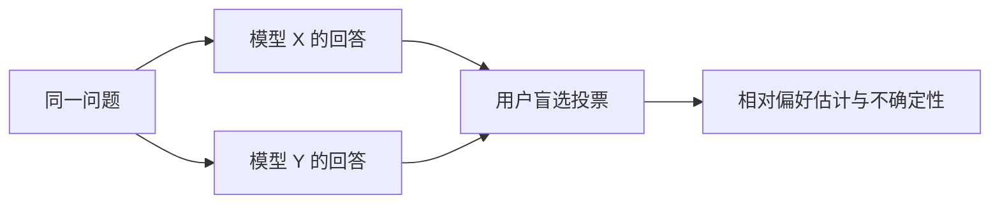

# 11. 大语言模型评测（LLM Evaluation）——如何科学评价一个大语言模型

> **本章目标**
>
> - 理解为什么大模型评价比传统机器学习模型困难得多：自由文本没有唯一答案
> - 区分评测指标、任务与协议、反馈来源：Perplexity、Benchmark、Arena、LLM-as-a-Judge 与人工评审并非互斥的层级
> - 理解 Benchmark 的价值与三大局限：数据污染、基准饱和、覆盖面不足
> - 理解 LLM-as-a-Judge 的常见偏差（位置偏差、长度偏差、自我偏好）与缓解手段
> - 理解"评测体系必须多层组合"的原因，以及评测工具链（lm-evaluation-harness、OpenCompass、HELM）
> - 理解评测与对齐、推理、安全的关系：没有评测，就没有迭代

---

## 一、一个没有唯一答案的评价难题

传统机器学习模型的评价很直接：分类模型看准确率，回归模型看误差。但大语言模型的输出是**自由文本**——同一个问题可以有无数种"都合理"的回答，"哪个回答更好"本身就是主观判断。更难的是，模型能力的维度太多：知识、推理、代码、写作、指令跟随、安全性、对话流畅度……一个分数根本说不完。

这正是 LLM Evaluation 的核心难题：**既需要客观、可复现的指标，又要能反映真实的主观体验；既要衡量"知识多少"，又要衡量"行为好坏"。** 因此，现代评测需要组合多种证据，而不是只看一个分数。

先区分三个问题：**测什么**（任务、样本与能力维度）、**怎么测**（提示、采样、工具预算与评分协议）、**由谁判**（规则、可执行测试、模型或人）。Benchmark 是标准化的任务与评测协议，可以用规则、Judge 或人工打分；Arena 是一种盲测偏好收集方式，也属于人工反馈。它们可以交叉组合，并不是由低到高、互相替代的层级。

## 二、Perplexity——语言建模的内在指标

在讨论任务级评测之前，还有一个历史更悠久的指标：**Perplexity（困惑度）**，第一部分 6.2 节讲过它的定义——`Perplexity = exp(Cross Entropy Loss)`，直观理解是"模型在每一步预测时，平均感觉有多少个同样可能的候选 Token 在竞争"，数值越低，模型对语言本身的建模越准。

| | 优点 | 局限 |
|---|---|---|
| Perplexity | 无需人工标注、任何文本都能直接算 | 低 Perplexity ≠ 会解题、会写代码、会对话 |

Perplexity 常用于**预训练监控与留出语料上的语言建模评价**，但低 PPL 不保证解题、对话或安全表现。比较时必须固定语料、文本预处理、上下文窗口、截断和 loss mask 等协议；**不同 tokenizer 的每 Token PPL 不能直接横比**，因为 Token 切分改变了分母与预测事件。若要跨 tokenizer 比较，可在相同文本上考虑按字节归一化的 bits-per-byte，并仍需说明编码与计算协议。

## 三、Benchmark——标准化的任务与评测协议

Benchmark 不只是“有标准答案的题库”，而是**任务/样本 + 输入与生成协议 + 评分方法 + 汇总规则**。选择题可用 exact match，代码题可执行测试，开放问答也可使用 rubric、人工或 LLM Judge。只有题目版本、split、Prompt/Chat Template、few-shot 示例、采样与输出预算、答案提取和评分规则一致时，分数才具有相应可比性。代表性基准：

| Benchmark | 测试内容 | 适合衡量 |
|---|---|---|
| MMLU | 覆盖 57 个学科的多项选择题（约 1.4 万题） | 综合知识广度 |
| GSM8K | 小学数学应用题（约 8.5k 题） | 基础数学推理 |
| HumanEval | 编程题（164 题，用单元测试判分） | 代码生成 |
| BBH（Big-Bench Hard） | 23 个高难度推理任务 | 复杂推理 |
| MT-Bench | 多轮对话质量（GPT-4 打分） | 对话能力 |
| MMMU | 大学级多学科图文题 | 多模态理解（第一部分第14章） |

**Benchmark 的价值**是把比较条件显式化、支持重复测量；采用规则或执行测试时通常易于自动化，但使用人工评审的基准仍需要标注成本。第11.1节会用 `lm-evaluation-harness` 跑 GSM8K 的小子集，先检查数据、生成与判分链路。

**但 Benchmark 有三大局限**：

1. **数据污染（Data Contamination）**：题目或近似解答进入训练数据后，分数可能包含记忆效应。文本去重、语义近重复检测、时间切分和新题集可缓解，但“未检测到重复”并不证明没有污染；
2. **基准饱和（Saturation）**：某个题集上正确率接近上限时，剩余题目太少，区分能力下降；应增加更有区分度的任务，而不是把微小分差直接当作实质进步；
3. **覆盖面不足**：固定样本与 rubric 只能覆盖目标场景的一部分。写作、建议和拒绝行为也能设计基准，但其主观标准、文化背景与长尾情况更难完整覆盖。

此外还要报告**有限样本的不确定性**。例如二元正确率为 0.4、样本量仅 10 时，独立同分布假设下的粗略标准误约为 `sqrt(0.4 × 0.6 / 10) ≈ 0.155`，不是“误差只有几个百分点”。小样本或极端正确率宜用 Wilson/精确区间；比较同一组题上的两个模型宜采用配对 bootstrap 等方法。若取的是题库前 10 题而非代表性抽样，区间也不能修复抽样偏差；重复运行同样 10 题不会得到新的题目覆盖。

## 四、Arena——让人类直接投票

Chatbot Arena 的典型流程是：**两个模型回答同一问题，用户不知道模型身份，投票选出更好的一个**。由成对胜负估计相对偏好分数，可采用 Elo 思路或 Bradley–Terry 等统计模型；分数依赖对手集合、抽样方式与投票人群，不是绝对能力单位。



**优点**是直接收集真实人的偏好，匿名展示可减轻品牌偏见；但回答风格仍可能暴露来源，不能说偏见已被完全消除。**局限**包括用户与题目选择偏差、专业领域覆盖不足、投票质量和成本。Arena 反映参与人群在该协议下的偏好，不能替代面向具体产品场景的用户研究，也不是所有模型发布前都必须经历的步骤。

## 五、LLM-as-a-Judge——一种可嵌入基准的评分方式

近年来最流行的折衷方案是 **LLM-as-a-Judge**：用一个能力足够强的模型充当"裁判"，对两个回答打分或排序。

```mermaid
flowchart LR
    A[待评测模型生成回答] --> B[Judge Model 评审<br/>(给评分标准 + 对比)] --> C[打分 / 选择更优]
```

**优点**：成本远低于人工评审、速度快、可以大规模批量评测（MT-Bench、AlpacaEval 都是这个思路）。**但 Judge 不是完美的裁判，它有著名的系统性偏差**：

| 偏差 | 表现 | 缓解手段 |
|---|---|---|
| 位置偏差 | 更偏爱排在前面的回答 | 交换两个回答的顺序各评一次 |
| 长度偏差 | 更偏爱更长的回答（即使更啰嗦） | 评分标准里明确"简洁加分"，或用长度控制 |
| 自我偏好 | 偏爱与自己同源的模型（GPT-4 评 GPT 系列偏高） | 用第三方模型交叉评审 |
| 权威偏差 | 被"听起来专业"的说法带偏 | 要求 Judge 引用具体证据 |

第11.1节会实现严格解析 verdict、允许平局并交换 A/B 的简化 Judge。少量明显样本只能检查链路和暴露故障，不能验证一般可靠性。正式使用前应固定 Judge 版本、rubric 与提示词，记录解析失败/顺序不一致率，并在目标领域的独立人工标注集上校准。

## 六、Human Evaluation——目标场景中的校准与复核

**人工评审仍是重要证据来源**，尤其适合复核安全边界、真实体验和专业长尾。它也可能受标注者知识、偏好和注意力影响，并非自动正确的“最终真值”；需要清晰 rubric、盲评、多人独立标注与分歧仲裁。

人工标注还用于校准 Judge 和任务指标。可报告成对偏好一致率、Cohen's Kappa 等，但解释要结合标签分布、样本量和标注者间一致性，不能把 `0.7` 当成通用上线阈值。如果表现偏离目标用户标准，应检查任务定义、标注规范、Judge 与提示词，再用独立留出集复核，避免只在校准集上调到高分。

## 七、评测体系的工程化：工具链与多层组合

**主流评测工具链**：

| 工具 | 出品方 | 特点 |
|---|---|---|
| lm-evaluation-harness | EleutherAI | 事实标准，支持几十个基准，一行命令评测任意模型 |
| OpenCompass | 上海 AI Lab | 中文模型评测事实标准，覆盖中文场景，可视化完善 |
| HELM | 斯坦福 CRFM | 强调"多维度 + 透明"，每个模型跑全套基准并公开原始数据 |
| Chatbot Arena / AlpacaEval / MT-Bench | LMSYS / 各家 | 偏好类评测（Elo / Win-rate） |

**工业界发布模型前的典型评测流程**：

```mermaid
flowchart LR
    A[Perplexity<br/>训练中监控] --> B[Benchmark<br/>能力体检(MMLU/GSM8K/...) ] --> C[Judge 批量评审<br/>对话质量/指令跟随] --> D[人工评审 + 红队<br/>安全/体验/长尾场景] --> E[上线决策]
    E -.->|"不合格,回炉迭代"| B
```

**为什么需要组合证据？** PPL 衡量语言建模但不能代替任务测试；标准化任务可能污染、饱和或覆盖不足；Judge 有系统性偏差；人工反馈也有成本和标注噪声。上图是一种工程组织方式，不表示 Benchmark、Judge 与人审互斥或必须串行：同一个基准就可以同时使用规则和人工抽查。指标之间的不一致往往最有价值，例如规则分数上升但用户体验下降，提示我们检查未覆盖的场景或评分偏差。

## 八、评测的终点：评测驱动迭代

最后回到一个贯穿全书的思想：**没有评测，就没有迭代。** 对齐的每一轮（SFT、偏好、推理、安全）都需要评测检查收益与退化；失败分析可以指导下一轮数据与训练，但不能反复针对同一测试集调优后仍将其当作独立证据。固定前后评测协议、保留未用于调优的留出集并记录不确定性，才能解释变化。第三部分 11.3 节还会在 Agent 场景中实践“评测 → 定位 → 修复 → 再评测”的闭环：

> **评测不只是"打分"，它是模型开发的数据飞轮的燃料——测出来的每一个失败样本，都是下一轮训练最有价值的数据。**

---

想亲手跑一次真实的 Benchmark 评测，并实现一个简化版的 LLM-as-a-Judge，体验"Judge 的可靠性也需要评测"，可以看这一节实验：**11.1 运行 Benchmark 并实现简化版 LLM-as-a-Judge**。

## 本章总结

本章我们理解了：

- PPL 衡量给定文本与协议下的语言建模，不保证任务能力，也不能跨 tokenizer 直接比较。
- Benchmark 是任务与评测协议，可以采用规则、执行测试、Judge 或人工评分；这些不是互斥层级。
- 污染、饱和、覆盖不足与有限样本误差会限制结论；分数需附协议、样本量及适当的不确定性说明。
- Arena 提供特定人群与题目分布下的偏好证据；Judge 需要检查位置、长度、自我偏好等偏差，人工评审也需要规范与校准。
- 同协议前后评测、失败分析与独立留出复核共同支持迭代，不能把冒烟检查当作能力验证。

> **先定义目标场景与比较协议，再选择指标和评审来源。相互校验的证据比单个“总分”更有用。**

## 下一章预告

至此，我们已经完整学习了 Alignment 的四个阶段（SFT、Preference、Reasoning、Safety），以及支撑这一切的训练、推理、评测工程体系。下一章，我们将把第二部分的所有内容拼成一张完整的地图，并回答一个贯穿始终的问题：能力与对齐，到底是什么关系？

> **第12章 第二部分总结——从 Base Model 到现代 AI 助手**

---

# 参考资料

- EleutherAI《lm-evaluation-harness》(评测工具事实标准)：https://github.com/EleutherAI/lm-evaluation-harness
- 上海 AI Lab《OpenCompass》(中文模型评测)：https://github.com/open-compass/opencompass
- 斯坦福《HELM: Holistic Evaluation of Language Models》：https://crfm.stanford.edu/helm/
- LMSYS《Chatbot Arena》(人类偏好评测平台)：https://chat.lmsys.org/
- Hendrycks et al.《Measuring Massive Multitask Language Understanding》(MMLU)：https://arxiv.org/abs/2009.03300
- Zheng et al.《Judging LLM-as-a-Judge with MT-Bench and Chatbot Arena》(Judge 偏差分析)：https://arxiv.org/abs/2306.05685

---

## 思考题

1. 为什么 Perplexity 低的模型不一定回答得好？
2. Benchmark 污染（数据泄露）是什么？如何检测一个评测集是否被“背过”？
3. LLM-as-a-Judge 有哪些系统性偏见（位置、长度等）？如何缓解？
