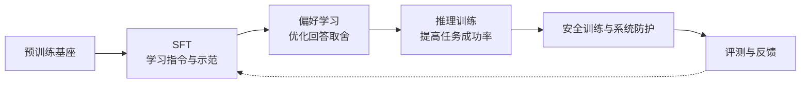
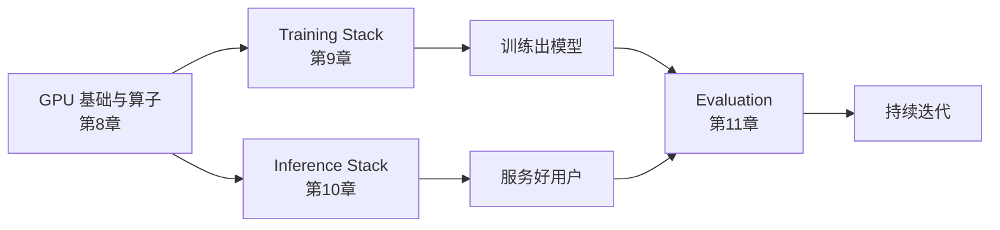

# 12. 第二部分总结——从基础模型（Base Model）到现代 AI 助手

第一部分我们理解了大语言模型**如何表示和生成语言**；第二部分回答了另一个问题：**如何在预训练基座上，通过数据、后训练和工程系统，构建更可用的 AI 助手？**

答案可以浓缩成一句话：**定义期望行为，构造学习信号，用合适的目标训练，再通过评测检验效果、成本与风险。** 第一部分的 nanoGPT 用于看清基本机制；本部分改用已有基础能力的开源基座，避免把后训练实验变成重新预训练一个模型。

## 一、从 Base Model 到 Chat Model：四类对齐任务

图中是**本书的讲解顺序，不是所有模型必须遵循的单向配方**。实际训练中各类数据和目标可以混合、交替，安全评测也应贯穿全程。

| 任务 | 解决什么问题 | 核心手段 | 一句话本质 |
|---|---|---|---|
| **SFT（第4章）** | 指令执行、任务行为和输出格式不够稳定 | 指令-回答示范 + Chat Template + Loss Mask | 从示范中学习条件生成，也可能学习新知识与技能 |
| **Preference Learning（第5章）** | 多个回答之间存在质量与偏好差别 | RM + PPO、DPO 等 | 让“哪个更好”进入优化目标 |
| **Reasoning Alignment（第6章）** | 推理任务正确率、鲁棒性或计算效率不足 | 推理示范、可验证奖励、GRPO 等 | 用任务反馈改进解题策略，而非只看回答是否很长 |
| **Safety Alignment（第7章）** | 有害输出、误拒与系统滥用风险 | 安全数据、偏好训练、分类器、分层防护 | 同时约束模型行为与系统执行边界 |

**共同点是调整数据与优化目标，而不是保证“知识不变”。** 后训练可以改变模型的知识、能力和行为，也可能造成遗忘或退化。Capability（能力）与 Alignment（对齐）是不同的评价视角，但并非两个互不影响的参数区域；最终都需要用合适的测试验证。

## 二、方法选择：简化了什么，又付出了什么代价？

方法演进不是“新方法必然淘汰旧方法”。更有用的比较方式，是看**监督信号、计算成本和适用条件**：

| 问题 | 可选方法 | 简化与代价 |
|---|---|---|
| 如何利用偏好数据 | PPO-RLHF、DPO 等 | DPO 省去显式 RM 与在线 RL 循环，但仍依赖偏好数据质量、参考策略与分布覆盖；PPO 可利用在线采样反馈 |
| 如何减少 RL 训练中的价值模型开销 | PPO 的 critic、GRPO 的组内基线 | GRPO 不单独训练 critic，但需要组内采样；全对或全错组的相对奖励信号很弱 |
| 如何扩展安全反馈 | 人工标注、基于原则的批评修订、AI 偏好标注 | 批评修订可生成 SFT 数据，AI 比较可生成偏好；仍需校准偏差并保留人工审核 |
| 如何构造 SFT 数据 | 人工示范、合成数据、蒸馏、精选混合 | 来源不同不代表天然优劣；覆盖、正确性、去重和验证集都重要。Alpaca 与 LIMA 是不同实验，不是同一数据集逐步缩小 |

**GRPO 是策略优化方法，RLVR 描述奖励来源。** 二者常组合使用，但 GRPO 也可以使用学习型奖励模型。理解一个新方法时，先问：它改变了哪种数据、哪个损失或哪段计算？又新增了什么假设与失败模式？

## 三、支撑这一切的工程体系

对齐决定了模型"应该表现成什么样子"，但真正让这一切在工业级规模上跑起来，离不开另一套工程体系——而它又建立在对 GPU 硬件本身的理解之上：

- **GPU 基础与算子**（SM / 显存层级 / 算子融合 / FlashAttention）帮助判断瓶颈是计算、访存还是调度；具体收益要测量，不能由技术名称推断；
- **Training Stack**（Data/Tensor/Pipeline 并行 + ZeRO + 混合精度）帮助分摊模型状态、控制激活值和通信。按第8、9章的假设，70B 模型状态为 \(70\times10^9\times16\) 字节，即 **1.12TB，尚未计激活值与临时缓冲**；
- **Inference Stack**（Continuous Batching + PagedAttention + 量化）在显存、吞吐与延迟之间做权衡。分页减少分配浪费，不会自动减少每个 Token 的 KV 数据量；
- **Evaluation**用固定任务与协议、自动验证、Judge 和人工审核检验质量与风险，为下一轮迭代提供依据。它应贯穿数据准备、训练和服务，而非只在最后做一次。

**贯穿工程章节的认知**：先建立资源账本，再确定瓶颈，最后用一致条件做对照。Roofline、训练显存账本和 KV Cache 账本给出解释框架；测量还必须注明模型、精度、输入长度、并发量、预热和统计口径。单卡 offload 的收益不能直接当作多卡分片收益，10 道题的冒烟测试也不能证明规模规律。

## 四、第二部分知识地图

本部分的 12 章按"总纲 → 基础 → 对齐方法 → 工程支撑"四段递进：

| 章节 | 核心问题 | 关键概念 |
|---|---|---|
| **1 Alignment**（总纲） | 为什么 GPT 需要变成 ChatGPT | Capability vs Alignment、HHH、InstructGPT 三步 |
| **2 三种学习范式**（基础） | 监督信号从哪来，怎样构造 | 监督 / 无监督 / 自监督、模型生成数据 |
| **3 数据工程**（基础） | 数据从哪来、怎么洗、怎么配比 | Common Crawl→C4、清洗四关、去重、PII、质量筛选 |
| **4 SFT**（对齐一） | 模型如何学会执行指令 | Chat Template、Loss Mask、LoRA/QLoRA、数据配比 |
| **5 Preference Learning**（对齐二） | 模型如何学会人类偏好 | RM、RLHF/PPO、DPO 推导、GRPO |
| **6 Reasoning Alignment**（对齐三） | 如何提高推理任务的成功率与效率 | 可验证奖励、R1 四阶段、test-time compute |
| **7 Safety Alignment**（对齐四） | 如何降低风险并控制误拒 | Jailbreak、提示注入、多层防护、Constitutional AI |
| **8 GPU 基础与算子**（工程） | GPU 的计算与访存如何形成约束 | SM/Tensor Core、HBM/SRAM、Roofline、算子融合 |
| **9 Training Stack**（工程） | 如何训练超大模型 | 3D 并行、ZeRO、显存账本 |
| **10 Inference Stack**（工程） | 如何高效服务大量用户 | Prefill/Decode、Continuous Batching、PagedAttention |
| **11 Evaluation**（工程） | 如何科学评价模型 | Benchmark、Judge 偏差、多层评测体系 |
| **12 第二部分总结** | 完整知识地图 | 从 Base Model 到现代 AI 助手 |

**为什么要按这个顺序？** 第 1 章给出全局地图（预训练 → SFT → RLHF）；第 2、3 章补齐支撑全书的**两块地基**——范式决定"需要什么数据"，数据工程决定"数据从哪来、怎么洗"；第 4~7 章沿着对齐流水线逐级递进（会执行 → 合偏好 → 会推理 → 有边界）；第 8~11 章回到工程支撑（硬件 → 训练 → 推理 → 评测）。**先知道"要训成什么样"，再学"怎么把它训出来、跑起来、评明白"**。

## 五、把实验串起来：哪些已经实现，哪些只是机制观察？

建议按“主章 → 本章实验 → 下一主章”阅读。最重要的连续训练路径是 **4.1 样本与监督位置 → 4.2 SFT 适配器 → 5.2 DPO**；5.1 的 RM 是帮助理解 PPO-RLHF 的旁支，DPO 不需要加载这个 RM。

| 实验段 | 应检查的产物或证据 | 不能据此宣称 |
|---|---|---|
| 3.1～4.1 数据与样本 | 保留结构的文本、清洗统计、Token 前缀与有效 labels | 已完成工业级数据治理或保证无污染 |
| 4.2～5.2 后训练 | 保存并能重载的适配器、固定模板、未参与训练的问题上前后输出 | 小数据训练一次就得到稳定、全面更强的助手 |
| 6.1 推理观察 | 最终答案、完成或截断状态、正确率与 Token 成本 | 已复现 GRPO 训练，或长思考本身证明更强 |
| 7.1 安全护栏 | 输入与输出审核、解析失败时的处理 | 一个分类器就能保证整个应用安全 |
| 8.1～10.2 工程实验 | 同口径计时与显存、明确的设备和输入配置 | 任意硬件上固定倍数加速或固定显存上限 |
| 11.1 评测 | 固定协议、实际调用的 Judge、异常解析与位置偏差检查 | 极小样本差异证明普遍优劣 |

CUDA 算子、分布式训练和 vLLM 服务实验有各自的平台要求；10.2 提供本地推理的另一条路径。不能把“8GB 显存”视为跨平台、跨序列长度的运行保证。示例需结合具体版本、驱动和硬件验证；未附完整环境与测量记录的显存、耗时说明只能作估算，不能当作实测基准。

## 六、参考资料的精华如何落实到练习？

第零部分的感谢名单是来源与延伸阅读地图，不是要求第二部分逐个复现全部框架。基础网络和手写 GPT 在第一部分，多模态也在那里；Agent 与具身智能分别由第三、四部分承担。本部分应抓住与后训练和工程相关的方法论：

| 资料线索 | 本书对应练习 | 学完后应能回答 |
|---|---|---|
| Karpathy、Raschka：机制透明与从零实现 | 第一部分 nanoGPT；4.1～5.2 | 每个 Token 是否参与 loss？训练产物怎样继续用于下一阶段？ |
| 吴恩达、李沐：优化、泛化与实验判断 | 第一部分优化基础；4.2、9.1、11.1 | 改进来自哪个变量？验证集与训练集是否分离？ |
| InstructGPT、李宏毅、DPO 与 Alignment Handbook | 第1、4、5章 | 示范、偏好和在线奖励分别怎样影响参数更新？ |
| R1、o1 | 第6章与6.1 | 奖励如何验证？训练算法、数据配方和推理预算有什么区别？ |
| Horace He、GPU Mode、FlashAttention | 第8章与8.1 | 当前受限于算力、访存还是调度？测量是否支持优化归因？ |
| DeepSpeed、Megatron、vLLM、Chip Huyen及评测资料 | 第9～11章 | 显存、通信、吞吐、延迟与质量如何共同约束系统？ |

MLA、DualPipe、CUTLASS、其他推理引擎和评测框架主要作为延伸阅读；了解定位不等于已经掌握实现。继续深入时，选一个机制读原论文、复算账本、构造对照，比同时安装很多框架更有价值。

## 七、一个重要的认知转变

> **回答流畅不等于知识可靠，奖励上升不等于任务全面改善，程序跑通也不等于效果已验证。**

能力与对齐需要共同评估。过度拒绝会损害可用性，过度迎合偏好可能牺牲诚实；需要用正常任务、风险任务和失败样本一起检查，而不是把某个指标单独最大化。

到这里，我们建立了构建、优化与评测助手的基本方法，并完成或了解了相应的教学实验；这不等于已经训练出可直接投入生产、足够安全的产品。模型可以生成计划或工具调用意图，但真正打开浏览器、读写文件、调用外部工具，还需要执行程序、状态管理与权限约束。第三部分将进入 **Agent（Use）**：

> **从生成回答与行动意图，到在受控系统里完成任务。**

---

# 参考资料

- Andrej Karpathy《State of GPT》(第二部分全链路的总纲性演讲)：https://www.youtube.com/watch?v=bZQun8Y4L2A
- HuggingFace《Alignment Handbook》(对齐全流程代码，与第4、5章对应)：https://github.com/huggingface/alignment-handbook
- OpenAI《InstructGPT》(Alignment 流水线原点)：https://arxiv.org/abs/2203.02155
- DeepSeek《DeepSeek-R1》(推理对齐新范式)：https://arxiv.org/abs/2501.12948
- Chip Huyen《AI Engineering》(训练/推理/评测工程全景)：https://github.com/chiphuyen/aie-book
