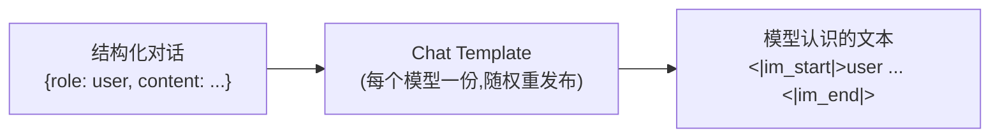
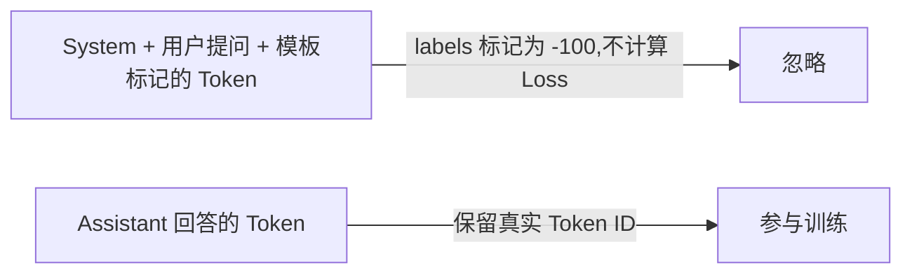
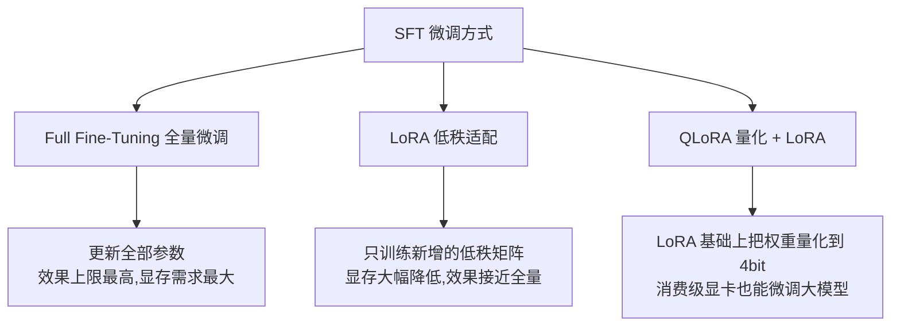

# 第2章 SFT——模型如何学会理解人类指令？

> **本章目标**
>
> - 理解 SFT 的本质：用监督学习的方式，教模型模仿"指令 → 高质量回答"的条件分布
> - 理解 SFT 与 Pretraining 的本质区别：知识 vs 行为，以及为什么"数据组织方式"才是真正的配方
> - 掌握 SFT 数据科学的三个认知迭代：InstructGPT 的 13k 条 → Alpaca 的 52k 条 → LIMA 的 1k 条，"质量远大于数量"
> - 理解 Chat Template 与 Loss Mask 的原理（实验 2.1 会亲手实现）
> - 掌握 SFT 训练的关键超参数与工程细节（学习率、epoch、过拟合、Sequence Packing）
> - 理解 SFT 的边界：它"格式化"行为而不是"注入知识"，也正因如此，后面才需要 Preference Learning 与 RL
> - 了解现代 SFT 的行业实践：合成数据、蒸馏，以及 DeepSeek-R1 的"冷启动 SFT"

---

## 一、SFT 是什么：从"模仿"到"学会执行指令"

上一章讲到，Alignment 流水线的第一步是 SFT。它的做法朴素得惊人：**给模型看大量"指令 → 高质量回答"的示范，让它直接模仿。**

```text
Instruction: 介绍一下 Transformer。
Output: Transformer 是一种基于 Self-Attention 的神经网络结构，由 Google 于 2017 年提出……
```

从机器学习的角度看，SFT 属于**监督学习**——每一条数据都有明确的"输入（指令）"和"标签（期望回答）"，模型在训练中不断降低"预测回答"与"示范回答"之间的差距。而从更广阔的视角看，SFT 与机器人领域的**模仿学习（Imitation Learning）/ 行为克隆（Behavior Cloning）**本质上是同一个思想：**不自己摸索规则，直接克隆专家的行为分布**。你给模型看一千个"人类如何回答指令"的例子，它就把"按这种方式回答"学成了自己的行为倾向。

**SFT 改变的不是模型的知识，而是模型的行为分布。** 预训练教会模型"苹果公司总部位于美国"，SFT 教会模型"当用户问'苹果公司总部在哪'时，应该直接给出答案，而不是续写一篇关于苹果公司的文章"。

## 二、SFT 与 Pretraining：同一个目标，不同的数据

一个让初学者困惑的事实是：**SFT 和 Pretraining 的数学目标完全一样，都是 Next Token Prediction。** 区别不在模型结构，也不在损失函数，而在**数据的组织方式**：

| | Pretraining | SFT |
|---|---|---|
| 数据来源 | 互联网原始文本（维基、网页、书籍、代码） | 人工撰写 / 模型生成的"指令-回答"对 |
| 数据规模 | 数万亿 Token（几 TB 文本） | 通常几千条到几十万条样本 |
| 训练目标 | Next Token Prediction | Next Token Prediction（**只计算回答部分的 Loss**） |
| 训练步数 | 数十万步 | 数百到数千步 |
| 模型获得的能力 | 世界知识、语言能力 | 指令跟随、回答的"行为方式" |
| 学习率 | 较高（配合 warmup + cosine 衰减） | 较低（通常比预训练小 1~2 个数量级） |

**为什么同样的目标函数，只因为数据不同，效果就天差地别？** 因为模型从数据里学的是"条件分布"：预训练数据里"苹果公司总部位于____"后面大概率是"美国"，所以模型学会了填"美国"；SFT 数据里"用户提问 → 高质量回答"是成对出现的，模型就学会了"当出现提问时，用回答的方式响应"。

> **SFT 真正的"配方"不在模型结构里，而在数据如何组织、Loss 在哪里计算。** 这也是第2.1节实验的核心：Chat Template 决定"模型看到什么"，Loss Mask 决定"模型学习什么"。

## 三、SFT 数据科学：三次认知迭代

SFT 数据从哪来、要多少、质量要多高？业界对这三个问题的认知，经历了三次标志性的迭代：

**第一次迭代：InstructGPT 的 13,000 条人工示范（2022）。** OpenAI 的做法是：从真实用户请求中采样指令，雇标注员写出高质量回答，一共约 **13,000 条**——这个数量小得让很多人吃惊。但它证明了：**只要数据是"真实用户会遇到的问题 + 人类认真写的回答"，几万条就足以让模型的行为发生质变。**

**第二次迭代：Alpaca 的 52,000 条合成数据（2023）。** 斯坦福的 Alpaca 用"种子指令 + 让 GPT-3.5 生成更多指令和回答"的方式，只花了约 500 美元就造出了 **52,000 条** SFT 数据，微调 LLaMA 后效果接近 GPT-3.5 的对话体验——这开启了**"用大模型造数据、训练小模型"的合成数据时代**（Self-Instruct 是背后的方法）。此后，ShareGPT（真实用户对话）、OpenOrca、UltraChat 等大规模开源数据集不断涌现。

**第三次迭代：LIMA 的 1,000 条精选数据（2023）。** Meta 的 LIMA 论文（*Less is More for Alignment*）做了一个极端的实验：只用 **1,000 条**人工精心挑选、多样化、高质量的样本，就微调出了一个在人类评测中能与更大模型一较高下的助手。结论掷地有声：**对齐数据的质量远重要于数量——"少而精"胜过"多而滥"。**

| 数据集 | 规模 | 数据来源 | 启示 |
|---|---|---|---|
| InstructGPT SFT | 13k 条 | 真实用户请求 + 人工撰写 | 真实场景 + 高质量人工 = 质变起点 |
| Alpaca | 52k 条 | 大模型合成（Self-Instruct） | 合成数据让规模不再是瓶颈 |
| LIMA | 1k 条 | 人工精选 + 多样化 | 质量 >> 数量，风格对齐可以"小而精" |

**这三步迭代共同塑造了今天的 SFT 数据观**：真实的场景分布（用户到底会问什么）比天马行空的编造更重要；覆盖度（任务类型、领域、语气要多样）比堆数量更重要；而"正确性"永远是底线——**一条精心写错的示范，比十条平庸的正确示范危害更大**，因为模型会照单全收。

微软的 **Phi 系列**把"数据质量"这条路线推向了极致：Phi-1 论文（*Textbooks Are All You Need*）只用约 70 亿 Token 的"教科书级"数据（教材、习题加一部分合成代码），就训练出了 1.3B 参数的小模型，在代码基准上超越了比它大一个数量级、用万亿 Token 训练的模型——**"教科书数据"的价值不在于规模，而在于"低噪声、高结构、直接示范正确推理"**。Phi 和 LIMA 从两个方向（数据质量 / 样本精选）得出了同一个结论：**对 SFT 来说，数据的"密度"（高质量样本的浓度）比总量更重要。**

## 四、SFT 数据的配方：不止"指令-回答"两段

真实的 SFT 数据远比"一问一答"复杂。现代 SFT 数据通常包含：

```text
<|im_start|>system
你是一个乐于助人的中文助手，回答简洁、准确、友好。<|im_end|>
<|im_start|>user
帮我写一封请假邮件，今天发烧了。<|im_end|>
<|im_start|>assistant
好的，以下是一封请假邮件模板……<|im_end|>
<|im_start|>user
再帮我加一句"下周补上工作进度"。<|im_end|>
<|im_start|>assistant
已加上，修改后的版本是……<|im_end|>
```

- **System Prompt 样本**：教模型"带角色/规则的场景下如何表现"（例如客服、翻译、代码助手）；
- **多轮对话样本**：教模型"记住前文、处理追问"——单轮数据无法教会对话能力；
- **需要工具调用的样本**：教模型"何时调用工具、如何组织参数"（与第三部分 Agent 衔接）；
- **拒绝类样本**：教模型"如何礼貌地拒绝危险或越权请求"（与第5章衔接）。

数据构建方式也早已不止"人工标注"一种：人工撰写（质量最高、最贵）、模板批量生成（Alpaca 早期做法）、**大模型蒸馏**（用 GPT-4 级别模型生成回答训练开源模型，开源社区追赶闭源的主要手段）、真实用户日志清洗（产品上线后最宝贵的数据来源）。

## 五、Chat Template：模型世界的"对话协议"

不同模型的对话格式标记各不相同——Qwen 用 `<|im_start|>user ... <|im_end|>`，Llama 3 用 `<|begin_of_text|><|start_header_id|>user<|end_header_id|> ... <|end_of_text|>`。**Chat Template 的作用，就是把结构化的 `{role, content}` 对话，拼接成每个模型专属的文本格式。**



在 HuggingFace 生态里，模板以 Jinja 格式随 Tokenizer 一起保存，一行 `tokenizer.apply_chat_template(messages)` 即可完成拼接。**一个经常踩的坑：训练和推理必须使用同一个模板。** 如果训练时用 A 模板、推理时用 B 模板，模型看到的输入分布和训练时不一致，表现会明显下降——这也是为什么几乎所有开源模型都会把 Chat Template 作为模型权重的一部分发布（Llama 2 论文里专门强调过 Tokenizer 与模板一致性的问题）。

## 六、Loss Mask：SFT 真正的"配方"

如果把整段对话直接喂给模型做 Next Token Prediction，模型会同时学习"如何提问"和"如何回答"——但我们只想让它学会后者。于是 SFT 的核心技巧出现了：**Loss Mask（损失掩码）**。



`-100` 是 PyTorch `CrossEntropyLoss` 默认的忽略值——训练框架遇到这个值就跳过该位置的 Loss 计算。**模型的输入里能看到完整的对话（包括用户提问），但只有回答部分的预测误差会进入梯度。** 这样模型学到的是"给定提问，如何作答"，而不是"如何提问"。

> 💡 **Insight：SFT 不改变模型结构、不改变损失函数，它只改变两件事——数据怎么拼（Chat Template）、梯度从哪里来（Loss Mask）。** 这个"配方"如此简单，以至于很多人第一次意识到 SFT 的全部秘密就藏在这两处时，会觉得难以置信。但正是这个简单的配方，让模型从"补全器"变成了"执行者"。

## 七、SFT 的训练细节：为什么它和预训练"不一样"

SFT 数据量小、任务单一，训练配置和预训练有显著差异，这些差异每一个都是踩坑换来的经验：

| 超参数 | 预训练 | SFT 的常见取值 | 原因 |
|---|---|---|---|
| 学习率 | 1e-4 ~ 6e-4（配合 warmup） | **1e-5 ~ 2e-5** | 模型已经很强，只需要"微调行为"，步子大了会破坏预训练学到的知识（灾难性遗忘） |
| Epoch | 1 ~ 3 | **1 ~ 3，通常 2** | SFT 数据少，多跑几轮就开始过拟合 |
| Warmup | 1%~10% 步数 | 少量 warmup | 与预训练相同 |
| 损失 | 全部 Token | 仅回答部分（Loss Mask） | 见上一节 |
| 权重衰减 | 有 | 有（AdamW） | 防止过拟合 |

**SFT 最大的风险是过拟合**：数据量只有几万条，模型又足够大，几个 epoch 之后它就能"背下"训练集——表现为 train loss 逼近 0 而 val loss 不再下降甚至回升。应对手段包括：更少的 epoch、更高的权重衰减、以及**监控验证集 Loss**（这正好呼应第一部分 11.1 节 Mini GPT 训练时的 train/val 监控）。

另一个重要的工程技巧是 **Sequence Packing**：SFT 样本长度参差不齐，朴素做法是"按最长样本 padding"，会浪费大量计算。Sequence Packing 把多条短样本首尾相接拼成一条接近最大长度的序列（样本间用 EOS 隔开，Loss Mask 同样只保留回答部分），可以把训练吞吐提升数倍——现代 SFT 训练脚本的标配。

## 八、Full Fine-Tuning、LoRA、QLoRA：三种微调方式

SFT 并不一定要更新全部参数：



- **Full Fine-Tuning**：更新全部参数，效果上限最高，但需要把参数、梯度、优化器状态全部放进显存——70B 模型全量微调需要数百 GB 显存；
- **LoRA（Low-Rank Adaptation）**：冻结原模型，只训练新增的两个低秩矩阵（例如 rank=16），可训练参数只有总量的 0.1%~1%。2.2 节实验就是用它完成的——它假设"行为的改变发生在低维子空间里"，实践上这个假设对大模型非常成立；
- **QLoRA**：在 LoRA 基础上把冻结权重量化到 4bit，让一张 8GB 消费级显卡也能微调数十亿参数模型。

**什么时候必须 Full FT？** 当任务需要模型"学会新知识/新领域"（而不是只改行为风格）时，LoRA 可能力不从心——因为知识改变需要的参数更新范围比行为改变更大。这也是为什么"领域微调"（如法律、医学）经常报道 LoRA 效果不足，而"对话风格对齐"LoRA 足够用的原因。

## 九、SFT 的边界：它解决什么，不解决什么

理解 SFT 的局限，和理解它的威力同样重要：

1. **SFT 是"格式化"，不是"教育"**：它让模型把已有的能力用"人类期望的方式"表达出来，但**不能注入新的知识**——模型在预训练时没见过的事实，SFT 数据里再怎么写它也无法真正学会（它只会"背诵"那几条特定文本）。指望用 SFT 数据"教会"模型新知识，是新手最常见的误区；
2. **SFT 无法让模型超过示范**：它优化的是"模仿示范"的 Loss，模型的天花板是示范数据的水平。示范里没有的更好的回答方式，模型不会自己发明——要突破这个天花板，需要下一章的 Preference Learning（让模型学会"什么更好"，而不是"示范长什么样"）；
3. **SFT 会放大数据偏差**：数据里"喜欢长篇大论"模型就长篇大论，"喜欢奉承"模型就奉承。数据的坏习惯会被忠实复制；
4. **SFT 不能消除幻觉**：幻觉的根源是预训练的知识表征，SFT 只能改变表达方式。这也是为什么对齐的完整流水线需要后续多个阶段。

> 💡 **Insight：把 SFT 理解为"给一个知识渊博但不懂礼貌的天才做礼仪培训"——培训能改变他说话的方式，但不能改变他的知识结构，也无法让他比自己的老师更聪明。** 这正是为什么对齐流水线在 SFT 之后还需要偏好学习（教"什么是更好"）、推理对齐（教"如何想清楚"）和安全对齐（教"什么不能说"）。

## 十、现代 SFT 的行业实践：从蒸馏到冷启动

今天的工业界，SFT 早已不是"写几万条数据跑一跑"那么简单：

- **合成数据主导**：绝大部分开源模型的 SFT 数据由更强的模型（GPT-4 级别或自家最强模型）生成，再经过清洗、去重、质量过滤（用 LLM 打分筛选）；
- **多阶段 SFT**：把数据按难度/类型分阶段训练，先学通用对话、再学复杂推理，比一锅烩效果更好；
- **蒸馏自最强模型**：开源社区追赶闭源的主要手段——用闭源模型生成的高质量数据微调开源模型；
- **冷启动 SFT（DeepSeek-R1 的创新）**：在强化学习训练推理能力之前，先用**几千条精心构造的"长思维链"示范做一轮 SFT**——让模型先学会"推理过程长什么样"，再进入 RL 阶段探索。这个"冷启动"让 RL 训练又快又稳，是 R1 论文里被引用最多的工程技巧之一（第4章会展开）。

这些实践共同指向一个结论：**SFT 从"数据量竞赛"转向了"数据质量与数据工程竞赛"**——谁能更懂数据，谁就能用更少的算力得到更好的模型。

## 工程工具箱

| 工具 | 用途 |
|---|---|
| HuggingFace `transformers` | `apply_chat_template` 统一处理对话格式；`Trainer` 封装训练循环 |
| `peft` | LoRA / QLoRA 参数高效微调 |
| TRL `SFTTrainer` | 内置 Loss Mask、Sequence Packing 的 SFT 训练器，开箱即用 |
| `bitsandbytes` | 4bit / 8bit 量化，QLoRA 的地基 |
| `datasets` | 数据加载、清洗、切分 |

---

想亲手拆开一条真实的 SFT 数据，看清楚 Chat Template 和 Loss Mask 到底是如何构造出来的，可以看这一节实验：**2.1 构建一份 SFT 数据集——Chat Template 与 Loss Mask 实战**。

## 本章总结

本章我们理解了：

✅ SFT 用监督学习教模型模仿"指令 → 高质量回答"的条件分布，本质是行为克隆 ✅ SFT 与预训练的数学目标相同，区别全在数据的组织方式：Chat Template 决定模型看到什么，Loss Mask 决定模型学习什么 ✅ SFT 数据的认知迭代：13k 人工示范（InstructGPT）→ 52k 合成数据（Alpaca）→ 1k 精选数据（LIMA），质量远大于数量 ✅ SFT 训练要小学习率（1e-5~2e-5）、少 epoch、防过拟合、用 Sequence Packing 提速 ✅ Full FT / LoRA / QLoRA 是三种不同的微调方式，知识注入需要全量微调，风格对齐 LoRA 足够 ✅ SFT 的边界：格式化行为而非注入知识、无法超越示范、会放大数据偏差 ✅ 现代 SFT 由合成数据、多阶段训练与冷启动 SFT（DeepSeek-R1）主导

> **SFT 让模型"会用人类的方式说话"，但"说什么更好"是偏好学习的战场，"怎么想清楚"是推理对齐的战场——SFT 只是对齐流水线的第一块基石。**

## 下一章预告

SFT 让模型学会了"正确执行指令"，但"正确"不等于"人类更喜欢"。同一个问题往往有无数种合理的回答，人类明显更偏好其中某一些——这种偏好如何教给模型？下一章，我们将进入：

> **第3章 Preference Learning——模型如何学会人类真正喜欢的回答？**

---

# 参考资料

- HuggingFace《Alignment Handbook》（SFT/DPO/RLHF 全流程代码，SFT 章节与本章内容一一对应）：https://github.com/huggingface/alignment-handbook
- OpenAI《Training language models to follow instructions with human feedback》(InstructGPT，13k SFT 数据出处)：https://arxiv.org/abs/2203.02155
- Meta《Llama 2: Open Foundation and Fine-Tuned Chat Models》(SFT 数据与训练细节)：https://arxiv.org/abs/2307.09288
- Meta《LIMA: Less is More for Alignment》(1k 条精选数据的质量论证)：https://arxiv.org/abs/2305.11206
- DeepSeek《DeepSeek-R1》(冷启动 SFT + RL 推理训练)：https://arxiv.org/abs/2501.12948
- Andrej Karpathy《State of GPT》(SFT 在整条链路中的位置)：https://www.youtube.com/watch?v=bZQun8Y4L2A
