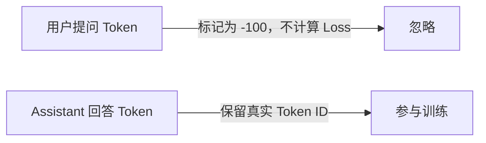
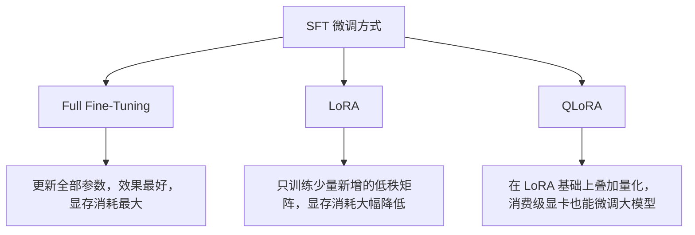
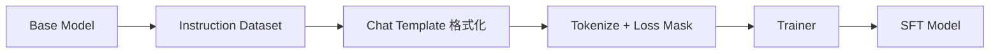

# 第2章 SFT——模型如何学会理解人类指令？

## 本章目标

完成本章学习后，你将理解：

- 什么是 SFT（Supervised Fine-Tuning，监督微调）
- SFT 数据集是如何构建的
- Chat Template 和 Loss Mask 的作用
- SFT 与 Pretraining 的本质区别
- Full Fine-Tuning、LoRA、QLoRA 之间的关系

---

## 一个直接的问题

上一章我们知道了Alignment 的目标是"让模型的行为符合人类目标"，但具体应该怎么做？答案是：**先给模型看大量"指令 → 正确回答"的示范，让它直接模仿。**

这正是 SFT（监督微调）要做的事情——**用监督学习的方式，教模型学会执行指令**。

## SFT 与 Pretraining 的本质区别

Pretraining 阶段的数据是原始互联网文本，训练目标是 Next Token Prediction，模型学到的是"世界知识"；SFT 阶段的数据变成了"一问一答"的指令样本，训练目标依然是 Next Token Prediction，但模型学到的是"如何执行任务"：

| | Pretraining | SFT |
|---|---|---|
| 数据来源 | 互联网原始文本 | 人工/模型生成的指令-回答对 |
| 数据规模 | 数万亿 Token | 通常几万至几百万条 |
| 训练目标 | Next Token Prediction | Next Token Prediction（只计算回答部分的Loss） |
| 模型获得的能力 | 世界知识 | 指令跟随能力 |

请注意，两阶段的训练目标本质上完全相同——**真正变化的是数据的组织方式**。

## SFT 数据长什么样？

一条典型的 SFT 样本包含指令和期望回答两部分：

```text
Instruction: 介绍一下 Transformer。
Output: Transformer 是一种基于 Self-Attention 的神经网络结构，由 Google 于 2017 年提出。
```

真实的训练数据往往还包含多轮对话、System Prompt、工具调用等更复杂的结构，但核心思想不变：**给模型看示范，让它学会模仿这种"回答方式"**。

## Chat Template：把数据变成模型认识的格式

不同模型有各自专属的对话格式标记，例如：

```text
<|im_start|>user
介绍一下 Transformer。<|im_end|>
<|im_start|>assistant
Transformer 是一种基于 Self-Attention 的神经网络结构……<|im_end|>
```

Chat Template 的作用就是把 `{role, content}` 这样的结构化对话，拼接成模型训练和推理时统一认识的文本格式。如果训练和推理时使用的模板不一致，模型的表现会明显下降——这也是为什么几乎所有开源模型都会随权重一起发布对应的 Chat Template。

## Loss Mask：只学习"回答"，不学习"提问"

如果把整段对话文本直接喂给模型做 Next Token Prediction，模型会同时学习"如何提问"和"如何回答"，但我们真正希望它学会的只是"如何回答"。因此需要构造 **Loss Mask**：



`-100` 是 PyTorch `CrossEntropyLoss` 的默认忽略值，训练框架会自动跳过这些位置——这正是 SFT 真正的"配方"：**不是模型结构变了，而是数据的组织方式和 Loss 计算范围变了。**

## SFT 数据从哪里来？

| 来源 | 特点 |
|---|---|
| 人工标注 | 质量高，成本高，规模有限 |
| 开源指令数据集（如 Alpaca、ShareGPT、OpenOrca） | 规模较大，质量参差不齐 |
| 模型自动生成（Self-Instruct、Distillation） | 用更强的模型生成数据训练较小的模型，是目前最主流的方式之一 |

近年来，越来越多团队采用"用大模型蒸馏数据、再训练小模型"的方式构建 SFT 数据集，这也是开源社区能够快速追赶闭源模型的重要原因。

## Full Fine-Tuning、LoRA、QLoRA

SFT 训练时，并不一定需要更新模型的全部参数：



正是因为 LoRA/QLoRA 的出现，普通开发者用一张消费级显卡就可以微调一个数十亿参数的模型——这也是本书第13.3节 LoRA 实验以及后面全部微调实验能够在 8GB 显存内完成的根本原因。

## 工程实践：一条 SFT 流水线



## 工程工具箱

| 工具 | 特点 |
|---|---|
| Hugging Face `transformers` | 提供 `apply_chat_template`，统一处理对话格式 |
| `peft` | 提供 LoRA/QLoRA 等参数高效微调方法 |
| TRL `SFTTrainer` | 封装了 SFT 训练的标准流程 |
| `bitsandbytes` | 提供 4bit/8bit 量化，配合 QLoRA 使用 |

---

## 本章总结

本章我们理解了：

✅ SFT 用监督学习的方式，教模型学会执行指令✅ Chat Template 把结构化对话转换成模型统一认识的文本格式 ✅ Loss Mask 保证模型只学习"如何回答"，不学习"如何提问" ✅ LoRA/QLoRA 让消费级显卡也能完成大模型微调

> **Pretraining 决定模型"知道什么"，SFT 决定模型"如何按照人类的方式回应"。**

---

想亲手拆开一条真实的 SFT 数据，看清楚 Chat Template 和 Loss Mask 到底是如何构造出来的，可以看这一节实验：**2.1 亲手构建一份 SFT 数据集——Chat Template 与 Loss Mask 实战**。

## 下一章预告

SFT 让模型学会了"正确执行指令"，但正确不等于"人类更喜欢"。下一章，我们将进入：

> **第3章 Preference Learning——模型如何学会人类真正喜欢的回答？**
