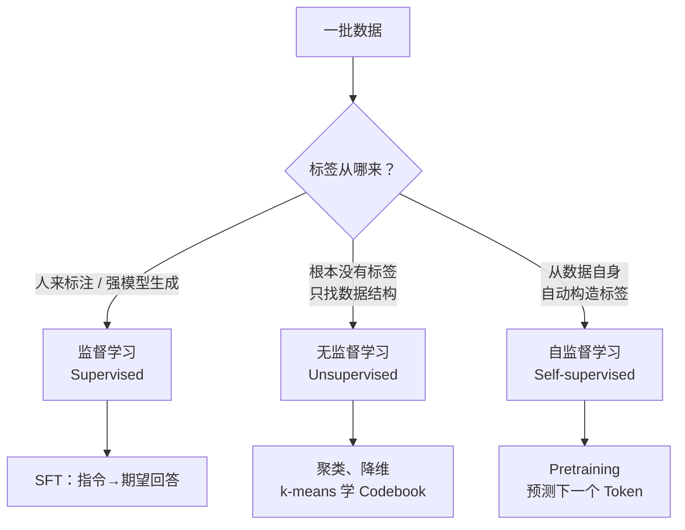

# 2. 三种学习范式——监督、无监督与自监督

> **本章目标**
>
> - 分清监督学习、无监督学习、自监督学习：唯一的判据是**标签从哪来**
> - 理解为什么自监督学习是大模型能规模化的关键——它让"无需人工标注的海量文本"直接变成训练信号
> - 搞清无监督与自监督的本质区别（"找结构" vs "造标签做预测"），这是最容易混淆的一对概念
> - 理解"模型自举"不是第四种范式，而是监督信号的生产者从人类换成模型
> - 建立一条关键认知：**范式决定了需要什么样的数据**——为下一章（数据工程）做铺垫

---

## 一、为什么先讲范式？

上一章我们建立了 Alignment 的全局地图：预训练得到一个 Base Model，再经过 SFT、RLHF 等环节变成助手。但有一个基础问题一直悬而未决：

> **预训练用几万亿 Token 的互联网文本，SFT 只用几千条人工示范——同样是"训练模型"，为什么数据量差了一百万倍？**

答案不在模型结构，也不在损失函数——**两者的目标函数其实完全一样，都是 Next Token Prediction**。真正的差别在于：**标签（Label）从哪来**。

而这正是机器学习里三个基础概念的分界线：

理解了这条分界线，你就会明白：**为什么预训练能把整个互联网喂进去（标签自动生成，数据几乎无限），而 SFT 的每一条数据都必须人写或模型生成（所以只有几千到几十万条）**。这也是下一章讲数据工程时的总纲——**范式决定数据需求，数据工程服务于范式**。

---

## 二、三种范式：一张表讲清楚

| 范式 | 标签（Label）从哪来 | 典型任务 | 在本书里的对应 |
|---|---|---|---|
| **监督学习**（Supervised） | 人来标注，或由强模型生成 | 分类、回归、翻译 | **SFT**：标签是人工/大模型写好的"期望回答" |
| **无监督学习**（Unsupervised） | **根本没有标签**，只找数据里固有的结构 | 聚类、降维、密度估计 | 第一部分的 **k-means 学音频 Codebook**、Embedding 空间的聚类现象 |
| **自监督学习**（Self-supervised） | **从数据自身自动构造标签**（有监督信号，但不靠人工） | 语言建模、对比学习 | **Pretraining**：标签就是"下一个 Token"本身 |

**关键的一句**：预训练做的是 Next Token Prediction，它的"标签"不是谁标出来的，而是**把输入文本往后错一位就自动得到了**——`The cat is sleeping` 这句话自己就能生成监督信号（用 `The cat is` 预测 `sleeping`）。这种"数据自己监督自己"的训练方式，就叫**自监督学习**。

> **它是过去十年 NLP 能规模化爆发的关键**：不需要任何人工标注，互联网上的海量原始文本都能直接拿来训练。如果语言模型必须靠人工标注才能训练，我们永远不可能训出 GPT——因为标注成本会先爆炸。

---

## 三、无监督 vs 自监督：别把这两个搞混

这两个概念最容易混淆，因为都"不需要人工标注"，但**本质完全不同**：

- **无监督学习：根本没有"标签"这回事。** 它不预测任何东西，只是去发现数据里固有的结构——比如"哪些样本彼此相似，可以归成一堆"（聚类），或者"怎么用更少的维度表示这些数据"（降维）。本书第一部分第 17.2 节用 **k-means 把音频帧聚成 8 个 Code**，就是一个标准的无监督学习实例：没有人告诉算法"第 1~20 帧是低音"，它只是自己发现这些帧的特征彼此接近，把它们归成一类。**学出来的是"结构"，不是"预测能力"。**
- **自监督学习：有明确的预测目标，只是标签是自动造的。** 预测下一个 Token 就是一个货真价实的监督任务（有输入、有目标、有 Loss），只不过这个目标是从数据自身派生出来的，不需要人去写。**学出来的是"预测能力"。**

**一句话区分：无监督是"找结构"，自监督是"造标签然后做预测"。**

大语言模型的能力几乎全部来自自监督——无监督方法（聚类等）在 LLM 主线里主要用于分析表示、或做向量量化这类辅助环节，而不是训练语言能力本身。

**所以那张表要这样读**：Pretraining 是**自监督**的（标签从文本自动来，所以能堆到数万亿 Token）；SFT 是**监督**的（标签要靠人写或用强模型生成，所以只有几千到几十万条）；而**无监督**在本书主线里是配角，出现在 k-means 量化这类环节。三者都用不上"人工标答案"，但**只有自监督能直接训练出语言能力**。

---

## 四、延伸：第二部分那条"模型自举"的暗线，属于哪一类？

本书第二部分有一条贯穿始终的暗线——**"从依赖人类，到模型自举"**（合成数据、蒸馏、Self-Instruct）。你可能会问：模型自己生成数据、再训自己，这是无监督还是自监督？

答案是：**它是一个"自举循环"，每一轮内部仍然是自监督或监督学习，只是数据的生产者从人换成了模型。**

最典型的例子是第8章 DeepSeek-R1 的**拒绝采样 SFT（Rejection Sampling）**：让模型自己生成大量推理过程 → 用"答案对错"这把免费的尺子**自动筛掉错的**，只保留正确的 → 拿这些"模型自己生成、但经过验证"的数据再做一轮 SFT。这里每一步的性质是：

1. 模型生成候选答案——**推理**，不算训练；
2. 用可验证的正确答案自动筛选——**自动构造标签**，思路上接近自监督（标签不是人给的）；
3. 用筛出来的数据做 SFT——**标准的监督学习**，只是"示范者"从人类专家换成了模型自己。

**所以"模型自举"不是第四种范式，而是一种数据生产方式的转变**：监督信号的来源从"人类标注"逐步迁移到"模型生成 + 自动验证"。

这也解释了为什么第8章强调"答案可自动验证"是推理任务的关键——**只有当对错能被程序自动判定时，自举循环才能真正转起来**，否则仍需人类（或 Reward Model，第7章）来把关。

理解到这一层，再看 LIMA 的精选、Alpaca 的合成、R1 的拒绝采样，就会明白它们是同一条演进路线上的不同站点：**用越来越少的"人类直接标注"，撬动越来越多的"有效监督信号"**。

---

## 本章总结

✅ 三种范式的唯一判据是**标签从哪来**：人来标（监督）、没有标签（无监督）、数据自动生成（自监督） ✅ Pretraining 是自监督——标签就是把文本往后错一位自动得到，这正是它能用数万亿 Token 的原因 ✅ SFT 是监督——标签要人写或强模型生成，所以只有几千到几十万条 ✅ 无监督是"找结构"（如 k-means 学 Codebook），自监督是"造标签做预测"，别混淆 ✅ 模型自举不是第四种范式，而是监督信号的生产者从人类换成模型（拒绝采样 SFT 是典型）

> **一句话记住本章**：范式决定了"需要什么样的数据、能要多少数据"——预训练（自监督）能吞下整个互联网，SFT（监督）每一条都得精挑细选。

## 下一章预告

既然范式决定了数据需求，那么接下来的问题就很自然了：**预训练需要的海量原始文本从哪来？为什么抓下来的网页不能直接训练？SFT 需要的成对数据又是怎么造出来的？**

下一章我们专门回答这些，把"数据工程"这条支撑起整个大模型的暗线讲清楚：

> **第3章 数据工程——数据从哪来、怎么洗、怎么配比？**

---

## 思考题

1. 为什么说"自监督学习"是大模型能规模化的前提？如果语言建模必须人工标注，会发生什么？
2. k-means 聚类属于哪种范式？它和"预测下一个 Token"的本质区别是什么？
3. DeepSeek-R1 的拒绝采样 SFT 里，哪一步接近自监督、哪一步是监督学习？为什么"答案可自动验证"是整个循环能转起来的关键？
