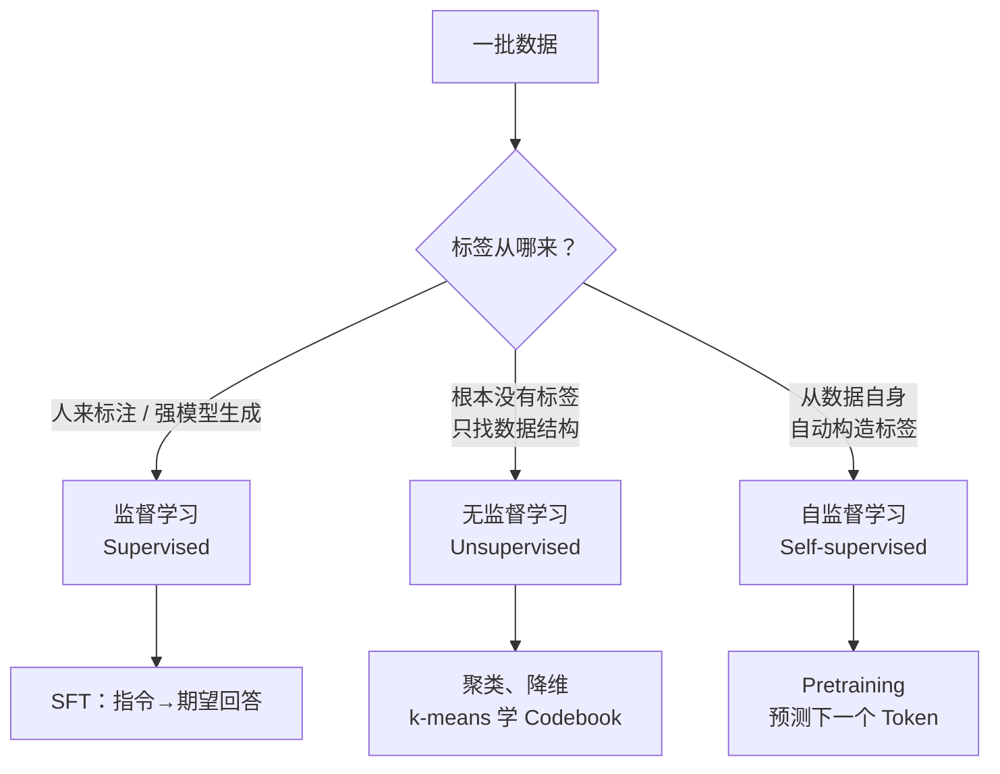

# 2. 三种学习范式——监督、无监督与自监督

> **本章目标**
>
> - 从**监督信号如何构造、训练任务是什么**区分监督学习、无监督学习、自监督学习；本章重点看“标签从哪来”
> - 理解为什么自监督学习是大模型能规模化的关键——它让"无需人工标注的海量文本"直接变成训练信号
> - 搞清无监督与自监督的本质区别（"找结构" vs "造标签做预测"），这是最容易混淆的一对概念
> - 理解"模型自举"不是第四种范式，而是监督信号的生产者从人类换成模型
> - 建立一条关键认知：**范式决定了需要什么样的数据**——为下一章（数据工程）做铺垫

---

## 一、为什么先讲范式？

上一章我们建立了 Alignment 的全局地图：预训练得到一个 Base Model，再经过 SFT、RLHF 等环节变成助手。但有一个基础问题一直悬而未决：

> **预训练常用万亿级 Token，SFT 则使用精选的指令与回答——同样是训练模型，为什么数据组织和规模常常不同？**

先统一单位：**Token 数不能直接与样本条数相除**。例如 10 万条样本、每条平均 500 Token，对应 5000 万 Token，而不是 10 万 Token。SFT 规模也可能达到百万乃至更多样本，并没有范式规定的数量上限。

预训练与常见的生成式 SFT 都可使用 Next Token Prediction 的交叉熵，但**并非完整训练目标“完全一样”**：数据分布、条件输入及 Loss Mask 不同，SFT 常只监督回答部分。理解差异的好起点是：**标签（Label）如何构造**。

而这正是机器学习里三个基础概念的分界线：

这张图是本书任务的入门分类，不是穷尽所有学习方法。预训练可以从文本自动取得目标，省去逐条写答案的成本；SFT 则需要与任务匹配的期望回答，来源可以是人工、模板、程序或模型。**两者都需要质量控制，数量取决于任务、预算和覆盖度，而不由范式单独决定。** 下一章的数据工程正是为这些需求服务。

---

## 二、三种范式：一张表讲清楚

| 范式 | 标签（Label）从哪来 | 典型任务 | 在本书里的对应 |
|---|---|---|---|
| **监督学习**（Supervised） | 数据中给定任务目标，可来自人工、程序或模型 | 分类、回归、翻译 | **SFT**：标签是与指令对应的期望回答 |
| **传统无监督方法**（Unsupervised） | 不提供外部任务标签，直接建模数据结构或分布 | 聚类、降维、密度估计 | 第一部分的 **k-means 学音频 Codebook** |
| **自监督学习**（Self-supervised） | 从数据自身构造预测目标，无需逐条人工标答案 | 语言建模、对比学习 | **Pretraining**：标签就是下一个 Token |

**关键的一句**：预训练的目标 Token 来自原文的下一位置——`The cat is sleeping` 自己就能生成监督信号，例如用 `The cat is` 预测后续内容。这种“数据监督自己”的方式使海量文本可以提供训练信号。

> **可扩展性来自省去逐条写答案的成本，不是省去所有数据工作。** 原始网页仍需授权检查、清洗、去重与配比，不能未经处理就直接拿来训练。

---

## 三、无监督 vs 自监督：别把这两个搞混

两者都可以不依赖人工任务标签，因此有文献把自监督归入广义无监督学习。本书为了讲清训练信号，将它们分开讨论：

- **传统无监督方法**：例如 k-means 直接优化簇内距离，不需要每个样本对应一个人工类别标签。第一部分第 15.2 节的音频 Codebook 是例子。无监督还包括密度估计等任务，不能概括成“不预测任何东西”。
- **自监督学习**：从数据本身构造明确的预测目标，例如用前文预测下一个 Token，或遮住一部分输入再重建。它也能学习结构与表示，不只是获得某种孤立的“预测能力”。

**入门时可记作：k-means 这类方法直接找结构，自监督先从数据中构造预测任务。** 这不是两类方法的绝对边界。

本书的语言模型预训练以自监督为主；SFT 使用期望回答作监督，既可能用人工示范，也可能用合成示范。后训练同样可以增加知识和技能。聚类则主要出现在表示分析、数据整理与向量量化环节，不能据此推断“只有自监督能训练语言能力”。

---

## 四、延伸：第二部分那条"模型自举"的暗线，属于哪一类？

本书第二部分有一条贯穿始终的暗线——**"从依赖人类，到模型自举"**（合成数据、蒸馏、Self-Instruct）。你可能会问：模型自己生成数据、再训自己，这是无监督还是自监督？

答案是：**“自举”描述数据和模型怎样迭代，不独立定义训练范式。** 合成回答做 SFT 仍是监督学习；循环也可以包含强化学习，要逐步看它采用什么训练信号。

以第6章 DeepSeek-R1 的**拒绝采样 SFT（Rejection Sampling）**为例，可简化为“生成候选 → 筛选 → 用保留的示范训练”：

1. 模型生成候选答案——**推理**，此时不更新参数；
2. 根据参考答案、测试或评分器筛选——**数据验证与选择**，不是一次训练，也不因自动化就成为自监督。参考答案和测试本身可能仍需人工构建；
3. 用筛出的回答做 SFT——**监督学习**，只是示范来自模型而不是逐条由人撰写。

可验证任务能用程序较低成本地检查候选，因此适合扩展循环；但验证并不免费，最终答案正确也不保证推理每一步正确。不能自动判定的任务仍可通过人工或模型评分迭代，只是成本、误判与偏差更难控制。

LIMA 的人工精选、Alpaca 的合成和 R1 的拒绝采样展示了不同数据策略，**并非人工必然被替代的单向路线**。关键是如何获得可信的监督信号，而不仅是减少标注人数。

---

## 本章总结

- 预训练从文本本身取得预测目标，属于自监督；SFT 用期望回答作监督，示范来源不限于人工。
- 两者都可以使用 Token 交叉熵，但数据分布与损失覆盖范围不同；数据规模比较要先统一单位。
- 自监督常被归入广义无监督，本书为教学分开讨论，不能以“是否有预测能力”划绝对边界。
- 模型自举描述迭代流程；候选生成、验证和 SFT 是不同步骤，自动验证不等于自监督学习。

> **一句话记住本章**：先看训练信号怎样构造，再决定如何准备和检查数据；不要仅凭有没有人手写答案判断范式。

## 下一章预告

既然范式决定了数据需求，那么接下来的问题就很自然了：**预训练需要的海量原始文本从哪来？为什么抓下来的网页不能直接训练？SFT 需要的成对数据又是怎么造出来的？**

下一章我们专门回答这些，把"数据工程"这条支撑起整个大模型的暗线讲清楚：

> **第3章 数据工程——数据从哪来、怎么洗、怎么配比？**

---

## 思考题

1. 为什么说"自监督学习"是大模型能规模化的前提？如果语言建模必须人工标注，会发生什么？
2. k-means 聚类属于哪种范式？它和"预测下一个 Token"的本质区别是什么？
3. 拒绝采样 SFT 中，候选生成、验证筛选和参数训练分别做什么？为什么“程序自动判定答案”不能直接等同于自监督学习？
