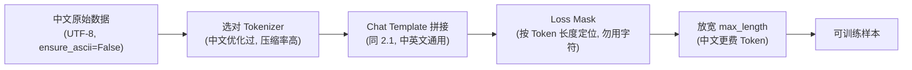

# 2.3 中文场景下的 Tokenizer 与 SFT 数据处理

> **硬件要求**：CPU 即可运行（前半部分纯 Python 不依赖模型；后半部分加载 Tokenizer 需要 `pip install transformers`，仍是 CPU 级别）
>
> **本节目标**：第一部分讲 Tokenizer（第2章）时，为了把 BPE、Subword 的原理讲干净，用的全是英文语料。但当你真正拿中文数据去微调模型（就像 2.2 用的 `alpaca-zh`），会立刻遇到一批英文里根本不存在的问题：**一个汉字会被切成好几个 Token、同样一句话中文比英文更"费" Token、词表里可能压根没有你要的字、Loss Mask 的边界更容易算错**。这一节我们把这些中文特有的坑一次性讲清楚，并动手对比中英文分词的真实差异。

---

## 一、为什么中文不能沿用英文那套"按空格切词"？

第一部分讲过：最朴素的 Word Tokenizer 是**按空格切词**。这在英文里天然成立——`The cat is sleeping` 用空格一切就是四个词。但中文有一个根本区别：

> **中文的书写系统里没有词边界（No Word Boundary）。** `我爱自然语言处理` 是一整串连续的字，中间没有任何空格告诉你该在哪里切。

如果硬用"按空格切"，整句话会变成**一个巨大的 Token**，词表瞬间爆炸且完全无法泛化。历史上中文 NLP 因此依赖专门的**分词工具**（如 jieba）先把 `我 / 爱 / 自然语言 / 处理` 切开。但现代 LLM 走了另一条路——**根本不做"词"级切分，而是退回到更底层的字节（byte）**，也就是第一部分讲过的 byte-level BPE 在字节序列上做合并。

先用一段代码直观感受"中文没有空格"这件事：

```python
en = "The cat is sleeping"
zh = "那只猫正在睡觉"

# 英文：按空格 split 就能得到词
print("英文按空格切:", en.split())          # ['The', 'cat', 'is', 'sleeping']
# 中文：按空格 split 完全失效，整句变成一个元素
print("中文按空格切:", zh.split())           # ['那只猫正在睡觉']  ← 切不开
# 中文只能退到"单字"这一层才有天然边界
print("中文按字切:", list(zh))               # ['那', '只', '猫', '正', '在', '睡', '觉']
```

**结论**：英文的空格免费提供了词边界，中文没有。这个差异会一路影响到 Tokenizer 的设计。

---

## 二、核心现象：一个汉字，UTF-8 里是好几个字节

现代 GPT 类模型用的是 **byte-level BPE**：它不直接看"字符"，而是先把文本编码成 **UTF-8 字节序列**，再在字节上做 BPE 合并。这么做的好处是**任何字符都能表示、永远不会出现 Unknown Token**（第一部分第2章讲过的未登录词问题被彻底绕开）。但对中文来说，这里藏着一个关键事实：

> **一个英文字母在 UTF-8 里是 1 个字节，而一个常见汉字是 3 个字节。**

下面这段代码不依赖任何模型，纯 Python 就能验证（本节所有数字都是真实运行结果）：

```python
samples = ["cat", "猫", "你好", "人工智能", "Transformer", "深度学习"]
for s in samples:
    b = s.encode("utf-8")
    print(f"{s:>12} | 字符数={len(s)} | UTF-8字节数={len(b)} | 每字符字节={len(b)/len(s):.1f}")
```

真实输出：

```text
         cat | 字符数=3 | UTF-8字节数=3 | 每字符字节=1.0
           猫 | 字符数=1 | UTF-8字节数=3 | 每字符字节=3.0
          你好 | 字符数=2 | UTF-8字节数=6 | 每字符字节=3.0
        人工智能 | 字符数=4 | UTF-8字节数=12 | 每字符字节=3.0
 Transformer | 字符数=11 | UTF-8字节数=11 | 每字符字节=1.0
        深度学习 | 字符数=4 | UTF-8字节数=12 | 每字符字节=3.0
```

看清楚了：英文每个字符 1 字节，**每个汉字 3 字节**。再看一个汉字到底被拆成哪几个字节：

```python
for ch in ["猫", "能"]:
    bs = ch.encode("utf-8")
    print(f"{ch} -> {len(bs)} 字节: {[hex(x) for x in bs]}")
```

真实输出：

```text
猫 -> 3 字节: ['0xe7', '0x8c', '0xab']
能 -> 3 字节: ['0xe8', '0x83', '0xbd']
```

**这意味着什么？** 如果一个 Tokenizer 的词表里**没有为"猫"这个字学到一个合并规则**，那么 byte-level BPE 在最坏情况下会把 `猫` 拆成 `[0xe7, 0x8c, 0xab]` **三个 Token**。一个汉字 = 三个 Token，这就是中文最典型的"Token 膨胀"来源。

---

## 三、同一句话，中文比英文更"费" Token

上面的字节现象直接导致一个后果：**表达同样的意思，中文消耗的 Token 往往比你以为的多。** 这不是玄学，用同义句的字节数就能估算下界：

```python
en = "Artificial intelligence is changing the world."
zh = "人工智能正在改变世界。"

print(f"英文: 字符数={len(en)}  UTF-8字节数={len(en.encode('utf-8'))}")
print(f"中文: 字符数={len(zh)}  UTF-8字节数={len(zh.encode('utf-8'))}")
```

真实输出：

```text
英文: 字符数=46  UTF-8字节数=46
中文: 字符数=11  UTF-8字节数=33
```

中文句子**字符数只有 11**（比英文的 46 短很多），但 **UTF-8 字节数是 33**。对一个中文优化不足的 Tokenizer（例如早期 GPT-2，词表里几乎没有中文合并规则），这 33 个字节可能就对应接近 33 个 Token；而现代对中文做过优化的 Tokenizer（Qwen、DeepSeek、GLM 等在中文语料上训练过 BPE）会把常见汉字/词组合并成单个 Token，把它压回 11 个左右。

**这件事的三个实际影响：**

1. **成本**：API 按 Token 计费，中文优化差的模型处理中文更贵。
2. **上下文窗口**：同样 8K Token 的窗口，装的中文内容多少，完全取决于 Tokenizer 对中文的压缩率。
3. **训练/推理速度**：序列越长，Attention 的 `O(N²)` 开销越大（第一部分第10章讲过）。

> **一句话**：选中文场景的基座模型时，"Tokenizer 对中文的压缩率"是一个和参数量同样值得看的指标。

---

## 四、动手对比：不同 Tokenizer 切中文的差异

这一步需要 `pip install transformers`（仍是 CPU 级别，只是加载 Tokenizer，不加载模型权重）。我们用同一句中文，对比一个**中文优化过的** Tokenizer（Qwen2.5）和一个**几乎没中文优化的**（GPT-2）：

```python
from transformers import AutoTokenizer

text = "人工智能正在改变世界"

# Qwen2.5：在大量中文语料上训过 BPE，中文压缩率高
qwen = AutoTokenizer.from_pretrained("Qwen/Qwen2.5-0.5B-Instruct")
# GPT-2：几乎只在英文上训练，中文基本退化成 byte 级
gpt2 = AutoTokenizer.from_pretrained("gpt2")

for name, tok in [("Qwen2.5", qwen), ("GPT-2", gpt2)]:
    ids = tok(text)["input_ids"]
    pieces = tok.convert_ids_to_tokens(ids)
    print(f"\n{name}: {len(ids)} 个 Token")
    print("  切分结果:", pieces)
```

你会观察到的典型现象（具体数字随版本略有差异，但趋势稳定）：

- **Qwen2.5**：`人工智能`、`世界` 这类常见词组可能被合并成 1~2 个 Token，整句只需要**很少的 Token**，切出来的 pieces 是可读的中文。
- **GPT-2**：几乎每个汉字都被拆成 **3 个字节 Token**（对应第二节看到的 `0xe7 0x8c 0xab`），整句 Token 数是 Qwen 的**好几倍**，而且 pieces 是一堆乱码般的字节符号（如 `ç«` `¬`），完全不可读。

**这就是"中文优化"最直观的体现**：不是模型更聪明，而是它的 Tokenizer 在中文语料上学到了合适的 BPE 合并规则，把高频汉字/词组"打包"成了单个 Token。

> **给你自己训 Tokenizer 的提示**：如果要在中文语料上训练自己的 BPE（回顾第一部分 2.6 训练 Mini BPE Tokenizer），务必**用中文语料来统计合并规则**，并适当增大词表容量（中文常用字就有几千个，词表太小会导致大量汉字退回字节级）。

---

## 五、中文 SFT 数据处理：三个真实的坑

回到 2.1 讲的 SFT 数据流程（Chat Template + Loss Mask）。这套流程本身对中英文是通用的，但用中文数据时有三个特别容易踩的坑：

### 坑一：编码问题（乱码）

中文数据几乎一定要显式指定 UTF-8，否则在某些系统上读出来是乱码：

```python
import json

# ✅ 正确：读写中文 JSON 一律显式 encoding="utf-8"
with open("sft_zh.jsonl", "w", encoding="utf-8") as f:
    sample = {"instruction": "介绍一下自己", "output": "我是一个中文助手。"}
    # ensure_ascii=False 才能让中文原样写入，而不是被转义成 \uXXXX
    f.write(json.dumps(sample, ensure_ascii=False) + "\n")

with open("sft_zh.jsonl", encoding="utf-8") as f:
    print(f.readline().strip())   # {"instruction": "介绍一下自己", "output": "我是一个中文助手。"}
```

**关键两点**：读写都加 `encoding="utf-8"`；`json.dumps` 一定要 `ensure_ascii=False`，否则中文会被写成 `\u4ecb\u7ecd` 这种转义，既不可读、也徒增文件体积。

### 坑二：`max_length` 截断更凶

因为中文更"费" Token（第三节），2.2 里那句 `truncation=True, max_length=256` 对中文的杀伤力比英文大得多——同样 256 的上限，能装下的中文回答比英文短。**中文 SFT 建议把 `max_length` 设得更宽松（如 512/1024），并检查有多少样本被截断：**

```python
# 统计一份中文 SFT 数据里，有多少条会被 max_length 截断
def count_truncated(dataset, tokenizer, max_length=256):
    truncated = 0
    for ex in dataset:
        text = f"指令：{ex['instruction']}\n回答：{ex['output']}"
        n = len(tokenizer(text)["input_ids"])
        if n > max_length:
            truncated += 1
    return truncated

# n_trunc = count_truncated(dataset, tokenizer, max_length=256)
# print(f"被截断的样本数: {n_trunc} / {len(dataset)}")
```

被截断的回答会丢失结尾（甚至丢掉 `<|im_end|>`），直接影响模型学到的"何时停止生成"。

### 坑三：Loss Mask 的边界计算依旧安全，但要用 Token 而非字符

2.1 里用 `len(prompt_ids)` 定位回答起点是**基于 Token 数**的——这一点对中文同样成立，**不要**改成按字符数去切。因为一个汉字对应多个 Token，若用字符位置去算 mask 边界会完全错位。沿用 2.1 的写法（对 `prompt_only` 和 `full_text` 分别 tokenize、用 Token 长度定位）即可，中英文通用：

```python
# 复用 2.1 的 build_training_sample，对中文样本同样适用
sample = {"instruction": "用一句话介绍 Transformer", "output": "Transformer 是一种基于自注意力的神经网络结构。"}
encoded = build_training_sample(sample, tok)   # build_training_sample 见 2.1
print("input_ids 长度:", len(encoded["input_ids"]))
print("参与训练的 token 数:", (encoded["labels"] != -100).sum().item())
```

只要边界是用 **Token 长度**（而非字符长度）定位的，中文的多字节特性就不会破坏 Loss Mask——这也是为什么 2.1 那套写法值得原样复用。

---

## 六、把整条链路串起来

回顾一下中文场景相比英文多出来的注意事项，正好对应从"文本"到"可训练样本"的每一步：



- **A → B** 是中文最独特的一环：汉字的多字节特性 + 是否有中文优化的 Tokenizer，直接决定 Token 数、成本和上下文利用率；
- **C、D** 与 2.1 完全一致，中英文通用，唯一要守住的底线是"Loss Mask 用 Token 而非字符定位"；
- **E** 是中文数据尤其要复查的一步，避免回答被静默截断。

---

## 本节小结

✅ 理解了中文没有词边界、不能沿用"按空格切词"，现代 LLM 退回 byte-level BPE 解决 ✅ 亲手验证了"一个汉字 = 3 个 UTF-8 字节"，看清了中文"Token 膨胀"的根源 ✅ 用同义句对比了中英文的 Token 消耗差异，理解了它对成本/上下文/速度的三重影响 ✅ 掌握了中文 SFT 数据的三个真实坑：编码乱码、`max_length` 截断更凶、Loss Mask 必须按 Token 定位。一句话总结：**从英文切到中文，模型结构一行都不用改，真正要改的是 Tokenizer 的选择和数据处理的细节。**

下一节，我们将进入 Preference Learning，亲手训练一个 Reward Model，理解 RLHF 里"谁来打分"这个关键问题：**3.1 训练 Reward Model 并分析回答评分**。
