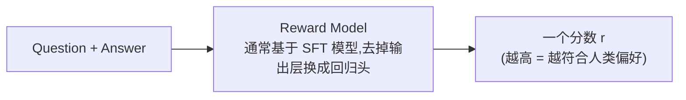
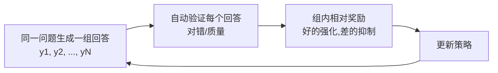

# 3. Preference Learning——人类偏好的建模与优化

> **本章目标**
>
> - 理解为什么 SFT 之后仍然需要偏好学习："模仿示范"教不会模型"什么是更好的回答"
> - 理解偏好数据长什么样、从哪来（人类标注 → AI 生成）
> - 掌握 RLHF 的完整结构：Reward Model + PPO + KL 惩罚，以及它们各自解决什么问题
> - 理解 Reward Hacking（奖励黑客）为什么必然发生，以及业界如何对抗它
> - 亲手推导 DPO：为什么"直接偏好优化"能免去 Reward Model 和强化学习
> - 了解 GRPO、ORPO、SimPO 等新一代方法，以及工业界的演进趋势

---

## 一、为什么 SFT 还不够？

上一章讲到，SFT 让模型学会了"模仿示范"。但模仿有一个天花板：**它只能让模型达到示范的水平，无法告诉模型"哪种回答更好"。**

用户问"如何拒绝朋友的邀请？"，模型可能生成：①"不去。"；②"不好意思，今天有安排，下次一起。"；③"滚。"。三个回答语法都正确，都符合语言模型的基本能力，但人类显然更偏好第二个——**除了"正确"，我们还希望回答礼貌、自然、得体、有帮助**。SFT 的示范数据里可能有第二种回答，但它无法表达"第二种比第一种更好"这个**程度信息**：示范是"绝对的对错"，偏好是"相对的优劣"。

> **SFT 学习"正确答案长什么样"，Preference Learning 学习"哪个答案更好"。** 前者是回归到示范，后者是学会排序——后者才能让模型超越示范的天花板。

## 二、偏好数据：一切偏好学习的原材料

偏好数据的基本单元不是"一条问答"，而是"一个问题 + 两个回答 + 谁更好"：

```text
Question：如何学习 Python？
Answer A：学习语法。
Answer B：建议先学习基础语法，再完成几个小项目，最后阅读优秀开源代码。

人工标注：B 更好
```

模型学习的是"为什么 B 更好"的**隐含规律**（更具体、更有帮助、更结构化），而不是"B 的具体内容"。偏好数据主要有三种来源：

| 来源 | 做法 | 优缺点 |
|---|---|---|
| 人工标注排序 | 让标注员对模型生成的多个回答排序（InstructGPT 的做法，约 33k 组） | 质量最高，但贵、慢、标注员之间有分歧 |
| AI 对比生成 | 用更强的模型（如 GPT-4）判断哪个回答更好，自动生成偏好对 | 便宜、可扩展，但继承了"裁判模型"的偏好与偏见 |
| 产品隐式反馈 | 从真实产品里收集用户行为（采纳、点赞、复制、重新生成）推断偏好 | 最真实，但噪声大、需要清洗 |

一个经常被忽视的细节：**偏好数据里"chosen"（更好）和"rejected"（较差）的差距要适中**。差距太大，模型学不到精细的偏好（"显然更好"没有信息量）；差距太小，模型分不清学习信号。工业界常用"同一个模型用不同温度采样两次再让标注员选"的方式，保证两个回答"各有道理但一个更好"。

## 三、Reward Model：把"人类偏好"变成一个可微的打分器

经典 RLHF 需要为策略新采样出的回答持续提供标量奖励，而人工偏好数据只覆盖有限的回答对。因此，系统会训练一个能泛化到新回答的连续打分器：**Reward Model（奖励模型，RM）**。离散偏好标签本身也可以直接构造 Pairwise Loss 或 DPO Loss；RM 的必要性来自经典 PPO-RLHF 的在线奖励需求，而不是“离散标签无法产生梯度”。



Reward Model 不需要预测一个“绝对正确”的分数，只需要让 chosen 的分数高于 rejected。假设两个回答得分分别为 `2.0` 和 `0.5`，分数差为 `1.5`；经过 Sigmoid 后，模型认为 chosen 更好的概率约为 `0.818`。差距越大，这个概率越接近 `1`。

Pairwise Loss 把这条规则写成：

```math
L_{RM}=-\log\sigma\big(r(x,y_w)-r(x,y_l)\big)
```

**这个公式的作用**：把一对回答的相对顺序转换成一个可反向传播的标量 Loss。

- `x`：问题或指令；
- `y_w`：chosen，即更受偏好的回答；
- `y_l`：rejected，即较差的回答；
- `r(x,y)`：Reward Model 给整段“问题 + 回答”的标量分数；
- `σ`：Sigmoid，把分数差转换到 `0～1`；
- `-log`：当 chosen 的概率较低时产生更大的惩罚。

若 chosen 与 rejected 得分相同，概率为 `0.5`，Loss 为 `-log(0.5)≈0.693`；当 chosen 分数明显更高时，Loss 会接近 `0`。第3.1节会用代码观察这个分数差如何在训练中逐步拉开。

**为什么需要 RM 而不是每次都用人类打分？** 两个原因：①人类打分慢且贵，RM 训练好后可以给任意"问题-回答"即时打分，PPO 每个 step 都要打分；②人类的打分有噪声，RM 相当于把几千条人类判断"蒸馏"成了一个稳定、平滑的打分函数。

## 四、RLHF：用强化学习"讨好"奖励模型

有了 RM，下一步就是让策略模型（被对齐的模型）学会生成高分回答——这是一个标准的强化学习问题。OpenAI 的 **RLHF（Reinforcement Learning from Human Feedback）** 用 PPO 算法解决它：

```mermaid
flowchart LR
    A[SFT 模型(初始策略)] --> B[对指令生成回答] --> C[RM 打分] --> D[PPO 更新策略] --> B
```

PPO 的核心概念不需要先看完整公式，可以先拆成三步：

1. Reward Model 给回答一个奖励；
2. Critic 估计“这个状态原本大约能拿多少奖励”，二者共同形成 Advantage；
3. 更新策略时限制新旧策略的概率比，避免一次改得过大。

例如，某个动作在旧策略下的概率是 `0.20`，更新后变成 `0.30`，概率比为 `1.5`。当该动作的 Advantage 为正、裁剪范围为 `[0.8,1.2]` 时，PPO 的代理目标不会继续奖励比率从 `1.2` 增长到 `1.5`。若 Advantage 为负，裁剪生效的方向相反。Clip 裁剪的是代理目标，不是对参数步长、KL 或真实策略变化的严格上限。

RLHF 还会用 KL 项修改奖励，限制策略偏离参考模型：

```math
r_{shaped}=r_{RM}-\beta\,D_{KL}(\pi_\theta\|\pi_{ref})
```

**这个公式的作用**：先形成用于强化学习的“塑形奖励”，而不是直接得到 Advantage。

- `r_RM`：Reward Model 给出的偏好分数；
- `π_ref`：冻结的参考模型，通常来自 SFT；
- `D_KL`：当前策略与参考策略的分布差异；
- `β`：KL 惩罚强度，越大表示越保守。

随后还要结合轨迹回报和 Critic/Value Model，才能计算 Advantage。不能把“RM 分数减 KL”直接等同于完整的 Advantage。

> **Reward Hacking（奖励黑客）**：模型找到让代理奖励变高的方式，但实际回答质量并没有同步提高。KL 约束只能限制偏移，并不能保证彻底消除 Reward Hacking。

### 补充阅读：PPO 的裁剪目标

主线理解到“概率比 + Advantage + Clip”已经足够。完整的常见写法是：

```math
J^{PPO}(\theta)=\mathbb{E}_t\!\left[\min\!\left(r_t(\theta)\hat A_t,\ \operatorname{clip}(r_t(\theta),1-\epsilon,1+\epsilon)\hat A_t\right)\right]
```

其中 `r_t(θ)=π_θ(a_t|s_t)/π_old(a_t|s_t)` 是新旧策略概率比，`Â_t` 是 Advantage，`ε` 是裁剪宽度，`E_t` 表示对采样位置取平均。`Â_t>0` 时主要限制概率比过度上升，`Â_t<0` 时主要限制概率比过度下降；朝不利方向的变化仍可能产生梯度。这个目标通常被**最大化**；代码若使用梯度下降优化 Loss，通常会对它取负，并叠加 Value Loss、Entropy Bonus 等项。

## 五、PPO 的工程之痛：为什么业界急着找替代品

PPO 效果好，但工程上是出了名的难伺候：

1. **要同时维护多类模型组件**：策略模型、参考模型、Reward Model，以及用于估计 Advantage 的 Value/Critic。Critic 可以与策略共享骨干，但仍增加输出头、状态和计算；
2. **强化学习的固有顽疾**：策略在采样空间里探索，训练不稳定，超参数（`ε`、`β`、学习率）敏感，动不动就"训飞"；
3. **流程复杂**：生成 → 打分 → 计算优势 → 更新 → 重新生成……每一个环节出错都难排查；
4. **数据生成成本高**：Rollout 需要在线生成回答。采样数据通常会被拆成 Mini-Batch 并重复若干 PPO Epoch，但使用次数仍受 On-Policy 约束，不能像固定监督数据那样长期反复训练。

这些痛点推动了 2023 年最重要的一次方法变革：**能不能不训练 RM、不用强化学习，直接用偏好数据优化模型？**

## 六、DPO：把偏好排序直接作用于模型概率

DPO（Direct Preference Optimization）仍使用“问题 + chosen + rejected”的偏好对，但不单独训练 Reward Model，也不运行 PPO 的在线采样循环。理解它时，先不要展开长公式，只看两个中间量。

第一步，比较策略模型与参考模型对同一个回答的对数概率：

```math
r_{impl}(x,y)=\beta\left[\log\pi_\theta(y|x)-\log\pi_{ref}(y|x)\right]
```

**这个公式的作用**：构造一个隐式奖励，衡量当前策略相对参考模型把某个回答的概率提高了多少。

- `π_θ`：正在训练的策略模型；
- `π_ref`：冻结的参考模型；
- `log π(y|x)`：模型对完整回答 `y` 的 Token Log Probability 之和；
- `β`：缩放系数，决定相对参考模型变化在 Loss 中的尺度。

第二步，像 Reward Model 的 Pairwise Loss 一样，让 chosen 的隐式奖励高于 rejected：

```math
L_{DPO}=-\log\sigma\left(r_{impl}(x,y_w)-r_{impl}(x,y_l)\right)
```

**这个公式的作用**：输出一个标量 Loss；当 chosen 的相对概率提升更多时，Loss 变小。

第3.1节使用四个具体 Log Probability 计算：chosen 隐式奖励为 `0.07`，rejected 为 `-0.11`，差值为 `0.18`，最终 `Loss≈0.607`。这个数值链比直接记忆展开式更重要。

把第一步代入第二步，才得到论文中常见的完整形式：

```math
L_{DPO}=-\log\sigma\!\left(\beta\log\frac{\pi_\theta(y_w|x)}{\pi_{ref}(y_w|x)}-\beta\log\frac{\pi_\theta(y_l|x)}{\pi_{ref}(y_l|x)}\right)
```

### 补充阅读：隐式奖励从哪里来

在 KL 正则化的 RLHF 目标下，最优策略与奖励之间可以写出解析关系：

```math
r(x,y)=\beta\log\frac{\pi^*(y|x)}{\pi_{ref}(y|x)}+\beta\log Z(x)
```

`Z(x)` 只依赖问题，不依赖具体回答；比较同一问题的 chosen 与 rejected 时，它会在奖励差中抵消。这个推导解释了 DPO 的来源，但不是使用 DPO 前必须掌握的内容。

“Direct”表示偏好数据可以直接构造策略模型的监督式损失，不再显式训练 RM 或执行 PPO。它不意味着训练没有参考模型、超参数或稳定性问题；`β` 的具体效果还与实现约定和数据分布有关。

## 七、GRPO：为推理而生的"组内相对"优化

DPO 之后又出现了大量变体，其中对今天影响最大的是 **GRPO（Group Relative Policy Optimization）**——DeepSeek-R1 用它训练出了震惊行业的推理模型。

GRPO 解决的是 PPO 的另一个痛点：PPO 需要维护一个 **Value Model（价值模型）**来估计优势函数，这个模型又大又难训。GRPO 的思路很直接：**让策略模型对同一个问题生成一组（Group）回答，用"组内相对好坏"代替 Value Model 的估计**——哪个回答在组内表现最好，就强化哪个。配合"推理答案可以程序自动验证"（数学题对错、代码能不能跑），GRPO 让 RL 训练既不需要 RM 也不需要 Value Model，效率和稳定性都大幅提升。



## 八、方法谱系与工业界演进

| 方法 | 核心思想 | 是否需要 RM | 是否需要强化学习 | 典型场景 |
|---|---|---|---|---|
| RLHF + PPO | RM 打分 + 近端策略优化 + KL | 是 | 是 | 2022~2023 的 ChatGPT |
| DPO | 用模型概率构造隐式奖励 | 否 | 否 | 2023 起，通用对话 |
| ORPO | SFT 与偏好优化一步完成 | 否 | 否 | 减少训练阶段 |
| SimPO | 进一步简化 DPO（去掉参考模型） | 否 | 否 | 追求极简稳定 |
| GRPO | 组内相对奖励，免去 Value Model | 否 | 是（轻量） | 2025 起，推理模型（R1） |
| KTO | 用"整体可接受性"替代成对比较 | 否 | 否 | 数据只有单边反馈时 |

**工业界的时间线**：2022 年 RLHF/PPO 一统天下 → 2023 年 DPO 以"简单"逆袭 → 2024 年 ORPO/SimPO 等极简派涌现 → 2025 年起，随着 DeepSeek-R1 的爆火，**GRPO 成为推理模型训练的事实标准**，偏好学习与推理训练开始合流（"Reasoning Preference"）。总的趋势是：**越来越少的强化学习组件，越来越简单的目标函数——但 RLHF 确立的"优化人类偏好"这个思想从未改变。**

## 工程工具箱

| 框架 | 特点 |
|---|---|
| TRL（HuggingFace） | 官方支持 PPO / DPO / ORPO / GRPO / KTO，与 transformers 无缝集成，目前应用最广 |
| OpenRLHF | 开源 RLHF 平台，支持大规模分布式 PPO/DPO |
| verl（字节火山引擎） | 新一代 RL 训练框架，重点支持 GRPO / RLVR，DeepSeek 社区大量采用 |
| DeepSpeed-Chat | 微软的完整 RLHF 流水线（SFT + RM + PPO），适合大规模 |

---

想亲手体验 Reward Model 到底是怎么训练出来的、DPO 的隐式奖励如何在代码里真正算出来，可以看这一节实验：**3.1 亲手训练一个 Reward Model，并手写一次不依赖 TRL 的 DPO Loss**。

## 本章总结

本章我们理解了：

✅ SFT 学"正确答案长什么样"，Preference Learning 学"哪个更好"——后者才能超越示范的天花板 ✅ 偏好数据的基本单元是"问题 + 两个回答 + 谁更好"，来源包括人工标注、AI 生成与产品隐式反馈 ✅ Reward Model 把人类偏好蒸馏成连续打分器，用 Pairwise Loss（Bradley-Terry）训练 ✅ PPO 用"clip 概率比 + KL 惩罚"在优化奖励的同时防止策略崩坏与 Reward Hacking ✅ DPO 利用"最优策略与奖励的解析映射"，把 RM 打分替换成策略自身的隐式奖励，免去 RM 和强化学习 ✅ GRPO 用组内相对奖励替代 Value Model，成为推理模型训练的新标准 ✅ 方法在演进（PPO → DPO → GRPO），但"优化人类偏好"的目标从未改变

> **SFT 教会模型"会回答"，Preference Learning 教会模型"回答得更符合人类偏好"。RLHF 是第一个答案，DPO 是更简单的答案，GRPO 是推理时代的答案——问题始终没变，变的是解法越来越简单。**

## 下一章预告

模型已经会执行指令、回答也符合偏好。但还有一个问题：让它做一道数学题，它可能"一本正经地写出错误的推理过程"——它会模仿推理的样子，却未必真正会推理。下一章，我们将进入：

> **第4章 Reasoning Alignment——模型如何学会真正推理？**

---

# 参考资料

- OpenAI《Training language models to follow instructions with human feedback》(InstructGPT，RLHF 与 33k 偏好数据出处)：https://arxiv.org/abs/2203.02155
- Rafailov et al.《Direct Preference Optimization: Your Language Model is Secretly a Reward Model》(DPO 论文，本章第六节的推导出处)：https://arxiv.org/abs/2305.18290
- Anthropic《Training a Helpful and Harmless Assistant with RLHF》(RM 训练与偏好数据细节)：https://arxiv.org/abs/2204.05862
- DeepSeek《DeepSeek-R1》(GRPO + RLVR 推理训练)：https://arxiv.org/abs/2501.12948
- HuggingFace《Alignment Handbook》(DPO/PPO 全流程代码)：https://github.com/huggingface/alignment-handbook

---

## 思考题

1. SFT 学“正确答案长什么样”，Preference Learning 学“哪个答案更好”——为什么后者能突破示范数据的天花板？
2. RLHF 中的 KL 惩罚项 β·KL(π‖π_ref) 防的是什么问题？把 β 设为 0 会发生什么？
3. DPO 是如何做到“不需要 Reward Model、不需要强化学习”的？它隐含利用了 RLHF 目标函数的什么性质？
4. 为什么 Reward Hacking 在 RLHF 中“必然发生”而不是偶然事故？从“奖励是代理指标”的角度解释。
