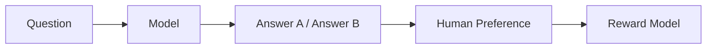
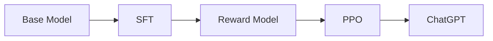
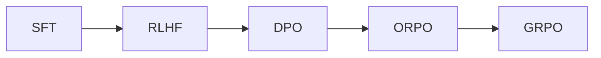
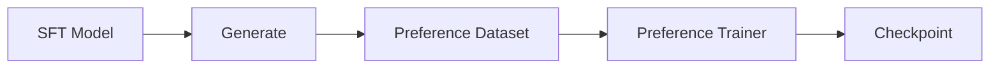

# 第3章 Preference Learning——模型如何学会人类真正喜欢的回答？

## 本章目标

完成本章学习后，你将理解：

- 为什么 SFT 之后仍然需要继续训练
- 什么是 Human Preference（人类偏好）
- 为什么 RLHF 会出现
- Reward Model 的作用
- PPO 的 Clip 目标函数，以及 DPO 损失函数的具体公式与推导
- PPO、DPO、ORPO、GRPO 等方法之间的关系
- 当前工业界 Preference Learning 的主流方案

---

## 一个没有标准答案的问题

上一章我们学习了 SFT，模型已经能够理解用户、执行指令。但新的问题来了：如果同一个问题存在很多种答案，模型应该选择哪一个？

用户问"如何拒绝朋友的邀请？"，模型可能回答：①"不去。"；②"不好意思，今天有安排，下次一起。"；③"滚。"。三个答案语法都正确，甚至都符合 Next Token Prediction，但人类显然更喜欢第二种——因为除了"正确"，我们还希望回答礼貌、自然、有帮助。这就是**人类偏好（Human Preference）**。

## SFT 为什么不够？

SFT 学习的是"正确答案"，但现实世界很多问题没有唯一答案。例如"如何拒绝别人？"——有人喜欢直接，有人喜欢委婉，有人喜欢幽默，这些回答都可以。SFT 无法告诉模型"哪一种更受欢迎"，于是需要 Preference Learning。

## 什么是 Preference Learning？

Preference Learning（偏好学习）的目标不是学习知识，而是学习**人类更喜欢哪一种回答**。同一个问题，模型生成两个答案，标注人员选择更好的一个，模型不断学习这种偏好，回答就会越来越符合人的习惯。

## Human Preference Dataset

Preference数据通常不是一个答案，而是"一对"答案加一个标注：

```text
Question：如何学习 Python？
Answer A：学习语法。
Answer B：建议先学习基础语法，再完成几个小项目，最后阅读优秀开源代码。

人工标注：B 更好
```

模型学习的是"为什么 B 更好"，而不是"B 的具体内容"。

## Reward Model

如何让模型知道哪个答案更好？工业界引入了 **Reward Model**：



Reward Model 负责预测哪个回答更符合人的偏好。有了它，之后就不需要每次都靠人工评分，而是由 Reward Model 自动打分。

## RLHF——Reinforcement Learning from Human Feedback

OpenAI 最早采用的方法就是 RLHF（基于人类反馈的强化学习）：



RLHF 第一次真正让模型开始学习人类偏好。

## PPO

RLHF 最经典的算法是 **PPO（Proximal Policy Optimization）**，本质上是一种强化学习算法：模型不断生成回答，Reward Model 不断评分，模型根据奖励调整参数，最终越来越符合人类偏好。

**具体优化的目标函数是什么？** 前面反复说"本质上是强化学习"，但一直没有写出公式——PPO 真正优化的是：

$$
L^{PPO}(\theta) = \mathbb{E}\left[\min\Big(r_t(\theta)\,\hat{A}_t,\ \ \text{clip}\big(r_t(\theta),\,1-\epsilon,\,1+\epsilon\big)\,\hat{A}_t\Big)\right]
$$

其中 `r_t(θ) = π_θ(y|x) / π_θ_old(y|x)` 是"当前策略"和"更新前策略"生成同一个回答的概率比值，`Â_t` 是优势函数（这个回答比 Reward Model 打分的平均水平好多少）。`clip(...)` 把这个比值强行限制在 `[1-ε, 1+ε]` 一个很窄的范围内——**这正是"Proximal（临近）"这个词的含义**：无论这一步的奖励信号有多诱人，也不允许新策略和旧策略偏离太远，防止单次更新幅度过大直接把模型训崩。

**这里的 `Â_t` 具体怎么来？** 并不是直接用 Reward Model 的打分，而是还要再减去一个 **KL 惩罚项**：

$$
\hat{A}_t \approx r_\phi(x, y) - \beta \cdot \text{KL}\big(\pi_\theta(\cdot|x) \,\|\, \pi_{ref}(\cdot|x)\big)
$$

`r_φ(x, y)` 就是第3.1节亲手训练的那个 Reward Model 给出的打分；`π_ref` 是训练开始前那个固定不动的参考模型（通常就是 SFT 之后的模型）。**为什么还要减掉一个 KL 惩罚？** 因为如果只追求 Reward Model 打分越高越好，模型很容易学会"讨好"打分器本身的漏洞（比如疯狂堆砌 Reward Model 碰巧偏好的某些词），而不是真正变得更好——这种现象叫 **Reward Hacking（奖励黑客）**。KL 惩罚强迫模型的输出分布不能离原始的、语言能力健全的 `π_ref` 太远，是防止 Reward Hacking 最基本的手段。

## 为什么后来大家不用 PPO 了？

PPO 效果很好，但训练成本非常高：训练过程复杂、需要额外维护一个 Reward Model、容易训练不稳定、GPU 消耗巨大——光看上面的公式就能感受到，一次更新需要同时跑通"策略模型 + 参考模型 + Reward Model"三个模型的前向计算。于是工业界开始寻找更简单的方法。

## DPO——直接偏好优化

2023年提出的 DPO（Direct Preference Optimization），最大的变化是**不再需要 Reward Model，也不需要强化学习**：

```text
Question + Chosen Answer + Rejected Answer → 直接优化模型
```

**这背后的关键数学洞察是什么？** 回顾上面 PPO 要解决的问题：在"不要偏离参考模型 `π_ref` 太远"（用 KL 约束）的前提下，最大化 Reward Model 的打分。可以证明，这样一个约束优化问题存在解析解——**最优策略 `π*` 和 Reward `r` 之间，满足一个固定的映射关系**：

$$
r(x, y) = \beta \log\frac{\pi^{*}(y|x)}{\pi_{ref}(y|x)} + \beta \log Z(x)
$$

其中 `Z(x)` 是一个只依赖于问题 `x`、和具体回答 `y` 完全无关的归一化常数。**DPO 的洞察是**：把这个关系代入第3.1节讲过的 Bradley-Terry 偏好模型——`P(chosen 优于 rejected) = σ(r_chosen − r_rejected)`——两个 Reward 相减时，那个恼人的 `Z(x)` 会**正好完全抵消掉**！于是根本不需要真正训练出一个独立的 Reward Model，直接用策略模型自己的概率，就能构造出等价的损失函数：

$$
L^{DPO}(\theta) = -\log\sigma\!\left(\beta\log\frac{\pi_\theta(y_w|x)}{\pi_{ref}(y_w|x)} - \beta\log\frac{\pi_\theta(y_l|x)}{\pi_{ref}(y_l|x)}\right)
$$

其中 `y_w` 是 chosen（更好的回答，w 代表 winner）、`y_l` 是 rejected（较差的回答，l 代表 loser）。把这个公式和 3.1节的 Pairwise Loss（`-log σ(chosen_reward − rejected_reward)`）放在一起对比，会发现它们**长得几乎一模一样**，唯一的区别是：Reward Model 打出的分数，被换成了 `β·log(策略模型概率 / 参考模型概率)`——这个量有一个专门的名字，叫**隐式 Reward（Implicit Reward）**。这正是"直接偏好优化"里"直接"两个字的真正含义：**策略模型自己的概率，同时充当了打分器**，不需要额外训练一个模型专门打分，也不需要 PPO 里那套采样-打分-裁剪的强化学习流程。这里的 `beta` 参数控制的正是这个隐式 Reward 的缩放程度——这也是为什么13.4节的实验里，`beta` 越大模型越保守：它在约束策略离参考模型能有多远，作用和 PPO 里的 KL 惩罚项完全一致，只是从"训练时的一个惩罚项"变成了"损失函数里的一个缩放系数"。

训练流程更简单、成本更低，目前已经成为工业界最主流的方案之一。

## ORPO、SimPO、GRPO

随着 DPO 的成功，又出现了越来越多新的偏好优化方法：

| 方法 | 特点 |
|---|---|
| ORPO | 在一次训练中同时完成监督学习和偏好学习，减少训练步骤 |
| SimPO | 进一步简化偏好目标，提高训练稳定性 |
| GRPO | 近年来 Reasoning Model（如 DeepSeek-R1、Qwen3-Reasoning）大量采用，更关注推理过程而不仅仅是最终答案 |

## Preference Learning 的演进



可以看到，研究重点正在逐渐从强化学习转向更简单、更稳定、更高效的直接偏好优化。

## 工程实践：工业界如何做 Preference Learning？



训练过程中通常需要 Chosen Answer、Rejected Answer 和 Pairwise Loss 三个要素，共同完成 Preference Optimization。

## 工程工具箱

| 框架 | 特点 |
|---|---|
| TRL（Transformer Reinforcement Learning） | Hugging Face 官方，支持 PPO/DPO/ORPO/GRPO，目前应用最广 |
| OpenRLHF | 开源 RLHF 平台，支持 Reward Model、PPO、DPO 及大规模分布式训练 |
| verl（Volcano Engine RL） | 近年来发展最快，重点支持 Reasoning、GRPO、RFT、Rollout，DeepSeek 社区大量采用 |
| DeepSpeed-Chat | 微软推出的完整 RLHF 训练流程（SFT + Reward Model + PPO），适合大规模训练 |

DPO 跳过了 Reward Model 这一步，但 Reward Model 到底是怎么训练出来的？DPO 的隐式 Reward 又是如何在代码里真正算出来的？想亲手体验一次，可以看这一节实验：**3.1 亲手训练一个 Reward Model，并手写一次不依赖 TRL 的 DPO Loss**。

## Industry Snapshot

| 阶段 | 主流方案 |
|---|---|
| 2022 | RLHF + PPO |
| 2023 | DPO |
| 2024 | ORPO、SimPO |
| 2025~2026 | GRPO、Reasoning Preference |

总体趋势：**越来越少依赖强化学习，越来越多采用直接偏好优化。**

---

## 本章总结

本章我们理解了：

✅ SFT 学习"正确回答"，Preference Learning 学习"更好的回答" ✅ RLHF 首次将人类偏好引入模型训练，PPO 的 Clip 目标函数 + KL 惩罚，既利用优势函数追求高奖励，又防止策略偏离参考模型太远、避免 Reward Hacking ✅ DPO 通过"最优策略与Reward之间的解析映射关系"，把 Reward Model 的打分替换成策略模型自身的隐式Reward，跳过了 Reward Model 和强化学习采样这两个环节，本质上和 PPO 优化的是同一个目标 ✅ GRPO 已成为新一代 Reasoning 模型的重要训练方法

> **SFT 教会模型"会回答"，Preference Learning 教会模型"回答得更符合人类偏好"。**

---

## 下一章预告

经过 SFT、Preference Learning，模型已经能够理解用户、回答自然、符合偏好。但还有一个问题：模型为什么有时候会胡说八道？为什么会被 Prompt Injection 或 Jailbreak 攻击？下一章，我们将进入：

> **第4章 Safety Alignment——如何让大模型既有能力，又足够安全？**
