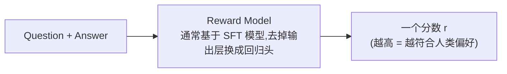
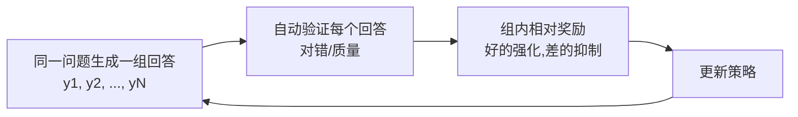

# 第3章 Preference Learning——模型如何学会人类真正喜欢的回答？

> **本章目标**
>
> - 理解为什么 SFT 之后仍然需要偏好学习："模仿示范"教不会模型"什么是更好的回答"
> - 理解偏好数据长什么样、从哪来（人类标注 → AI 生成）
> - 掌握 RLHF 的完整结构：Reward Model + PPO + KL 惩罚，以及它们各自解决什么问题
> - 理解 Reward Hacking（奖励黑客）为什么必然发生，以及业界如何对抗它
> - 亲手推导 DPO：为什么"直接偏好优化"能免去 Reward Model 和强化学习
> - 了解 GRPO、ORPO、SimPO 等新一代方法，以及工业界的演进趋势

---

## 一、为什么 SFT 还不够？

上一章讲到，SFT 让模型学会了"模仿示范"。但模仿有一个天花板：**它只能让模型达到示范的水平，无法告诉模型"哪种回答更好"。**

用户问"如何拒绝朋友的邀请？"，模型可能生成：①"不去。"；②"不好意思，今天有安排，下次一起。"；③"滚。"。三个回答语法都正确，都符合语言模型的基本能力，但人类显然更偏好第二个——**除了"正确"，我们还希望回答礼貌、自然、得体、有帮助**。SFT 的示范数据里可能有第二种回答，但它无法表达"第二种比第一种更好"这个**程度信息**：示范是"绝对的对错"，偏好是"相对的优劣"。

> **SFT 学习"正确答案长什么样"，Preference Learning 学习"哪个答案更好"。** 前者是回归到示范，后者是学会排序——后者才能让模型超越示范的天花板。

## 二、偏好数据：一切偏好学习的原材料

偏好数据的基本单元不是"一条问答"，而是"一个问题 + 两个回答 + 谁更好"：

```text
Question：如何学习 Python？
Answer A：学习语法。
Answer B：建议先学习基础语法，再完成几个小项目，最后阅读优秀开源代码。

人工标注：B 更好
```

模型学习的是"为什么 B 更好"的**隐含规律**（更具体、更有帮助、更结构化），而不是"B 的具体内容"。偏好数据主要有三种来源：

| 来源 | 做法 | 优缺点 |
|---|---|---|
| 人工标注排序 | 让标注员对模型生成的多个回答排序（InstructGPT 的做法，约 33k 组） | 质量最高，但贵、慢、标注员之间有分歧 |
| AI 对比生成 | 用更强的模型（如 GPT-4）判断哪个回答更好，自动生成偏好对 | 便宜、可扩展，但继承了"裁判模型"的偏好与偏见 |
| 产品隐式反馈 | 从真实产品里收集用户行为（采纳、点赞、复制、重新生成）推断偏好 | 最真实，但噪声大、需要清洗 |

一个经常被忽视的细节：**偏好数据里"chosen"（更好）和"rejected"（较差）的差距要适中**。差距太大，模型学不到精细的偏好（"显然更好"没有信息量）；差距太小，模型分不清学习信号。工业界常用"同一个模型用不同温度采样两次再让标注员选"的方式，保证两个回答"各有道理但一个更好"。

## 三、Reward Model：把"人类偏好"变成一个可微的打分器

偏好数据是"离散的排序"，无法直接用来做梯度更新——梯度需要的是一个**连续的打分函数**。于是业界训练了一个专门的模型：**Reward Model（奖励模型，RM）**。



Reward Model 的训练方式非常优雅：把偏好对（chosen, rejected）喂给它，用 **Pairwise Loss**（成对损失）训练——让 chosen 的得分高于 rejected：

$$
L_{RM} = -\log\sigma\big(r(x, y_w) - r(x, y_l)\big)
$$

其中 `r(x, y)` 是 RM 对"问题 x + 回答 y"的打分，`y_w` 是更好的回答，`y_l` 是较差的回答，`σ` 是 Sigmoid 函数。这个损失的本质是 Bradley-Terry 偏好模型：**"chosen 优于 rejected"的概率 = σ(两个分数的差)**。训练完成后，RM 就成了"人类偏好的代理"——它读过的偏好对越多，代理得越准。（第3.1节的实验会亲手训练一个最小 RM。）

**为什么需要 RM 而不是每次都用人类打分？** 两个原因：①人类打分慢且贵，RM 训练好后可以给任意"问题-回答"即时打分，PPO 每个 step 都要打分；②人类的打分有噪声，RM 相当于把几千条人类判断"蒸馏"成了一个稳定、平滑的打分函数。

## 四、RLHF：用强化学习"讨好"奖励模型

有了 RM，下一步就是让策略模型（被对齐的模型）学会生成高分回答——这是一个标准的强化学习问题。OpenAI 的 **RLHF（Reinforcement Learning from Human Feedback）** 用 PPO 算法解决它：

```mermaid
flowchart LR
    A[SFT 模型(初始策略)] --> B[对指令生成回答] --> C[RM 打分] --> D[PPO 更新策略] --> B
```

**PPO 优化的目标函数**：

$$
L^{PPO}(\theta) = \mathbb{E}\left[\min\Big(r_t(\theta)\,\hat{A}_t,\ \ \text{clip}\big(r_t(\theta),\,1-\epsilon,\,1+\epsilon\big)\,\hat{A}_t\Big)\right]
$$

- `r_t(θ) = π_θ(y|x) / π_θ_old(y|x)`：当前策略与更新前策略生成同一回答的概率比值——衡量"这一步策略动了多少"；
- `Â_t`：优势函数——这个回答比平均水平好多少；
- `clip(...)`：把概率比值限制在 `[1-ε, 1+ε]` 内，**无论奖励信号多诱人，单次更新都不允许策略偏离太远**——这正是"Proximal（近端）"的含义，防止一次更新把模型训崩。

**`Â_t` 具体怎么算？** 它并不是直接用 RM 的分数，而是减去一个 **KL 惩罚项**：

$$
\hat{A}_t \approx r_\phi(x, y) - \beta \cdot \text{KL}\big(\pi_\theta(\cdot|x) \,\|\, \pi_{ref}(\cdot|x)\big)
$$

其中 `π_ref` 是训练开始时的参考模型（通常就是 SFT 模型，训练期间冻结不动），`β` 控制惩罚强度。**为什么必须减掉 KL？** 因为 RM 只是人类偏好的"近似代理"，它一定有漏洞。如果只追求 RM 分数最大化，模型会学会钻漏洞——例如疯狂堆砌 RM 碰巧偏好的措辞、生成又长又空洞的回答来"刷分"。这个现象有专门的名字：

> **Reward Hacking（奖励黑客）：模型发现了让奖励变高的捷径，但这个捷径并不等于真正的"变好"。**

KL 惩罚的物理意义是：**你可以优化，但你的输出分布不能离原本语言能力健全的模型太远**——它把"优化"限制在"说话方式"的范围内，防止模型为了刷分而说人话的能力崩坏。`β` 越大，模型越保守。

## 五、PPO 的工程之痛：为什么业界急着找替代品

PPO 效果好，但工程上是出了名的难伺候：

1. **要同时跑三个模型**：策略模型（生成回答）、参考模型（算 KL）、RM（打分）——一次更新要三份前向计算，显存和算力开销巨大；
2. **强化学习的固有顽疾**：策略在采样空间里探索，训练不稳定，超参数（`ε`、`β`、学习率）敏感，动不动就"训飞"；
3. **流程复杂**：生成 → 打分 → 计算优势 → 更新 → 重新生成……每一个环节出错都难排查；
4. **数据利用率低**：PPO 采样的回答只用一次就丢弃，样本效率远低于监督学习。

这些痛点推动了 2023 年最重要的一次方法变革：**能不能不训练 RM、不用强化学习，直接用偏好数据优化模型？**

## 六、DPO：直接偏好优化——把"打分"换成"模型的概率"

**DPO（Direct Preference Optimization，Rafailov et al. 2023）** 的回答是：能。它的关键洞察藏在上一章 RLHF 的数学结构里。

回顾 RLHF：在"不偏离参考模型 `π_ref` 太远"（KL 约束）的前提下最大化 RM 打分。这是一个**带约束的优化问题**，数学上可以证明它存在解析解——**最优策略 `π*` 和奖励函数 `r` 之间存在固定的映射**：

$$
r(x, y) = \beta \log\frac{\pi^{*}(y|x)}{\pi_{ref}(y|x)} + \beta \log Z(x)
$$

其中 `Z(x)` 是一个只依赖问题 `x`、与具体回答 `y` 无关的归一化常数。**DPO 的洞察是**：把这个映射代回 Bradley-Terry 偏好模型——`P(chosen 优于 rejected) = σ(r_chosen − r_rejected)`——两个奖励相减时，那个恼人的 `Z(x)` 会**恰好抵消**！于是根本不需要显式训练 RM，直接用策略模型自己的概率就能构造出等价的损失：

$$
L^{DPO}(\theta) = -\log\sigma\!\left(\beta\log\frac{\pi_\theta(y_w|x)}{\pi_{ref}(y_w|x)} - \beta\log\frac{\pi_\theta(y_l|x)}{\pi_{ref}(y_l|x)}\right)
$$

把它和第3.1节的 Pairwise Loss（`-log σ(chosen_reward − rejected_reward)`）对比，会发现**长得几乎一模一样**——唯一的区别是：RM 打出的分数被换成了 `β·log(策略概率 / 参考模型概率)`。这个量叫**隐式奖励（Implicit Reward）**：策略模型自己的概率，同时充当了打分器。

**"直接"二字的含义**：不需要训练 RM，不需要 PPO 的采样-打分-裁剪循环，只需要 SFT 后的模型 + 一份偏好数据 + 这个损失函数——训练流程和 SFT 一样简单。`β` 的物理意义和 PPO 里的 KL 惩罚完全一致：约束策略离参考模型多远，`β` 越大模型越保守（这也是第一部分 13.4 节实验里"β 越大变化越小"的原因）。

## 七、GRPO：为推理而生的"组内相对"优化

DPO 之后又出现了大量变体，其中对今天影响最大的是 **GRPO（Group Relative Policy Optimization）**——DeepSeek-R1 用它训练出了震惊行业的推理模型。

GRPO 解决的是 PPO 的另一个痛点：PPO 需要维护一个 **Value Model（价值模型）**来估计优势函数，这个模型又大又难训。GRPO 的思路很直接：**让策略模型对同一个问题生成一组（Group）回答，用"组内相对好坏"代替 Value Model 的估计**——哪个回答在组内表现最好，就强化哪个。配合"推理答案可以程序自动验证"（数学题对错、代码能不能跑），GRPO 让 RL 训练既不需要 RM 也不需要 Value Model，效率和稳定性都大幅提升。



## 八、方法谱系与工业界演进

| 方法 | 核心思想 | 是否需要 RM | 是否需要强化学习 | 典型场景 |
|---|---|---|---|---|
| RLHF + PPO | RM 打分 + 近端策略优化 + KL | 是 | 是 | 2022~2023 的 ChatGPT |
| DPO | 用模型概率构造隐式奖励 | 否 | 否 | 2023 起，通用对话 |
| ORPO | SFT 与偏好优化一步完成 | 否 | 否 | 减少训练阶段 |
| SimPO | 进一步简化 DPO（去掉参考模型） | 否 | 否 | 追求极简稳定 |
| GRPO | 组内相对奖励，免去 Value Model | 否 | 是（轻量） | 2025 起，推理模型（R1） |
| KTO | 用"整体可接受性"替代成对比较 | 否 | 否 | 数据只有单边反馈时 |

**工业界的时间线**：2022 年 RLHF/PPO 一统天下 → 2023 年 DPO 以"简单"逆袭 → 2024 年 ORPO/SimPO 等极简派涌现 → 2025 年起，随着 DeepSeek-R1 的爆火，**GRPO 成为推理模型训练的事实标准**，偏好学习与推理训练开始合流（"Reasoning Preference"）。总的趋势是：**越来越少的强化学习组件，越来越简单的目标函数——但 RLHF 确立的"优化人类偏好"这个思想从未改变。**

## 工程工具箱

| 框架 | 特点 |
|---|---|
| TRL（HuggingFace） | 官方支持 PPO / DPO / ORPO / GRPO / KTO，与 transformers 无缝集成，目前应用最广 |
| OpenRLHF | 开源 RLHF 平台，支持大规模分布式 PPO/DPO |
| verl（字节火山引擎） | 新一代 RL 训练框架，重点支持 GRPO / RLVR，DeepSeek 社区大量采用 |
| DeepSpeed-Chat | 微软的完整 RLHF 流水线（SFT + RM + PPO），适合大规模 |

---

想亲手体验 Reward Model 到底是怎么训练出来的、DPO 的隐式奖励如何在代码里真正算出来，可以看这一节实验：**3.1 亲手训练一个 Reward Model，并手写一次不依赖 TRL 的 DPO Loss**。

## 本章总结

本章我们理解了：

✅ SFT 学"正确答案长什么样"，Preference Learning 学"哪个更好"——后者才能超越示范的天花板 ✅ 偏好数据的基本单元是"问题 + 两个回答 + 谁更好"，来源包括人工标注、AI 生成与产品隐式反馈 ✅ Reward Model 把人类偏好蒸馏成连续打分器，用 Pairwise Loss（Bradley-Terry）训练 ✅ PPO 用"clip 概率比 + KL 惩罚"在优化奖励的同时防止策略崩坏与 Reward Hacking ✅ DPO 利用"最优策略与奖励的解析映射"，把 RM 打分替换成策略自身的隐式奖励，免去 RM 和强化学习 ✅ GRPO 用组内相对奖励替代 Value Model，成为推理模型训练的新标准 ✅ 方法在演进（PPO → DPO → GRPO），但"优化人类偏好"的目标从未改变

> **SFT 教会模型"会回答"，Preference Learning 教会模型"回答得更符合人类偏好"。RLHF 是第一个答案，DPO 是更简单的答案，GRPO 是推理时代的答案——问题始终没变，变的是解法越来越简单。**

## 下一章预告

模型已经会执行指令、回答也符合偏好。但还有一个问题：让它做一道数学题，它可能"一本正经地写出错误的推理过程"——它会模仿推理的样子，却未必真正会推理。下一章，我们将进入：

> **第4章 Reasoning Alignment——模型如何学会真正推理？**

---

# 参考资料

- OpenAI《Training language models to follow instructions with human feedback》(InstructGPT，RLHF 与 33k 偏好数据出处)：https://arxiv.org/abs/2203.02155
- Rafailov et al.《Direct Preference Optimization: Your Language Model is Secretly a Reward Model》(DPO 论文，本章第六节的推导出处)：https://arxiv.org/abs/2305.18290
- Anthropic《Training a Helpful and Harmless Assistant with RLHF》(RM 训练与偏好数据细节)：https://arxiv.org/abs/2204.05862
- DeepSeek《DeepSeek-R1》(GRPO + RLVR 推理训练)：https://arxiv.org/abs/2501.12948
- HuggingFace《Alignment Handbook》(DPO/PPO 全流程代码)：https://github.com/huggingface/alignment-handbook
