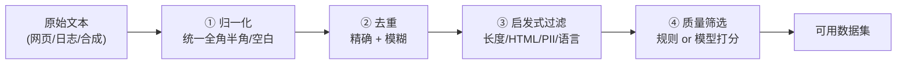

# 3. 数据工程——数据从哪来、怎么洗、怎么配比

> **本章目标**
>
> - 认识真实的开源预训练语料（Common Crawl → C4 → The Pile → RedPajama），理解"清洗"在 LLM 时代的分量
> - 掌握工业级清洗流水线的四道关卡：归一化 → 去重 → 启发式过滤 → 质量筛选
> - 理解为什么去重不是"省空间"的小事，以及 PII 脱敏为什么是合规红线而非质量问题
> - 理解质量筛选的两条路线（规则打分 vs LLM 打分），以及它与"数据质量 >> 数据数量"的关系
> - 理解数据配比为什深刻影响模型能力，以及它为什么没有银弹
> - 建立核心认知：**数据是模型的上限，而清洗是数据的上限**（动手实现见实验 3.1、3.2）

---

## 一、为什么数据工程值得单独一章？

上一章讲清了：范式决定数据需求——预训练（自监督）需要海量无标注文本，SFT（监督）需要成对的"指令-回答"。

但还有一个更前置的问题：**这些数据最初是从哪来的？拿到手的原始文本有多脏？怎么把它洗成能训练的样子？**

这个问题值得单独一章，原因有三：

1. **它决定了模型的上限**。模型结构、训练技巧可以抄论文，但数据管线抄不走——它是一家公司的核心资产。
2. **它最容易被低估**。初学者往往盯着模型结构和超参数，实际上工业界公认：数据工程的收益远超调参。
3. **它的投入最"不划算"却最必要**。从 Common Crawl 到 C4，丢掉的原始内容通常占绝大部分——你可能花很大力气清洗，最后只留下很小一部分，但正是这一小部分决定了模型质量。

---

## 二、真实语料的来源：从原始网页到开源数据集

预训练数据来自互联网原始文本，工业界会把它整理成几个著名的开源数据集。理解它们的递进关系，就理解了"清洗"这个词在 LLM 时代的分量：

| 数据集 | 来源 | 规模量级 | 特点 |
|---|---|---|---|
| **Common Crawl** | 全网公开网页（每月增量抓取） | PB 级原始 HTML | 几乎所有开源语料的源头，但**极脏**——含大量广告、导航栏、重复模板 |
| **C4**（Colossal Clean Crawled Corpus） | Common Crawl 的清洗版 | 约 750GB | T5 团队做的启发式清洗（去样板文本、去广告）；**名字里的 "Clean" 就是"清洗"的经典范例** |
| **The Pile** | 混合多源（网页 + 学术 + 代码 + 书籍 + 对话） | 约 825GB | 强调**多样性**与领域配比，是 GPT-Neo/Pythia 的训练语料 |
| **RedPajama / Dolma** | 复现 LLaMA 配比的开源语料 | 万亿 Token 级 | 社区为复现 LLaMA 而整理，配比公开透明 |

**关键认知**：Common Crawl 抓下来的是**原始 HTML**，里面有导航栏、cookie 提示、广告、版权模板。这些**样板文本（Boilerplate）**如果不清掉，模型会学到一堆"网页噪声"。

> 从 Common Crawl 到 C4，丢掉的原始内容通常占绝大部分——**清洗率之高，往往超出初学者想象**。这正是"数据工程"这个词的重量所在。

**中文场景**：中文预训练语料常来自中文维基、中文网页、开源书籍。结合实验 3.2 讲过的"中文更费 Token"，同样规模的中文语料在 Token 数上会膨胀，配比时需把这点算进去。

---

## 三、清洗流水线：四道关卡

一条工业级清洗流水线通常包含四步，从粗到细：

| 关卡 | 做什么 | 为什么必须做 |
|---|---|---|
| **① 归一化** | NFKC 归一化（全角→半角）、折叠连续空白 | 让"看起来不同、实际相同"的文本统一，为去重做准备；中文全角/半角混用极常见，是**中文清洗的必做项** |
| **② 去重** | 精确去重（哈希）；近似重复需 MinHash/SimHash | 重复数据导致过拟合，且互联网内容大量互相转载，不去重会**严重扭曲数据分布** |
| **③ 启发式过滤** | 长度过滤、HTML/样板过滤、PII 脱敏、语言检测 | 去掉无信息量样本与网页噪声；**PII（邮箱、手机号等）是合规红线**，不是单纯的质量问题 |
| **④ 质量筛选** | 规则打分（词汇多样性等）或 **LLM 打分**（1~5 分保留高分） | 前几步去不掉"平淡无用"的文本；这正是 LIMA / Phi 结论的工程落地方式 |

### 3.1 为什么去重不是"省空间"的小事

这一点值得单独强调。重复数据的危害远不止浪费存储：

- **导致过拟合**：模型反复看到同样的文本，会把它背下来，在没见过的数据上表现变差；
- **严重扭曲数据分布**：互联网上大量内容本来就是互相抄的（同一个新闻稿被几十个站点转载）。不去重的话，某些句子会在训练集中出现成百上千次，**模型会误以为这类内容"非常重要"**，从而学到扭曲的分布。

精确去重只能抓一模一样的文本，但互联网上更多的是**近似重复**（同一篇新闻改了标题、转载时加了免责声明、模板页面只有日期不同）。这时要用 MinHash / SimHash 等近似方法——工业界常用 LSH 分桶来加速。

### 3.2 PII 脱敏：这不是质量问题，是合规红线

个人敏感信息（邮箱、手机号、身份证号等）进入训练集，模型可能在生成时**泄露他人隐私**。这既是 GDPR 等法规明确要求的合规问题，也是第9章 Safety Alignment 的一环。

真实项目里，这一步的重要性往往**超过模型调参**——一个泄露用户隐私的模型，效果再好也无法上线。

### 3.3 质量筛选：值得花钱的一步

前几步能去掉"明显垃圾"，但筛不出"平淡无用的文本"——比如一句语法通顺却毫无信息量的水帖。这一步要靠**打分**，有两条路线：

**路线一：规则打分（便宜、可解释）。** 用可解释的统计特征给文本打分，例如：

- **词汇多样性**（Type-Token Ratio）：不同词的数量 / 总词数，太低说明重复啰嗦；
- **标点/符号比例**：异常符号过多往往是乱码或机器生成垃圾；
- **语言置信度**：用语言检测器确认是不是目标语言。

**路线二：模型打分（贵、但效果好）。** 这是现代主流做法：**用一个较强的模型给每条数据打 1~5 分**（是否准确、信息密度高低），只保留高分样本。

**为什么值得花钱？** 因为第6章会看到，LIMA 和 Phi 已经用实验证明**数据的"密度"比总量更重要**：把 100 万条未筛选数据用模型筛成 10 万条高分数据，往往比全量训练效果更好、还更省算力——这就是"数据质量 >> 数据数量"在工程上的落地方式。

---

## 四、数据配比：最后一块拼图

清洗出干净数据后，还有一个深刻影响效果的决策：**不同类型的数据各占多少？**

The Pile 强调多样性的价值，LLaMA 则公开了自己的配比（网页、书籍、代码、学术等各占一定比例）。配比之所以重要，是因为不同类型的数据"教"给模型的能力不同：

- **代码数据**能显著提升模型的逻辑推理能力（这是近年被广泛验证的发现）；
- **书籍/长文本**教会模型长程依赖与连贯叙述；
- **高质量对话**直接决定 SFT 后的交互体验；
- 某类数据占比过高，模型就会带上那类数据的"口癖"（全是网页体，或全是论坛语气）。

**配比没有银弹，只能靠实验迭代**——这也是为什么现代训练流程把"数据配比实验"当作和模型调参同等重要的工作。

> **回到那句核心判断：谁能更懂数据，谁就能用更少的算力得到更好的模型。**

---

## 本章对应的实验

本章概念对应两个动手实验：

| 实验 | 对应本章内容 | 你要亲手做什么 |
|---|---|---|
| **3.1 数据清洗实战** | 第三、四节（清洗四关、质量筛选） | 跑通归一化 → 去重 → 过滤 → 质量筛选，亲眼看到脏数据怎么被一层层洗净 |
| **3.2 中文场景下的 Tokenizer 与数据处理** | 第二节（中文语料延伸） | 对比中英文分词差异，处理中文特有的三个坑 |

---

## 本章总结

✅ 认识了真实语料来源（Common Crawl → C4 → The Pile → RedPajama），理解"清洗"在 LLM 时代的分量 ✅ 掌握清洗四关：归一化（NFKC，中文必做）、去重（哈希 + MinHash）、启发式过滤（长度/HTML/PII）、质量筛选（规则 or LLM 打分） ✅ 理解去重不是省空间，而是防止过拟合与分布扭曲 ✅ 理解 PII 脱敏是合规红线，优先级高于模型调参 ✅ 理解数据配比深刻影响能力，且没有银弹、只能靠实验

> **一句话记住本章**：模型的上限由数据决定，而数据的上限由清洗决定——你愿意在清洗上花多少功夫，直接决定了模型能走多远。

## 下一章预告

数据准备好了，终于可以开始训练模型了。第一个要解决的问题是：**一个只会"续写"的 Base Model，怎么才能学会"按指令回答"？**

下一章我们进入对齐流水线的第一步，也是整条链路的地基：

> **第4章 SFT——模型如何学会理解人类指令？**

---

## 思考题

1. 为什么从 Common Crawl 到 C4 会丢掉绝大部分原始内容？这些被丢掉的内容里，有没有可能误删了有价值的文本？如何降低误删？
2. 如果训练数据里有大量重复文本（比如某条新闻被转载 500 次），会对模型产生什么影响？精确去重能完全解决吗？
3. 为什么"用 LLM 给数据打分"这种看起来很贵的方法，反而可能比全量训练更省钱？
