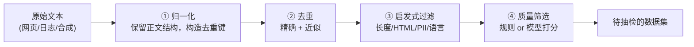

# 3. 数据工程——数据从哪来、怎么洗、怎么配比

> **本章目标**
>
> - 认识真实的公开预训练语料及其不同来源（Common Crawl、C4、The Pile、RedPajama、Dolma），理解"清洗"在 LLM 时代的分量
> - 理解清洗流水线的四类常见环节：归一化 → 去重 → 启发式过滤 → 质量筛选；实际顺序和实现依数据类型调整
> - 理解为什么去重不是"省空间"的小事，以及 PII 脱敏为什么是合规红线而非质量问题
> - 理解质量筛选的两条路线（规则打分 vs LLM 打分），以及它与"数据质量 >> 数据数量"的关系
> - 理解数据配比为什么深刻影响模型能力，以及它为什么没有银弹
> - 建立核心认知：**数据质量、覆盖度与配比共同影响训练效果，清洗也要防止误删**（动手实现见实验 3.1、3.2）

---

## 一、为什么数据工程值得单独一章？

上一章讲清了：范式决定数据需求——预训练（自监督）需要海量无标注文本，SFT（监督）需要成对的"指令-回答"。

但还有一个更前置的问题：**这些数据最初是从哪来的？拿到手的原始文本有多脏？怎么把它洗成能训练的样子？**

这个问题值得单独一章，原因有三：

1. **它决定了模型的上限**。模型结构、训练技巧可以抄论文，但数据管线抄不走——它是一家公司的核心资产。
2. **它最容易被低估**。初学者往往盯着模型结构和超参数，实际上工业界公认：数据工程的收益远超调参。
3. **它的投入最"不划算"却最必要**。从 Common Crawl 到 C4，丢掉的原始内容通常占绝大部分——你可能花很大力气清洗，最后只留下很小一部分，但正是这一小部分决定了模型质量。

---

## 二、真实语料的来源：从原始网页到开源数据集

预训练语料包括网页、书籍、代码和学术文本等。下面是几种公开语料，**它们不是逐级清洗、彼此继承的同一条链**，使用前还需核查版本、授权和数据来源：

| 数据集 | 来源 | 规模量级 | 特点 |
|---|---|---|---|
| **Common Crawl** | 大规模公开网页抓取 | 历年累计 PB 级 | 许多网页语料的重要源头；提供网页归档及文本提取等数据，可能含广告、导航和模板 |
| **C4**（Colossal Clean Crawled Corpus） | Common Crawl 的英语清洗子集 | 约 750GB | T5 使用的启发式清洗语料；不同变体口径不同 |
| **The Pile** | 网页、学术、代码、书籍等多源混合 | 约 825GB | 强调多样性与配比，供 GPT-Neo、Pythia 等使用 |
| **RedPajama v1** | 按 LLaMA 公开配方整理的多源语料 | 约 1.2 万亿 Token | 以复现 LLaMA 数据配方为目标；后续版本目标和规模不同 |
| **Dolma** | 网页、代码、学术、书籍等多源混合 | 约 3 万亿 Token | AI2 为 OLMo 整理的语料，不是 LLaMA 配比复现 |

**关键认知**：从网页归档提取文本时，要处理导航栏、cookie 提示、广告等**样板文本（Boilerplate）**。大量内容可能被移除，但删除比例依源数据、语言和规则而异，不是越高越好。

**中文场景**：中文语料也要经过来源与授权检查。后面的实验 **3.2** 会实际比较 Tokenizer；配比应明确按文档数、字符数还是 Token 数统计，不能假定中文在任意词表下都必然膨胀。

---

## 三、清洗流水线：四道关卡

为便于理解，先按四类环节组织。真实管线会调整顺序、重复执行，还需要授权检查、数据版本与评测集去污染等工作；下面不是完整工业实现：

| 关卡 | 做什么 | 需要注意什么 |
|---|---|---|
| **① 归一化** | 保留正文换行、缩进；为去重单独生成规范化键 | NFKC、空白折叠会改变代码、公式与格式，不能无条件覆盖正文；去重键也要按数据类型选择策略 |
| **② 去重** | 哈希去除精确重复；用 MinHash/SimHash 等发现近似重复 | 降低记忆和分布偏移风险，同时检查误合并与训练/测试集重叠 |
| **③ 启发式过滤** | 长度、HTML/样板、PII、语言等规则 | 规则可能误杀短问答或代码；隐私检测、脱敏和合规审查不是同一件事 |
| **④ 质量筛选** | 统计特征、分类器或 LLM 评分 | 分数是代理指标，要用抽检及下游评测验证，不能把模型高分直接当成事实正确 |

### 3.1 为什么去重不是"省空间"的小事

这一点值得单独强调。重复数据的危害远不止浪费存储：

- **导致过拟合**：模型反复看到同样的文本，会把它背下来，在没见过的数据上表现变差；
- **严重扭曲数据分布**：互联网上大量内容本来就是互相抄的（同一个新闻稿被几十个站点转载）。不去重的话，某些句子会在训练集中出现成百上千次，**模型会误以为这类内容"非常重要"**，从而学到扭曲的分布。

精确去重只能抓一模一样的文本，但互联网上更多的是**近似重复**（同一篇新闻改了标题、转载时加了免责声明、模板页面只有日期不同）。这时要用 MinHash / SimHash 等近似方法——工业界常用 LSH 分桶来加速。

### 3.2 PII 脱敏：这不是质量问题，是合规红线

个人敏感信息（邮箱、手机号、身份证号等）进入训练集，模型可能在生成时**泄露他人隐私**。这既是 GDPR 等法规明确要求的合规问题，也是第7章 Safety Alignment 的一环。

真实项目里，这一步的重要性往往**超过模型调参**——一个泄露用户隐私的模型，效果再好也无法上线。

### 3.3 质量筛选：值得花钱的一步

前几步能去掉"明显垃圾"，但筛不出"平淡无用的文本"——比如一句语法通顺却毫无信息量的水帖。这一步要靠**打分**，有两条路线：

**路线一：规则打分（便宜、可解释）。** 用可解释的统计特征给文本打分，例如：

- **词汇多样性**（Type-Token Ratio）：不同词的数量 / 总词数，太低说明重复啰嗦；
- **标点/符号比例**：异常符号过多往往是乱码或机器生成垃圾；
- **语言置信度**：用语言检测器确认是不是目标语言。

**路线二：模型打分（成本与效果需验证）。** 可以用质量分类器或较强的 LLM，根据任务相关性、信息密度等标准评分，例如 1~5 分。评分器也可能偏爱某种文风、漏掉事实错误，需抽样校准并监控被删领域。

**为什么可能值得花钱？** 筛选可能减少无效训练 Token，但要把评分成本、覆盖损失与下游收益一起算。第4章的 LIMA 是精选示范的 SFT 案例，Phi 则讨论高质量预训练数据，两者不能合成“质量永远大于数量”的通用定律；例如“100 万筛成 10 万更好”只能是待实验验证的假设。

---

## 四、数据配比：最后一块拼图

清洗出干净数据后，还有一个深刻影响效果的决策：**不同类型的数据各占多少？**

The Pile 强调多样性的价值，LLaMA 则公开了自己的配比（网页、书籍、代码、学术等各占一定比例）。配比之所以重要，是因为不同类型的数据"教"给模型的能力不同：

- **代码数据**有助于代码任务，也可能改善部分推理任务，但收益依质量、比例和评测而定；
- **书籍/长文本**提供长程依赖与连贯叙述的训练信号，还需合适的上下文长度；
- **高质量对话**影响 SFT 后的交互体验，不能替代基座能力与评测；
- 某类数据占比过高，模型就会带上那类数据的"口癖"（全是网页体，或全是论坛语气）。

**配比没有银弹，只能靠实验迭代**——这也是为什么现代训练流程把"数据配比实验"当作和模型调参同等重要的工作。

> **回到那句核心判断：谁能更懂数据，谁就能用更少的算力得到更好的模型。**

---

## 本章对应的实验

本章概念对应两个动手实验：

| 实验 | 对应本章内容 | 你要亲手做什么 |
|---|---|---|
| **3.1 数据清洗实战** | 第三节（清洗）与第四节（配比） | 用手工样本实现前三步；质量评分、近似去重与配比只讲方法，未执行 |
| **3.2 中文场景下的 Tokenizer 与数据处理** | 第二节（中文语料延伸） | 对比分词，检查编码、真实模板长度与回答边界 |

---

## 本章总结

本章认识了不同来源的公开语料，梳理了归一化、去重、启发式过滤和质量筛选。正文格式与去重键要分开处理；隐私规则不能代替完整合规审查；质量分和删除比例也不能代替下游评测。数据配比要明确计量单位，并靠实验检查收益与覆盖损失。

> **一句话记住本章**：不是删得越多越好，而是让保留的数据更符合任务，同时避免丢掉有价值的训练信号。

## 下一章预告

实验 3.1、3.2 完成基础清洗与 Tokenizer 检查后，我们还需要构造指令示范。接下来的问题是：**如何用这些示范，让 Base Model 更稳定地按指令回答？**

下一章我们进入对齐流水线的第一步，也是整条链路的地基：

> **第4章 SFT——模型如何学会理解人类指令？**

---

## 思考题

1. 为什么从 Common Crawl 到 C4 会丢掉绝大部分原始内容？这些被丢掉的内容里，有没有可能误删了有价值的文本？如何降低误删？
2. 如果训练数据里有大量重复文本（比如某条新闻被转载 500 次），会对模型产生什么影响？精确去重能完全解决吗？
3. 为什么"用 LLM 给数据打分"这种看起来很贵的方法，反而可能比全量训练更省钱？
