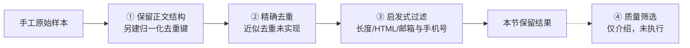

# 3.1 数据清洗实战——从原始文本到可用语料

> **硬件要求**：CPU 即可运行。可执行代码只用 Python 标准库，不训练模型；第四步“质量筛选”仅解释方法，不包含模型 API 调用。
>
> **本节目标**：承接第3章的数据工程概念，用 7 条手工构造的样本实现**保留正文格式 → 生成去重键并去重 → 启发式过滤**，再了解第四步质量筛选的思路。这是前三步的教学原型，**不是工业完整管线，也没有执行质量打分**。它为后续 SFT 数据整理提供基础：干净文本还需要任务设计、示范回答和模板处理，不能直接等同于 SFT 训练样本。

---

## 一、真实的数据从哪来？

### 预训练数据：原始语料的"四大来源"

第3章提到预训练数据来自"互联网原始文本（维基、网页、书籍、代码）"。工业界实际使用时，这些来源会被整理成几个著名的开源数据集：

| 数据集 | 来源 | 规模量级 | 特点 |
|---|---|---|---|
| **Common Crawl** | 大规模公开网页抓取 | 历年累计 PB 级 | 许多网页语料的源头，提供网页归档及文本提取等数据，可能含广告、导航和重复模板 |
| **C4**（Colossal Clean Crawled Corpus） | Common Crawl 的英语清洗子集 | 约 750GB | T5 使用的启发式清洗语料，不同变体口径不同 |
| **The Pile** | 网页、学术、代码、书籍等多源混合 | 约 825GB | EleutherAI 出品，强调多样性与配比 |
| **RedPajama v1** | 按 LLaMA 公开配方整理的多源语料 | 约 1.2 万亿 Token | 以复现 LLaMA 数据配方为目标 |
| **Dolma** | 网页、代码、学术、书籍等多源混合 | 约 3 万亿 Token | AI2 为 OLMo 整理，不是 LLaMA 配比复现 |

这些数据集不是同一条逐级清洗链。网页处理需要去除样板文本，但下载到公开语料也不代表可以忽略授权、版本和隐私检查。本节用手工样本演示规则，**不下载或处理上述真实语料**。

> 中文场景补充：后面的 **3.2** 会比较具体 Tokenizer 的分词长度。中文并非在任意词表下都比英文费 Token；配比时须明确是按文档、字符还是 Token 统计。

### SFT 数据：先清洗，再组织任务

人工撰写、模板生成、模型蒸馏和日志整理等构建方式将在**第4章“SFT 数据的配方”**中展开。本节先聚焦：不管数据从哪来，拿到手之后怎么洗？清洗普通文本并不会自动得到“指令—期望回答”对。

---

## 二、清洗流水线总览

第3章介绍了四类常见环节。本节实现前三类的最小版本，虚线后的第四类仅作方法预告：



**为什么去重？** 重复样本会被反复训练，增加记忆与过拟合风险，也会改变数据分布。近似去重、语言识别、隐私实体识别和评测集去污染等还需另行实现。

下面的 Python 代码块需**按顺序在同一会话运行**，只依赖标准库；输出示例对应本节手工数据，不代表真实语料的统计结果。

---

## 三、第一步：归一化（Normalization）

**正文与去重键必须分开**。把所有空白折成一个空格，会破坏 Python 缩进、Markdown 段落和代码块；NFKC 也可能改变有意义的字符。这里正文仅统一换行符，普通散文的去重键才做 NFKC 与空白折叠：

```python
import re
import unicodedata

def normalize(text):
    return text.replace("\r\n", "\n").replace("\r", "\n")

def dedup_key(text, preserve_layout=False):
    text = normalize(text)
    if preserve_layout:
        return text
    return re.sub(r"\s+", " ", unicodedata.normalize("NFKC", text)).strip()

text = "  机器学习（AI）是人工智能的一个分支。  "
print(repr(normalize(text)))
print(repr(dedup_key(text)))

code = "def f():\n    return 1\n"
assert normalize(code) == code
assert dedup_key(code, preserve_layout=True) == code
assert dedup_key("机器学习（AI）") == dedup_key("机器学习(AI)")
```

预期输出：

```text
'  机器学习（AI）是人工智能的一个分支。  '
'机器学习(AI)是人工智能的一个分支。'
```

第一行是保留格式的正文，第二行只是比较用的键。代码、公式、表格等格式敏感数据应采用 `preserve_layout=True`；含代码的混合文档也要保守处理。散文键可能误合并格式不同的文本，需抽样检查。**NFKC 不是所有中文文本的必做项**，也不会把所有中文标点一概转换成英文标点。

---

## 四、第二步：去重（Deduplication）

最基础的是**精确去重**：对归一化后的文本算哈希，只保留第一次出现的。

```python
import hashlib

raw = [
    {"text": "机器学习是人工智能的一个分支。"},
    {"text": "机器学习是人工智能的一个分支。"},                  # 完全重复
    {"text": "  机器学习是人工智能的一个分支。  "},              # 重复但多了空格
    {"text": "<html><body>广告内容</body></html>"},
    {"text": "请联系我：test@example.com 或 138-0013-8000"},
    {"text": "深度学习"},                                        # 太短
    {"text": "机器学习是人工智能的一个分支，它研究计算机如何利用经验改善系统性能，广泛应用于推荐、搜索与自然语言处理等领域。"},
]

def dedup_exact(records):
    seen, kept = set(), []
    for ex in records:
        text = normalize(ex["text"])
        preserve_layout = ex.get("preserve_layout", False)
        key = dedup_key(text, preserve_layout=preserve_layout)
        fingerprint = (preserve_layout, hashlib.sha256(key.encode("utf-8")).digest())
        if fingerprint in seen:
            continue
        seen.add(fingerprint)
        kept.append(text)
    return kept

kept = dedup_exact(raw)
print(f"原始 {len(raw)} 条 -> 去重后 {len(kept)} 条")
```

预期输出：

```text
原始 7 条 -> 去重后 5 条
```

7 条里去掉了 2 条重复，其中一条靠规范化去重键识别。返回的仍是首次保留的正文，不是去重键。格式敏感记录应显式设置 `{"text": code, "preserve_layout": True}`；这需要上游标注或识别，函数不会自动判断文本是不是代码。生产管线还应保留来源、记录 ID 等元数据。这里“精确”指键完全相等，并不代表归一化前逐字相同。

### 精确去重的边界：为什么还需要"模糊去重"

精确去重只能抓**一模一样**的文本，但互联网上更多的是**近似重复**（同一篇新闻改了标题、转载时加了免责声明、模板页面只有日期不同）。这时要用近似方法：

- **MinHash / SimHash**：把文本映射成一组指纹，通过指纹相似度判断近似重复（工业界常用，如 LSH 分桶加速）；
- **n-gram 重叠**：比较两段文本共有的 n-gram 比例，超过阈值即判定相似。

这部分实现较重，本节不展开代码，但你只需要记住一个判断标准：**如果两段文本的"骨架"几乎一样，只是改了几个词，精确去重抓不到，必须靠模糊去重**。

---

## 五、第三步：启发式过滤（Heuristic Filtering）

去重之后，用一套"规则"把明显不合格的样本筛掉。这一步叫启发式，因为规则来自经验而非模型。我们实现三类最常见的过滤器：

```python
def is_html(t):
    """是否残留 HTML 标签/网页样板"""
    return bool(re.search(r"<html|</?div|</?p>|&nbsp;", t))

def has_pii(t):
    """是否含个人敏感信息（PII）：邮箱、手机号"""
    # 邮箱，或中国大陆手机号（1[3-9]开头共11位，允许中间有连字符）
    return bool(re.search(r"[\w.+-]+@[\w-]+\.\w+|1[3-9]\d-?\d{4}-?\d{4}", t))

def filter_heuristic(texts, min_len=10):
    kept, dropped = [], []
    for n in texts:
        reasons = []
        if len(n) < min_len:
            reasons.append("过短")
        if is_html(n):
            reasons.append("HTML")
        if has_pii(n):
            reasons.append("含PII(邮箱/手机)")
        (dropped if reasons else kept).append((n, reasons))
    return kept, dropped

```

上面定义了三个过滤器，现在把它们逐一应用到去重后的数据上，直观查看每条的判定结果：

```python
for n in kept:
    reasons = []
    if len(n) < 10:            reasons.append("过短")
    if is_html(n):             reasons.append("HTML")
    if has_pii(n):             reasons.append("含PII(邮箱/手机)")
    status = "丢弃:" + ",".join(reasons) if reasons else "保留"
    print(f"  [{len(n):>3}字符] {status}  {n[:38]}")
```

预期输出（保留原文全角标点）：

```text
  [ 15字符] 保留  机器学习是人工智能的一个分支。
  [ 30字符] 丢弃:HTML  <html><body>广告内容</body></html>
  [ 37字符] 丢弃:含PII(邮箱/手机)  请联系我：test@example.com 或 138-0013-8000
  [  4字符] 丢弃:过短  深度学习
  [ 55字符] 保留  机器学习是人工智能的一个分支，它研究计算机如何利用经验改善系统性能，广泛应用
```

**三类规则的边界：**

| 过滤器 | 本例做了什么 | 没有保证什么 |
|---|---|---|
| **长度过滤** | 用 Python `len` 的字符数检查下限 | 短问答可能很有价值；字符数不是 Token 数，未检查模型上下文上限 |
| **HTML / 样板过滤** | 用少量正则命中特定标签 | 不是 HTML 解析器，也没有提取正文；代码教程中的标签可能是有效内容 |
| **PII 检测后丢弃** | 命中邮箱或手机号样式时删除整条 | 没有脱敏、没有识别所有隐私实体，且可能误报公开示例字符串 |

> **隐私规则不是合规证明。** 生产环境还需要来源授权、访问控制、删除流程和更完整的检测；不要把“正则没命中”解释成“没有隐私风险”。

---

## 六、第四步：质量筛选（Quality Filtering）

前三步能去掉"明显垃圾"，但筛不出"平淡无用的文本"——比如一句语法通顺却毫无信息量的水帖。这一步要靠**打分**，有两种路线：

### 路线一：规则打分（便宜、可解释）

用可解释的统计特征给文本打分，例如：

- **词汇多样性**（Type-Token Ratio）：不同词的数量 / 总词数，太低说明重复啰嗦；
- **标点/符号比例**：异常符号过多往往是乱码或机器生成垃圾；
- **语言置信度**：用语言检测器确认是不是目标语言（中文语料里混进大量英文要处理）。

### 路线二：模型打分（需验证收益）

可以让质量分类器或较强的 LLM 评分，再用抽样人工检查校准阈值。以下只是**概念 Prompt**，没有在本节管线中调用；评价回答是否解决任务，需要同时给出指令和参考依据，而不能只看回答文风：

```text
请根据用户任务、参考依据与候选回答，给出 1-5 的质量分及简短理由：
- 5 分：有依据、信息充分、直接解决任务
- 3 分：基本相关，但存在遗漏或无法核实的部分
- 1 分：明显错误、答非所问或大量重复

用户任务：<任务>
参考依据：<可核实的材料；没有时明确注明>
候选回答：<回答>
```

模型评分不保证事实正确，也可能偏爱固定风格。第4章的 LIMA 是精选示范 SFT 案例，Phi 则是高质量预训练数据案例，不能由此保证“100 万筛成 10 万一定更好”。应同时比较评分成本、覆盖损失与下游效果。

---

## 七、串起前三步，并统计结果

复用前面定义的函数；这里仍然**没有第四步质量评分**：

```python
from collections import Counter

def clean_pipeline(records, min_len=10):
    deduped = dedup_exact(records)
    accepted, dropped = filter_heuristic(deduped, min_len=min_len)
    reasons = Counter(reason for _, tags in dropped for reason in tags)
    print(f"去重丢弃 {len(records) - len(deduped)} 条；启发式丢弃 {len(dropped)} 条")
    print("丢弃原因:", dict(reasons))
    return [text for text, _ in accepted]

final = clean_pipeline(raw)
assert len(final) == 2
assert final == [raw[0]["text"], raw[-1]["text"]]
print(f"最终保留 {len(final)} / {len(raw)} 条，清洗掉 {len(raw) - len(final)} 条")
```

预期输出：

```text
去重丢弃 2 条；启发式丢弃 3 条
丢弃原因: {'HTML': 1, '含PII(邮箱/手机)': 1, '过短': 1}
最终保留 2 / 7 条，清洗掉 5 条
```

7 条手工样本中有 2 条通过本例规则，删除比例约 71%；**“通过规则”不等于“达到训练质量要求”**，这个比例也不能推广到真实数据。若一条样本触发多个原因，原因计数之和还会大于丢弃条数。

> **实践建议**：记录每一步删了多少、为什么删，并分别抽检保留与丢弃样本。字符下限与 Token 上限是不同检查；后面的 3.2 会按真实模板统计 Token 长度，不应仅因文本是中文就机械放宽阈值。

---

## 八、数据配比：最后一块拼图

清洗出干净数据后，还有一个深刻影响效果的决策：**不同类型的数据各占多少？**

The Pile 强调多样性的价值，LLaMA 则公开了自己的配比（网页、书籍、代码、学术等各占一定比例）。配比之所以重要，是因为：

- **代码数据**提供编程训练信号，也可能帮助部分推理任务，收益需实验验证；
- **书籍/长文本**提供长程依赖与连贯叙述的信号；
- **高质量对话**影响 SFT 后的交互体验；
- 某类数据占比过高，也可能带来文风偏移或其他领域覆盖不足。

配比实验需先明确计量单位，并在固定预算下评测。本节只有一个手工样本集，**没有运行多源配比或模型训练实验**。

---

## 本节小结

本节实现的是前三步教学原型：保留正文格式、单独生成去重键、精确去重、按长度/HTML/邮箱与手机号规则过滤。7 条手工样本经过规则后保留 2 条；这验证的是规则流程，不是数据质量提升或工业管线有效性。质量评分、近似去重、完整隐私检测与配比仍是待扩展部分。

下一节先处理 **3.2 中文场景下的 Tokenizer 与数据处理**，检查编码与模板长度；然后进入**第4章 SFT**，在实验 **4.1** 构造 Chat Template 和 Loss Mask，决定模型学习哪些 Token。
