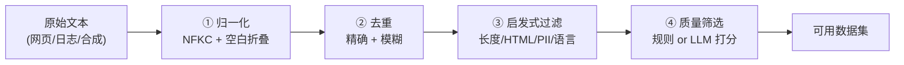

# 3.1 数据清洗实战——从原始文本到可用语料

> **硬件要求**：CPU 即可运行（纯数据处理，不训练模型；除可选的"质量打分"小节外，零第三方依赖）
>
> **本节目标**：第4章反复强调"SFT 的配方在数据里"，也在第 4 节讲清了数据工程的概念（数据来源、清洗四步、配比）。但概念终究要落地：**一段从网上抓下来的原始文本，究竟要经过哪些步骤才能变成可以喂给模型的训练样本？** 本节就把它跑一遍——亲手实现归一化 → 去重 → 启发式过滤 → 质量筛选这条流水线，亲眼看到"脏数据"是怎么被一层层洗干净的。本节是 2.2（构建 SFT 数据集）的前置环节：先有干净语料，才谈得上把它组织成训练样本。

---

## 一、真实的数据从哪来？

### 预训练数据：原始语料的"四大来源"

第4章提到预训练数据来自"互联网原始文本（维基、网页、书籍、代码）"。工业界实际使用时，这些来源会被整理成几个著名的开源数据集：

| 数据集 | 来源 | 规模量级 | 特点 |
|---|---|---|---|
| **Common Crawl** | 全网公开网页（每月增量抓取） | PB 级原始 HTML | 几乎所有开源预训练语料的源头，但极脏——含大量广告、导航栏、重复模板 |
| **C4**（Colossal Clean Crawled Corpus） | Common Crawl 清洗版 | 约 750GB | T5 团队做的启发式清洗（去样板文本、去广告、英文过滤），"清洗"这个词在 LLM 时代的经典范例 |
| **The Pile** | 混合多源（网页 + 学术 + 代码 + 书籍 + 对话） | 约 825GB | EleutherAI 出品，强调**多样性**与领域配比，是 GPT-Neo/Pythia 的训练语料 |
| **RedPajama / Dolma** | 复现 LLaMA 配比的开源语料 | 万亿 Token 级 | 社区为复现 LLaMA 而整理，配比公开透明 |

**一条重要的认知**：Common Crawl 抓下来的是**原始 HTML**，里面有导航栏、cookie 提示、广告、"Copyright ©" 模板——这些样板文本（Boilerplate）如果不清掉，模型会学到一堆"网页噪声"。**C4 这个名字里的 "Clean" 正是这个意思**，它做的事情和本节后面要写的清洗流水线是同一类。

> 中文场景补充：中文预训练语料常来自**中文维基、中文网页（如 Wudao/CLUE 系语料）、开源书籍**。结合 2.3 节讲过的"中文更费 Token"，同样的中文语料在 Token 数上会比英文膨胀，配比时要把这一点算进去。

### SFT 数据：主章已经讲过概念

SFT 数据的四种构建方式（人工撰写 / 模板生成 / 大模型蒸馏 / 用户日志清洗）在第4章第 6 节"SFT 数据的配方"中已有详细说明，本节不再重复。**本节聚焦一个更基础、也更容易被忽略的问题：不管数据从哪来，拿到手之后怎么洗？**

---

## 二、清洗流水线总览

一条工业级的数据清洗流水线通常包含四步，从粗到细：



**为什么必须去重？** 这不是"省空间"的小事。重复数据会让模型**反复看到同样的文本**，直接导致过拟合——模型背下了这几句话，却在没见过的数据上表现变差。更严重的是，互联网上大量内容本来就是互相抄的（同一个新闻稿被几十个站点转载），不去重的话，某些句子会在训练集中出现成百上千次，**严重扭曲数据分布**。

下面我们把这四步逐一实现。所有代码零第三方依赖，直接复制就能跑。

---

## 三、第一步：归一化（Normalization）

归一化的目的是**把"看起来不同、实际相同"的文本统一起来**，为后续去重做准备。两个最常见的操作：

```python
import re, unicodedata

def normalize(text):
    # NFKC 归一化：把全角字符、兼容字符统一（如 ＭＬ → ML，　→ 普通空格）
    t = unicodedata.normalize("NFKC", text)
    # 折叠连续空白：多个空格/换行/制表符统一成一个空格，并去掉首尾空白
    t = re.sub(r"\s+", " ", t).strip()
    return t

print(repr(normalize("  机器学习（AI）是人工智能的一个分支。  ")))
```

真实输出：

```text
'机器学习(AI)是人工智能的一个分支。'
```

注意发生了两件事：首尾空白被去掉，**全角括号 `（）` 被归一成半角 `()`**。如果不做这步归一化，下面这两句会被去重逻辑当成两条不同的数据：

- `机器学习（AI）是...`（全角括号）
- `机器学习(AI)是...`（半角括号）

> **中文尤其要注意**：中文文本里全角/半角混用非常常见（全角逗号、全角句号、全角空格 `　`），NFKC 归一化是中文清洗的**必做项**，这也是 2.3 节中文处理的自然延伸。

---

## 四、第二步：去重（Deduplication）

最基础的是**精确去重**：对归一化后的文本算哈希，只保留第一次出现的。

```python
import hashlib

raw = [
    {"text": "机器学习是人工智能的一个分支。"},
    {"text": "机器学习是人工智能的一个分支。"},                  # 完全重复
    {"text": "  机器学习是人工智能的一个分支。  "},              # 重复但多了空格
    {"text": "<html><body>广告内容</body></html>"},
    {"text": "请联系我：test@example.com 或 138-0013-8000"},
    {"text": "深度学习"},                                        # 太短
    {"text": "机器学习是人工智能的一个分支，它研究计算机如何利用经验改善系统性能，广泛应用于推荐、搜索与自然语言处理等领域。"},
]

def dedup_exact(records):
    seen, kept = set(), []
    for ex in records:
        n = normalize(ex["text"])
        h = hashlib.md5(n.encode("utf-8")).hexdigest()   # 归一化后取哈希
        if h in seen:
            continue                                      # 已出现过，丢弃
        seen.add(h)
        kept.append(n)
    return kept

kept = dedup_exact(raw)
print(f"原始 {len(raw)} 条 -> 去重后 {len(kept)} 条")
```

真实输出：

```text
原始 7 条 -> 去重后 5 条
```

7 条里去掉了 2 条重复（其中一条只是多了空格，靠归一化才被正确识别为重复）。

### 精确去重的边界：为什么还需要"模糊去重"

精确去重只能抓**一模一样**的文本，但互联网上更多的是**近似重复**（同一篇新闻改了标题、转载时加了免责声明、模板页面只有日期不同）。这时要用近似方法：

- **MinHash / SimHash**：把文本映射成一组指纹，通过指纹相似度判断近似重复（工业界常用，如 LSH 分桶加速）；
- **n-gram 重叠**：比较两段文本共有的 n-gram 比例，超过阈值即判定相似。

这部分实现较重，本节不展开代码，但你只需要记住一个判断标准：**如果两段文本的"骨架"几乎一样，只是改了几个词，精确去重抓不到，必须靠模糊去重**。

---

## 五、第三步：启发式过滤（Heuristic Filtering）

去重之后，用一套"规则"把明显不合格的样本筛掉。这一步叫启发式，因为规则来自经验而非模型。我们实现三类最常见的过滤器：

```python
def is_html(t):
    """是否残留 HTML 标签/网页样板"""
    return bool(re.search(r"<html|</?div|</?p>|&nbsp;", t))

def has_pii(t):
    """是否含个人敏感信息（PII）：邮箱、手机号"""
    # 邮箱，或中国大陆手机号（1[3-9]开头共11位，允许中间有连字符）
    return bool(re.search(r"[\w.+-]+@[\w-]+\.\w+|1[3-9]\d-?\d{4}-?\d{4}", t))

def filter_heuristic(texts, min_len=10):
    kept, dropped = [], []
    for n in texts:
        reasons = []
        if len(n) < min_len:
            reasons.append("过短")
        if is_html(n):
            reasons.append("HTML")
        if has_pii(n):
            reasons.append("含PII(邮箱/手机)")
        (dropped if reasons else kept).append((n, reasons))
    return kept, dropped

```

上面定义了三个过滤器，现在把它们逐一应用到去重后的数据上，直观查看每条的判定结果：

```python
for n in kept:
    reasons = []
    if len(n) < 10:            reasons.append("过短")
    if is_html(n):             reasons.append("HTML")
    if has_pii(n):             reasons.append("含PII(邮箱/手机)")
    status = "丢弃:" + ",".join(reasons) if reasons else "✅保留"
    print(f"  [{len(n):>3}字] {status}  {n[:38]}")
```

真实输出：

```text
  [ 15字] ✅保留  机器学习是人工智能的一个分支。
  [ 30字] 丢弃:HTML  <html><body>广告内容</body></html>
  [ 37字] 丢弃:含PII(邮箱/手机)  请联系我:test@example.com 或 138-0013-8000
  [  4字] 丢弃:过短  深度学习
  [ 55字] ✅保留  机器学习是人工智能的一个分支,它研究计算机如何利用经验改善系统性能,广泛应用
```

**三类过滤器各自解决什么问题：**

| 过滤器 | 为什么必须做 |
|---|---|
| **长度过滤** | 过短的文本（几个字）几乎没有信息量，还会浪费训练步数；过长则可能超出 `max_length`（结合 2.3 节讲的中文截断问题） |
| **HTML / 样板过滤** | 网页抓取必然会带 HTML 标签和导航栏文本，这些是纯噪声（C4 清洗的核心工作） |
| **PII 脱敏** | 个人隐私（邮箱、手机号、身份证）进入训练集，模型可能在生成时泄露——这既是合规红线，也是第7章 Safety 的一环 |

> **PII 处理是合规问题，不只是质量问题。** GDPR 等法规明确要求训练数据中的个人信息可被处理/删除，真实项目里这一步往往比模型调参更重要。

---

## 六、第四步：质量筛选（Quality Filtering）

前三步能去掉"明显垃圾"，但筛不出"平淡无用的文本"——比如一句语法通顺却毫无信息量的水帖。这一步要靠**打分**，有两种路线：

### 路线一：规则打分（便宜、可解释）

用可解释的统计特征给文本打分，例如：

- **词汇多样性**（Type-Token Ratio）：不同词的数量 / 总词数，太低说明重复啰嗦；
- **标点/符号比例**：异常符号过多往往是乱码或机器生成垃圾；
- **语言置信度**：用语言检测器确认是不是目标语言（中文语料里混进大量英文要处理）。

### 路线二：模型打分（贵、但效果好）

这是现代主流做法，也正是第4章第 4.2 节"清洗流水线"里提到的"用 LLM 打分筛选"。流程是：**用一个较强的模型给每条数据打 1~5 分（是否有帮助、是否准确、是否信息密度高），只保留高分样本**。

```text
# 典型的质量打分 Prompt（概念示意，实际调用需接入模型 API）
请评估以下回答的质量，只输出 1-5 的整数分数：
- 5 分：准确、信息密度高、直接解决问题
- 3 分：正确但平淡、信息量一般
- 1 分：错误、答非所问、重复啰嗦

<待评估文本>
```

**为什么值得花钱做这一步？** 因为第4章 LIMA 和 Phi 已经用实验证明：**数据的"密度"比总量更重要**。把 100 万条未筛选数据用模型筛成 10 万条高分数据，往往比全量训练效果更好、还更省算力——这就是"数据质量 >> 数据数量"这句话在工程上的落地方式。

---

## 七、把流水线串起来，并统计战果

四步合起来，完整跑一遍：

```python
def clean_pipeline(records, min_len=10):
    # ① 归一化（内置于去重）
    stage1 = dedup_exact(records)
    # ②③④ 去重后依次做启发式过滤
    final = [n for n in stage1
             if len(n) >= min_len and not is_html(n) and not has_pii(n)]
    return final

final = clean_pipeline(raw)
print(f"最终保留 {len(final)} / {len(raw)} 条，清洗掉 {len(raw) - len(final)} 条")
```

真实输出：

```text
最终保留 2 / 7 条，清洗掉 5 条
```

我们这个玩具数据集里，7 条原始数据只有 2 条最终达标（清洗率约 71%）。**真实项目的清洗率往往更触目惊心**——从 Common Crawl 到 C4 这类清洗，通常会丢掉绝大部分原始内容。这正好印证了第4章的结论：**不是"有数据"就能训模型，数据的价值在于"筛过之后剩下什么"**。

> **一个实践建议**：真实清洗流水线一定要**记录每一步丢弃了多少、为什么丢弃**，并抽样人工检查被丢弃的样本。如果过滤规则把大量正常数据误杀（例如中文被长度规则误伤），损失的训练信号远大于收益——2.3 节讲过中文在 Token 层面更"占地方"，长度阈值对中文要相应放宽。

---

## 八、数据配比：最后一块拼图

清洗出干净数据后，还有一个深刻影响效果的决策：**不同类型的数据各占多少？**

The Pile 强调多样性的价值，LLaMA 则公开了自己的配比（网页、书籍、代码、学术等各占一定比例）。配比之所以重要，是因为：

- **代码数据**能显著提升模型的逻辑推理能力（这是近年被广泛验证的发现）；
- **书籍/长文本**教会模型长程依赖与连贯叙述；
- **高质量对话**直接决定 SFT 后的交互体验；
- 某类数据占比过高，模型就会带上那类数据的"口癖"（全是网页体、或全是论坛语气）。

**配比没有银弹，只能靠实验迭代**——这也是为什么现代训练流程都把"数据配比实验"当作和模型调参同等重要的工作。回到第4章那句话：**"谁能更懂数据，谁就能用更少的算力得到更好的模型。"**

---

## 本节小结

✅ 认识了真实的预训练语料来源（Common Crawl → C4 → The Pile → RedPajama），理解了"清洗"在 LLM 时代的含义 ✅ 亲手实现了归一化（NFKC + 空白折叠），理解了中文全角/半角必须先统一 ✅ 实现了精确去重（哈希），并知道还需 MinHash 等模糊去重来抓近似重复 ✅ 实现了三类启发式过滤器（长度 / HTML / PII），理解了 PII 是合规红线 ✅ 理解了质量筛选的两条路线（规则打分 vs LLM 打分）及其与 LIMA/Phi 结论的呼应 ✅ 用真实数据跑通完整流水线，7 条清洗后只剩 2 条，直观感受清洗率。一句话总结：**模型的上限由数据决定，而数据的上限由清洗决定——你愿意在清洗上花多少功夫，直接决定了模型能走多远。**

数据洗干净了，下一步是把它**组织成模型能学习的样子**——也就是加上 Chat Template、并构造 Loss Mask 决定"模型该学哪部分"。下一节我们亲手拆解这一步：**4.1 构建一份 SFT 数据集——Chat Template 与 Loss Mask 实战**。
