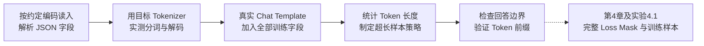

# 3.2 中文场景下的 Tokenizer 与数据处理

> **硬件要求**：CPU 即可运行。字节演示只用 Python 标准库；Tokenizer 实验需要安装支持 Qwen2.5 的 `transformers` 并下载词表，不加载模型权重。复现时记录包版本与模型 revision。
>
> **本节目标**：承接第一部分第2章的 Tokenizer 原理，观察中文与英文的编码、分词差异。中文没有显式词间空格，一个汉字可能对应多个 Token；但“中文一定更费 Token”并不成立，必须对具体词表和语料实测。我们将检查编码、模板后的长度和回答边界，为第4章 SFT 及实验 4.1 做准备；这些问题也适用于其他多语言数据。

---

## 一、为什么中文不能沿用英文那套"按空格切词"？

第一部分讲过：最朴素的 Word Tokenizer 是**按空格切词**。这在英文里天然成立——`The cat is sleeping` 用空格一切就是四个词。但中文有一个根本区别：

> **中文的书写系统里没有词边界（No Word Boundary）。** `我爱自然语言处理` 是一整串连续的字，中间没有任何空格告诉你该在哪里切。

如果只用空格切分，这句话会成为一个整体，遇到新句子便很难复用词表。传统中文 NLP 常先用 jieba 等工具分词；现代 LLM 多使用子词方法，例如 byte-level BPE 或带 byte fallback 的 SentencePiece。这些方案并不完全相同，也可能包含预切分规则；本节重点看 Qwen2.5 与 GPT-2 使用的字节级 BPE。

先用一段代码直观感受"中文没有空格"这件事：

```python
en = "The cat is sleeping"
zh = "那只猫正在睡觉"

# 英文：按空格 split 就能得到词
print("英文按空格切:", en.split())          # ['The', 'cat', 'is', 'sleeping']
# 中文：按空格 split 完全失效，整句变成一个元素
print("中文按空格切:", zh.split())           # ['那只猫正在睡觉']  ← 切不开
# 中文只能退到"单字"这一层才有天然边界
print("中文按字切:", list(zh))               # ['那', '只', '猫', '正', '在', '睡', '觉']
```

**结论**：英文的空格免费提供了词边界，中文没有。这个差异会一路影响到 Tokenizer 的设计。

---

## 二、核心现象：一个汉字，UTF-8 里是好几个字节

以 **byte-level BPE** 为例：文本先编码成 UTF-8 字节，再按词表规则合并。若基础词表覆盖全部 256 种字节，普通 Unicode 文本就能退回字节表示，不必因生僻字缺席而使用 Unknown Token；这不代表所有 Tokenizer 都具有相同机制。

> **ASCII 范围内的英文字母占 1 个 UTF-8 字节，常见汉字通常占 3 个；部分扩展汉字占 4 个。**

下面用纯 Python 检查字符数和字节数；这些计数不是模型的 Token 数：

```python
samples = ["cat", "猫", "你好", "人工智能", "Transformer", "深度学习"]
for s in samples:
    b = s.encode("utf-8")
    print(f"{s:>12} | 字符数={len(s)} | UTF-8字节数={len(b)} | 每字符字节={len(b)/len(s):.1f}")
```

预期输出：

```text
         cat | 字符数=3 | UTF-8字节数=3 | 每字符字节=1.0
           猫 | 字符数=1 | UTF-8字节数=3 | 每字符字节=3.0
          你好 | 字符数=2 | UTF-8字节数=6 | 每字符字节=3.0
        人工智能 | 字符数=4 | UTF-8字节数=12 | 每字符字节=3.0
 Transformer | 字符数=11 | UTF-8字节数=11 | 每字符字节=1.0
        深度学习 | 字符数=4 | UTF-8字节数=12 | 每字符字节=3.0
```

上例的 ASCII 字符各占 1 字节，所选常见汉字各占 3 字节。再看具体字节：

```python
for ch in ["猫", "能"]:
    bs = ch.encode("utf-8")
    print(f"{ch} -> {len(bs)} 字节: {[hex(x) for x in bs]}")
```

预期输出：

```text
猫 -> 3 字节: ['0xe7', '0x8c', '0xab']
能 -> 3 字节: ['0xe8', '0x83', '0xbd']
```

**这意味着什么？** 若没有可用合并，孤立的 `猫` 可以由三个字节 Token 表示；有部分合并时可能是两个，完整合并时可能是一个。多个汉字还可能共同合成一个 Token。因此既不能认为“一汉字必等于三 Token”，也不能认为“Token 边界一定对齐字符边界”。

---

## 三、同义句的字节数，不等于 Token 数

先比较两句同义文本的字符数与字节数，但**不能据此判定哪句更费 Token**：

```python
en = "Artificial intelligence is changing the world."
zh = "人工智能正在改变世界。"

print(f"英文: 字符数={len(en)}  UTF-8字节数={len(en.encode('utf-8'))}")
print(f"中文: 字符数={len(zh)}  UTF-8字节数={len(zh.encode('utf-8'))}")
```

预期输出：

```text
英文: 字符数=46  UTF-8字节数=46
中文: 字符数=11  UTF-8字节数=33
```

对于覆盖全部字节、仅通过合并构造普通 Token 的 byte-level BPE，**不计额外特殊 Token、也不发生会扩展文本的归一化时，UTF-8 字节数是 Token 数的粗略上界，不是下界**：未合并时一字节一个 Token，合并后只会更少。上例中文有 33 字节，但可能压缩到少于 11 个 Token；具体数量由词表、预切分与实际文本决定，应直接编码测量。

**长度会影响三个方面：**

1. **成本**：按 Token 计费时，需要结合实际 Token 数与模型单价，不能只按语言判断贵贱。
2. **上下文窗口**：正文、系统提示、对话模板和生成内容共同占用窗口。
3. **训练/推理速度**：全注意力训练或 prefill 的注意力计算量随序列长度呈平方增长；有 KV Cache 的逐 Token decode 每步访问已有上下文，不能把所有推理阶段都简单写成同一种平方开销。

> **一句话**：选中文场景的基座模型时，"Tokenizer 对中文的压缩率"是一个和参数量同样值得看的指标。

---

## 四、动手对比：不同 Tokenizer 切中文的差异

这一步需要 `pip install transformers`（仍是 CPU 级别，只是加载 Tokenizer，不加载模型权重）。我们用同一句中文，对比一个**中文优化过的** Tokenizer（Qwen2.5）和一个**几乎没中文优化的**（GPT-2）：

```python
from transformers import AutoTokenizer

texts = ["人工智能正在改变世界。", "Artificial intelligence is changing the world."]
qwen = AutoTokenizer.from_pretrained("Qwen/Qwen2.5-0.5B-Instruct")
gpt2 = AutoTokenizer.from_pretrained("gpt2")

for name, tok in [("Qwen2.5", qwen), ("GPT-2", gpt2)]:
    for text in texts:
        ids = tok(text, add_special_tokens=False)["input_ids"]
        pieces = tok.convert_ids_to_tokens(ids)
        restored = tok.decode(ids, clean_up_tokenization_spaces=False)
        assert restored == text
        print(f"\n{name}: {len(ids)} 个 Token | {text}")
        print("  词表内部表示:", pieces)
        print("  逐 Token 解码:", [tok.decode([i], clean_up_tokenization_spaces=False) for i in ids])
        print("  整段解码:", restored)
```

记录同一 Tokenizer 下的中英文长度，再比较不同 Tokenizer 对同一中文的长度。Qwen 通常能更紧凑地编码常见中文，但具体分片、比例和数量应以固定 revision 的实测为准，不应假定 GPT-2 的每个汉字都恰好占三个 Token。

**特别注意显示方式**：`convert_ids_to_tokens` 返回词表内部字符串，Qwen 和 GPT-2 都可能显示字节映射后的符号，**并非 Qwen 一定显示可读中文、GPT-2 才显示“乱码”**。单个 Token 可能只含某个 UTF-8 字符的一部分，因此逐 Token `decode` 可能出现 `�`；拼齐字节后整段解码仍可恢复原文。这是分片边界现象，不一定是文件编码损坏。

分词更紧凑说明词表对这段文本的压缩更好，不等价于模型更聪明或所有任务都更强。

> **给你自己训 Tokenizer 的提示**：如果要在中文语料上训练自己的 BPE（回顾第一部分 2.6 训练 Mini BPE Tokenizer），务必**用中文语料来统计合并规则**，并适当增大词表容量（中文常用字就有几千个，词表太小会导致大量汉字退回字节级）。

---

## 五、中文 SFT 数据处理：三个真实的坑

第4章与实验 4.1 将完整介绍 Chat Template 和 Loss Mask。本节先做不依赖后文函数的检查，以下问题对中英文都适用：

### 坑一：混淆文件编码、JSON 转义与 Token 显示

读写文本文件时应明确约定 UTF-8，不依赖平台默认编码。JSON 的 `ensure_ascii=False` 只控制序列化时是否直接显示中文，并不决定反序列化后的内容是否正确：

```python
import json

sample = {"instruction": "介绍一下自己", "output": "我是一个中文助手。"}
readable = json.dumps(sample, ensure_ascii=False)
escaped = json.dumps(sample, ensure_ascii=True)
assert json.loads(readable) == json.loads(escaped) == sample
assert readable.encode("utf-8").decode("utf-8") == readable
print(readable)
```

实际 JSONL 文件仍需在读写时指定 `encoding="utf-8"`。两种转义方式都能被 `json.loads` 正确还原；训练应使用解析后的字段内容，不要把原始 JSON 转义字符串误当正文。本例在内存中演示，不创建文件。

### 坑二：长度统计没有使用真实 Chat Template

`max_length` 限制的是 Token，不是汉字。应先用训练时**同一份消息构造逻辑与模板**统计长度，包括可选 `input`、角色标记和结束符，再按模型窗口、内存预算与数据分布定上限。不要另拼一个“指令：…回答：…”字符串来估算。

前面的 0.5B Tokenizer 用于分词对比；从这里起使用 **Qwen2.5-1.5B-Instruct 的模板与词表**，与实验 4.1、4.2 的训练样本约定保持一致。这里只加载 Tokenizer，不加载 Base 或 Instruct 模型权重：

```python
from transformers import AutoTokenizer

SYSTEM = "你是一个中文助手，请准确回答并遵循用户的格式要求。"
tokenizer = AutoTokenizer.from_pretrained("Qwen/Qwen2.5-1.5B-Instruct")
assert tokenizer.eos_token == "<|im_end|>"

def to_messages(ex):
    instruction = ex["instruction"].strip()
    extra = (ex.get("input") or "").strip()
    user_text = instruction + ("\n\n" + extra if extra else "")
    answer = ex["output"].strip()
    assert instruction and answer
    return [
        {"role": "system", "content": SYSTEM},
        {"role": "user", "content": user_text},
        {"role": "assistant", "content": answer},
    ]

def training_ids(ex, tokenizer):
    messages = to_messages(ex)
    assert not any(t in m["content"] for t in tokenizer.all_special_tokens for m in messages)
    full = tokenizer.apply_chat_template(
        messages, tokenize=False, add_generation_prompt=False,
    )
    assert full.endswith(tokenizer.eos_token + "\n")
    full = full[:-1]
    ids = tokenizer(full, add_special_tokens=False)["input_ids"]
    assert ids[-1] == tokenizer.eos_token_id
    return ids

def count_truncated(dataset, tokenizer, max_length=256):
    return sum(len(training_ids(ex, tokenizer)) > max_length for ex in dataset)

dataset = [
    {"instruction": "介绍一下自己", "output": "我是一个中文助手。"},
    {"instruction": "输出长度测试", "input": "仅用于检查截断",
     "output": "这是用于长度测试的重复句子。" * 100},
]
lengths = [len(training_ids(ex, tokenizer)) for ex in dataset]
print("模板后的 Token 长度:", lengths)
print(f"超过 256 Token: {count_truncated(dataset, tokenizer)} / {len(dataset)}")
```

第二条是故意构造的长样本，不是训练质量示范。代码只统计，不截断；仅删除模板在**最后一个 EOS 之后**追加的单个换行，保留回答 EOS，与 4.1、4.2 一致。若训练时改变 system、加入多轮历史或其他字段，也必须同步消息构造逻辑再统计。简单右截断可能删掉完整回答或 `<|im_end|>`；可选择过滤、按轮切分或调整预算，而不是事后补一个结束符就视为修复。

### 坑三：用 Token 数定位前，还要检查前缀是否一致

字符位置不能直接当作 Token 位置；但分别编码提示和全文，再取 `len(prompt_ids)`，也**并非对任意模板自动安全**。边界附近的子词合并、模板分支或特殊 Token 设置可能让提示不再是全文的 Token 前缀。先做下面这个可独立运行的单轮检查，不调用未来实验 4.1 的函数：

```python
from transformers import AutoTokenizer

SYSTEM = "你是一个中文助手，请准确回答并遵循用户的格式要求。"
tok = AutoTokenizer.from_pretrained("Qwen/Qwen2.5-1.5B-Instruct")
assert tok.eos_token == "<|im_end|>"

def build_messages(sample):
    instruction = sample["instruction"].strip()
    extra = (sample.get("input") or "").strip()
    user_text = instruction + ("\n\n" + extra if extra else "")
    answer = sample["output"].strip()
    assert instruction and answer
    return [
        {"role": "system", "content": SYSTEM},
        {"role": "user", "content": user_text},
        {"role": "assistant", "content": answer},
    ]

sample = {
    "instruction": "用一句话介绍 Transformer",
    "input": "面向初学者，保留自注意力这一关键词。",
    "output": "Transformer 是一种基于自注意力的神经网络结构。",
}
messages = build_messages(sample)
assert not any(t in m["content"] for t in tok.all_special_tokens for m in messages)
full = tok.apply_chat_template(
    messages, tokenize=False, add_generation_prompt=False,
)
assert full.endswith(tok.eos_token + "\n")
full = full[:-1]
prompt = tok.apply_chat_template(
    messages[:-1], tokenize=False, add_generation_prompt=True,
)
full_ids = tok(full, add_special_tokens=False)["input_ids"]
prompt_ids = tok(prompt, add_special_tokens=False)["input_ids"]
assert full.startswith(prompt)
assert full_ids[:len(prompt_ids)] == prompt_ids, "模板前缀不一致，不能按长度直接切分"
answer_ids = full_ids[len(prompt_ids):]
assert len(answer_ids) > 1 and answer_ids[-1] == tok.eos_token_id
print("完整样本 Token 数:", len(full_ids))
print("提示 Token 数:", len(prompt_ids))
print("回答及模板结束标记:", tok.decode(answer_ids, skip_special_tokens=False))
```

这里与长度统计一样，先渲染模板，仅去掉最后一个 EOS 后的单个换行，再以 `add_special_tokens=False` 编码，避免重复添加特殊 Token。输入字段清理、system 消息及回答 EOS 的处理均与 4.1、4.2 一致。检查通过只说明**当前样本、当前模板**可按该前缀定位；更换模板或进入多轮训练需要重新验证。怎样构造 Loss Mask、处理 padding 和超长样本，将在第4章及实验 4.1 展开，本节不把一个边界断言当成完整训练样本实现。

---

## 六、把整条链路串起来

把本节检查按数据流串起来：



- 字节数、字符数和 Token 数是不同计量，不能互相替代。
- 编码与模板检查对多语言都适用；词表内部符号不等于原文损坏。
- 长度和回答边界要基于同一套真实模板，换模板或截断策略后重新检查。

---

## 本节小结

本节比较了字符与 UTF-8 字节，提供了 Qwen/GPT-2 分词及整段解码检查，并演示真实模板长度统计和单轮回答边界检查。常见汉字通常占 3 字节，但不能据此断言一字几个 Token 或中文总比英文费 Token。代码尚未构造完整训练数据，也没有运行 SFT。

下一章进入 **第4章 SFT——模型如何学会理解人类指令**；随后在 **4.1 构建一份 SFT 数据集——Chat Template 与 Loss Mask 实战** 中把这些检查接入训练样本构造，再到 **4.2** 微调模型。
