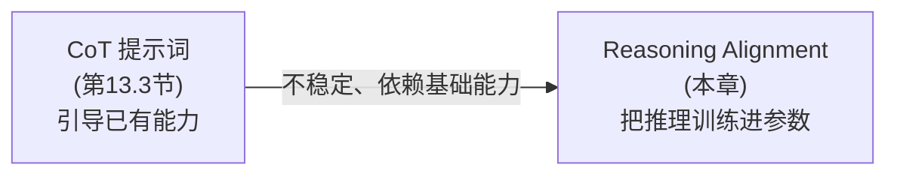
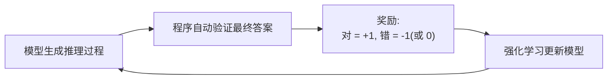
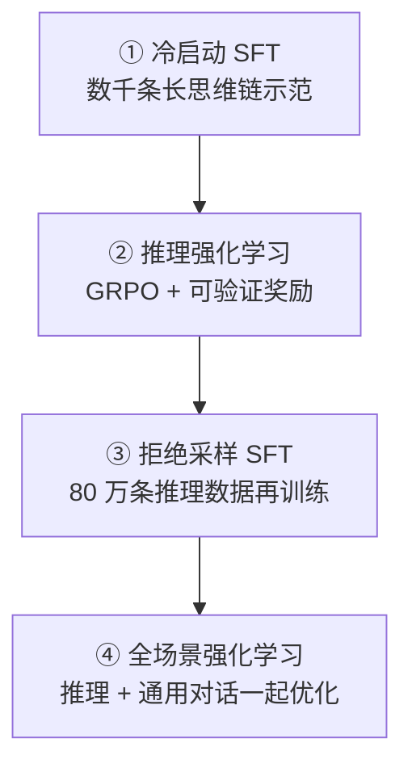

# 第4章 Reasoning Alignment——模型如何学会真正推理？

> **本章目标**
>
> - 理解"模型会模仿推理的样子"与"模型真正会推理"的本质区别
> - 了解 CoT（思维链）的历史：从提示词技巧到训练目标的演进
> - 掌握 Outcome Supervision 与 Process Supervision 的区别
> - 理解"可验证奖励"（Verifiable Rewards）如何让强化学习在推理场景重新登场
> - 掌握 DeepSeek-R1 的四阶段训练流水线（冷启动 SFT → RL → 拒绝采样 SFT → 全场景 RL）
> - 理解 o1 / R1 这类推理模型的核心特征：长思考、test-time compute，以及它们的高昂成本

---

## 一、一个容易被忽视的现象：模型会"装"会推理

第一部分 13.3 节我们体验过用"Let's think step by step"引导模型逐步推理，效果确实有提升。但如果仔细观察，你会发现模型有时**"写了一大段推理过程，结论却是错的"**，甚至**"推理过程和结论根本对不上"**——比如它写着"第一步：计算 23×17……"却直接蹦出"答案是 381"。

这说明什么？**模型学会了"模仿推理的样子"（长句、分步、'因此'、'综上所述'），却未必学会了"真正推理"。** 预训练时，互联网上大量存在的"解题过程"文本教会了它推理的**文体**；至于推理的**逻辑**是否正确，预训练目标（预测下一个词）并不关心——它只关心"接下来最可能出现的词"。

## 二、从 Prompt 到训练：CoT 的两条路线

**Chain of Thought（CoT）** 最早是 2022 年 Google 论文（*Chain-of-Thought Prompting Elicits Reasoning in Large Language Models*）提出的一种**提示词技巧**：在示例里展示"先想一步、再想一步、最后作答"的完整过程，模型就会模仿这种格式。它的本质是**唤醒**模型在预训练中已经习得的推理能力——能力本来就有，提示词负责把它"引导"出来。

但提示词技巧有三个天花板：

1. **依赖模型已有的能力**：模型本身不会的推理，提示词变不出来；
2. **不稳定**：换个措辞、换个示例，效果就波动；
3. **不可控**：无法保证模型"每次都认真想"，也无法惩罚它"想错了"。

于是业界开始把推理能力**训练进参数**——这就是 **Reasoning Alignment（推理对齐）**：在训练阶段，用专门的推理数据和训练目标，让模型真正学会"先思考、再作答"，并且让"思考的质量"直接影响参数更新。

## 三、监督信号从哪来：Outcome vs Process

训练推理能力时，第一个设计决策是：**"对错"这个信号从哪里来、监督到什么粒度？**

| 监督方式 | 监督对象 | 优点 | 缺点 |
|---|---|---|---|
| Outcome Supervision（结果监督） | 只检查最终答案是否正确 | 简单、成本低 | 无法判断过程是否合理，可能"蒙对"；无法定位错在哪一步 |
| Process Supervision（过程监督） | 对推理过程的每一步分别打分 | 能识别链条中的错误步骤，可解释性强 | 标注成本高，需要专门的 Process Reward Model |

（第4.1节的实验里我们实现的 Verifier 只检查最终数字，正是最朴素的 Outcome Supervision。）

**一个关键的行业转折**：传统上 Process Supervision 因为标注成本太高而难以大规模使用；但 2023~2024 年业界发现——**对于数学、代码这类"答案可自动验证"的任务，连人工标注都不需要了**。这直接催生了推理对齐的新范式：**可验证奖励（Verifiable Rewards）**。

## 四、可验证奖励：让强化学习在推理场景"复活"

回顾第3章：偏好学习的奖励来自人类偏好，需要 RM 或隐式奖励。但在推理场景里，**"回答对不对"可以用程序自动验证**——数学题可以算标准答案、代码题可以跑测试用例、逻辑题可以规则校验。这意味着：

1. 奖励信号**免费且无噪声**（不需要 RM，不需要人类标注）；
2. 奖励信号**可解释**（对就是对，错就是错）；
3. 强化学习最贵的一环（人类反馈）消失了。

于是强化学习在推理对齐中重新成为主角——这次比 RLHF 更纯粹：

**为什么"验证"比"偏好"更适合 RL？** 因为推理任务的奖励是**稀疏但确定**的——不需要模型去猜"人类喜欢什么"，只需要它通过探索找到"能算出正确答案的思考路径"。而 RL 恰恰擅长在稀疏奖励下探索：模型尝试各种思路，对的思路被强化，错的被抑制，久而久之，"会推理"就长在了参数里。

## 五、DeepSeek-R1 的四阶段流水线

2025 年初，DeepSeek 发布的 R1 把推理对齐推向了新的高度，也第一次向开源社区完整展示了推理模型的标准训练配方。它的流水线分四个阶段：

**第一阶段：冷启动 SFT（Cold Start）。** 这是 R1 论文最被津津乐道的工程技巧：在强化学习之前，先用**几千条人工精心构造的"长思维链"示范**做一轮 SFT，让模型先学会"高质量的推理过程长什么样"。为什么要这一步？因为直接从 Base/SFT 模型开始 RL，模型会输出乱七八糟的格式（乱码、中英混杂、不遵循思考格式）——**先让它"模仿对的"，RL 才能专心"探索更好的"**。冷启动让后续 RL 又快又稳。

**第二阶段：推理强化学习（RL with Verifiable Rewards）。** 用第3章讲过的 **GRPO** + 可验证奖励，在数学、代码等"答案可自动验证"的任务上强化学习。R1 论文记录了一个有趣的涌现现象：**模型在训练中自发学会了"反思"**——发现自己算错了会回头重算，会尝试多种解法并自我检验。反思并没有被显式训练，它是 RL 在稀疏奖励下"自己发现"的有效策略。

**第三阶段：拒绝采样 SFT（Rejection Sampling）。** RL 阶段积累了大量"对错已知"的样本，从中**只保留回答正确的**（拒绝错误的），再加上通用对话数据，凑成约 **80 万条**数据再做一轮 SFT。这一步把 RL 探索出的好路径"固化"进模型——相当于把 RL 的成果蒸馏成监督信号，同时补充了推理之外的通用能力。

**第四阶段：全场景强化学习。** 在最后阶段，把"可验证奖励"（推理任务）和"人类偏好奖励"（对话任务，用第3章的方法）**混合**起来做一轮 RL，让模型既能深度推理、又保持对话的自然与礼貌——避免"只会做数学题的机器人"。

**R1 的启示**：推理能力不是靠堆数据"喂"出来的，而是靠 RL"练"出来的；SFT 负责教"格式"，RL 负责练"能力"，两者交替推进。这套"SFT → RL → SFT → RL"的配方，已经成为 2025 年后推理模型训练的事实标准。

## 六、推理模型的代价：没有免费的"思考"

推理模型（o1、R1 等）与普通 Chat Model 在推理阶段的行为差异巨大：

| | Chat Model | Reasoning Model |
|---|---|---|
| 推理阶段 | 直接生成回答 | 先生成一大段"思考过程"（隐藏的 thought token） |
| 回答问题的 Token 消耗 | 少 | 多 5~20 倍（思考过程本身就是 Token） |
| 延迟 | 低 | 高（几秒到几十秒的"思考时间"） |
| 适合 | 日常对话、快速问答 | 数学、代码、逻辑、规划等复杂任务 |
| 关键指标 | TTFT（首 Token 延迟） | 最终正确率、思考效率 |

这里有一个重要的概念：**Test-Time Compute（测试时计算）**。普通模型的能力在训练时就"定死"了，推理时每道题只花一份固定计算；推理模型则把"思考"本身当成计算资源——**想得越多、越久，答案往往越好**。o1 系列甚至支持"思考预算"调节：给的时间多，它就想得深；时间紧，它就快速作答。这带来一个范式转变：**从"把能力塞进参数"（训练时堆算力），到"把能力花在思考上"（推理时堆算力）**——两者在"总算力 = 训练算力 + 推理算力"的等式里是可以互相置换的。

**为什么推理过程要"隐藏"？** o1 会把思考过程折叠成摘要再展示给用户——一方面防止"思考链被复制蒸馏"（DeepSeek 开源后，多家厂商用 R1 的思考链蒸馏小模型，OpenAI 对此非常警惕）；另一方面，模型"自言自语"的过程中可能冒出格式混乱、甚至"想歪了再纠正"的内容，不适合直接给用户看。

## 七、推理对齐的开放问题

- **思考效率**：推理模型为了正确率，经常"过度思考"——简单问题也长篇大论。如何让模型"按需思考"（Qwen3 的思考模式/非思考模式切换、DeepSeek 的"简单问题快速回答"）是当前热点；
- **可验证奖励的边界**：数学、代码之外，大部分任务（写作、规划、开放问答）没有自动验证器。如何把 RLVR 扩展到更广的任务（LLM-as-a-Judge 当验证器、工具验证、规则验证）是研究前沿；
- **推理与安全的冲突**：思考过程越长，模型在思考中"权衡要不要输出有害内容"的空间越大——推理模型的安全对齐比普通模型更复杂（第5章衔接）。

---

想亲眼对比一次真正的 Reasoning Model 和普通 Chat Model 面对同一道难题时的真实差异，可以看这一节实验：**4.1 亲手对比 Reasoning Model 与 Chat Model——阅读一次真实的思考轨迹**。

## 本章总结

本章我们理解了：

✅ CoT 提示词唤醒的是已有能力，Reasoning Alignment 把推理训练进参数，两者有本质区别 ✅ Outcome Supervision 只看结果，Process Supervision 监督每一步，但"答案可自动验证"让推理任务不再需要人工监督 ✅ 可验证奖励让强化学习在推理场景重新成为主角——奖励免费、无噪声、可解释 ✅ DeepSeek-R1 的四阶段配方：冷启动 SFT → 推理 RL（GRPO + 可验证奖励）→ 拒绝采样 SFT → 全场景 RL ✅ 推理模型的核心特征是 test-time compute：把"思考"当计算资源，想得越多通常越好，但 Token 成本和延迟也大幅上升 ✅ 反思能力可以在 RL 中自发涌现，不需要显式训练

> **CoT 让模型"看起来会推理"，Reasoning Alignment 让模型"真的会推理"——区别在于：前者是模仿文体，后者是让"想对了"直接变成参数更新的奖励。**

## 下一章预告

模型越来越聪明、越来越会推理，但一个新的问题也随之而来：推理能力越强，被恶意利用时的破坏力也越大——而且推理模型的"长思考"给安全对齐带来了全新的挑战。下一章，我们将进入：

> **第5章 Safety Alignment——如何让大模型既强大，又安全？**

---

# 参考资料

- DeepSeek《DeepSeek-R1: Incentivizing Reasoning Capability in LLMs via Reinforcement Learning》(四阶段流水线、GRPO、冷启动 SFT 出处)：https://arxiv.org/abs/2501.12948
- OpenAI《Learning to Reason with LLMs》(o1 推理模型、test-time compute 技术博客)：https://openai.com/index/learning-to-reason-with-llms/
- Wei et al.《Chain-of-Thought Prompting Elicits Reasoning in Large Language Models》(CoT 起源)：https://arxiv.org/abs/2201.11903
- OpenAI《Let's Verify Step by Step》(Process Supervision 论文)：https://arxiv.org/abs/2305.20050
- OpenAI o1 系统卡（推理模型的安全评估与红队）：https://openai.com/index/openai-o1-system-card/
