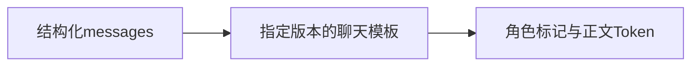
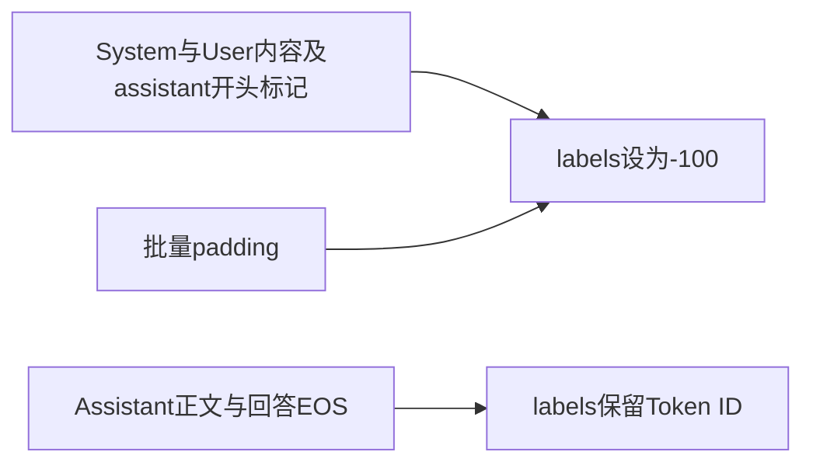
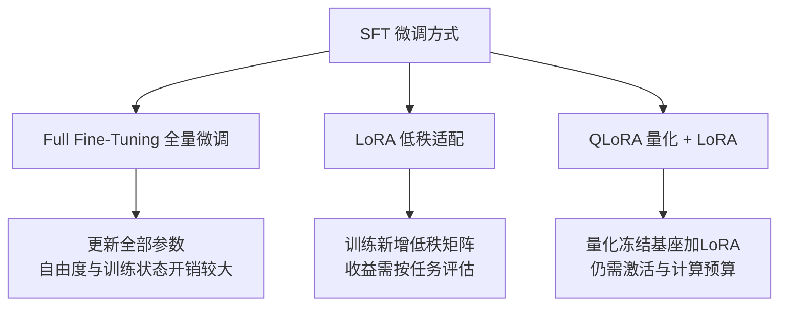

# 4. 监督微调（SFT）——模型如何学会理解人类指令

> **本章目标**
>
> - 理解 SFT 的本质：用监督学习的方式，教模型模仿"指令 → 高质量回答"的条件分布
> - 区分SFT与预训练的数据分布、监督位置和训练预算，而不是把它们硬分成“行为”与“知识”
> - 理解InstructGPT、Alpaca、LIMA对数据质量和覆盖度的启示，不把小样本结论当通用定律
> - 理解Chat Template与Loss Mask（4.1实现编码，4.2用于真实训练）
> - 掌握学习率、epoch、过拟合、padding与Sequence Packing的关键边界
> - 理解SFT可以学习新知识和技能，但不保证可靠记忆、泛化或消除幻觉；偏好学习提供不同的监督信号
> - 了解现代 SFT 的行业实践：合成数据、蒸馏，以及 DeepSeek-R1 的"冷启动 SFT"

---

## 一、SFT 是什么：从"模仿"到"学会执行指令"

上一章讲到，Alignment 流水线的第一步是 SFT。它的做法朴素得惊人：**给模型看大量"指令 → 高质量回答"的示范，让它直接模仿。**

```text
Instruction: 介绍一下 Transformer。
Output: Transformer 是一种基于 Self-Attention 的神经网络结构，由 Google 于 2017 年提出……
```

从机器学习的角度看，SFT 属于**监督学习**——每一条数据都有明确的"输入（指令）"和"标签（期望回答）"，模型在训练中不断降低"预测回答"与"示范回答"之间的差距。而从更广阔的视角看，SFT 与机器人领域的**模仿学习（Imitation Learning）/ 行为克隆（Behavior Cloning）**本质上是同一个思想：**不自己摸索规则，直接克隆专家的行为分布**。你给模型看一千个"人类如何回答指令"的例子，它就把"按这种方式回答"学成了自己的行为倾向。

**指令SFT通常重点塑造回答行为，但它同样会更新知识与技能表征。** 例如，SFT可以教模型直接回答公司总部问题，也可能让模型学到训练样本中的新事实。区别在于数据覆盖和优化目标，而不是存在一道“只能改行为、不能学知识”的机制边界；少量示范能否泛化到新问法，仍要独立评估。

## 二、SFT 与 Pretraining：同一个目标，不同的数据

对自回归语言模型，两者都使用next-token交叉熵；但数据分布、监督位置和预算不同，**完整训练目标并非毫无差别**。本书采用assistant-only SFT；也存在对整段对话监督的配方。

| | Pretraining | 本书的指令SFT |
|---|---|---|
| 数据来源 | 广泛文本、代码等语料 | 人工或模型生成并筛选的指令—回答 |
| 数据规模 | 随模型和预算变化，可达万亿Token | 从机制演示到大规模任务混合，不能只用条数比较 |
| 训练目标 | 对有效文本位置预测下一Token | 对回答正文和EOS预测下一Token |
| 训练步数 | 随总Token预算变化 | 由样本数、有效batch和epoch决定 |
| 常见收益 | 语言、知识与基础任务能力 | 指令遵循、技能、领域信息和表达方式 |
| 学习率 | 与规模、优化器和训练阶段有关 | 全量微调常较低；LoRA可用不同量级 |

**为什么同样的目标函数，只因为数据不同，效果就天差地别？** 因为模型从数据里学的是"条件分布"：预训练数据里"苹果公司总部位于____"后面大概率是"美国"，所以模型学会了填"美国"；SFT 数据里"用户提问 → 高质量回答"是成对出现的，模型就学会了"当出现提问时，用回答的方式响应"。

> **SFT 真正的"配方"不在模型结构里，而在数据如何组织、Loss 在哪里计算。** 这也是实验 4.1 的核心：Chat Template 决定"模型看到什么"，Loss Mask 决定"模型学习什么"。（至于"监督 / 无监督 / 自监督"这三种范式的区分，以及数据从哪来、怎么洗，已经在**第2章**与**第3章**专门讲过，本章不再重复。）

## 三、SFT 数据科学：三次认知迭代

有了清洗好的数据，接下来的问题是：SFT 数据要多少、质量要多高？业界对这两个问题的认知，经历了三次标志性的迭代：

**InstructGPT（2022）**使用约13k条人工示范做SFT，说明在强基座和该任务分布下，较小的高质量示范集也能改变输出行为；这不是“任意模型几万条即可质变”的保证。

**Alpaca（2023）**使用约52k条合成指令数据，以较低的数据生成成本展示指令微调的可行性；其小规模评测不能等同于全面达到GPT-3.5水平。Self-Instruct等工作推动了合成指令数据的应用。

**LIMA（2023）**用约1k条精选示范展示了小数据对齐的潜力，但结论依赖强预训练基座、数据选择和评测设置，不能推出复杂领域或多任务覆盖只需要1k条。

| 数据集 | 规模 | 数据来源 | 应怎样理解 |
|---|---|---|---|
| InstructGPT SFT | 约13k条 | 人工示范 | 真实任务分布和标注质量重要 |
| Alpaca | 约52k条 | 模型合成 | 降低采集成本，仍须质量核验 |
| LIMA | 约1k条 | 精选示范 | 强基座下的特定小数据实验 |

共同启示是：**质量、覆盖度和数量应一起考虑**。增加重复低质数据通常帮助有限，但高质量数据不足也会限制任务覆盖和泛化。

Phi-1的“教科书级数据”工作主要涉及代码模型的预训练与后续微调，不能直接当成“SFT只需少数据”的证据。它补充说明数据质量的重要性，而不是证明数据规模不再重要。

## 四、SFT 数据的配方：不止"指令-回答"两段

真实的 SFT 数据远比"一问一答"复杂。现代 SFT 数据通常包含：

```text
<|im_start|>system
你是一个乐于助人的中文助手，回答简洁、准确、友好。<|im_end|>
<|im_start|>user
帮我写一封请假邮件，今天发烧了。<|im_end|>
<|im_start|>assistant
好的，以下是一封请假邮件模板……<|im_end|>
<|im_start|>user
再帮我加一句"下周补上工作进度"。<|im_end|>
<|im_start|>assistant
已加上，修改后的版本是……<|im_end|>
```

- **System Prompt 样本**：教模型"带角色/规则的场景下如何表现"（例如客服、翻译、代码助手）；
- **多轮对话样本**：教模型"记住前文、处理追问"——单轮数据无法教会对话能力；
- **需要工具调用的样本**：教模型"何时调用工具、如何组织参数"（与第三部分 Agent 衔接）；
- **拒绝类样本**：教模型"如何礼貌地拒绝危险或越权请求"（与第7章衔接）。

数据构建方式也早已不止"人工标注"一种：人工撰写（质量最高、最贵）、模板批量生成（Alpaca 早期做法）、**大模型蒸馏**（用 GPT-4 级别模型生成回答训练开源模型，开源社区追赶闭源的主要手段）、真实用户日志清洗（产品上线后最宝贵的数据来源）。

## 五、Chat Template：模型世界的"对话协议"

不同模型的对话标记不同：Qwen2.5常用 `<|im_start|>user ... <|im_end|>`，Llama3的消息头使用 `<|start_header_id|>` 等标记，轮次通常以 `<|eot_id|>` 结束。**Chat Template把结构化的role/content消息序列化为训练使用的协议。**



模板常随tokenizer保存，但**Base tokenizer可能没有chat_template**。4.1从同系列Instruct tokenizer明确获取模板与对话EOS，并核验词表；这不等于加载Instruct权重。4.2保存同一个tokenizer，5.2从该产物重载。训练和推理须保持模板、system、特殊token和生成起点一致；不能训练时用“指令/回答”文本，推理时却换成ChatML。

## 六、Loss Mask：监督到底落在哪里？

本书采用assistant-only监督：输入包含全部上下文，但只预测assistant回答正文和结束符。这是常用配方，不是所有SFT的唯一定义。



`-100`是PyTorch交叉熵的默认忽略值。用户内容仍可被注意力读取，并通过回答损失间接影响参数更新；“不对用户位置计算损失”不等于“用户输入与梯度完全无关”。4.1按token前缀断言定位边界，4.2核验padding labels为-100，且EOS不被误mask。

> 💡 **Insight：SFT 不改变模型结构、不改变损失函数，它只改变两件事——数据怎么拼（Chat Template）、梯度从哪里来（Loss Mask）。** 这个"配方"如此简单，以至于很多人第一次意识到 SFT 的全部秘密就藏在这两处时，会觉得难以置信。但正是这个简单的配方，让模型从"补全器"变成了"执行者"。

## 七、SFT 的训练细节：为什么它和预训练"不一样"

SFT既可以是小规模任务适配，也可以是多任务大规模混合。以下只作起点，不是对所有模型成立的固定配方：

| 配置 | 需要观察什么 |
|---|---|
| 学习率 | 全量SFT常从1e-5量级尝试；LoRA可用不同量级，4.2示例取2e-4 |
| Epoch | 以独立验证损失和任务指标选轮数，不保证2轮最优 |
| Warmup | 与步数和稳定性一起设置，极小实验可能只有很少更新 |
| 损失 | 本书只监督回答正文和EOS，并忽略padding |
| 权重衰减 | 可作正则化，但不能替代数据去重与验证集 |

**SFT 最大的风险是过拟合**：数据量只有几万条，模型又足够大，几个 epoch 之后它就能"背下"训练集——表现为训练 Loss 逼近 0 而验证 Loss 不再下降甚至回升。应对手段包括：更少的 epoch、更高的权重衰减、以及**监控验证集 Loss**（这正好呼应第一部分 11.1 节 nanoGPT 训练时的 train/val 监控）。

**Sequence Packing**把短样本拼入较长序列，减少padding浪费，收益依赖长度分布与实现。EOS只是token，**不会自动隔离跨样本注意力**；如果需要独立样本语义，应确认block-diagonal attention、位置编号及loss边界的实现。还要检查样本接缝的下一token监督。4.2为便于检查，采用动态padding而不packing。

## 八、Full Fine-Tuning、LoRA、QLoRA：三种微调方式

SFT 并不一定要更新全部参数：



- **Full Fine-Tuning**：更新全部参数，自由度更大，但梯度和优化器状态开销高；是否表现更好仍取决于数据、优化和泛化，offload与分片也会改变显存预算。
- **LoRA（Low-Rank Adaptation）**：冻结基座，在选中的线性层训练低秩增量；可训练比例由rank与目标层决定，并非恒定为0.1%~1%。它约束的是权重更新形式，不是把学习内容限制为“风格”。
- **QLoRA**：量化冻结基座并训练较高精度的LoRA增量，节约权重内存，但激活、logits与优化器仍需资源。4.2给出单卡实验，不保证所有8GB显卡都能运行。

例如 \(W\in\mathbb{R}^{1024\times1024}\)，\(A\in\mathbb{R}^{8\times1024}\)、\(B\in\mathbb{R}^{1024\times8}\) 时，原矩阵有1,048,576个参数，新增A/B只有16,384个。默认LoRA计算为 \(y=Wx+(\alpha/r)BAx\)；取 \(\alpha=16,r=8\)，增量乘2。4.2详细解释维度与训练配置。

**何时考虑Full FT？** 当LoRA在充分调节rank、目标层和数据后仍受容量限制，且资源允许时，可以比较全量微调。但领域学习并不必然要求Full FT：SFT/LoRA也能学习新知识和任务映射，应通过未见问法、知识保留与任务表现选方案。

## 九、SFT 的边界：它解决什么，不解决什么

理解 SFT 的局限，和理解它的威力同样重要：

1. **可以学知识，不保证可靠泛化**：SFT能更新事实、任务映射和技能；只用少量重复示范，可能得到记忆而不是跨问法泛化。持续知识更新也可考虑检索增强或继续预训练，并通过独立测试选择。
2. **模仿目标不直接给出相对偏好**：SFT可能组合已有能力产生超出单条示范的输出，但没有显式比较两个候选回答的好坏。偏好学习提供另一种监督，不是突破“示范硬上限”的保证。
3. **数据偏差会传入模型**：长度偏好、奉承和错误事实都可能被学习；数据分布与质量比“跑通训练”更重要。
4. **不能保证消除幻觉**：SFT可用事实性、拒答和不确定性示范降低一些错误，但幻觉涉及知识、生成目标、上下文和校准；后续偏好优化也没有自动消除幻觉的保证。

> **SFT改变条件分布，可能同时影响知识、技能和表达。判断收益，要分别测指令遵循、事实准确性、未见问题泛化与原能力保留，而不是用“礼仪培训”替代机制解释。**

## 十、现代 SFT 的行业实践：从蒸馏到冷启动

今天的工业界，SFT 早已不是"写几万条数据跑一跑"那么简单：

- **合成数据与蒸馏**：许多配方使用更强模型生成示范，并做质量、去重、许可与覆盖检查；教师可能是开源或闭源模型，合成数据也可能继承教师错误。
- **多阶段SFT**：按任务或难度分阶段是一种选择，不保证优于精心配比的混合训练。
- **冷启动SFT**：DeepSeek-R1在RL前使用少量推理示范改善初始可读性和训练起点；其R1-Zero路线说明冷启动不是所有RL训练的必要步骤，详细讨论见第6章。

数据工程与训练预算需要共同设计，不能把“少而精”理解成任务覆盖或数据规模不再重要。

## 工程工具箱

| 工具 | 用途 |
|---|---|
| HuggingFace `transformers` | `apply_chat_template` 统一处理对话格式；`Trainer` 封装训练循环 |
| `peft` | LoRA / QLoRA 参数高效微调 |
| TRL `SFTTrainer` | 内置 Loss Mask、Sequence Packing 的 SFT 训练器，开箱即用 |
| `bitsandbytes` | 4bit / 8bit 量化，QLoRA 的地基 |
| `datasets` | 数据加载、清洗、切分 |

---

本章的概念对应四个动手实验，按数据流向依次展开，建议按顺序完成：

| 实验 | 对应概念 | 你要亲手做什么 |
|---|---|---|
| **3.1 数据清洗实战** | 第3章 数据工程 | 跑通归一化 → 去重 → 过滤 → 质量筛选，看脏数据怎么被洗干净 |
| **3.2 中文场景下的 Tokenizer 与数据处理** | 第3章（中文延伸）、本章第 5 节 | 对比中英文分词差异，处理中文特有的三个坑 |
| **4.1 构建一份 SFT 数据集** | 本章第 5、6 节 Chat Template 与 Loss Mask | 拆开一条真实数据，看清楚它如何变成 Token 与 Loss Mask |
| **4.2 使用 LoRA 微调一个模型** | 本章第8、9节 | 接入assistant-only样本，保存adapter与tokenizer，并核验重载 |

**数据工程知识（3.1、3.2）→ 指令样本构建（4.1）→ SFT训练与产物（4.2）→ DPO继续优化（5.2）。** 原始文本清洗不会自动产生指令标签；5.1的RM是理解PPO的旁支。

## 本章总结

本章我们理解了：

- SFT使用示范训练条件分布，可以同时影响指令行为、知识与技能。
- 本书的assistant-only配方监督回答正文与EOS；prompt仍可见，padding labels为-100。
- Base可能没有聊天模板，必须明确模板来源，并在训练、保存、重载和推理中保持一致。
- 数据质量、覆盖与数量共同决定效果；InstructGPT、Alpaca、LIMA不是互相替代的通用规模定律。
- Full FT、LoRA、QLoRA约束的是参数更新与资源，不能按“知识/风格”简单二分；4.2给出矩阵数例与保存重载实验。
- 评估应同时检查未见问题、事实性、原有能力和资源开销；训练Loss下降不是全部验收标准。

> **SFT 让模型"会用人类的方式说话"，但"说什么更好"是偏好学习的战场，"怎么想清楚"是推理对齐的战场——SFT 只是对齐流水线的第一块基石。**

## 下一章预告

SFT 让模型学会了"正确执行指令"，但"正确"不等于"人类更喜欢"。同一个问题往往有无数种合理的回答，人类明显更偏好其中某一些——这种偏好如何教给模型？下一章，我们将进入：

> **第5章 Preference Learning——模型如何学会人类真正喜欢的回答？**

---

# 参考资料

- HuggingFace《Alignment Handbook》（SFT/DPO/RLHF 全流程代码，SFT 章节与本章内容一一对应）：https://github.com/huggingface/alignment-handbook
- OpenAI《Training language models to follow instructions with human feedback》(InstructGPT，13k SFT 数据出处)：https://arxiv.org/abs/2203.02155
- Meta《Llama 2: Open Foundation and Fine-Tuned Chat Models》(SFT 数据与训练细节)：https://arxiv.org/abs/2307.09288
- Meta《LIMA: Less is More for Alignment》(1k 条精选数据的质量论证)：https://arxiv.org/abs/2305.11206
- DeepSeek《DeepSeek-R1》(冷启动 SFT + RL 推理训练)：https://arxiv.org/abs/2501.12948
- Andrej Karpathy《State of GPT》(SFT 在整条链路中的位置)：https://www.youtube.com/watch?v=bZQun8Y4L2A

---

## 思考题

1. Chat Template 解决了什么问题？如果训练和推理使用了不一致的模板，会发生什么？
2. Loss Mask 为什么只对 assistant 回复部分计算损失，而把 prompt 部分“遮蔽”掉？
3. LoRA 为什么能把微调的可训练参数降低几个数量级？“低秩”的直觉是什么？它牺牲了什么？
