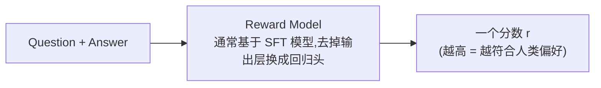
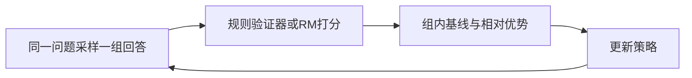

# 5. 偏好学习（Preference Learning）——人类偏好的建模与优化

> **本章目标**
>
> - 理解偏好学习对SFT的补充：用候选回答的相对比较提供额外监督
> - 理解偏好数据的格式、来源和标注偏差
> - 理解经典PPO-RLHF的策略、参考、Reward Model与Critic组件，以及clip/KL的不同作用
> - 理解Reward Hacking为何是代理奖励优化的风险，而不是每次训练必然发生的结果
> - 亲手推导 DPO：为什么"直接偏好优化"能免去 Reward Model 和强化学习
> - 了解 GRPO、ORPO、SimPO 等新一代方法，以及工业界的演进趋势

---

## 一、为什么 SFT 还不够？

上一章讲到，SFT学习示范回答的条件分布。它可以组合已有能力并泛化，不存在“必然不能超过任何示范”的硬上限；但标准SFT目标没有显式表达**同一问题下两个候选回答的相对偏好**。

用户问“如何拒绝朋友的邀请？”，候选回答可能是“不去。”或“不好意思，今天有安排，下次一起。”。在礼貌沟通的标注准则下，后者通常更合适；但不同用户和语境仍可能有不同偏好。SFT可以包含后者，也能学习礼貌措辞；偏好对进一步明确“在此条件下，B比A更好”的相对信号。

> **SFT用示范训练回答分布，偏好学习用比较信号优化相对选择。两者互补，均不保证无限提高，也不代表所有人的偏好完全一致。**

## 二、偏好数据：一切偏好学习的原材料

偏好数据的基本单元不是"一条问答"，而是"一个问题 + 两个回答 + 谁更好"：

```text
Question：如何学习 Python？
Answer A：学习语法。
Answer B：建议先学习基础语法，再完成几个小项目，最后阅读优秀开源代码。

人工标注：B 更好
```

模型学习的是"为什么 B 更好"的**隐含规律**（更具体、更有帮助、更结构化），而不是"B 的具体内容"。偏好数据主要有三种来源：

| 来源 | 做法 | 优缺点 |
|---|---|---|
| 人工标注排序 | 让标注员对模型生成的多个回答排序（InstructGPT 的做法，约 33k 组） | 质量最高，但贵、慢、标注员之间有分歧 |
| AI 对比生成 | 用更强的模型（如 GPT-4）判断哪个回答更好，自动生成偏好对 | 便宜、可扩展，但继承了"裁判模型"的偏好与偏见 |
| 产品隐式反馈 | 从真实产品里收集用户行为（采纳、点赞、复制、重新生成）推断偏好 | 最真实，但噪声大、需要清洗 |

一个经常被忽视的细节：**偏好数据里"chosen"（更好）和"rejected"（较差）的差距要适中**。差距太大，模型学不到精细的偏好（"显然更好"没有信息量）；差距太小，模型分不清学习信号。工业界常用"同一个模型用不同温度采样两次再让标注员选"的方式，保证两个回答"各有道理但一个更好"。

## 三、Reward Model：把"人类偏好"变成一个可微的打分器

经典 RLHF 需要为策略新采样出的回答持续提供标量奖励，而人工偏好数据只覆盖有限的回答对。因此，系统会训练一个能泛化到新回答的连续打分器：**Reward Model（奖励模型，RM）**。离散偏好标签本身也可以直接构造 Pairwise Loss 或 DPO Loss；RM 的必要性来自经典 PPO-RLHF 的在线奖励需求，而不是“离散标签无法产生梯度”。



Reward Model 不需要预测一个“绝对正确”的分数，只需要让 chosen 的分数高于 rejected。假设两个回答得分分别为 `2.0` 和 `0.5`，分数差为 `1.5`；经过 Sigmoid 后，模型认为 chosen 更好的概率约为 `0.818`。差距越大，这个概率越接近 `1`。

Pairwise Loss 把这条规则写成：

```math
L_{RM}=-\log\sigma\big(r(x,y_w)-r(x,y_l)\big)
```

**这个公式的作用**：把一对回答的相对顺序转换成一个可反向传播的标量 Loss。

- `x`：问题或指令；
- `y_w`：chosen，即更受偏好的回答；
- `y_l`：rejected，即较差的回答；
- `r(x,y)`：Reward Model 给整段“问题 + 回答”的标量分数；
- `σ`：Sigmoid，把分数差转换到 `0～1`；
- `-log`：当 chosen 的概率较低时产生更大的惩罚。

若 chosen 与 rejected 得分相同，概率为 `0.5`，Loss 为 `-log(0.5)≈0.693`；当 chosen 分数明显更高时，Loss 会接近 `0`。第5.1节会用代码观察这个分数差如何在训练中逐步拉开。

**为什么需要 RM 而不是每次都用人类打分？** 两个原因：①人类打分慢且贵，RM 训练好后可以给任意"问题-回答"即时打分，PPO 每个 step 都要打分；②人类的打分有噪声，RM 相当于把几千条人类判断"蒸馏"成了一个稳定、平滑的打分函数。

## 四、RLHF：用强化学习"讨好"奖励模型

有了 RM，下一步就是让策略模型（被对齐的模型）学会生成高分回答——这是一个标准的强化学习问题。OpenAI 的 **RLHF（Reinforcement Learning from Human Feedback）** 用 PPO 算法解决它：

```mermaid
flowchart LR
    A[SFT 模型(初始策略)] --> B[对指令生成回答] --> C[RM 打分] --> D[PPO 更新策略] --> B
```

PPO 的核心概念不需要先看完整公式，可以先拆成三步：

1. Reward Model 给回答一个奖励；
2. Critic 估计“这个状态原本大约能拿多少奖励”，二者共同形成 Advantage；
3. 更新策略时限制新旧策略的概率比，避免一次改得过大。

例如，某个动作在旧策略下的概率是 `0.20`，更新后变成 `0.30`，概率比为 `1.5`。当该动作的 Advantage 为正、裁剪范围为 `[0.8,1.2]` 时，PPO 的代理目标不会继续奖励比率从 `1.2` 增长到 `1.5`。若 Advantage 为负，裁剪生效的方向相反。Clip 裁剪的是代理目标，不是对参数步长、KL 或真实策略变化的严格上限。

RLHF 还会用 KL 项修改奖励，限制策略偏离参考模型：

```math
r_{shaped}=r_{RM}-\beta\,D_{KL}(\pi_\theta\|\pi_{ref})
```

**这个公式的作用**：先形成用于强化学习的“塑形奖励”，而不是直接得到 Advantage。

- `r_RM`：Reward Model 给出的偏好分数；
- `π_ref`：冻结的参考模型，通常来自 SFT；
- `D_KL`：当前策略与参考策略的分布差异；
- `β`：KL 惩罚强度，越大表示越保守。

随后还要结合轨迹回报和 Critic/Value Model，才能计算 Advantage。不能把“RM 分数减 KL”直接等同于完整的 Advantage。

> **Reward Hacking（奖励黑客）**：模型找到让代理奖励变高的方式，但实际回答质量并没有同步提高。KL 约束只能限制偏移，并不能保证彻底消除 Reward Hacking。

### 补充阅读：PPO 的裁剪目标

主线理解到“概率比 + Advantage + Clip”已经足够。完整的常见写法是：

```math
J^{PPO}(\theta)=\mathbb{E}_t\!\left[\min\!\left(r_t(\theta)\hat A_t,\ \operatorname{clip}(r_t(\theta),1-\epsilon,1+\epsilon)\hat A_t\right)\right]
```

其中 `r_t(θ)=π_θ(a_t|s_t)/π_old(a_t|s_t)` 是新旧策略概率比，`Â_t` 是 Advantage，`ε` 是裁剪宽度，`E_t` 表示对采样位置取平均。`Â_t>0` 时主要限制概率比过度上升，`Â_t<0` 时主要限制概率比过度下降；朝不利方向的变化仍可能产生梯度。这个目标通常被**最大化**；代码若使用梯度下降优化 Loss，通常会对它取负，并叠加 Value Loss、Entropy Bonus 等项。

## 五、PPO 的工程之痛：为什么业界急着找替代品

PPO 效果好，但工程上是出了名的难伺候：

1. **要同时维护多类模型组件**：策略模型、参考模型、Reward Model，以及用于估计 Advantage 的 Value/Critic。Critic 可以与策略共享骨干，但仍增加输出头、状态和计算；
2. **强化学习的固有顽疾**：策略在采样空间里探索，训练不稳定，超参数（`ε`、`β`、学习率）敏感，动不动就"训飞"；
3. **流程复杂**：生成 → 打分 → 计算优势 → 更新 → 重新生成……每一个环节出错都难排查；
4. **数据生成成本高**：Rollout 需要在线生成回答。采样数据通常会被拆成 Mini-Batch 并重复若干 PPO Epoch，但使用次数仍受 On-Policy 约束，不能像固定监督数据那样长期反复训练。

这些痛点推动了 2023 年最重要的一次方法变革：**能不能不训练 RM、不用强化学习，直接用偏好数据优化模型？**

## 六、DPO：把偏好排序直接作用于模型概率

DPO（Direct Preference Optimization）仍使用“问题 + chosen + rejected”的偏好对，但不单独训练 Reward Model，也不运行 PPO 的在线采样循环。理解它时，先不要展开长公式，只看两个中间量。

第一步，比较策略模型与参考模型对同一个回答的对数概率：

```math
r_{impl}(x,y)=\beta\left[\log\pi_\theta(y|x)-\log\pi_{ref}(y|x)\right]
```

**这个公式的作用**：构造一个隐式奖励，衡量当前策略相对参考模型把某个回答的概率提高了多少。

- `π_θ`：正在训练的策略模型；
- `π_ref`：冻结的参考模型；
- `log π(y|x)`：模型对完整回答 `y` 的 Token Log Probability 之和；
- `β`：缩放系数，决定相对参考模型变化在 Loss 中的尺度。

第二步，像 Reward Model 的 Pairwise Loss 一样，让 chosen 的隐式奖励高于 rejected：

```math
L_{DPO}=-\log\sigma\left(r_{impl}(x,y_w)-r_{impl}(x,y_l)\right)
```

**这个公式的作用**：输出一个标量 Loss；当 chosen 的相对概率提升更多时，Loss 变小。

第5.1节使用四个具体 Log Probability 计算：chosen 隐式奖励为 `0.07`，rejected 为 `-0.11`，差值为 `0.18`，最终 `Loss≈0.607`。这个数值链比直接记忆展开式更重要。

把第一步代入第二步，才得到论文中常见的完整形式：

```math
L_{DPO}=-\log\sigma\!\left(\beta\log\frac{\pi_\theta(y_w|x)}{\pi_{ref}(y_w|x)}-\beta\log\frac{\pi_\theta(y_l|x)}{\pi_{ref}(y_l|x)}\right)
```

### 补充阅读：隐式奖励从哪里来

在 KL 正则化的 RLHF 目标下，最优策略与奖励之间可以写出解析关系：

```math
r(x,y)=\beta\log\frac{\pi^*(y|x)}{\pi_{ref}(y|x)}+\beta\log Z(x)
```

`Z(x)` 只依赖问题，不依赖具体回答；比较同一问题的 chosen 与 rejected 时，它会在奖励差中抵消。这个推导解释了 DPO 的来源，但不是使用 DPO 前必须掌握的内容。

“Direct”表示偏好数据可以直接构造策略模型的监督式损失，不再显式训练 RM 或执行 PPO。它不意味着训练没有参考模型、超参数或稳定性问题；`β` 的具体效果还与实现约定和数据分布有关。

## 七、GRPO：用组内相对奖励估计优势

**GRPO（Group Relative Policy Optimization）**在DeepSeekMath（2024）中提出，随后用于DeepSeek-R1（2025）等推理训练工作。它是在线策略优化方法，不是DPO的直接变体。

对同一个问题，策略采样一组回答，用组内奖励均值（常配合标准差归一化）构造相对优势，从而不必另训练一个Value/Critic模型。但“免去Critic”不等于“免去奖励来源”：奖励可以来自可验证规则、学习到的RM或二者组合。



**GRPO与RLVR是不同维度的概念**：GRPO描述策略更新算法，RLVR描述使用可验证奖励的训练设定。GRPO可以采用RLVR奖励，PPO等其他算法也可以；GRPO本身不保证无RM、更稳定或更省总计算，组大小与rollout成本同样重要。组内奖励全相同还可能产生接近零的学习信号。

## 八、方法谱系与工业界演进

| 方法 | 核心思想 | 是否需要 RM | 是否需要强化学习 | 典型场景 |
|---|---|---|---|---|
| 经典PPO-RLHF | 学习的RM打分 + PPO + KL | 通常是 | 是 | 通用偏好对齐；PPO也可配其他奖励 |
| DPO | 相对参考策略的对数概率比 | 不显式训练 | 无在线RL循环 | 2023年提出，离线偏好优化 |
| ORPO | SFT项 + odds-ratio偏好项 | 不显式训练 | 无在线RL循环 | 2024年提出，无独立参考策略 |
| SimPO | 长度归一化log概率与奖励间隔 | 不显式训练 | 无在线RL循环 | 2024年提出，无独立参考策略 |
| GRPO | 组内基线替代Value/Critic | 取决于奖励来源 | 是 | 2024年DeepSeekMath；2025年R1采用 |
| KTO | 使用单条回答的可取/不可取标签 | 不显式训练 | 无在线RL循环 | 2024年提出，非成对反馈 |

这些不是“PPO→DPO→GRPO逐代淘汰”的同一条路线：离线偏好优化与在线奖励优化解决不同约束。选择取决于是否有可靠奖励、是否负担得起rollout、数据覆盖与评估目标。GRPO在推理训练中受到关注，不意味着成为所有任务的标准；可验证正确性与一般人类偏好也不能混为一谈。

## 工程工具箱

| 框架 | 特点 |
|---|---|
| TRL（HuggingFace） | 官方支持 PPO / DPO / ORPO / GRPO / KTO，与 transformers 无缝集成，目前应用最广 |
| OpenRLHF | 开源 RLHF 平台，支持大规模分布式 PPO/DPO |
| verl（字节火山引擎） | 新一代 RL 训练框架，重点支持 GRPO / RLVR，DeepSeek 社区大量采用 |
| DeepSpeed-Chat | 微软的完整 RLHF 流水线（SFT + RM + PPO），适合大规模 |

---

实验分成两条支线：**5.1训练Reward Model并分析回答评分**解释PPO-RLHF打分器及手写DPO数例；**5.2使用DPO训练一次偏好优化**直接读取4.2保存的SFT adapter与tokenizer，不读取5.1的RM。

## 本章总结

- 偏好对提供相对比较信号，SFT与偏好学习互补，而不是“只有偏好学习能超过示范”。
- RM用pairwise损失学习相对分数；它是代理指标，可能产生偏差或被策略利用。
- PPO的旧策略概率比、Critic形成的Advantage、clip代理目标和SFT参考KL各有作用；clip和KL都不保证消除奖励投机。
- DPO以固定参考策略的对数概率比构造隐式奖励，不需要显式RM和在线PPO循环。5.2用双adapter保留SFT参考。
- GRPO用组内相对优势替代单独Critic；是否使用RM取决于奖励来源，GRPO不等于RLVR。

> **方法没有脱离数据、奖励和资源约束的普适优胜者。收益应由独立评估确认，不能只看训练奖励或把算法年代当作效果排名。**

## 下一章预告

模型已经会执行指令、回答也符合偏好。但还有一个问题：让它做一道数学题，它可能"一本正经地写出错误的推理过程"——它会模仿推理的样子，却未必真正会推理。下一章，我们将进入：

> **第6章 Reasoning Alignment——模型如何学会真正推理？**

---

# 参考资料

- OpenAI《Training language models to follow instructions with human feedback》(InstructGPT，RLHF 与 33k 偏好数据出处)：https://arxiv.org/abs/2203.02155
- Rafailov et al.《Direct Preference Optimization: Your Language Model is Secretly a Reward Model》(DPO 论文，本章第六节的推导出处)：https://arxiv.org/abs/2305.18290
- Anthropic《Training a Helpful and Harmless Assistant with RLHF》(RM 训练与偏好数据细节)：https://arxiv.org/abs/2204.05862
- DeepSeek《DeepSeek-R1》(GRPO + RLVR 推理训练)：https://arxiv.org/abs/2501.12948
- HuggingFace《Alignment Handbook》(DPO/PPO 全流程代码)：https://github.com/huggingface/alignment-handbook

---

## 思考题

1. SFT和偏好对分别表达哪些监督信号？为什么“没有显式相对偏好”不等于“SFT不能泛化到示范之外”？
2. KL参考约束与PPO旧策略概率比各防什么问题？把beta设为0是否一定立刻导致崩坏？
3. DPO为什么可以省去显式RM和在线PPO？推导中的KL目标与Bradley-Terry假设分别起什么作用？
4. 为什么优化代理奖励存在Reward Hacking风险，但不能说每次训练必然发生？如何用独立评价发现它？
5. GRPO与RLVR分别描述什么？请举出GRPO使用学习到的RM和PPO使用规则奖励的可能配置。
