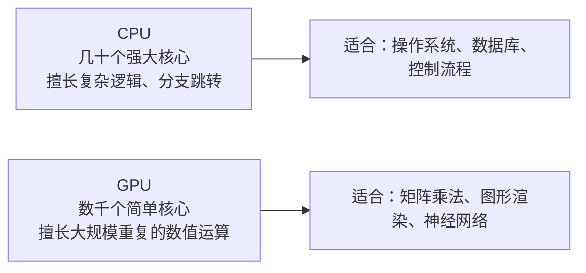
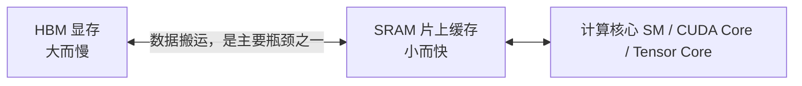
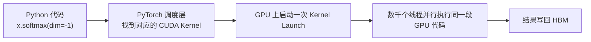
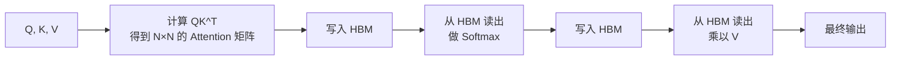
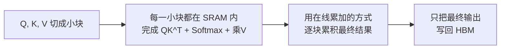

# 第6章 GPU 基础与算子——为什么理解硬件，才能真正理解训练与推理工程

## 本章目标

完成本章学习后，你将理解：

- GPU 为什么天生适合训练神经网络，它和CPU 的核心差异在哪里
- GPU 内部的 SM、CUDA Core、Tensor Core 分别是做什么的
- 显存的两个层级（HBM 与 SRAM）为什么会决定一个程序的真实速度
- 什么是"算子"（Operator），为什么"算子融合"能带来实实在在的加速
- CUDA 生态（Driver、Toolkit、cuBLAS/cuDNN、NCCL）大致的分层关系，以及 ROCm 的定位
- FlashAttention 如何仅通过改变计算顺序，就在数学结果完全不变的前提下大幅提速、降低显存占用

---

下一章即将讲到的并行训练策略、ZeRO、Continuous Batching、PagedAttention，全部建立在一个共同的前提之上：**它们都在和显存、算力这两个物理资源打交道**。如果不理解 GPU 本身是怎么工作的，这些工程方案就会变成一堆需要死记硬背的名词。这一章，我们退回到硬件这一层，把地基先补上。

## 为什么是 GPU，而不是 CPU？

CPU 的设计目标是"把一件复杂的事情尽快做完"：少量核心（通常几个到几十个），但每个核心都非常强大，擅长处理分支、跳转、复杂逻辑。GPU 的设计目标完全不同：**把同一件简单的事情，同时做成千上万遍**。一张消费级显卡（如 RTX 4060）就拥有数千个计算核心，但每个核心都很简单，只擅长做加法、乘法这类规整的数值运算。

神经网络的核心运算——矩阵乘法——恰好完美契合 GPU 的设计：一次`[1000, 1000] @ [1000, 1000]` 的矩阵乘法可以拆解成一百万个"取两个数、相乘、加到累加器"这样极其规整、彼此独立的小操作，这正是 GPU 数千个核心可以同时施展的场景。这也是为什么深度学习几乎是伴随着 GPU 算力的普及才真正爆发的。

## GPU 内部结构：SM、CUDA Core、Tensor Core

打开一张 NVIDIA GPU 的"内部结构图"，会看到几个关键概念：

| 概念 | 类比 | 作用 |
|---|---|---|
| SM（Streaming Multiprocessor） | 一个"车间" | GPU 由多个 SM 组成，每个 SM 内部有自己的计算核心、缓存和调度器，可以独立执行任务 |
| CUDA Core | 车间里的"工人" | 最基础的计算单元，一次只能做一次标量加法/乘法 |
| Tensor Core | 车间里的"专用生产线" | 新一代显卡（Volta 架构之后）专门为矩阵乘法设计的硬件单元，一次能完成一小块矩阵乘加运算，比用 CUDA Core 拼出同样的计算快得多 |
| Warp | 一个"班组" | GPU 调度的基本单位，通常是 32 个线程一组，同一个 Warp 内的线程会同步执行同一条指令 |

一个直观的数字：Tensor Core 针对矩阵乘法这一件事做了专门的硬件优化，使得同样的矩阵乘法，用 Tensor Core 计算可以比单纯堆 CUDA Core 快好几倍。这也是为什么 PyTorch、TensorFlow 等框架都会想办法把矩阵乘法路由到 Tensor Core 上执行（例如启用 `torch.backends.cuda.matmul.allow_tf32`），以及为什么"半精度（FP16/BF16）训练"能提速——Tensor Core 对低精度矩阵乘法的支持通常比 FP32 更强。

## 显存层级：HBM 与 SRAM，谁在拖慢你的程序？

很多人以为"显卡算力越高，程序就越快"，但真实情况经常是：**程序的瓶颈根本不在"算得快不快"，而在"数据搬得快不快"**。GPU 内部至少有两层完全不同的存储：

| 层级 | 全称 | 容量 | 速度 | 类比 |
|---|---|---|---|---|
| HBM（显存） | High Bandwidth Memory | 大（消费卡 8~24GB，数据中心卡可达 80~192GB） | 相对慢（带宽通常几百 GB/s 到几TB/s） | 仓库：能放很多东西，但每次搬运都要走一段路 |
| SRAM（片上缓存） | 芯片内置的高速缓存，位于每个 SM 内部 | 很小（每个 SM 通常只有几十 KB 到几百 KB） | 极快（比 HBM 快一个数量级以上） | 工作台：东西不多，但拿取几乎零延迟 |

这引出了一个判断程序性能瓶颈的经典工具——**Roofline 模型**：一个程序的实际速度，取决于它是被"算力"卡住，还是被"数据搬运的带宽"卡住。

- **Compute-Bound（算力瓶颈）**：核心大部分时间在计算，数据搬运不是瓶颈。典型例子：大矩阵乘法（矩阵越大，同样的数据搬运量能换来越多次计算，"划算"）。
- **Memory-Bound（带宽瓶颈）**：核心大部分时间在等数据从 HBM 搬到计算单元，真正计算的时间反而很短。典型例子：Softmax、LayerNorm 这类"逐元素"操作——每读一个数只做一次简单运算，算力远没有用满，程序却因为反复读写 HBM 而变慢。

**朴素实现的 Self-Attention 恰好是一个典型的 Memory-Bound 操作**——这一点会在本章最后和6.1 节的实验里具体展开，这也是理解 FlashAttention 为什么有效的关键。

## 什么是"算子"（Operator）？

你在 PyTorch 里写下 `torch.matmul(a, b)` 或者 `x.softmax(dim=-1)`，这一行代码在底层并不是"直接跑在 GPU 上"，而是要经过这样一个过程：

这里的"CUDA Kernel"，就是一段专门为 GPU 编写、会被成千上万个线程同时执行的小程序，深度学习框架里把每一个这样的基本计算单元称为**算子（Operator）**——矩阵乘法是一个算子，Softmax 是一个算子，LayerNorm 是一个算子。一个复杂的模型 forward 过程，本质上就是几十上百个算子按顺序被调度执行的过程。

这里有两个容易被忽略的开销：

1. **Kernel Launch 开销**：每一次"启动一个算子"本身就有一份固定的调度成本（哪怎么把任务分给哪些 SM、什么时候开始），算子越小、越碎，这份开销占比就越高。
2. **中间结果的读写**：算子 A 算完的结果，要先写回 HBM，算子 B 才能再从 HBM 读出来接着算——即使 A 和 B 的数据完全能放进 SRAM，只要它们是两个独立的算子，这次没必要的"写出去再读回来"就会发生。

**算子融合（Kernel Fusion）**，就是把多个连续的小算子合并成一个大算子，让中间结果直接留在 SRAM 里传递给下一步计算，不必经过 HBM 这一趟"远路"，同时也少了几次 Kernel Launch 的固定开销。`torch.compile`、Triton、XLA 这些"编译加速"技术，做的核心工作之一正是自动发现并融合可以合并的算子。

## CUDA 生态全景

NVIDIA GPU 的软件栈，从下到上大致分成这几层：

| 层级 | 名称 | 作用 |
|---|---|---|
| 驱动层 | NVIDIA Driver | 操作系统与 GPU 硬件通信的最底层接口 |
| 平台层 | CUDA Toolkit | 提供编译器（nvcc）、运行时 API，让开发者可以写 GPU 程序 |
| 算子库 | cuBLAS / cuDNN | NVIDIA 官方实现的高度优化矩阵运算库（cuBLAS）与深度学习专用算子库（cuDNN），绝大多数框架的矩阵乘法、卷积底层都直接调用它们 |
| 通信库 | NCCL | 多卡/多机之间做梯度同步、集合通信（All-Reduce 等）的专用库，第7章讲的分布式训练全部依赖它 |
| 框架层 | PyTorch / TensorFlow | 我们平时写的 Python 代码，底层会自动路由到上面这些库 |

也就是说，你写的每一行 `model(x)`，最终都会经过"PyTorch → cuDNN/cuBLAS → CUDA Toolkit → Driver → 硬件"这样一条完整的链路。

> **关于 AMD 显卡（ROCm）**：AMD 提供了一套与 CUDA 生态对应的软件栈，叫 **ROCm**，其中 `HIP` 对应 CUDA 的编程接口，`MIOpen` 对应 cuDNN。近年来主流深度学习框架（包括 PyTorch）已经支持直接在 ROCm 上运行，使用体验上 `torch.cuda` 这套接口在 ROCm 后端下同样可用，代码基本不需要改动。由于本书所有实验默认基于 CUDA 生态，涉及底层细节时会以 CUDA 为主线讲解，但绝大多数结论（显存层级、算子、Kernel Fusion 的思想）对 ROCm 同样成立。

## FlashAttention：一次经典的算子级优化

现在把前面几节的知识拼在一起，看一个真实的例子。Self-Attention 的朴素实现大致是这样几步：

问题就出在反复的"写入 HBM → 读出 HBM"：当序列长度是 N，这个 N×N 的中间矩阵可能非常大（例如 N=4096 时就是 1600 万个元素），而每一步的实际计算量（乘法、Softmax）相对于"把这么大一块数据在 HBM 里来回搬运"而言并不算多——**这正是上面提到的 Memory-Bound：算力没有被用满，时间大部分花在了搬数据上**。

FlashAttention 的核心思路是：**把 Q、K、V 切成小块（Tiling），每一小块都尽量留在 SRAM 里，通过分块累加的方式，从头到尾都不把完整的 N×N 中间矩阵写回 HBM**，只在最后写出最终结果：

关键在于：**FlashAttention 计算出的数学结果和朴素实现完全一样**（都是标准的 Softmax Attention），它改变的只是"计算顺序"和"数据在 HBM/SRAM 之间的搬运方式"，却因为大幅减少了对 HBM 的读写次数，换来了数倍的速度提升和显存节省。这是一个理解"算子级优化"价值的绝佳案例：**很多时候，让程序变快的关键不是换一个更强的 GPU，而是重新设计算子，让数据尽量待在快的存储里，少往慢的存储搬。**

---

想亲手感受这一切，可以看这一节实验：**6.1 亲手写一个 Triton 算子，并对比 FlashAttention 与朴素 Attention 的显存/速度差异**。

---

## 本章总结

本章我们理解了：

✅ GPU 用数千个简单核心并行处理规整的数值运算，天生契合矩阵乘法这类神经网络核心操作 ✅ SM、CUDA Core、Tensor Core 是GPU 内部从"车间"到"专用生产线"的分工结构 ✅ HBM（大而慢）与 SRAM（小而快）两级存储决定了程序是Compute-Bound 还是 Memory-Bound ✅ 算子是深度学习框架里最基本的计算单元，算子融合通过减少 HBM 读写和 Kernel Launch 次数带来加速 ✅ CUDA 生态从Driver 到 cuBLAS/cuDNN/NCCL 再到 PyTorch 层层封装，ROCm 是 AMD 对应的生态 ✅ FlashAttention 证明了：不改变数学结果，仅通过重新设计算子的计算顺序，就能带来数量级的性能提升

> **理解训练和推理工程之前，先理解显存和算力这两个物理资源到底在被什么消耗——这是本章留给后面所有工程方案的一把钥匙。**

## 下一章预告

补上了硬件这一层地基之后，我们可以回到更熟悉的问题：一个几百亿参数的模型，要如何被拆到成百上千张 GPU 上协同训练？下一章，我们将进入：

> **第7章 LLM Training Stack——现代大模型训练工程**
