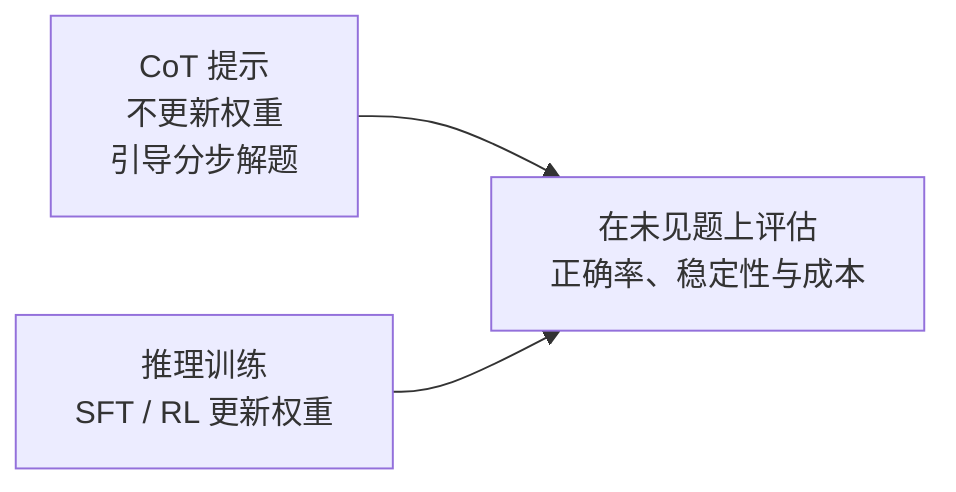
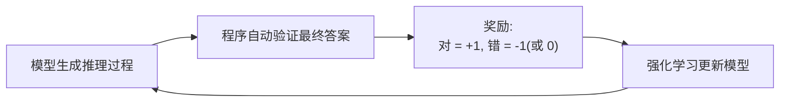
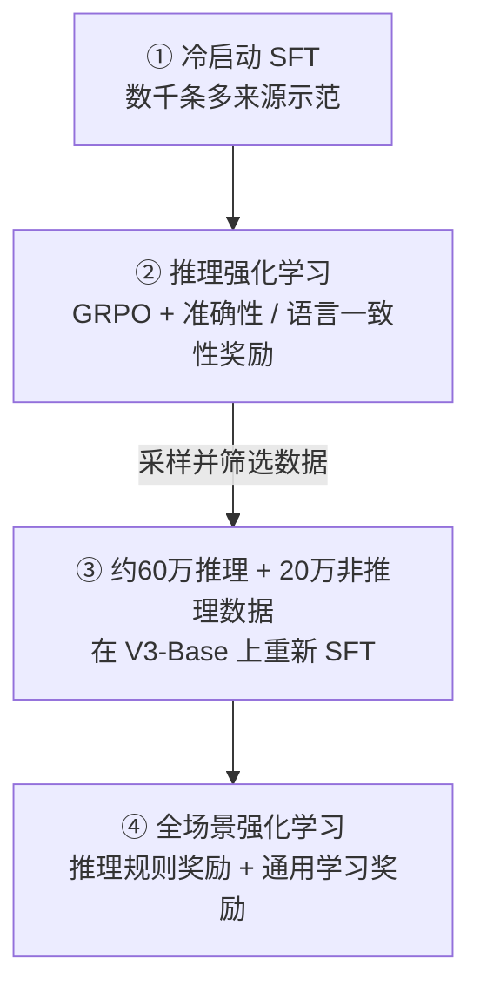

# 6. 推理对齐（Reasoning Alignment）——推理能力的训练与对齐

> **本章目标**
>
> - 区分可见推理文本、答案正确率与泛化能力，不凭输出长短判断是否会推理
> - 了解 CoT（思维链）提示、推理数据 SFT 与强化学习如何相互配合
> - 掌握结果监督（Outcome Supervision）与过程监督（Process Supervision）的区别
> - 理解可验证奖励的作用、成本与误差，区分 RLVR 与 GRPO
> - 掌握 DeepSeek-R1 的四阶段训练流水线，并与 R1-Zero 区分
> - 理解测试时计算（test-time compute）的收益边界与成本

---

## 一、一个容易被忽视的现象：过程很长，不等于答案正确

第一部分 13.3 节我们体验过用 "Let's think step by step" 引导模型逐步推理。但模型有时**写了一大段过程，结论却是错的**，甚至过程与结论互相矛盾——例如声称 23×17=381，而正确结果是 391。

这说明**流畅的解释不是正确性的证明**，并不说明预训练或 SFT 只能学习文体。预测下一个 token 的训练也可能学到可迁移的计算规律与解题策略，只是目标函数不会逐步证明其逻辑正确。反过来，经过 RL 的模型也可能推理出错。判断能力需要看未见题上的正确率、稳定性和成本，而不是把模型分成“模仿”与“真正推理”两类。

## 二、从 Prompt 到训练：CoT 的两条路线

2022 年的 *Chain-of-Thought Prompting Elicits Reasoning in Large Language Models* 系统展示了 **CoT 提示**：在示例中给出中间步骤，引导模型生成分步解答。提示词不更新权重，但可以改变解题策略、分配更多生成计算，从而改善部分任务的结果；它不只是换一种文体。

CoT 提示也有边界：效果依赖模型、题型和示例，可能随措辞波动，也不保证过程正确。与此对应，**Reasoning Alignment（推理对齐）**通过推理数据 SFT、结果或过程奖励等方法更新参数，改善模型选择解题路径与作答的行为。SFT 可以学到解题策略；RL 可以改变策略，也可能强化错误的捷径。两者都需要验证泛化效果。

## 三、监督信号从哪来：Outcome vs Process

训练推理能力时，第一个设计决策是：**"对错"这个信号从哪里来、监督到什么粒度？**

| 监督方式 | 监督对象 | 优点 | 缺点 |
|---|---|---|---|
| Outcome Supervision（结果监督） | 只检查最终答案是否正确 | 简单、成本低 | 无法判断过程是否合理，可能"蒙对"；无法定位错在哪一步 |
| Process Supervision（过程监督） | 对推理过程的每一步分别打分 | 有助于定位错误步骤 | 细粒度标注与校验成本高，可借助过程奖励模型，也可使用人工或规则反馈 |

第6.1节只核验符合输出约定的最终数值，属于 Outcome Verifier；它不证明中间过程正确。数学、代码等部分任务可以用规则代替逐条人工评分，这使 **可验证奖励（Verifiable Rewards）**成为推理训练的重要信号，但题目、参考答案、测试和验证器本身仍需构建与质检。

## 四、可验证奖励：可扩展，但不是免费且无噪声

**RLVR（Reinforcement Learning with Verifiable Rewards）描述奖励来源**：例如比较数值答案、运行代码测试、检查形式化证明。规则较明确，通常能减少逐个回答的人类偏好标注；与依赖学习奖励模型的方法相比，一些奖励也更便于审计。但必须保留三个边界：

1. **验证有成本**：题库制作、答案审计、测试执行与沙箱维护都需要资源；大批量 rollout 和长序列生成也可能成为主要成本。
2. **验证会出错或不完整**：答案解析错误、浮点误差、参考答案错误、测试覆盖不足都可能错奖或漏奖；“通过现有测试”不等于程序对所有输入都正确。
3. **人类反馈没有消失**：开放任务、数据质检、奖励设计和安全评测仍依赖人工；奖励设计还要防止 reward hacking（模型利用验证漏洞）。

一个结果奖励训练循环可以概括为：

**稀疏奖励是难点，不是 RL 天然擅长的条件。** 如果模型几乎采不到正确解，奖励很难指出哪条路径更好，长序列的信用分配也很困难。有效训练依赖基座能力、题目难度、采样预算和验证质量，而不是把“对/错”接上去就能学会。

### 从奖励到更新：一个 GRPO 手算例子

**GRPO 是策略优化算法，RLVR 是奖励来源，两者不等价。** 同一问题采样四个回答，若结果奖励为 \([1,1,0,0]\)，以总体标准差计算：

\[
\bar r=\frac{1+1+0+0}{4}=0.5,\qquad
\sigma=\sqrt{\frac{4\times 0.5^2}{4}}=0.5.
\]

\[
A_i=\frac{r_i-\bar r}{\sigma+\delta}
\approx [1,1,-1,-1]_i,
\]

其中 \(\delta\) 是防止除零的小常数。正优势倾向于提高对应采样回答的概率，负优势反之；它不是“整条推理已被证明正确”。这里选择总体标准差只是为了手算清楚，实际库的标准差与归一化约定要看实现，R1 v1 未指定这些细节。

若组内全错 \([0,0,0,0]\)（或全对），均值相减都为零，稳定化后优势为零：**这一项结果奖励没有组内相对学习信号**。这不等于所有损失都为零；KL 或其他奖励仍可能贡献梯度。可调整题目难度与采样策略，但不能靠归一化“创造”正确样本。

第5章的更新边界仍然适用：**clip 针对新策略与采样旧策略的概率比**，限制目标中的更新激励；**KL 针对当前策略与参考策略的偏离**。两者不是同一比较，也都不能保证实际策略严格停留在某个安全区域内。本节手算只展示优势，不是完整训练器；实际实现还需 token mask、概率比、clip、KL 与长度归一化等细节。

## 五、DeepSeek-R1 的四阶段流水线

以下按 **DeepSeek-R1 原论文 arXiv:2501.12948v1（2025年1月）**介绍一条公开实践，不将其称为所有推理模型的统一标准。先区分两个模型：**R1-Zero** 从 DeepSeek-V3-Base 直接做 RL，没有前置 SFT；**R1** 为改善可读性、语言混杂与通用能力，引入下面的四阶段流程。

**第一阶段：冷启动 SFT。** 数据来自长 CoT 少样本提示、直接提示生成含反思与验证的详细解答、可读的 R1-Zero 输出，以及人工后处理等多种渠道，并非全部由人工从零编写。收集数千条样本后微调 DeepSeek-V3-Base，为 RL 提供更可读的起点；这不意味着所有模型都必须按同样方式冷启动。

**第二阶段：推理导向 RL。** 使用 GRPO 优化数学、代码等任务，结合准确性奖励与语言一致性奖励。论文著名的自我检查、“aha moment”等观察主要来自 **R1-Zero** 的训练；它说明这些行为可以在特定条件下被强化，不是所有 RL 必然产生反思的证明，也不能据此外推推理过程始终正确。

**第三阶段：拒绝采样与 SFT。** 用第二阶段的检查点对推理提示采样、筛选正确且可读的回答，构造约 **60 万条推理数据**；部分扩展样本使用生成式奖励模型辅助判断，不是全靠无误差规则。另加入约 **20 万条非推理数据**，涵盖写作、事实问答、翻译等。随后以总计约 **80 万条样本重新微调 DeepSeek-V3-Base 两个 epoch**，而不是在上一阶段的 RL 检查点上原地继续 SFT。

**第四阶段：全场景 RL。** 推理数据使用规则奖励，通用数据使用学习到的奖励模型以刻画偏好。论文中，有用性评估主要看最终摘要，无害性评估覆盖包括推理在内的整个回答；“全场景”指多类任务联合优化，不代表覆盖所有现实场景。

**R1 的启示**是 SFT 与 RL 可以互补，而不是“SFT 只教格式、RL 才练能力”。同一论文发布的小型蒸馏模型用整理后的数据做 SFT，未进行该论文中的 RL 阶段，也获得了推理表现提升。第6.1节观察的正是这类蒸馏模型。

## 六、推理模型的代价：没有免费的"思考"

推理导向模型常在数学、代码等任务上使用更长的生成轨迹，消耗更多 token、KV cache 和时间，但不是每次都更长，也没有通用的固定成本倍数。普通 Chat Model 同样可以输出分步推理；一些模型还支持思考与非思考模式。两者都需要记录正确率、首 token 延迟、完整响应延迟和 token 消耗。

**Test-Time Compute（测试时计算）不是推理模型独有。** 普通模型也能通过多次采样、Self-Consistency、搜索或验证器重排增加推理时计算。推理导向训练则可能让模型更有效地利用这些预算。预算增加有时提高准确率，也可能只带来重复、错误累积或收益饱和；**更长不保证更好**，而 `max_new_tokens` 只是生成上限，不保证模型有效思考到该长度。

训练计算与推理计算可以在特定任务和服务负载下共同优化，但不是任意等价替换：要看模型基础能力、调用次数、延迟约束以及额外计算的边际收益。只有同一评测集上的质量—成本曲线，才能支持“多花这些计算是否值得”的判断。

**可见文本也不等于内部机制。** R1 可展示推理文本；部分商业产品仅提供摘要而不暴露原始推理轨迹，具体取决于接口。没有 `<think>` 标签不代表没有推理，有标签也不证明其中的解释忠实、正确。

## 七、推理对齐的开放问题

- **思考效率**：如何按题目难度分配生成或搜索预算，在正确率与成本间取舍，而不是让所有问题都长篇回答？
- **验证器边界**：开放任务往往难以完整形式化。工具和规则能验证部分约束；LLM-as-a-Judge 则引入学习评判器的误差，不能等同于可靠的规则验证。
- **推理与安全**：更强能力、更长输出和工具使用会改变风险面，需要分别评测最终回答与系统行为；不能仅凭“思考更长”断言一定更安全或更危险（第7章衔接）。

---

下一节先用 **6.1 Reasoning Model 与 Chat Model 的推理输出对比**观察蒸馏模型的行为、截断和成本，再进入第7章。

## 本章总结

- CoT 提示不更新权重；SFT 与 RL 都可能改善解题策略，不能用文体与“真假推理”二分。
- Outcome 与 Process 指监督粒度；RLVR 指奖励来源；GRPO 指更新方法，三者回答不同问题。
- 自动验证能降低逐条评分成本，但仍有验证误差、数据成本和探索困难；全同奖励组没有结果奖励的相对信号。
- R1 与 R1-Zero 不同；R1 四阶段包含约60万推理与20万非推理样本在 V3-Base 上重新 SFT，以及最终混合奖励 RL。
- 测试时计算适用于多种模型和策略，其价值应以未见题上的质量—成本曲线衡量。

> **不要只问“模型想了多长”，还要问“验证器测了什么、在哪些新题上有效、为此付出了多少计算”。**

## 下一章预告

更强的能力、更长的输出与更广的工具权限都可能改变风险面，需要具体评测。完成第6.1节的行为观察后，我们将进入：

> **第7章 Safety Alignment——大模型安全对齐方法**，随后通过第7.1节实现内容审核链路。

---

# 参考资料

- DeepSeek《DeepSeek-R1: Incentivizing Reasoning Capability in LLMs via Reinforcement Learning》v1（本章四阶段与数据量以原始版本为准）：https://arxiv.org/html/2501.12948v1
- OpenAI《Learning to Reason with LLMs》(o1 推理模型、test-time compute 技术博客)：https://openai.com/index/learning-to-reason-with-llms/
- Wei et al.《Chain-of-Thought Prompting Elicits Reasoning in Large Language Models》(CoT 起源)：https://arxiv.org/abs/2201.11903
- OpenAI《Let's Verify Step by Step》(Process Supervision 论文)：https://arxiv.org/abs/2305.20050
- OpenAI o1 系统卡（推理模型的安全评估与红队）：https://openai.com/index/openai-o1-system-card/

---

## 思考题

1. Process Supervision 与 Outcome Supervision 各自的优缺点是什么？什么任务更适合哪种监督方式？
2. GRPO 相比 PPO 去掉了 Value Network——这样做的收益和代价分别是什么？
3. 推理时 Scaling（Test-Time Scaling）与训练时 Scaling 的区别是什么？为什么“让模型多想一会儿”也能提升性能？
