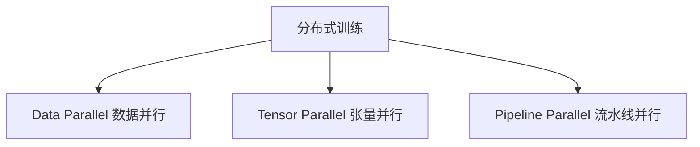

# 第7章 LLM Training Stack——现代大模型训练工程

> **本章目标**
>
> - 理解"训练大模型"为什么是一套工程系统问题，而不是"调用几行代码"
> - 掌握训练显存的完整账本：参数、梯度、优化器状态、激活值各占多少
> - 理解 Data Parallel、Tensor Parallel、Pipeline Parallel 三种并行方式，以及 3D 并行如何组合
> - 理解 ZeRO 的三个阶段分别切分什么、能省多少显存，以及它与数据并行的关系
> - 理解混合精度训练、梯度检查点、梯度累积等标配优化手段的原理
> - 了解主流分布式训练框架的定位（Megatron、DeepSpeed、Accelerate）

---

## 一、一张显卡装不下的模型：从显存账本说起

上一章我们算过一笔账：一个 70B 参数的模型，用 AdamW + 混合精度训练，显存需求超过 **700GB**——而最顶级的单卡也只有 80GB。所以训练现代大模型的第一个工程问题就是：

> **如何把一个模型，拆到成百上千张 GPU 上协同训练？**

在回答"怎么拆"之前，先记住显存账本的四个项目（第6章已详述，这里只做提醒）：

| 项目 | 70B 模型示例 | 说明 |
|---|---|---|
| 模型参数（FP16/BF16） | ~140GB | 必须常驻 |
| 梯度（FP16/BF16） | ~140GB | 反传时产生 |
| 优化器状态（Adam 的 FP32 副本 + 一阶矩 + 二阶矩） | ~420GB | **最大的一块**，12 字节/参数 |
| 激活值（中间结果） | 随 batch/序列长度暴涨 | 用梯度检查点可控地削减 |

**优化器状态 > 参数 > 梯度**，这个顺序决定了后面所有并行策略的设计优先级。

## 二、三种并行方式

把模型拆到多卡上，可以从三个维度拆：**数据、层、层内部的矩阵**。



| 并行方式 | 拆分的对象 | 核心思想 | 典型代表 |
|---|---|---|---|
| Data Parallel（数据并行） | 数据 | 每张卡保存完整模型副本，处理不同数据切片，梯度最后同步 | DDP、DeepSpeed |
| Tensor Parallel（张量并行） | 单层内部的矩阵运算 | 把一次矩阵乘法按行列拆到多张卡上并行计算 | Megatron、vLLM |
| Pipeline Parallel（流水线并行） | 模型的层 | 不同的 Transformer 层放到不同卡上，数据像流水线一样依次流过 | Megatron、GPT-3 |

**Data Parallel（数据并行）** 是最直观的：N 张卡 = N 份数据并行处理，每张卡都有一份完整模型，每个 step 结束用 **All-Reduce 通信**把各卡的梯度求和取平均，再各自更新。它的优点是实现简单、扩展性好；缺点是**每张卡都要装下完整模型**（显存墙）——70B 模型连一张 80GB 的 A100 都装不下，谈何数据并行。

**Tensor Parallel（张量并行）** 解决"单层太大"：一个 70B 模型的 MLP 层权重可能有几千亿参数，一次矩阵乘法 `Y = XW` 可以把 `W` 按列切成两块，两块分别在不同卡上计算，再拼起来。通信发生在**每层内部**（All-Reduce 一次前向两次），通信量很大，所以 Tensor Parallel 通常只用于**单机多卡**（NVLink 高速互联），跨机器通信太慢。

**Pipeline Parallel（流水线并行）** 解决"层数太多"：第 1~10 层放卡 A，第 11~20 层放卡 B……数据像工厂流水线一样依次流过各卡。它通信量小（只需要在层边界传激活值），但有一个经典问题：**气泡（Bubble）**——卡 A 处理完第 1 个 batch 后，要等卡 B 处理完才能接第 2 个 batch，大量时间在空转。GPT-3 论文里用 8 路流水线，气泡率约 15%（已经很优秀）。现代实现（如 Interleaved Pipeline、DeepSeek-V3 的 DualPipe）把气泡率进一步压到接近零。

**真实的大模型训练几乎都是三者混合（3D Parallel）**：模型按层切成若干段（Pipeline），每一段内部再做张量并行（Tensor Parallel），不同副本之间做数据并行（Data Parallel）。GPT-3 的 175B 模型就是这么训出来的：8 路 Pipeline × 张量并行 × 数据并行 = 数千张 GPU。

NVIDIA 在 Megatron 博客里给出了这套配置的经典实证（也是 530B 模型训练的基础）：**175B 的 GPT-3 用 1024 张 A100，采用 8 路张量并行 + 8 路流水线并行**。其中有一个关键约束值得注意——**张量并行通常只做到单机 8 卡**：因为张量并行在每层内部就要做一次 All-Reduce 通信，跨机器的网络（InfiniBand）比机内 NVLink 慢一个数量级，TP 规模一上来，通信开销就会吞掉并行收益；而流水线并行只在层边界通信一次，天然适合跨节点。**这也是"3D 并行"里每个维度各司其职的原因：TP 管单机内、PP 管跨节点、DP 管扩规模。**

## 三、ZeRO：把"重复"变成"分片"

数据并行有一个巨大的浪费：**每张卡都保存一份完整的参数、梯度、优化器状态——这些内容在所有卡上是完全重复的**。比如 64 张卡数据并行，优化器状态就存了 64 份。

**ZeRO（Zero Redundancy Optimizer，微软 2020）** 的核心思想：把这些重复的内容**切分**到不同卡上，每张卡只保存 1/N，需要用时再通过通信取回。它分三个阶段，逐级切分：

| ZeRO 阶段 | 切分的内容 | 显存节省（以 64 卡、70B、Adam 为例） | 通信开销 |
|---|---|---|---|
| Stage 1 | 优化器状态 | 约 4 倍 | 与数据并行相同 |
| Stage 2 | 优化器状态 + 梯度 | 约 8 倍 | 与数据并行相同 |
| Stage 3 | 优化器状态 + 梯度 + **参数** | 约 64 倍（随卡数线性） | 增加（参数也要通信） |

**为什么 Stage 2 是"性价比之王"？** 优化器状态占显存最大（12 字节/参数），梯度次之（2 字节/参数），Stage 2 把这两块切分后，单卡显存需求从"完整模型 + 完整优化器"降到"完整模型 + 1/N 优化器"——而通信开销和数据并行完全一样（梯度本来就要 All-Reduce，只是顺路把求和变成了"各自持有一份"）。这也是为什么 7.1 节的实验用 Stage 2 + CPU Offload 在 8GB 显卡上就能跑起来。

**ZeRO 与数据并行的关系**：ZeRO 不是取代数据并行，而是"数据并行的显存优化版"——计算方式相同（每卡处理不同数据），只是存储方式从"每人一份完整副本"变成"每人一份切片"。

**CPU Offload**：ZeRO 的另一个武器——把优化器状态（甚至参数和梯度）放到 CPU 内存，GPU 只保留计算需要的部分。显存彻底解放，但 CPU↔GPU 的搬运带宽（PCIe 约 50GB/s，远低于 HBM 的 TB/s 级）会成为新瓶颈，所以 Offload 只适合"显存实在不够"的场景（比如单卡训练大模型）。

## 四、混合精度训练与梯度检查点：每个训练脚本的标配

除了并行策略，还有两个几乎所有训练脚本都会用到的显存/速度优化手段：

**混合精度训练（Mixed Precision / AMP）**：用 FP16/BF16 做大部分前向和反传计算（显存减半、Tensor Core 提速 2~4 倍），同时保留一份 FP32 的"主权重"用于参数更新——因为 FP16 的精度太低，直接累加小梯度会被"吃掉"（精度溢出）。BF16 相比 FP16 有更大的指数范围，不需要 loss scaling，已经成为大模型训练的事实标准。

**梯度检查点（Gradient Checkpointing）**：反传需要前向的中间激活值，朴素做法是全部保存（显存大户）；梯度检查点的做法是**只保存少数关键激活值，反传时需要哪个就现场重算哪个**——用计算时间（约 30% 的额外前向）换显存（通常能省 60~70% 的激活值占用）。它是"显存不够"时最直接的救兵。

**梯度累积（Gradient Accumulation）**：显存不够放不下大 batch 时，把一个大 batch 拆成几个小 batch 依次前向反传，**累积梯度但不更新参数**，攒够一个完整 batch 的梯度再更新一次——数学上等价于大 batch 训练，只是慢一点。

## 五、分布式训练的技术底座：通信与框架

**通信原语**：分布式训练的本质是"算 + 通信"的交替。最常用的通信原语是 **All-Reduce**（各卡把自己的梯度贡献出去，最后每卡都拿到全局梯度之和）和 **All-Gather / Reduce-Scatter**（ZeRO 的取回与分发）。这些原语由 **NCCL**（第6章讲过）在 NVLink/InfiniBand 上高效实现——通信库的性能直接决定分布式训练的扩展效率。

**主流框架的定位**：

| 框架 | 出品方 | 定位 |
|---|---|---|
| Megatron-LM | NVIDIA | Tensor/Pipeline Parallel 的权威实现，很多大模型训练的底层基础（GPT-3 用它） |
| DeepSpeed | 微软 | ZeRO 的发明者，Stage 1~3 + Offload，与 HuggingFace 深度集成 |
| Accelerate | HuggingFace | 轻量封装，一份代码在单卡/多卡/多机间无缝切换，7.1 节实验的主角 |
| Colossal-AI / veScale | 新一代 | 更大规模训练的探索（序列并行、异构并行等） |
| FSDP | PyTorch 官方 | PyTorch 原生的"ZeRO 式"分片（Data Parallel + 参数分片），现代微调默认选择 |

**别忘了另一个阵营：Google 的 TPU 生态。** 前面所有的并行与通信都建立在 NVIDIA GPU + NCCL 之上，但大规模训练的另一个主要舞台是 Google 的 **TPU**：PaLM 540B 就是用 **6144 块 TPU v4**（论文原文数字）通过 Pathways 系统训练出来的，Gemini 系列同样基于 TPU。TPU 的软件栈与 GPU 不同——不依赖 CUDA/NCCL，而是围绕 **XLA 编译器 + JAX 框架 + ICI（芯片间互联，相当于 TPU 版的 NVLink/InfiniBand）**构建，XLA 会自动完成算子融合与跨设备分片。**两种生态的工程理念也一脉相承**：GPU 阵营用 Megatron/DeepSpeed 显式配置并行策略，TPU 阵营的 JAX + XLA 则倾向于"你写单设备逻辑，编译器自动分片"（PaLM 的 Pathways 就是这个思路）。理解了本书的显存账本与并行思想，切换生态时你会发现概念完全通用，只是"谁来做分片"从程序员变成了编译器。

**一次真实的大规模训练启动流程**：

```mermaid
flowchart LR
    A[数据预处理与 Tokenizer] --> B[分布式环境初始化<br/>rank / world_size / 通信后端] --> C[并行策略配置<br/>DP × TP × PP × ZeRO] --> D[训练循环<br/>前向 → 反传 → All-Reduce → 更新] --> E[Checkpoint 保存<br/>(分布式一致性)]
```

**Checkpoint 是最后一个容易被忽视的工程点**：分布式训练动辄数天，任何一张卡故障都可能毁掉全部进度，所以要么频繁保存全量 Checkpoint（几十 GB 到 TB 级），要么用异步保存 + 定期重启的长任务管理（Kubernetes 上的 Job 管理），要么用第11章（第三部分）讲过的 Checkpoint/Resume 思想——**训练系统首先得是一个可靠的系统，其次才是快的系统**。

---

即使只有一张 8GB 显卡，也可以亲手体验 Accelerate 与 DeepSpeed ZeRO 的分布式训练配置，感受"分布式"思想如何在单卡上工作：**7.1 使用 Accelerate 与 DeepSpeed ZeRO 配置分布式训练——即使只有一张卡**。

## 本章总结

本章我们理解了：

✅ 训练显存账本：优化器状态（12B/参数）> 参数（2B）> 梯度（2B），激活值随 batch 暴涨——这是所有并行策略的出发点 ✅ 三种并行拆的是三个不同维度：数据（Data）、层（Pipeline）、层内矩阵（Tensor），真实训练用 3D 并行组合 ✅ ZeRO 把"每卡重复"变成"每卡分片"，Stage 1/2/3 依次切优化器、梯度、参数，Stage 2 性价比最高 ✅ 混合精度（BF16 + FP32 主权重）、梯度检查点（重算换显存）、梯度累积（小 batch 攒大梯度）是标配优化手段 ✅ 分布式训练的底层是 NCCL 的 All-Reduce 等通信原语，框架层由 Megatron/DeepSpeed/Accelerate/FSDP 各司其职 ✅ Checkpoint 与容灾是训练系统"可靠"的一面，与"快"同等重要

> **训练一个大模型，考验的不只是算法，更是一整套工程系统的协同能力——算力、显存、通信、存储，每一项都是约束，优化器只解决其中很小的一部分。**

## 下一章预告

模型训练好之后，下一个问题是：如何让它以尽可能低的成本、尽可能快的速度，为成千上万个用户提供服务？推理场景和训练场景的工程目标完全不同——下一章，我们将进入：

> **第8章 LLM Inference Stack——现代大模型推理工程**

---

# 参考资料

- Microsoft《ZeRO: Memory Optimizations Toward Training Trillion Parameter Models》(ZeRO 论文)：https://arxiv.org/abs/1910.02054
- Shoeybi et al.《Megatron-LM: Training Multi-Billion Parameter Language Models Using Model Parallelism》：https://arxiv.org/abs/1909.08053
- NVIDIA《Scaling Language Model Training to a Trillion Parameters Using Megatron》(530B 模型训练实战)：https://developer.nvidia.com/blog/scaling-language-model-training-to-a-trillion-parameters-using-megatron/
- DeepSpeed 官方文档：https://www.deepspeed.ai/
- HuggingFace Accelerate 文档：https://huggingface.co/docs/accelerate/
- NVIDIA Megatron-LM 仓库：https://github.com/NVIDIA/Megatron-LM
- 李沐《大语言模型》系列（训练基础设施部分）：https://space.bilibili.com/1567748478
- Chip Huyen《AI Engineering》（训练/推理工程全景）：https://github.com/chiphuyen/aie-book
