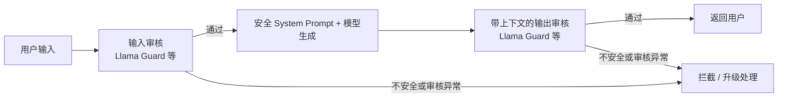
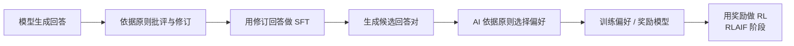

# 7. 安全对齐（Safety Alignment）——大模型安全对齐方法

> **本章目标**
>
> - 理解安全对齐要防范什么：有害内容、越狱、提示注入、隐私泄露、过度拒绝
> - 理解 HHH 中 Harmless 维度的具体含义，以及"安全"与"可用性"之间的权衡
> - 从防御视角理解 Jailbreak（越狱）与 Prompt Injection（提示注入）的风险及权限边界
> - 理解工业界"多层防护体系"的架构：输入审核、System Prompt、输出审核、安全分类器
> - 了解 Constitutional AI / RLAIF 如何降低对人工安全标注的依赖
> - 了解红队（Red Teaming）与安全评测在安全对齐中的角色

---

## 一、能力越强，风险越大

模型越强大，能力的"双刃剑效应"越明显：一个能写代码的模型，理论上也能被诱导写恶意代码；一个知识渊博的模型，理论上也能被诱导输出危险信息；一个会推理的模型（第6章），理论上也能"更聪明地"绕过安全限制。**能力本身没有立场，如何使用能力才有立场**——这正是 Safety Alignment（安全对齐）要解决的问题。

安全对齐对应第1章 HHH 框架中的 **Harmless（无害）**：依据任务与内容政策降低有害输出，并尽可能稳定地保持行为边界。这是优化目标，不是“无论怎样诱导都绝对安全”的保证；本章只做防御性教学。

## 二、安全对齐要防范什么？

| 风险类型 | 说明 | 防御评测关注点 |
|---|---|---|
| 有害内容生成 | 生成政策禁止的有害内容 | 是否正确拒绝并提供安全替代帮助 |
| Jailbreak（越狱） | 通过输入诱导偏离安全行为 | 改变措辞与上下文后边界是否稳定 |
| Prompt Injection（提示注入） | 不可信资料中的指令劫持授权任务 | 外部文本能否越过任务与权限边界 |
| 隐私泄露 | 暴露训练语料或运行时上下文中的敏感信息 | 数据最小化、隔离、脱敏与访问控制 |
| 过度拒绝（Over-refusal） | 把正常请求也误判为危险请求 | 是否能正常回答安全防护与日常学习问题 |

**安全不是拒绝越多越好。** 更保守的拦截策略通常会增加误伤，但“阈值越高越安全”取决于分数定义；不是每个生成式审核器都有可调的概率阈值。应在同一政策和测试集上同时报告漏放率、误拦率与异常率，寻找适合应用风险的折中，而不是承诺存在零漏放、零误伤的完美点。

## 三、Jailbreak：从防御角度识别边界绕过

越狱试图让模型偏离既定安全行为。防御评测需要覆盖角色设定、多轮上下文、变形表达和虚构权威等输入变化：同一类内容是否因为表面措辞变化而被不同对待？本章不提供可直接用于生成危险内容的攻击指令，实战使用无害样本和模拟状态验证控制流。

训练可以让模型更可靠地遵循指令层级，但这不是编程语言式的严格隔离。安全对齐降低风险，不能证明所有输入下都无法被诱导。对高风险系统，模型之外的访问控制必须独立生效。

## 四、Prompt Injection：把不可信资料误当指令

Jailbreak 侧重绕过安全行为；Prompt Injection 侧重让系统偏离授权任务，二者可能重叠。例如阅读网页的助手把网页中的任务改写要求当成用户授权，可能返回无关答案；若还拥有工具权限，风险会扩展到越权读写或外发。

它与 SQL 注入都涉及不可信输入跨越信任边界，但机制不同：自然语言模型没有一个能靠“转义字符串”就彻底解决问题的通用指令解析器。引用标记、System Prompt 和分类器只是部分防线；数据来源标识、工具最小权限及独立鉴权仍然必要。

OWASP 将 Prompt Injection 列为 LLM 应用的重要风险，但清单顺序不等于每个业务中已经测得的发生率或损失排名。是否比其他风险更紧迫，应按本系统的数据、工具权限和威胁模型判断。

## 五、工业界的多层防护体系

安全对齐从来不是"训练一次就万事大吉"，而是**训练 + 推理时防护 + 持续监控**的组合拳。一个生产级系统的典型架构：

1. **输入审核**：生成前判断请求在当前内容政策下是否可接受。策略需要区分危险意图与讨论安全防护等正常请求。
2. **System Prompt 约束**：明确助手任务与行为边界，但它是模型指令，不是不可绕过的权限机制，不能保证覆盖所有诱导。
3. **输出审核**：将用户上下文与待发送的助手回答一起评估，审核通过后才返回；流式输出若已发送违规片段，事后拦截无法撤回。
4. **专门的安全分类模型**：可独立训练、评测和更新，但仍可能误判或受到提示注入。是否优于通用模型审查，需要在相同语言、政策和测试集上比较，不能一概而论。

第7.1节实现的是**内容审核**链路，不是完整的权限安全系统。一个内容上无害的请求仍可能要求越权读取文件、调用工具或外发数据；这些必须由模型之外的身份鉴权、最小权限、工具参数校验、沙箱、外发限制与高风险操作确认来约束。**`safe` 不等于“已授权执行”，内容审核不能代替权限检查。**

独立分类器能减少与生成器共用上下文带来的部分风险，但不是万能防注入。审核异常、空输出、未知类别或超长上下文都应进入明确分支；高风险场景默认不放行，并记录脱敏后的状态供排查。

## 六、Constitutional AI：用原则指导监督修订与 AI 偏好

Anthropic 的 **Constitutional AI** 使用一组由人制定的原则，指导 AI 评价与修订回答，以减少逐条人工标注的需求。原论文包含两个阶段，不能把“批评后修订，再做 SFT”直接叫作 RLAIF。

1. **监督阶段**：模型依据原则批评初始回答，再生成修订回答；用修订后的回答监督微调助手。批评帮助构造训练数据，不意味着所有批评文本都必须作为 SFT 目标。
2. **强化学习阶段（RLAIF）**：AI 对候选回答给出偏好标签，训练偏好模型，再将其作为奖励信号进行 RL。这里强调的是反馈来源为 AI，而不是人工逐对标注。

原则制定、数据选择、质量抽检和最终安全评测仍需人参与；AI 评判也可能放大偏差或遗漏风险。高层原则可能促进泛化，但不能保证覆盖所有未见场景。

## 七、红队与安全评测：安全对齐的"考试"

安全对齐的质量如何衡量？工业界依赖**红队（Red Teaming）**与系统化的安全评测：

- **红队**：一组专门的攻击者（人和自动化工具），持续尝试攻破模型的安全边界，发现漏洞后反馈给训练团队。OpenAI、Anthropic、Google 都有成建制的红队；
- **安全基准**：HarmBench、SafetyBench、XSTest（专门测"过度拒绝"）等基准，把安全能力量化成可对比的分数；
- **对抗性评测**：把已知的越狱手法自动化批量测试，确保模型更新后不会"回退"（安全回归测试，和第二部分第11章的评测体系衔接）。

**一个重要的行业教训**：安全对齐是"猫鼠游戏"——模型发布后，社区会不断发现新的越狱手法。因此安全不是一次性的训练目标，而是一个**持续的红队-修复-再评估循环**（这正是第6章 Reasoning 模型的系统卡（System Card）里专门披露安全测试结果的原因）。

## 八、Safety 与 Helpfulness 的平衡：安全对齐的终极难题

安全对齐最大的挑战，不是"如何拒绝"，而是**"如何只拒绝真正危险的请求"**：

- 拒绝太少 → 有害内容流出（安全事故）；
- 拒绝太多 → 误伤正常用户（可用性灾难）；
- 拒绝的"度"还因文化、语境而异（"刀"在厨房场景是工具，在威胁场景是武器）。

业界应对这个难题的手段包括：**分层安全策略**（不同风险等级不同响应——明确拒绝 / 委婉引导 / 正常回答）、**上下文感知的审核**（结合对话历史判断意图）、以及**持续收集误伤样本回炉训练**（把"被误伤的正当请求"变成训练数据，教模型更精细地区分）。

> **安全对齐改善行为，系统安全约束权限。** 降低误伤与减少漏放都需要有边界的政策、可测量的指标，以及模型之外的工程防护。

---

下一节 **7.1 搭建一层输入∕输出安全护栏——Llama Guard 实战**将实现真实的输入审核、候选生成与带上下文的输出审核，并用无害模拟测试检查失败关闭；它不是生产安全认证。

## 本章总结

- 越狱侧重绕过安全行为，提示注入侧重偏离授权任务，二者可能重叠；风险高低取决于具体系统。
- 内容审核、安全提示和分类器共同降低风险，但都不能代替身份鉴权、最小权限与工具隔离。
- Constitutional AI 包含批评修订后的 SFT，以及 AI 偏好训练奖励模型再做 RL 的 RLAIF 阶段；仍需人工制定原则与质检。
- 输入与带上下文的输出都应审核，异常要有明确处理；安全与可用性需要同时测量。
- 红队、安全回归和误伤评测应在授权范围内持续开展，而不是一次测试后宣称绝对安全。

> **安全不是给模型加一把锁，而是给模型的能力配上恰当的边界——锁越严，误伤越多；边界越清晰，才越安全又越可用。**

## 下一章预告

理解了对齐（SFT、偏好、推理、安全）之后，我们把视角转向工程：训练一个 ChatGPT 级别的模型，需要什么样的算力与工程系统支撑？在深入并行策略、ZeRO 之前，需要先补上一块地基——GPU 本身是怎么工作的、显存为什么会成为瓶颈、"算子"到底是什么。下一章，我们将进入：

> 完成第7.1节后，进入 **第8章 GPU 基础与算子——训练与推理工程的硬件基础**，再做第8.1节的算子实验。

---

# 参考资料

- Meta《Llama Guard: LLM-based Input-Output Safeguard for Human-AI Conversations》(安全分类模型论文)：https://arxiv.org/abs/2312.06674
- Anthropic《Constitutional AI: Harmlessness from AI Feedback》(宪法 AI / RLAIF)：https://arxiv.org/abs/2212.08073
- Anthropic《Red Teaming Language Models to Reduce Harms》(红队方法论)：https://arxiv.org/abs/2209.07858
- OpenAI《Lessons Learned on Language Model Safety》(安全实践总结)：https://openai.com/index/lessons-learned-on-language-model-safety/
- OWASP《LLM Top 10》(应用层风险清单，不代表每个业务的风险排名)：https://owasp.org/www-project-top-10-for-large-language-model-applications/
- OpenAI o1 系统卡（推理模型的安全评估范例）：https://openai.com/index/openai-o1-system-card/

---

## 思考题

1. 从“训练分布”的角度解释：Jailbreak 为什么能绕过安全对齐？
2. 输入护栏和输出护栏分别拦截什么？为什么必须两层都要有？
3. 过强的安全护栏会牺牲什么能力？安全与有用之间的张力如何权衡？
