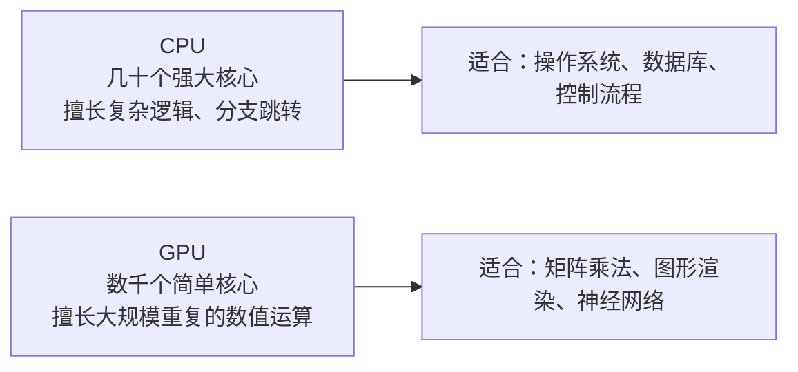
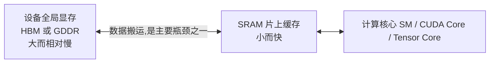
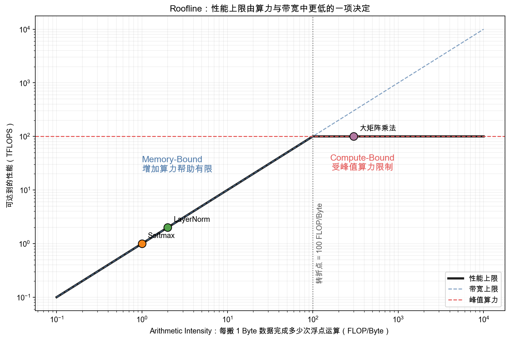
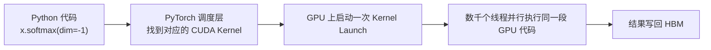
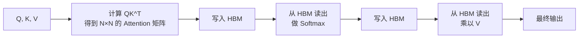
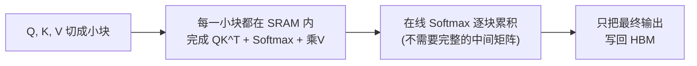

# 8. GPU 基础与算子——训练与推理工程的硬件基础

> **本章目标**
>
> - 理解 GPU 为什么天生适合神经网络训练，它与 CPU 的核心差异
> - 掌握 GPU 内部结构：SM、CUDA Core、Tensor Core、Warp 各自做什么
> - 理解显存层级（HBM 与 SRAM）如何决定程序的真实速度，掌握 Roofline 模型判断瓶颈
> - 了解常见 GPU 的真实算力与显存数字，建立"一张卡能装下什么"的直觉
> - 理解"算子"与"算子融合"，以及 FlashAttention 为什么能不改数学结果就大幅提速
> - 理解 CUDA 生态的分层（Driver、Toolkit、cuBLAS/cuDNN、NCCL）与 ROCm 的定位
> - 理解浮点数值误差从何而来，为什么会随网络深度累积，以及训练/推理精度不一致对强化学习的真实影响

---

下一章即将讲到的并行训练策略、ZeRO、Continuous Batching、PagedAttention，全部建立在一个共同前提上：**它们都在和显存、算力这两个物理资源打交道**。不理解 GPU 本身是怎么工作的，这些工程方案就会变成一堆需要死记硬背的名词。这一章，我们退回到硬件层，把地基补上。

## 一、为什么是 GPU，而不是 CPU？

CPU 的设计目标是"把一件复杂的事情尽快做完"：少量核心（几个到几十个），每个核心都很强大，擅长分支、跳转、复杂逻辑。GPU 的设计目标完全不同：**把同一件简单的事情，同时做成千上万遍**。一张消费级显卡就拥有数千个计算核心，但每个核心都很简单，只擅长加法、乘法这类规整的数值运算。



神经网络的核心运算——矩阵乘法——恰好契合 GPU 的设计。一次 `[1000,1000] @ [1000,1000]` 会产生一百万个输出元素；每个输出元素又是长度为 1000 的点积，因此总计约需要十亿次乘加。不同输出元素可以并行计算，单个点积内部也能分块并行，这种规整结构非常适合 GPU。这里不能把"一百万个输出"误写成"一百万次乘加"。

## 二、GPU 内部结构：SM、CUDA Core、Tensor Core

打开一张 NVIDIA GPU 的"内部结构图"，会看到几个关键概念：

| 概念 | 类比 | 作用 |
|---|---|---|
| SM（Streaming Multiprocessor） | 一个"车间" | GPU 由多个 SM 组成，每个 SM 内部有自己的计算核心、缓存和调度器，可以独立执行任务 |
| CUDA Core | 车间里的"工人" | 最基础的计算单元，一次只能做一次标量加法/乘法 |
| Tensor Core | 车间里的"专用生产线" | Volta 架构之后为矩阵乘法专门设计的硬件单元，一次能完成一小块矩阵乘加运算，比用 CUDA Core 拼出同样计算快得多 |
| Warp | 一个"班组" | GPU 调度的基本单位，32 个线程一组，同一 Warp 内的线程同步执行同一条指令 |

**Tensor Core 是现代深度学习加速的核心**：它针对"矩阵乘加"这一件事做了专用硬件设计，同样的矩阵乘法可以比纯 CUDA Core 快数倍——这也是为什么 PyTorch 会努力把矩阵乘法路由到 Tensor Core（例如 `torch.backends.cuda.matmul.allow_tf32`），以及为什么"半精度（FP16/BF16）训练"能大幅提速：Tensor Core 对低精度矩阵乘法的吞吐通常是 FP32 的 2~4 倍。

**Tensor Core 本身也在持续为 Transformer 定制**（这是 NVIDIA 白皮书里的主线）：Volta（2017）发明了第一代支持 FP16 的 Tensor Core；Ampere（A100）加入 TF32/BF16 支持；**Hopper（H100）更进一步，引入了专门为 Transformer 设计的 Transformer Engine（Transformer 引擎）**——它在训练过程中自动为每一层选择 FP16/BF16/FP8 中收益最高的精度，让 Transformer 的训练吞吐相比 A100 大幅提升（NVIDIA 官方宣称最高约 6 倍）；到了 Blackwell（B200），Tensor Core 对 FP8/FP4 的支持进一步强化，这一代硬件的"低精度偏好"正是第10章 FP8 量化和推理优化的硬件基础。**理解这条演进线，你就理解了为什么现代大模型训练和推理越来越依赖低精度计算——不是软件偷懒，而是硬件在主动引导。**

## 三、显存层级：HBM 与 SRAM——谁在拖慢你的程序？

很多人以为"显卡算力越高，程序就越快"，但真实情况经常是：**程序的瓶颈根本不在"算得快不快"，而在"数据搬得快不快"**。GPU 内部至少有两层完全不同的存储：

| 层级 | 全称 | 容量 | 速度 | 类比 |
|---|---|---|---|---|
| 设备全局显存（Global Memory） | 数据中心卡常用 HBM，消费卡常用 GDDR | 大（常见 8～192GB） | 相对片上 SRAM 慢，带宽从数百 GB/s 到数 TB/s | 仓库：容量大，但搬运距离远 |
| SRAM（片上缓存） | 芯片内置高速缓存，位于每个 SM 内部 | 很小（每个 SM 几十 KB 到几百 KB） | 极快（比 HBM 快一个数量级以上） | 工作台：东西不多，但拿取几乎零延迟 |



判断性能瓶颈前，先看一个直观指标：**Arithmetic Intensity（算术强度）**，即每从显存搬运 `1 Byte` 数据，完成多少次浮点运算。若读入大量数据却只做几次加减，算术强度低；若一块数据被反复用于大量乘加，算术强度高。

Roofline 模型把程序性能看成两个上限中较低的一个：

```math
\text{Attainable Performance}
\le
\min\left(\text{Peak Compute},\ \text{Memory Bandwidth}\times\text{Arithmetic Intensity}\right)
```

**这个公式的作用**：判断继续增加算力是否可能让某个算子变快。

- `Peak Compute`：GPU 理论峰值算力；
- `Memory Bandwidth`：HBM 每秒最多搬运的数据量；
- `Arithmetic Intensity`：每 Byte 数据对应的浮点运算次数；
- `Attainable Performance`：在这两个物理上限下可能达到的性能。

例如，一张 GPU 的峰值算力为 `100 TFLOPS`、带宽为 `1 TB/s`。算术强度为 `2 FLOP/Byte` 的算子，带宽上限只有约 `2 TFLOPS`，即使再增加计算核心也帮助有限；算术强度为 `300 FLOP/Byte` 的大矩阵乘法则会先碰到 `100 TFLOPS` 的算力上限。



- **Memory-Bound**：位于斜线区域，主要受数据搬运限制。Softmax、LayerNorm 等逐元素算子常在这一侧；
- **Compute-Bound**：位于水平屋顶附近，主要受峰值算力限制。足够大的矩阵乘法更容易进入这一侧。

朴素 Attention 的多个阶段会频繁读写大型中间矩阵，因而包含显著的 HBM 流量。FlashAttention 的关键正是改变分块和读写方式，降低数据搬运，而不是改变 Attention 的数学定义。生成脚本见 [`roofline_model.py`](./assets/roofline_model.py)。

## 四、真实数字：一张 GPU 到底有多快、多大？

为了给后面的工程方案建立直觉，这里给出几款代表性 GPU 的真实规格（公开数据）：

| GPU | 显存 | HBM 带宽 | FP16 Tensor Core 算力 | 定位 |
|---|---|---|---|---|
| RTX 4090 | 24GB GDDR6X | ~1 TB/s | ~330 TFLOPS | 消费级旗舰 |
| RTX 5060 Ti | 16GB GDDR7 | ~448 GB/s | ~100+ TFLOPS | 消费级入门（本书实验主力） |
| A100 80GB | 80GB HBM2e | ~2 TB/s | ~312 TFLOPS | 数据中心经典款 |
| H100 | 80GB HBM3 | ~3.35 TB/s | ~990 TFLOPS | 数据中心旗舰 |

**几个需要建立的直觉**：

1. **显存决定"装得下什么"**：一个 7B 模型 FP16 权重约 14GB，8GB 显存的消费卡放不下，需要量化（10.2 节）或拆到多卡（第9章）；
2. **带宽决定"搬得快不快"**：把 14GB 权重从 HBM 读一遍，在 RTX 4090（1TB/s）上约 14 毫秒——推理时每个 Token 都要"过一遍"全部权重，这决定了单 Token 生成时间的天花板；
3. **算力只有"算得足够多"时才用得上**：矩阵越大，计算密度越高，越接近算力上限（Compute-Bound）；小算子则被带宽拖累（Memory-Bound）。

## 五、训练时的显存去哪了：一份"显存账本"

训练一个模型，显存里不只有参数。与第9章统一，以下采用一套**用于估算的混合精度 AdamW 账本**：参数数目为 \(P\)，BF16 参数和梯度各 2 字节，FP32 主权重、一阶矩、二阶矩各 4 字节；不做分片或 offload。GB/TB 使用十进制，1 GB = \(10^9\) 字节。

| 项目 | 70B 模型占用 | 计算方式 |
|---|---|---|
| 模型参数（BF16） | 140 GB | \(2P\) 字节 |
| 梯度（BF16） | 140 GB | \(2P\) 字节，与参数相等 |
| FP32 主权重与 Adam 一、二阶矩 | 840 GB | \(12P\) 字节 |
| **模型状态小计** | **1120 GB = 1.12 TB** | **\(16P\) 字节，不含激活与缓冲** |
| 激活值、临时张量与通信缓冲 | 另计 | 取决于 batch、序列长度、算子和重计算策略 |

这不是所有框架的固定实现：例如 FP32 梯度累积、不同优化器或没有独立主权重的 AMP 路径会改变账本。**估算先统一精度与存储假设，实测再核对实现**，不能拿某次 `max_memory_allocated()` 直接验证这份简化小计。

**三个关键结论**：

1. **优化器状态往往比参数本身还大**——这是 ZeRO 优化（第9章）要切分的第一样东西；
2. **激活值会随 batch size 和序列长度暴涨**——这是梯度检查点（Gradient Checkpointing）存在的理由；
3. **"训练一个模型"从来不是"把参数装进显存"这么简单**——显存是训练工程的第一约束，也是第9章所有并行策略的出发点。

## 六、什么是"算子"（Operator）？

你在 PyTorch 里写下 `torch.matmul(a, b)` 或者 `x.softmax(dim=-1)`，这一行代码在底层并不是"直接跑在 GPU 上"，而是要经过这样一个过程：



这里的"CUDA Kernel"，就是一段专门为 GPU 编写、会被成千上万个线程同时执行的小程序。深度学习框架把每一个这样的基本计算单元称为**算子（Operator）**——矩阵乘法是一个算子，Softmax 是一个算子，LayerNorm 是一个算子。一个复杂的模型 forward 过程，本质上就是几十上百个算子按顺序被调度执行的过程。

这里有两个容易被忽略的开销：

1. **Kernel Launch 开销**：每一次"启动一个算子"本身就有一份固定的调度成本，算子越小、越碎，这份开销占比就越高；
2. **中间结果的读写**：算子 A 算完的结果，要先写回 HBM，算子 B 才能再从 HBM 读出来接着算——即使 A 和 B 的数据完全能放进 SRAM，只要它们是两个独立的算子，这次没必要的"写出去再读回来"就会发生。

**算子融合（Kernel Fusion）**，就是把多个连续的小算子合并成一个大算子，让中间结果直接留在 SRAM 里传递给下一步计算，不必经过 HBM 这一趟"远路"，同时也少了几次 Kernel Launch 的固定开销。`torch.compile`、Triton、XLA 这些"编译加速"技术，做的核心工作之一正是自动发现并融合可以合并的算子。（第8.1节先实现向量加法 Kernel，再调用 FlashAttention 做对照；它没有手写融合算子，融合实现可作为后续扩展练习。）

## 七、CUDA 生态全景

NVIDIA GPU 的软件栈，从下到上大致分成这几层：

| 层级 | 名称 | 作用 |
|---|---|---|
| 驱动层 | NVIDIA Driver | 操作系统与 GPU 硬件通信的最底层接口 |
| 平台层 | CUDA Toolkit | 提供编译器（nvcc）、运行时 API，让开发者可以写 GPU 程序 |
| 算子库 | cuBLAS / cuDNN | NVIDIA 官方的高度优化矩阵运算库与深度学习算子库，绝大多数框架的矩阵乘法、卷积底层直接调用它们 |
| 通信库 | NCCL | 多卡/多机之间做梯度同步、集合通信（All-Reduce 等）的专用库，第9章的分布式训练全部依赖它 |
| 框架层 | PyTorch / TensorFlow | 我们平时写的 Python 代码，底层自动路由到上面这些库 |

也就是说，你写的每一行 `model(x)`，最终都会经过"PyTorch → cuDNN/cuBLAS → CUDA Toolkit → Driver → 硬件"这样一条完整的链路。

> **想自己动手写 GPU 算子的话，除了 8.1 节的 Triton，NVIDIA 还开源了 CUTLASS**——它是 cuBLAS 同源的矩阵乘模板库，展示了如何用 CUDA 手写达到接近 cuBLAS 性能的 GEMM（包括利用 Tensor Core 的分块策略）。Triton 胜在"更接近 Python 的简单"，CUTLASS 胜在"接近硬件极限的精细"，两者是理解 GPU 算子优化的两条互补路径。

> **关于 AMD 显卡（ROCm）**：AMD 提供了与 CUDA 生态对应的软件栈 ROCm，其中 HIP 对应 CUDA 的编程接口，MIOpen 对应 cuDNN。主流深度学习框架已支持在 ROCm 上运行，`torch.cuda` 这套接口在 ROCm 后端下同样可用，代码基本不用改。本书实验默认基于 CUDA 生态，但绝大多数结论（显存层级、算子、Kernel Fusion）对 ROCm 同样成立。

## 八、FlashAttention：一次经典的算子级优化

现在把前面几节的知识拼在一起，看一个真实的例子。Self-Attention 的朴素实现大致是这样几步：



问题之一是反复物化大型中间矩阵：单个头在 \(N=4096\) 时有 \(4096^2\) 个分数，FP16 下占 **32 MiB（约 33.6 MB）**，实际还要乘 batch 和头数。Softmax 等阶段可能受到内存带宽限制，但 Attention 中也有计算密集的矩阵乘法，不能说所有阶段必然都是 Memory-Bound；需要按形状和实现判断。随序列长度平方增长的中间张量，同时形成了显存压力。

FlashAttention（Dao et al., 2022）的核心思路是：**把 Q、K、V 切成小块（Tiling），每一小块都尽量留在 SRAM 里，通过"在线 Softmax"分块累加的方式，从头到尾都不把完整的 N×N 中间矩阵写回 HBM**，只在最后写出最终结果：



关键在于：**FlashAttention 计算的是同一标准 Softmax Attention，而不是近似或稀疏 Attention**。它通过分块、在线归一化和融合减少 HBM 访问，避免保存完整 \(N\times N\) 分数矩阵；固定 batch、头数和头维度时，相关存储随 \(N\) 线性增长，但计算复杂度仍是二次的。浮点运算顺序不同，输出不保证逐位相等；实际加速比取决于形状、硬件、精度与内核版本，需要实验测量。

> **很多时候，让程序变快的关键不是换一个更强的 GPU，而是重新设计算子，让数据尽量待在快的存储里，少往慢的存储搬。**

（FlashAttention 之后，MLA、DeepSeek-V3 等对 Attention 的进一步改造，本质都是沿着"减少显存读写"这条思路继续走——理解了 FlashAttention，就理解了半个现代推理优化史。）

## 九、浮点数值误差：为什么同一个公式，不同框架算出的不完全一样？

### 一个容易被忽略的现象

同一个数学公式 `y = tanh(Wx + b)`，用 NumPy（CPU）和 PyTorch（CPU）分别计算，结果**可能有细微差异，也可能在当前输入上完全相同**。误差大小取决于数值范围、精度、后端与运算顺序，不能预先承诺从小数点后哪一位开始不同。这里不提供没有脚本、版本与运行记录支撑的“实测误差表”；下面的代码只是一项可自行记录的单层检查。

### 误差从哪来：两个常见来源

**来源一：浮点加法不满足结合律。** `(a + b) + c` 和 `a + (b + c)` 在实数算术中相等，但在浮点数下未必位级相等。矩阵乘法包含大量乘加，分块、归约顺序和融合乘加都会影响舍入。

**来源二：实际执行后端与内核可能不同。** NumPy 可链接 OpenBLAS、MKL、Accelerate 等库；PyTorch CPU 运算可能使用 BLAS、oneDNN 或自身内核，具体取决于构建、平台和算子，不能说“PyTorch 默认所有矩阵乘法都走 oneDNN”。可用 `np.show_config()` 和 `torch.__config__.show()` 检查环境。GPU 上的算子版本、融合策略与 TF32 设置同样会影响结果；差异的量级并不固定，也不能因此把任意大误差都当作正常舍入。

```python
import numpy as np
import torch

rng = np.random.default_rng(0)
x = rng.standard_normal((1, 256)).astype(np.float32)
W = (rng.standard_normal((256, 256)) / np.sqrt(256)).astype(np.float32)
out_np = np.tanh(x @ W)
out_torch = torch.tanh(torch.from_numpy(x) @ torch.from_numpy(W)).numpy()
delta = out_np.astype(np.float64) - out_torch.astype(np.float64)
print("NumPy/PyTorch:", np.__version__, torch.__version__)
print("最大绝对误差:", np.abs(delta).max())
print("相对 L2 误差:", np.linalg.norm(delta) / max(np.linalg.norm(out_np), 1e-12))
```

### 深度如何传播误差：可能放大，也可能衰减

每一层都会把已有误差当作输入继续变换，同时引入新的局部舍入误差。在线性化近似下：

\[
\delta_{\ell+1} \approx J_\ell\delta_\ell + \varepsilon_\ell
\]

这里 \(J_\ell\) 是当前输入处该层的 Jacobian，\(\varepsilon_\ell\) 是本层新增误差。它与第一部分第9章中梯度传播的 Jacobian 连乘有共同结构，但**不意味着误差必然随深度指数增长**：传播方向、Jacobian 的尺度、激活饱和、归一化和残差结构都可能使误差放大、衰减、抵消或维持在有限范围。持续放大的方向可能产生很快的增长；是否发生、增长多快，必须结合具体网络测量。

### 几个实用的优化/规避技巧

| 场景 | 技巧 | 原理 |
|---|---|---|
| 调试/验证数值是否正确 | 关键路径临时切到 `float64`（双精度）跑一遍做对照 | 双精度的舍入误差比单精度小约 8 个数量级，能帮你判断"差异是正常的浮点噪声，还是真的 Bug" |
| 需要可复现的实验结果 | 固定随机种子的同时，调用 `torch.use_deterministic_algorithms(True)`，并关闭 TF32（`torch.backends.cuda.matmul.allow_tf32 = False`） | 让同一份代码在同一硬件上多次运行结果完全一致；但换机器、换 GPU 型号，数值依然可能变化——"可复现"和"跨平台一致"是两个不同的目标 |
| 大规模归约运算（求和、方差） | 优先用框架自带的稳定实现（如 PyTorch 的 LayerNorm 用 Welford 算法逐步更新均值/方差），而不是手写朴素累加 | 朴素顺序累加在数值上不稳定，专门的稳定算法能显著减少舍入误差的累积速度 |
| 混合精度训练（第9章会展开） | 梯度累积、优化器状态用 FP32，只在前向/反向的矩阵乘法上用 BF16/FP16 | 低精度参与的层数越多、累积步数越多，误差滚雪球的风险越大；把"容易出错的加法环节"（梯度累加、参数更新）留在高精度里，能大幅降低整体误差 |

### 一个真实的工业级案例：训练和推理"看起来算的是同一个模型"，却因为精度不同而"对不上"

RLHF/RLVR 的训练引擎与 rollout 推理引擎即使加载同一份权重，也可能因为算子、融合、并行归约和精度配置不同，给同一 Token 算出略有不同的 log-probability。若使用序列级概率比，其对数等于逐 Token 对数概率差之和：\(\log r=\sum_t(\log p_{\mathrm{train},t}-\log p_{\mathrm{rollout},t})\)。系统性偏差可能累积，随后经指数映射放大；不同位置的偏差也可能抵消，**并非所有 RL 算法都使用序列级比值，更不是长度越长就必然指数失稳**。

Qi et al.（2025）的 *Defeating the Training-Inference Mismatch via FP16* 研究了这一问题，报告在其评估的 RL 微调模型、任务和训练/推理框架配置中，统一使用 FP16 能缓解不匹配。这个结果不能推广为“FP16 总比 BF16 稳定”，也不在这里引用未交代指标和实验配置的固定倍数。FP16 在相同量级的正规数上有更细的尾数精度，但动态范围小得多，可能需要 loss scaling 并面临溢出；BF16 与 FP16 都是 2 字节。实际决策应记录具体 dtype、内核、模型和并行设置，测 log-probability 偏差、溢出与训练稳定性，再选择精度策略。

---

想亲手感受这一切，可以看这一节实验：**8.1 实现 Triton 算子，并对比 FlashAttention 与朴素 Attention 的显存∕速度差异**。

## 本章总结

本章我们理解了：

- GPU 的执行组织适合大量规整的并行运算；SM、CUDA Core、Tensor Core 和 Warp 是不同层面的概念。
- 全局显存、片上存储与 Roofline 模型帮助判断数据搬运和计算瓶颈；理论峰值不是程序必达的性能。
- 本章统一账本为 BF16 参数 \(2P\) + BF16 梯度 \(2P\) + FP32 主权重及 Adam 状态 \(12P\)：70B 合计 1.12 TB，另加激活与缓冲；**参数 = 梯度**。
- 算子融合和 FlashAttention 可减少中间结果读写；FlashAttention 保留标准 Attention 的实数数学定义，不保证浮点逐位一致，也不承诺固定加速倍数。
- 数值误差由精度、运算顺序和实际后端共同决定，可能随深度放大或衰减；训练/推理不匹配要结合具体 RL 算法与配置测量。

> **理解训练和推理工程之前，先理解显存和算力这两个物理资源到底在被什么消耗——这是本章留给后面所有工程方案的一把钥匙。**

## 下一章预告

补上了硬件这块地基之后，回到更熟悉的问题：一个几百亿参数的模型，要如何被拆到成百上千张 GPU 上协同训练？显存账本里的每一项（参数、梯度、优化器状态、激活值），各自应该怎么分配？下一章，我们将进入：

> **第9章 LLM Training Stack——现代大模型训练工程**

---

# 参考资料

- NVIDIA《An Even Easier Introduction to CUDA》(CUDA 编程模型入门经典)：https://developer.nvidia.com/blog/even-easier-introduction-cuda/
- NVIDIA CUDA 官方文档（Kernel 编程、内存层级、性能优化权威参考）：https://docs.nvidia.com/cuda/
- NVIDIA CUTLASS（GPU 矩阵乘模板库，理解 Tensor Core 实现细节）：https://github.com/NVIDIA/cutlass
- Triton 官方教程（算子编程与融合，Triton 由 OpenAI 开源）：https://triton-lang.org/
- Dao et al.《FlashAttention: Fast and Memory-Efficient Exact Attention with IO-Awareness》：https://arxiv.org/abs/2205.14135
- Qi et al.《Defeating the Training-Inference Mismatch via FP16》（训练/推理数值不匹配、BF16 舍入误差实证）：https://arxiv.org/abs/2510.26788
- GPU Mode（GPU 编程社区课程，含 FlashAttention 逐行讲解）：https://www.gpumode.com
- Horace He《Making Deep Learning Go Brrr》（算子融合与编译优化的直觉）：https://horace.io/brrr_intro.html

---

## 思考题

1. 为什么 HBM 容量大但慢、SRAM 快但小？这个存储层级如何决定了"算子融合"的价值？
2. FlashAttention 的核心思想是什么？它为什么能减少显存访问而不减少计算量？
3. Tensor Core 与普通 CUDA Core 的区别是什么？为什么矩阵乘法能被它大幅加速？
4. 为什么单层网络里 NumPy 和 PyTorch 的数值差异可以忽略，但堆到 100 多层后差异会显著放大？这和第一部分第 9 章 RNN 的梯度消失/爆炸有什么共同的数学结构？
5. 训练引擎和推理引擎即使加载同一份权重，为什么算出的 Token 概率仍会有细微差异？这种差异对强化学习（第 5、6 章）为什么比对普通推理更致命？
