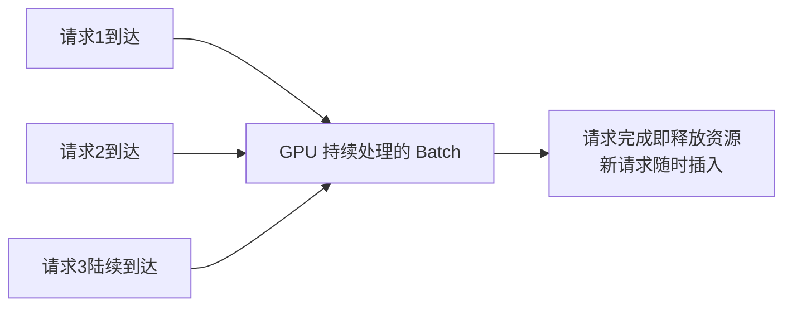
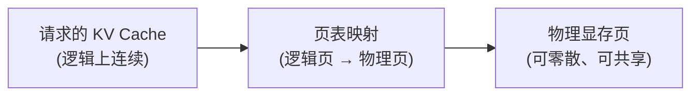

# 第8章 LLM Inference Stack——现代大模型推理工程

> **本章目标**
>
> - 理解推理系统与训练系统关注的问题为何完全不同：训练重吞吐，推理重延迟与并发
> - 理解自回归生成的两个阶段（Prefill / Decode）与三大延迟指标（TTFT / TPOT / ITL）
> - 掌握 KV Cache 的显存账本：为什么长上下文和并发请求会撑爆显存
> - 理解 Continuous Batching 如何让 GPU 一刻不停
> - 理解 PagedAttention 如何像操作系统管理内存一样管理 KV Cache
> - 了解量化、投机解码、Prefix Caching 等推理加速手段的原理与取舍
> - 了解主流推理引擎的定位（vLLM、TensorRT-LLM、SGLang、TGI）

---

## 一、训练关心吞吐，推理关心延迟与并发

第7章的训练系统追求"用最短时间训练完一个模型"；推理系统面对的是完全不同的场景：**成千上万个用户同时发来长度各不相同的请求，系统需要在可接受的延迟下，同时服务尽可能多的用户**。两者的工程目标几乎是反的：

| | 训练系统 | 推理系统 |
|---|---|---|
| 优化目标 | 吞吐（每小时处理的 Token 数） | 延迟（每个请求多快返回）+ 吞吐（单位时间服务多少用户） |
| 数据 | 固定的大 batch，形状整齐 | 请求长度参差、动态到达 |
| 显存压力 | 参数 + 梯度 + 优化器 + 激活值 | 参数 + **KV Cache**（随并发请求数线性增长） |
| 精度 | BF16/FP32（要训练稳定） | 可以 INT8/INT4 量化（质量损失可接受） |

**推理的黄金法则是"显存决定一切"**：模型参数是固定的，但每个并发请求都会占用一份不断增长的 KV Cache——并发数、上下文长度、显存容量三者的矛盾，是推理工程的永恒主线。这一章的所有技术（Continuous Batching、PagedAttention、量化），本质上都在回答一个问题：**如何在有限的显存里，塞下尽可能多的并发请求？**

## 二、自回归生成的两个阶段与三大延迟指标

LLM 生成回答的过程（第1.1节讲过）分为两个阶段：

1. **Prefill（预填充）**：把用户输入的整个 Prompt 一次性喂给模型，并行计算出所有位置的 KV Cache。这一步计算量大但只需要一次；
2. **Decode（解码）**：逐个生成新的 Token（每步只算最后一个位置，借助 KV Cache 避免重算历史），每步生成一个 Token，直到遇到结束符。

两个阶段的行为完全不同，因此业界用三个指标分开衡量：

| 指标 | 全称 | 含义 | 受什么影响 |
|---|---|---|---|
| **TTFT** | Time To First Token | 从发出请求到收到第一个 Token | Prefill 速度 + 排队时间 + 网络 |
| **TPOT** | Time Per Output Token | 每生成一个 Token 的平均时间 | Decode 速度（受显存带宽限制） |
| **ITL** | Inter-Token Latency | 相邻两个 Token 的间隔（体验指标） | 与 TPOT 相关 |

**为什么 Decode 速度受"显存带宽"限制而不是"算力"限制？** 回顾第6章的 Roofline 模型：Decode 每步只算一个 Token，计算量极小，但**每步都要把模型全部参数从 HBM 读一遍**——7B 模型 14GB 权重，在 1TB/s 带宽的卡上，每步至少 14 毫秒，这个下限与算力无关。这就是为什么：**模型越大，单 Token 生成越慢（要读的权重越多）；这也是量化为什么有效（权重变小 = 每步要读的数据变少）。**

## 三、KV Cache 的显存账本：为什么长上下文这么贵

第一部分 13.6 节讲过 KV Cache 避免重复计算，但它的代价是显存。一个并发请求的 KV Cache 显存大约为：

```
2 (K 和 V 两组) × 层数 × 注意力头数 × 每头维度 × 序列长度 × 2 字节(FP16)
```

以 7B 模型（32 层、d_model=4096）为例：每 Token 的 KV Cache 约 **1MB**。这意味着：

- 单请求上下文 128K Token → 128GB KV Cache（超过单卡显存！）；
- 100 个并发请求、每个 4K 上下文 → 400MB，尚可接受；
- 100 个并发请求、每个 32K 上下文 → 3.2GB，开始吃紧。

**KV Cache 的显存是"并发数 × 序列长度"的乘积**——推理系统的显存压力不是来自模型本身，而是来自这个乘积。这也是"长上下文 + 高并发"永远矛盾的根源，也是 PagedAttention 和 KV Cache 压缩（MQA/GQA、量化 KV、MLA）存在的意义。

## 四、Continuous Batching：让 GPU 一刻不停

朴素的批处理方式有两种，都不高效：

- **静态批处理（Static Batching）**：攒够 N 个请求一起处理，全部完成后才接下一批——**慢请求拖累快请求**，GPU 在批次切换时空转；
- **逐个排队**：一次只处理一个请求——GPU 利用率惨不忍睹（Decode 阶段算力本来就闲）。

**Continuous Batching（连续批处理，也叫动态批处理）** 是现代推理引擎的核心突破：**不再等待整批请求完成，而是在任意时刻，只要有请求完成（释放资源），就立刻把新请求插入正在进行的 Batch**：



为什么能这样？因为 Decode 阶段每个请求每步只生成一个 Token，**多个请求可以交错推进**——请求 A 在生成第 5 个 Token 时，请求 B 可以同时生成第 3 个——GPU 的算力被不同请求"填满"，不再有整批等待的空档。vLLM 论文里的数据：同样的请求负载，Continuous Batching 的吞吐比静态批处理高 10~20 倍。8.1 节的实验会亲手测量这个差距。

## 五、PagedAttention：像操作系统管理内存一样管理 KV Cache

Continuous Batching 带来一个新问题：**不同请求的 KV Cache 长度实时变化，如何高效管理这些大小不一、持续增长的显存块？**

朴素的做法是"按最大可能长度给每个请求预分配一整块连续显存"——但一个请求实际可能只用 10% 的分配空间，造成巨大浪费（**显存碎片 + 内部碎片**）；更糟的是，请求完成前这块显存不能被其它请求使用，而新请求又不断到来。

vLLM 提出的 **PagedAttention** 借鉴了操作系统**分页内存管理**的思想：

- 把 KV Cache 切成固定大小的**页（Page）**（如每页 16 个 Token 的 KV）；
- 每个请求按需**按页分配**，用一张**页表**记录"逻辑页 → 物理页"的映射；
- 请求增长时分配新页，完成时释放旧页——**碎片化显存被重新利用**，不同请求甚至可以共享相同的页（Prefix Caching 的基础）。



这套"分页 + 页表"的设计，让 KV Cache 的显存利用率从 60%~70%（连续分配）提升到 99% 以上——**相当于在不加显存的情况下，多服务了几十个百分点的并发请求**。PagedAttention 是 vLLM 的核心贡献，也是"推理引擎借鉴操作系统"的经典案例（和第11章 Graph Engineering 借鉴数据库思想异曲同工）。

## 六、其它推理加速手段

| 技术 | 核心思想 | 收益 | 代价 |
|---|---|---|---|
| 量化（INT8/INT4/FP8） | 用低精度表示权重（和 KV Cache） | 显存减半/减 4 倍，Decode 提速（少读数据） | 质量轻微下降，需要校准 |
| 投机解码（Speculative Decoding） | 小模型先"猜"接下来 K 个 Token，大模型一次性并行验证 | Decode 提速 2~3 倍 | 需要额外的小模型，实现复杂 |
| Prefix Caching | 多个请求共享相同的公共前缀（System Prompt）时只算一次 KV | 长 Prompt 场景大幅提速 | 需要页表支持共享（PagedAttention 天然支持） |
| 张量并行推理 | 模型权重拆到多卡（第7章思想），KV Cache 也分摊 | 装下超显存模型、并发翻倍 | 卡间通信开销，需要 NVLink |
| GQA / MLA | 让多个头共享 KV（第10章），或把 KV 压缩成低秩形式 | KV Cache 减少 4~8 倍 | 需要模型本身支持（预训练决定） |

**一个重要的分层认知**：量化、投机解码、GQA 这些是"模型/权重层面的优化"，在推理引擎出现之前就存在；而 Continuous Batching 和 PagedAttention 是"调度/显存管理层面的优化"，是推理引擎（vLLM 等）的独特贡献——**现代推理引擎 = 调度层（Batching/Paging）+ 内核层（量化 Kernel、FlashAttention）+ 服务层（OpenAI 兼容 API、流式输出）**。

## 七、主流推理引擎的定位

| 引擎 | 出品方 | 特点 |
|---|---|---|
| vLLM | 开源社区（加州伯克利） | 最流行，PagedAttention 发明者，易用性与性能兼顾，生态最大 |
| TensorRT-LLM | NVIDIA | 官方出品，针对自家 GPU 深度优化，性能极致但使用门槛高 |
| SGLang | 开源（斯坦福/LMSYS） | 专注复杂推理场景（多轮对话、结构化输出、并行调度）的性能优化 |
| TGI（Text Generation Inference） | HuggingFace | 与 HF 生态深度集成，部署简单 |
| LMDeploy / vLLM 国产替代 | 上海 AI Lab 等 | 中文社区常用，推理性能与 vLLM 相当，文档中文友好 |

不同引擎的实现细节不同，但总体架构高度一致：**Continuous Batching + PagedAttention（或同类显存管理机制）+ 量化 + 流式输出，共同构成了现代推理引擎的核心**。理解了这一章的概念，换任何一个引擎都只是换 API 而已。

---

想亲手测量 Continuous Batching 到底能带来多大的吞吐提升，可以看这一节实验：**8.1 亲手用 vLLM 体验 Continuous Batching——测量多请求并发下的吞吐提升**。

## 本章总结

本章我们理解了：

✅ 训练重吞吐，推理重延迟与并发——两者工程目标不同，技术栈也不同 ✅ 自回归生成分 Prefill / Decode 两阶段，三大指标 TTFT / TPOT / ITL 分别衡量不同环节的体验 ✅ Decode 速度受显存带宽限制（每步要读全部权重），这解释了"模型越大生成越慢、量化为什么有效" ✅ KV Cache 显存 = 并发数 × 序列长度，是推理系统显存压力的根源 ✅ Continuous Batching 让请求交错推进，吞吐比静态批处理高一个数量级 ✅ PagedAttention 用分页 + 页表管理 KV Cache，显存利用率从 ~70% 提升到 99%+ ✅ 量化、投机解码、Prefix Caching、GQA/MLA 从不同维度压缩成本 ✅ 现代推理引擎 = 调度层 + 内核层 + 服务层，架构高度一致

> **KV Cache 解决"一个请求内部"的重复计算，Continuous Batching 解决"多个请求之间"的资源利用率，PagedAttention 解决"KV Cache 怎么放得下"——三个问题层层递进，构成了推理工程的完整主线。**

## 下一章预告

一个模型训练完成、也已经能够高效推理，但我们如何知道它到底"好不好"？对齐做得好不好、推理能力强不强，都需要科学的方法来度量——下一章，我们将进入：

> **第9章 LLM Evaluation——如何科学评价一个大语言模型**

---

# 参考资料

- vLLM 官方文档与仓库：https://github.com/vllm-project/vllm
- Kwon et al.《Efficient Memory Management for Large Language Model Serving with PagedAttention》(PagedAttention 论文)：https://arxiv.org/abs/2309.06180
- NVIDIA TensorRT-LLM 仓库：https://github.com/NVIDIA/TensorRT-LLM
- SGLang 仓库：https://github.com/sgl-project/sglang
- LMDeploy 仓库：https://github.com/InternLM/lmdeploy
- Chip Huyen《AI Engineering》(推理工程全景)：https://github.com/chiphuyen/ai-engineer-book
