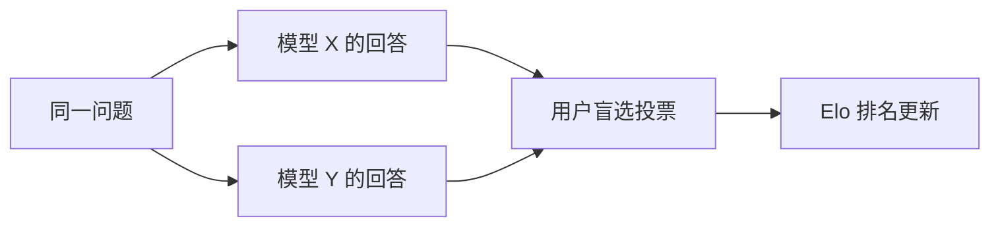

# 第9章 LLM Evaluation——如何科学评价一个大语言模型

> **本章目标**
>
> - 理解为什么大模型评价比传统机器学习模型困难得多：自由文本没有唯一答案
> - 掌握评测体系的四个层次：内在指标（Perplexity）、Benchmark、Arena、LLM-as-a-Judge、人工评审
> - 理解 Benchmark 的价值与三大局限：数据污染、基准饱和、覆盖面不足
> - 理解 LLM-as-a-Judge 的常见偏差（位置偏差、长度偏差、自我偏好）与缓解手段
> - 理解"评测体系必须多层组合"的原因，以及评测工具链（lm-evaluation-harness、OpenCompass、HELM）
> - 理解评测与对齐、推理、安全的关系：没有评测，就没有迭代

---

## 一、一个没有唯一答案的评价难题

传统机器学习模型的评价很直接：分类模型看准确率，回归模型看误差。但大语言模型的输出是**自由文本**——同一个问题可以有无数种"都合理"的回答，"哪个回答更好"本身就是主观判断。更难的是，模型能力的维度太多：知识、推理、代码、写作、指令跟随、安全性、对话流畅度……一个分数根本说不完。

这正是 LLM Evaluation 的核心难题：**既需要客观、可复现的指标，又要能反映真实的主观体验；既要衡量"知识多少"，又要衡量"行为好坏"。** 因此，现代评测从来不是"一个指标"，而是一个**多层体系**——每一层回答不同的问题，互相补充、互相印证。

## 二、第一层：Perplexity——最基础的"内在"指标

在讨论任务级评测之前，还有一个历史更悠久的指标：**Perplexity（困惑度）**，第一部分第6.6节讲过它的定义——`Perplexity = exp(Cross Entropy Loss)`，直观理解是"模型在每一步预测时，平均感觉有多少个同样可能的候选 Token 在竞争"，数值越低，模型对语言本身的建模越准。

| | 优点 | 局限 |
|---|---|---|
| Perplexity | 无需人工标注、任何文本都能直接算 | 低 Perplexity ≠ 会解题、会写代码、会对话 |

Perplexity 只适合做**预训练过程中的监控指标**（"模型是不是学得更好了"），不能回答"这个模型能不能用"——一个把维基百科背得滚瓜烂熟的模型，Perplexity 极低，但你问它问题它照样不会回答。现代评测体系里，它的地位是"训练日志里的曲线"，而不是"发布前的成绩单"。

## 三、第二层：Benchmark——标准化的离线测试

Benchmark 是评价模型能力最基础的方式：固定一批题目和评分标准，任何模型跑一遍，得到可以直接比较的分数。代表性基准：

| Benchmark | 测试内容 | 适合衡量 |
|---|---|---|
| MMLU | 覆盖 57 个学科的多项选择题（约 1.4 万题） | 综合知识广度 |
| GSM8K | 小学数学应用题（约 8.5k 题） | 基础数学推理 |
| HumanEval | 编程题（164 题，用单元测试判分） | 代码生成 |
| BBH（Big-Bench Hard） | 23 个高难度推理任务 | 复杂推理 |
| MT-Bench | 多轮对话质量（GPT-4 打分） | 对话能力 |
| MMMU | 大学级多学科图文题 | 多模态理解（第一部分第14章） |

**Benchmark 的两大优点**：标准化（分数可复现、可对比）、自动化（不需要人工参与，成本低）。第9.1节的实验会用 `lm-evaluation-harness` 在本地模型上真实跑一次 GSM8K——这是 Benchmark 评价最直接的呈现。

**但 Benchmark 有三大局限**：

1. **数据污染（Data Contamination）**：题目是固定的，一旦出现在训练数据里（互联网上到处都是），分数就会失真——模型可能"背过答案"而不是"会做"。业界用"污染检测"（看训练数据里是否包含题目文本）和"题目动态更新"来缓解，但无法根治；
2. **基准饱和（Saturation）**：头部模型在 MMLU 上已经逼近 90%，分数差距小到无法区分模型优劣——基准的"分辨率"用完了，需要不断设计更难的新基准；
3. **覆盖面不足**：Benchmark 无法衡量"写作是否流畅""建议是否得体""拒绝是否恰当"这类主观且重要的能力。

## 四、第三层：Arena——让人类直接投票

Chatbot Arena（LMSYS）采用了一种完全不同的思路：**让两个模型同时回答同一个问题，用户在不知道模型身份的情况下投票选出更好的一个**，再用 Elo 评分系统（国际象棋的排名算法）计算相对实力排名。



**优点**：完全贴近真实使用体验——"好不好用"最终就是人的主观判断；盲选消除了品牌偏见。**缺点**：成本高、周期长（需要大量真实用户投票）、无法覆盖所有场景（专业领域用户不够多）、Elo 分数受用户群体构成影响。

Arena 的地位是"最终的用户体验度量"——模型发布前用它验证，但不可能每个迭代都用它。

## 五、第四层：LLM-as-a-Judge——用模型评价模型

近年来最流行的折衷方案是 **LLM-as-a-Judge**：用一个能力足够强的模型充当"裁判"，对两个回答打分或排序。

```mermaid
flowchart LR
    A[待评测模型生成回答] --> B[Judge Model 评审<br/>(给评分标准 + 对比)] --> C[打分 / 选择更优]
```

**优点**：成本远低于人工评审、速度快、可以大规模批量评测（MT-Bench、AlpacaEval 都是这个思路）。**但 Judge 不是完美的裁判，它有著名的系统性偏差**：

| 偏差 | 表现 | 缓解手段 |
|---|---|---|
| 位置偏差 | 更偏爱排在前面的回答 | 交换两个回答的顺序各评一次 |
| 长度偏差 | 更偏爱更长的回答（即使更啰嗦） | 评分标准里明确"简洁加分"，或用长度控制 |
| 自我偏好 | 偏爱与自己同源的模型（GPT-4 评 GPT 系列偏高） | 用第三方模型交叉评审 |
| 权威偏差 | 被"听起来专业"的说法带偏 | 要求 Judge 引用具体证据 |

第9.1节的实验会亲手实现一个最简 Judge 并验证其可靠性——你会在实验里看到，**Judge 的可靠性本身也需要评测**（用"一眼能看出好坏"的样本检验它是否给出正确判断）。

## 六、第五层：Human Evaluation——最终的标准，也是最贵的标准

无论 Benchmark 分数多高、Judge 多么一致，**人工评审始终是评价体系里不可替代的一环**——尤其在安全性、真实体验、复杂场景这些 Benchmark 难以覆盖、Judge 又容易出错的方面。头部实验室发布模型前，都会做大量的人工红队评测与用户研究。

**人工评审的另一个重要角色是"校准"其它层**：用一小部分人工标注数据去验证 Judge 和 Benchmark 的分数是否和人类判断一致——如果 Judge 的排序和人工排序一致性低（例如 Cohen's Kappa 低于 0.7），说明 Judge 需要换或需要调提示词。

## 七、评测体系的工程化：工具链与多层组合

**主流评测工具链**：

| 工具 | 出品方 | 特点 |
|---|---|---|
| lm-evaluation-harness | EleutherAI | 事实标准，支持几十个基准，一行命令评测任意模型 |
| OpenCompass | 上海 AI Lab | 中文模型评测事实标准，覆盖中文场景，可视化完善 |
| HELM | 斯坦福 CRFM | 强调"多维度 + 透明"，每个模型跑全套基准并公开原始数据 |
| Chatbot Arena / AlpacaEval / MT-Bench | LMSYS / 各家 | 偏好类评测（Elo / Win-rate） |

**工业界发布模型前的典型评测流程**：

```mermaid
flowchart LR
    A[Perplexity<br/>训练中监控] --> B[Benchmark<br/>能力体检(MMLU/GSM8K/...) ] --> C[Judge 批量评审<br/>对话质量/指令跟随] --> D[人工评审 + 红队<br/>安全/体验/长尾场景] --> E[上线决策]
    E -.->|"不合格,回炉迭代"| B
```

**为什么必须多层组合？** 因为单层都有致命盲区：Perplexity 看不出能力；Benchmark 可能被污染且饱和；Judge 有系统性偏差；人工评审太贵无法规模化。**四层互为校验**——Benchmark 告诉你"知识能力基线"，Judge 告诉你"相对优劣"，人工告诉你"真实体验"，而它们之间的不一致（Benchmark 高分但人工体验差）恰恰是最有价值的信息：它指向了"分数没衡量的东西"。

## 八、评测的终点：评测驱动迭代

最后回到一个贯穿全书的思想：**没有评测，就没有迭代。** 对齐的每一轮（SFT、偏好、推理、安全）都需要评测来验证效果；评测发现的问题（安全误伤、过度拒绝、推理错误）又会变成下一轮训练的数据和方向。第二部分第10章的"评测 → 定位 → 修复 → 再评测"闭环（第三部分 10.3 节亲手实践过），在模型开发的尺度上完全成立：

> **评测不只是"打分"，它是模型开发的数据飞轮的燃料——测出来的每一个失败样本，都是下一轮训练最有价值的数据。**

---

想亲手跑一次真实的 Benchmark 评测，并实现一个简化版的 LLM-as-a-Judge，体验"Judge 的可靠性也需要评测"，可以看这一节实验：**9.1 运行 Benchmark 并实现简化版 LLM-as-a-Judge**。

## 本章总结

本章我们理解了：

✅ 大模型评价的难点：自由文本无唯一答案，能力维度多——所以评测必须多层组合 ✅ Perplexity 只适合做训练监控，看不出能力 ✅ Benchmark 标准化可复现，但有数据污染、基准饱和、覆盖面不足三大局限 ✅ Arena 用真实用户盲选 + Elo 排名，最贴近体验但成本高 ✅ LLM-as-a-Judge 性价比最高，但有位置偏差、长度偏差、自我偏好等系统性偏差，需要缓解与校准 ✅ 人工评审是最终标准，同时负责校准其它层 ✅ 评测工具链：lm-evaluation-harness / OpenCompass / HELM / Arena ✅ 评测是模型迭代数据飞轮的燃料——失败样本是下一轮训练的数据

> **Benchmark 回答"在标准题目上做得怎么样"，Arena 回答"真实用户更喜欢哪个"，Judge 回答"批量对比中哪个更好"，人工回答"最终能不能上线"——四层各回答一个问题，缺一不可。**

## 下一章预告

至此，我们已经完整学习了 Alignment 的四个阶段（SFT、Preference、Reasoning、Safety），以及支撑这一切的训练、推理、评测工程体系。下一章，我们将把第二部分的所有内容拼成一张完整的地图，并回答一个贯穿始终的问题：能力与对齐，到底是什么关系？

> **第10章 第二部分总结——从 Base Model 到现代 AI 助手**

---

# 参考资料

- EleutherAI《lm-evaluation-harness》(评测工具事实标准)：https://github.com/EleutherAI/lm-evaluation-harness
- 上海 AI Lab《OpenCompass》(中文模型评测)：https://github.com/open-compass/opencompass
- 斯坦福《HELM: Holistic Evaluation of Language Models》：https://crfm.stanford.edu/helm/
- LMSYS《Chatbot Arena》(人类偏好评测平台)：https://chat.lmsys.org/
- Hendrycks et al.《Measuring Massive Multitask Language Understanding》(MMLU)：https://arxiv.org/abs/2009.03300
- Zheng et al.《Judging LLM-as-a-Judge with MT-Bench and Chatbot Arena》(Judge 偏差分析)：https://arxiv.org/abs/2306.05685
